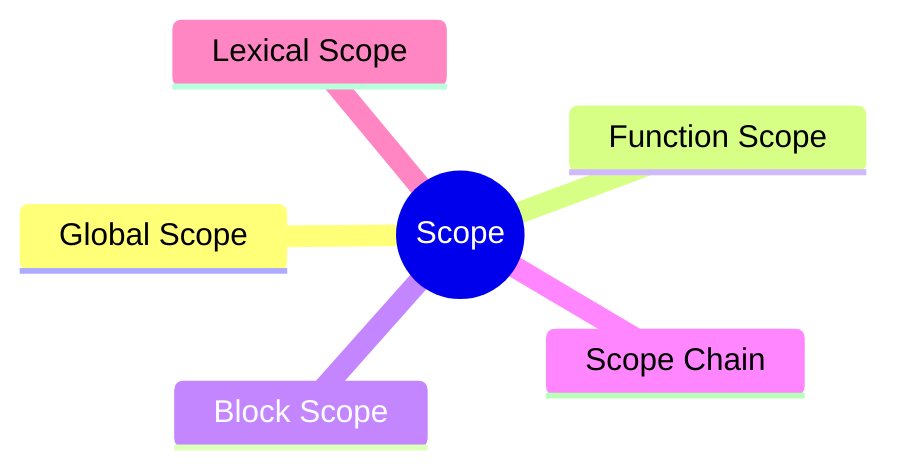

export const metadata = {
  title: 'JavaScript Scope',
  date: '2026-03-16',
  excerpt: 'A practical guide to JavaScript scope — covering global, function, and block scope, along with the scope chain and lexical scope.',
  tags: ['Front-end', 'JavaScript'],
};

# JavaScript Scope

Scope determines where a variable can be accessed.

Understanding scope is fundamental to understanding how variables behave in JavaScript — and how to avoid bugs caused by unexpected variable access.



- [What Is Scope](#what-is-scope)
- [Global Scope](#global-scope)
- [Function Scope](#function-scope)
- [Block Scope](#block-scope)
- [Scope Chain](#scope-chain)
- [Lexical Scope](#lexical-scope)

---

## What Is Scope

Scope defines the visibility of a variable — where in your code it can be read or modified.

JavaScript has three types of scope:

- Global Scope
- Function Scope
- Block Scope

---

## Global Scope

Variables declared outside of any function or block belong to the global scope and can be accessed from anywhere:

```javascript
var name = "Charmy";

function greet() {
  console.log(name); // "Charmy"
}

greet();
console.log(name); // "Charmy"
```

Global variables are convenient, but they come with risks:

- Naming conflicts between different parts of the codebase
- Variables can be accidentally modified from anywhere
- Hard to track where a variable comes from or how it changes

In modern JavaScript, global variables should be avoided where possible.

---

## Function Scope

Variables declared inside a function are only accessible within that function:

```javascript
function greet() {
  var message = "Hello";
  console.log(message); // "Hello"
}

greet();
console.log(message); // ReferenceError: message is not defined
```

Each function creates its own isolated scope. Variables with the same name in different functions don't conflict:

```javascript
function funcA() {
  var value = 1;
  console.log(value); // 1
}

function funcB() {
  var value = 2;
  console.log(value); // 2
}

funcA();
funcB();
```

---

## Block Scope

ES6 introduced `let` and `const`, which brought block scope to JavaScript.

Any `{}` block creates its own scope:

```javascript
{
  let a = 1;
  const b = 2;
  console.log(a); // 1
  console.log(b); // 2
}

console.log(a); // ReferenceError: a is not defined
console.log(b); // ReferenceError: b is not defined
```

`var` is not block-scoped and leaks out of `{}`:

```javascript
{
  var c = 3;
}

console.log(c); // 3
```

Block scope applies to `if`, `for`, `while`, and any other `{}` block:

```javascript
if (true) {
  let result = "inside";
  console.log(result); // "inside"
}

console.log(result); // ReferenceError: result is not defined
```

```javascript
for (let i = 0; i < 3; i++) {
  // i only exists inside this block
}

console.log(i); // ReferenceError: i is not defined
```

---

## Scope Chain

When JavaScript looks up a variable, it starts in the current scope. If it doesn't find it there, it moves to the outer scope, then the next outer scope, all the way up to the global scope.

This lookup process is called the scope chain.

```javascript
const a = 1;

function outer() {
  const b = 2;

  function inner() {
    const c = 3;
    console.log(a); // 1 — found in global scope
    console.log(b); // 2 — found in outer's scope
    console.log(c); // 3 — found in inner's own scope
  }

  inner();
}

outer();
```

The lookup only goes outward, never inward:

```javascript
function outer() {
  function inner() {
    const x = 10;
  }
  console.log(x); // ReferenceError: x is not defined
}

outer();
```

`outer` has no access to variables declared inside `inner`.

If a variable isn't found anywhere in the chain, JavaScript throws a `ReferenceError`.

---

## Lexical Scope

JavaScript uses lexical scope (also called static scope).

This means: scope is determined by where the code is written, not where the function is called.

```javascript
const name = "global";

function printName() {
  console.log(name);
}

function main() {
  const name = "local";
  printName();
}

main(); // "global"
```

`printName` is defined in the global scope, so it looks up `name` from there — even though it's called inside `main`, where a local `name` exists.

Lexical scope is the foundation for understanding closures.

---

## Conclusion

| Scope | Where It's Declared | Accessible From |
| - | - | - |
| Global | Declared outside any function or block | Anywhere |
| Function | Declared inside a function | Inside that function |
| Block | Declared with `let` / `const` inside `{}` | Inside that block |

Once you're comfortable with scope, the natural next topics are:

- Hoisting
- Closures
- `this`
- Execution Context

These concepts all build directly on how scope works.
