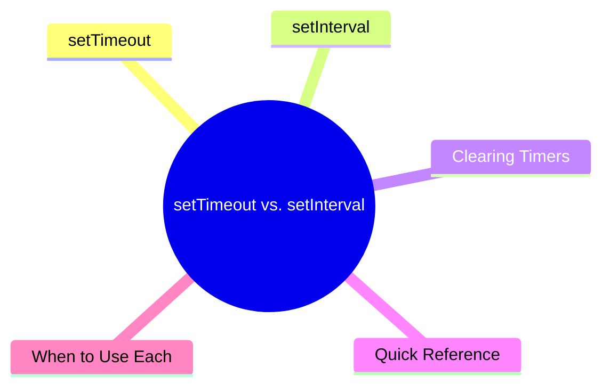

export const metadata = {
  title: 'JavaScript setTimeout vs. setInterval',
  date: '2026-03-19',
  excerpt: 'A practical guide to JavaScript setTimeout and setInterval — covering basic usage, clearing timers, when to use each, and why recursive setTimeout is sometimes more reliable than setInterval.',
  tags: ['Front-end', 'JavaScript'],
};

# JavaScript setTimeout vs. setInterval

`setTimeout` and `setInterval` are JavaScript's two built-in timer functions. Both delay code execution, but they behave differently.

- `setTimeout` — runs a callback once after a delay
- `setInterval` — runs a callback repeatedly at a fixed interval



- [setTimeout](#settimeout)
- [setInterval](#setinterval)
- [Clearing Timers](#clearing-timers)
- [Quick Reference](#quick-reference)
- [When to Use Each](#when-to-use-each)

---

## setTimeout

`setTimeout` runs a callback once after a specified delay.

### Syntax

```javascript
setTimeout(callback, delay, ...args)
```

- `callback` — the function to run
- `delay` — milliseconds to wait (1000 = 1 second)
- `...args` — optional arguments passed to the callback

### Basic Usage

```javascript
setTimeout(function () {
  console.log("runs after 1 second");
}, 1000);
```

Arrow function:

```javascript
setTimeout(() => {
  console.log("runs after 1 second");
}, 1000);
```

### Passing Arguments

```javascript
setTimeout(function (name) {
  console.log("Hello, " + name);
}, 1000, "Charmy");
// "Hello, Charmy" (after 1 second)
```

### delay of 0

Setting the delay to `0` doesn't mean the callback runs immediately. It still waits for the Call Stack to clear first:

```javascript
console.log("A");

setTimeout(function () {
  console.log("B");
}, 0);

console.log("C");
```

Output:

```text
A
C
B
```

This is how the Event Loop works — `setTimeout` callbacks are always asynchronous, no matter the delay.

---

## setInterval

`setInterval` runs a callback repeatedly at a fixed interval, until it's cleared.

### Syntax

```javascript
setInterval(callback, delay, ...args)
```

### Basic Usage

```javascript
setInterval(function () {
  console.log("runs every second");
}, 1000);
```

### Example: Counter

```javascript
let count = 0;

const id = setInterval(function () {
  count++;
  console.log(count);

  if (count === 5) {
    clearInterval(id);
    console.log("stopped");
  }
}, 1000);
```

Output:

```text
1
2
3
4
5
stopped
```

---

## Clearing Timers

Both `setTimeout` and `setInterval` return a timer ID that you can use to cancel them.

### clearTimeout

Cancels a `setTimeout` before it fires:

```javascript
const id = setTimeout(function () {
  console.log("this won't run");
}, 2000);

clearTimeout(id);
```

### clearInterval

Stops a `setInterval` from repeating:

```javascript
const id = setInterval(function () {
  console.log("running");
}, 1000);

setTimeout(function () {
  clearInterval(id);
  console.log("stopped");
}, 3500);
```

Output:

```text
running
running
running
stopped
```

---

## Quick Reference

| | setTimeout | setInterval |
| - | - | - |
| Runs | Once | Repeatedly |
| Cancel with | `clearTimeout(id)` | `clearInterval(id)` |
| Best for | Delayed one-time actions | Periodic repeated actions |

---

## When to Use Each

### Use setTimeout

Delayed one-time actions — like auto-dismissing a notification:

```javascript
showNotification("Saved successfully");

setTimeout(function () {
  hideNotification();
}, 3000);
```

Mocking async behavior in tests or development:

```javascript
function fakeApiCall() {
  return new Promise(function (resolve) {
    setTimeout(function () {
      resolve({ name: "Charmy" });
    }, 500);
  });
}
```

### Use setInterval

Polling or periodic updates — like fetching fresh data every few seconds:

```javascript
const id = setInterval(function () {
  fetchLatestData();
}, 5000);
```

Countdown timers:

```javascript
let seconds = 10;

const id = setInterval(function () {
  console.log(seconds);
  seconds--;

  if (seconds < 0) {
    clearInterval(id);
    console.log("Time's up!");
  }
}, 1000);
```

### A Note on setInterval

`setInterval` doesn't account for how long the callback takes to run. If the callback takes longer than the interval, the next execution can fire immediately after the previous one finishes — causing tasks to pile up.

If you need a guaranteed gap between executions, use recursive `setTimeout` instead:

```javascript
function repeat() {
  doSomething();
  setTimeout(repeat, 1000); // next run starts after this one finishes
}

setTimeout(repeat, 1000);
```

This ensures the 1-second delay starts only after `doSomething` completes.

---

## Conclusion

- `setTimeout` — runs once after a delay, cancelled with `clearTimeout`
- `setInterval` — runs repeatedly at a fixed interval, stopped with `clearInterval`
- Both delays are minimums, not guarantees — actual timing depends on the Event Loop
- When precise intervals matter, recursive `setTimeout` is more reliable than `setInterval`
