export const metadata = {
  title: 'JavaScript Synchronous vs. Asynchronous',
  date: '2026-03-18',
  excerpt: 'A practical guide to synchronous and asynchronous JavaScript — covering how the Event Loop works and the three main ways to handle async code: callbacks, Promises, and async/await.',
  tags: ['Front-end', 'JavaScript'],
};

# JavaScript Synchronous vs. Asynchronous

JavaScript is single-threaded — it can only do one thing at a time.

But real programs need to handle things like network requests, timers, and file reads. If any of those blocked the thread while waiting, the page would freeze and nothing else could run.

That's the problem asynchronous JavaScript solves.

```mermaid
mindmap
  	root((Synchronous vs. Asynchronous))
    	What Is Synchronous
    	What Is Asynchronous
    	The Event Loop
    	Common Async Operations
    	Ways to Handle Async Code
```



- [What Is Synchronous](#what-is-synchronous)
- [What Is Asynchronous](#what-is-asynchronous)
- [The Event Loop](#the-event-loop)
- [Common Async Operations](#common-async-operations)
- [Ways to Handle Async Code](#ways-to-handle-async-code)

---

## What Is Synchronous

Synchronous code runs line by line, in order. Each line waits for the previous one to finish before moving on.

```javascript
console.log("First");
console.log("Second");
console.log("Third");
```

Output:

```text
First
Second
Third
```

Straightforward — but if one line takes a long time (like waiting for a server response), everything else has to wait. The whole thread is blocked until it's done.

---

## What Is Asynchronous

Asynchronous code doesn't wait. It kicks off an operation, moves on, and comes back to handle the result when it's ready.

```javascript
console.log("Start");

setTimeout(function () {
  console.log("setTimeout fires");
}, 1000);

console.log("End");
```

Output:

```text
Start
End
setTimeout fires
```

`setTimeout` doesn't block anything. JavaScript logs `"End"` immediately, then comes back to run the callback after 1 second.

---

## The Event Loop

The mechanism that makes all of this work is the Event Loop.

JavaScript's runtime has a few moving parts:

- Call Stack — where synchronous code runs, one task at a time
- Web APIs — browser-provided features like `setTimeout`, `fetch`, and DOM events that run in the background
- Task Queue — once a Web API operation completes, its callback is placed here to wait
- Event Loop — continuously watches the Call Stack; when it's empty, it pushes the next task from the Task Queue in

Here's a concrete example:

```javascript
console.log("A");

setTimeout(function () {
  console.log("B");
}, 0);

console.log("C");
```

Output:

```text
A
C
B
```

Even with a `0` delay, `"B"` runs last. The `setTimeout` callback is handed off to the Web APIs, then queued in the Task Queue. The Event Loop only pushes it onto the Call Stack once `"A"` and `"C"` have already run.

---

## Common Async Operations

Most async work in JavaScript falls into a few categories:

- `setTimeout` / `setInterval` — timers
- `fetch` — network requests
- DOM events — user interactions like `click` and `input`
- `Promise` — a wrapper for async operations
- `async` / `await` — cleaner syntax for working with Promises

```javascript
// Timer
setTimeout(() => {
  console.log("runs after 1 second");
}, 1000);

// Network request
fetch("https://api.example.com/data")
  .then(response => response.json())
  .then(data => console.log(data));

// DOM event
button.addEventListener("click", () => {
  console.log("button clicked");
});
```

---

## Ways to Handle Async Code

There are three main approaches. Each one was introduced to address the shortcomings of the one before it.

### Callbacks

The original approach — pass a function as an argument, and call it when the operation is done:

```javascript
function fetchData(callback) {
  setTimeout(function () {
    callback("data");
  }, 1000);
}

fetchData(function (data) {
  console.log(data); // "data"
});
```

Works fine for simple cases. But nest a few of these together and you end up with Callback Hell:

```javascript
fetchUser(function (user) {
  fetchPosts(user.id, function (posts) {
    fetchComments(posts[0].id, function (comments) {
      console.log(comments);
    });
  });
});
```

Hard to read, hard to maintain.

### Promises

Introduced in ES6, Promises give async code more structure:

```javascript
fetch("https://api.example.com/data")
  .then(response => response.json())
  .then(data => console.log(data))
  .catch(error => console.error(error));
```

Chaining `.then()` calls is much cleaner than nested callbacks.

### async / await

Introduced in ES2017, `async`/`await` lets you write async code that reads like synchronous code:

```javascript
async function getData() {
  try {
    const response = await fetch("https://api.example.com/data");
    const data = await response.json();
    console.log(data);
  } catch (error) {
    console.error(error);
  }
}

getData();
```

`await` pauses the function until the Promise resolves — but it doesn't block the rest of the program. It can only be used inside an `async` function.

---

## Conclusion

| | Synchronous | Asynchronous |
| - | - | - |
| Execution | Line by line, blocks until done | Non-blocking, handles result later |
| Use cases | General logic | Network requests, timers, I/O |
| Tools | — | Callbacks, Promises, async/await |

JavaScript's async model is what lets a single-threaded language handle real-world workloads without grinding to a halt. Understanding it is essential for writing JavaScript that actually works the way you expect.
