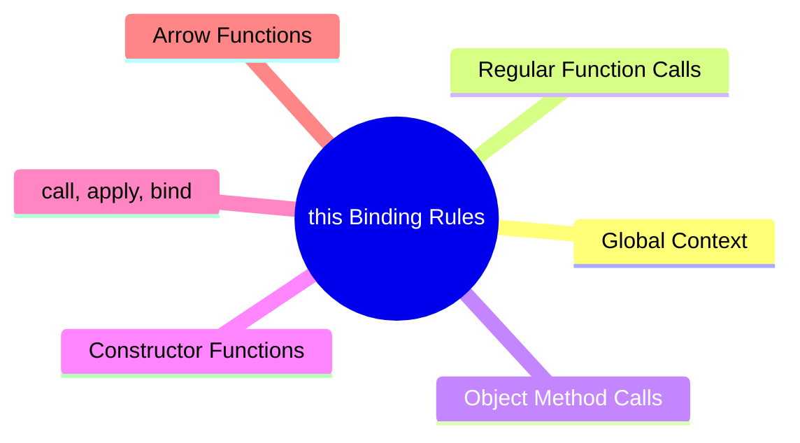

export const metadata = {
  title: 'JavaScript this: How It Works and What It Points To',
  date: '2026-03-17',
  excerpt: 'A practical guide to JavaScript this — covering global context, regular functions, object methods, constructors, call/apply/bind, and arrow functions.',
  tags: ['Front-end', 'JavaScript'],
};

# JavaScript `this`: How It Works and What It Points To

`this` is one of the most confusing parts of JavaScript.

Its value isn't fixed — it changes depending on how a function is called, not where it's defined.



- [What Is `this`](#what-is-this)
- [Global Context](#global-context)
- [Regular Function Calls](#regular-function-calls)
- [Object Method Calls](#object-method-calls)
- [Constructor Functions](#constructor-functions)
- [`call`, `apply`, `bind`](#call-apply-bind)
- [Arrow Functions](#arrow-functions)
- [Quick Reference](#quick-reference)

---

## What Is `this`

`this` is a keyword available inside functions. It refers to the object the function is operating on — and that value changes depending on how the function is called.

The key rule: `this` depends on how the function is called, not where it's defined.

---

## Global Context

Outside of any function, `this` refers to the global object.

In a browser, that's `window`:

```javascript
console.log(this); // window
console.log(this === window); // true
```

In Node.js, it's `global` (or `{}` at the module level):

```javascript
console.log(this); // {}
```

---

## Regular Function Calls

When you call a function directly, `this` depends on whether strict mode is enabled.

Non-strict mode — `this` is the global object:

```javascript
function show() {
  console.log(this); // window
}

show();
```

Strict mode — `this` is `undefined`:

```javascript
"use strict";

function show() {
  console.log(this); // undefined
}

show();
```

---

## Object Method Calls

When a function is called as a method on an object, `this` refers to that object:

```javascript
const user = {
  name: "Charmy",
  greet() {
    console.log(this.name); // "Charmy"
  }
};

user.greet();
```

`this` is `user` because `user` is the one calling `greet`.

Watch out — `this` is determined at call time, not definition time. Pulling the method out and calling it separately changes `this`:

```javascript
const greet = user.greet;
greet(); // undefined (or window.name in non-strict mode)
```

---

## Constructor Functions

When a function is called with `new`, JavaScript creates a new object and `this` points to it:

```javascript
function Person(name) {
  this.name = name;
}

const p = new Person("Charmy");
console.log(p.name); // "Charmy"
```

What `new` does behind the scenes:

1. Creates a new empty object
2. Sets `this` to that object
3. Runs the function body
4. Returns the new object

---

## `call`, `apply`, `bind`

These three methods let you set `this` manually.

### `call`

Calls the function immediately. The first argument sets `this`, the rest are passed as individual arguments:

```javascript
function greet(greeting) {
  console.log(greeting + ", " + this.name);
}

const user = { name: "Charmy" };

greet.call(user, "Hello"); // "Hello, Charmy"
```

### `apply`

Same as `call`, but arguments are passed as an array:

```javascript
greet.apply(user, ["Hello"]); // "Hello, Charmy"
```

### `bind`

Doesn't call the function immediately — returns a new function with `this` permanently bound:

```javascript
const boundGreet = greet.bind(user);
boundGreet("Hello"); // "Hello, Charmy"
```

`bind` is especially useful when you need to preserve `this` across callbacks:

```javascript
class Timer {
  constructor() {
    this.seconds = 0;
  }

  start() {
    setInterval(this.tick.bind(this), 1000);
  }

  tick() {
    this.seconds++;
    console.log(this.seconds);
  }
}
```

---

## Arrow Functions

Arrow functions don't have their own `this`. They inherit it from the surrounding lexical scope at the time they're defined.

```javascript
const user = {
  name: "Charmy",
  greet: () => {
    console.log(this.name); // undefined
  }
};

user.greet();
```

`this` here isn't `user` — it's whatever `this` is in the outer scope (the global object in this case).

Arrow functions' `this` can't be overridden with `call`, `apply`, or `bind`:

```javascript
const show = () => {
  console.log(this);
};

show.call({ name: "Charmy" }); // still the outer this, not { name: "Charmy" }
```

This makes arrow functions a natural fit for callbacks where you want to preserve the outer `this`:

```javascript
const timer = {
  seconds: 0,
  start() {
    setInterval(() => {
      this.seconds++; // `this` is timer
      console.log(this.seconds);
    }, 1000);
  }
};
```

---

## Quick Reference

| How the function is called | `this` points to |
| - | - |
| Global context | Global object (`window` / `global`) |
| Regular function (non-strict) | Global object |
| Regular function (strict mode) | `undefined` |
| Object method | The object calling the method |
| `new` constructor | The newly created object |
| `call` / `apply` / `bind` | The manually specified object |
| Arrow function | Outer lexical scope's `this` |

---

## Conclusion

`this` is determined by how a function is called:

- Regular call → global object or `undefined` (strict mode)
- Object method → the calling object
- `new` → the newly created object
- `call` / `apply` / `bind` → whatever you pass in
- Arrow function → inherited from the surrounding scope

Once you're comfortable with `this`, the natural next topics are:

- Execution Context
- Closures
- Prototypes
