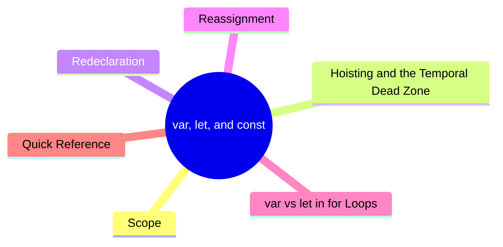

export const metadata = {
  title: 'JavaScript var, let, and const: Key Differences and When to Use Each',
  date: '2026-03-16',
  excerpt: 'A practical guide to var, let, and const — covering scope, hoisting, the temporal dead zone, redeclaration, reassignment, and the classic for loop gotcha.',
  tags: ['Front-end', 'JavaScript'],
};

# JavaScript `var`, `let`, and `const`: Key Differences and When to Use Each

JavaScript has three ways to declare variables: `var`, `let`, and `const`.

`var` was the only option in early JavaScript. `let` and `const` were introduced in ES6 (ES2015) to address its shortcomings.



- [Scope](#scope)
- [Hoisting and the Temporal Dead Zone](#hoisting-and-the-temporal-dead-zone)
- [Redeclaration](#redeclaration)
- [Reassignment](#reassignment)
- [`var` vs `let` in `for` Loops](#var-vs-let-in-for-loops)
- [Quick Reference](#quick-reference)

---

## Scope

`var` is function-scoped — it's only limited by function boundaries, not by blocks `{}`.

`let` and `const` are block-scoped — they only exist within the `{}` they're declared in.

```javascript
// var is not block-scoped
{
  var a = "Charmy";
}
console.log(a); // "Charmy"
```

```javascript
// let is block-scoped
{
  let b = "Charmy";
}
console.log(b); // ReferenceError: b is not defined
```

`var` is still limited by function boundaries:

```javascript
function greet() {
  var name = "Charmy";
}
console.log(name); // ReferenceError: name is not defined
```

Block scope helps you:

- Avoid naming conflicts between variables
- Prevent variables from leaking into outer scopes

---

## Hoisting and the Temporal Dead Zone

All three — `var`, `let`, and `const` — are hoisted, but they behave differently.

### `var`
`var` is initialized to `undefined` during the creation phase, so accessing it before the declaration doesn't throw an error:
```javascript
console.log(i); // undefined
var i = 5;
```
This is equivalent to:
```javascript
var i;
console.log(i); // undefined
i = 5;
```

### `let` and `const`
`let` and `const` are also hoisted, but they're not initialized. Instead, they enter the Temporal Dead Zone (TDZ) until the declaration is reached.
Accessing them before the declaration throws an error:
```javascript
console.log(i); // ReferenceError: Cannot access 'i' before initialization
let i = 5;
```
The TDZ makes bugs easier to catch — you'll know immediately if you're using a variable before it's declared.

### Variable Lifecycle
The difference between `var`, `let`, and `const` becomes clearer when you understand the three phases of a variable's lifecycle. A variable goes through three phases:
1. Creation: when the execution context is set up, JavaScript scans all variable declarations and binds them. This is what hoisting actually is.
2. Initialization: `var` is automatically set to `undefined` during creation. `let` and `const` enter the TDZ and are left uninitialized.
3. Assignment: the variable gets its value when the declaration line is executed. For `const`, declaration and assignment must happen together.

---

## Redeclaration

`var` allows redeclaring the same variable:

```javascript
var str = "Charmy";
var str = "Charmying";
console.log(str); // "Charmying"
```

`let` and `const` do not:

```javascript
let str = "Charmy";
let str = "Charmying"; // SyntaxError: Identifier 'str' has already been declared
```

```javascript
const str = "Charmy";
const str = "Charmying"; // SyntaxError: Identifier 'str' has already been declared
```

---

## Reassignment

`var` and `let` can be reassigned:

```javascript
let count = 0;
count = 1;
console.log(count); // 1
```

`const` cannot be reassigned:

```javascript
const count = 0;
count = 1; // TypeError: Assignment to constant variable.
```

However, if a `const` variable holds an object or array, you can still modify its contents — you just can't reassign the variable itself:

```javascript
const user = { name: "Charmy" };
user.name = "Charmying"; // fine
user = {}; // TypeError
```

```javascript
const nums = [1, 2, 3];
nums.push(4); // fine
nums = []; // TypeError
```

---

## `var` vs `let` in `for` Loops

This is one of the most classic examples of why `var` can be problematic.

```javascript
for (var i = 0; i < 3; i++) {
  setTimeout(function () {
    console.log(i);
  }, 100);
}
```

Output:

```text
3
3
3
```

You might expect `0 1 2`, but you get `3 3 3`. There are two reasons:

Reason 1: Async execution order

`setTimeout` callbacks run after the `for` loop has already finished. JavaScript is asynchronous — during the 100ms delay, the loop completes entirely before any callback fires.

Reason 2: `var` is function-scoped

Since there's no wrapping function, `var i` lives in the global scope. The entire loop shares a single `i`. By the time the callbacks run, `i` is already `3` — so all three log `3`.

---

Switching to `let` fixes this immediately:

```javascript
for (let i = 0; i < 3; i++) {
  setTimeout(function () {
    console.log(i);
  }, 100);
}
```

Output:

```text
0
1
2
```

`let` is block-scoped. Each iteration creates its own environment with its own copy of `i`, so the values are captured correctly.

---

Before `let`, the workaround was an IIFE — functional, but awkward:

```javascript
for (var i = 0; i < 3; i++) {
  (function (x) {
    setTimeout(function () {
      console.log(x);
    }, 100);
  })(i);
}
```

`let` makes this kind of problem trivial to solve.

---

## Quick Reference

| | `var` | `let` | `const` |
| - | - | - | - |
| Scope | Function | Block | Block |
| Hoisting | Hoisted, initialized to `undefined` | Hoisted, enters TDZ | Hoisted, enters TDZ |
| Redeclaration | Allowed | Not allowed | Not allowed |
| Reassignment | Allowed | Allowed | Not allowed |

---

## Conclusion

`let` and `const` make variable declarations stricter and safer:

- Block scope prevents variables from leaking
- The TDZ catches errors early
- No redeclaration means fewer accidental bugs

In modern JavaScript, the general rule is: use `const` by default, use `let` when you need to reassign, and avoid `var`.
