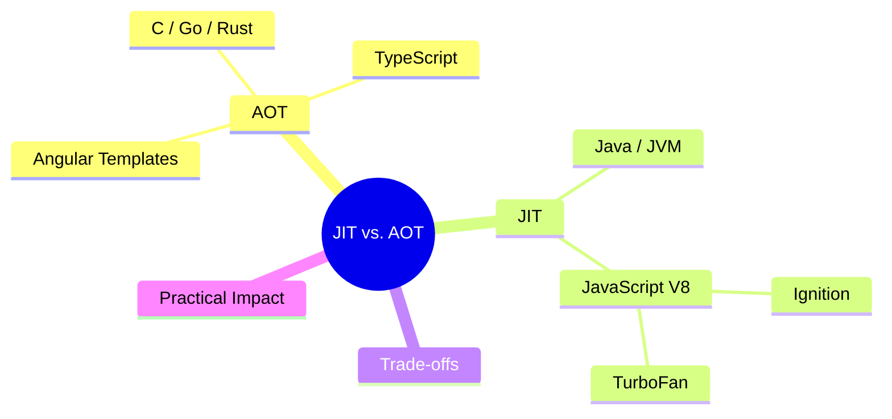
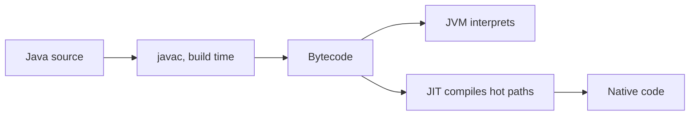
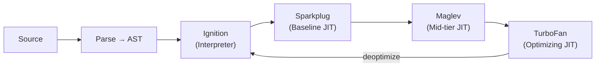

export const metadata = {
  title: 'JIT vs. AOT: How Code Gets Compiled',
  date: '2026-06-19',
  excerpt:
    "A practical breakdown of Just-In-Time and Ahead-Of-Time compilation — how each approach works, where each fits, and what V8's tiered compilation pipeline means for the JavaScript you write.",
  tags: ['Front-end', 'JavaScript'],
};

# JIT vs. AOT: How Code Gets Compiled

Every programming language eventually needs to be translated into something a processor can run. The question is when that translation happens.

AOT does it before execution. JIT does it during. That difference shapes startup time, peak performance, and what kinds of optimizations are even possible — and for frontend engineers, both show up in ways that directly affect day-to-day work.



- [AOT](#aot)
- [JIT](#jit)
- [AOT vs. JIT](#aot-vs-jit)
- [Practical Impact](#practical-impact)

---

## AOT

AOT (Ahead-Of-Time) compilation transforms source code into executable form before the program starts. By the time anything runs, the compilation is already done.

Languages like C, Go, and Rust are the clearest examples. Their compilers run at build time and produce machine code the operating system can execute directly. No compilation happens at runtime.


### TypeScript

TypeScript is the AOT example frontend engineers encounter every day. `tsc` — or SWC and esbuild in modern build setups — compiles TypeScript to JavaScript during the build step, before the file reaches the browser. Type annotations are checked and stripped. The output is plain JavaScript.

This is why TypeScript type errors are build-time errors: by the time code reaches the browser, the type system is already gone.

### Angular Templates

Angular's production build applies AOT compilation to HTML templates. The Angular compiler converts template syntax — property bindings, structural directives, pipes — into TypeScript rendering functions during `ng build`, before anything reaches the browser.

Two direct consequences: template errors are caught at build time rather than surfaced to users, and the runtime bundle doesn't need to ship the Angular template compiler, which meaningfully reduces bundle size. This has been the default for Angular production builds since Angular 9.

---

## JIT

JIT (Just-In-Time) compilation takes the opposite approach: compile during execution, as the code runs.

The key insight is that waiting gives you information. A JIT compiler can observe what the program actually does — which functions are called most often, what types the arguments actually have, which branches are taken — and generate optimized machine code for the paths that matter most.

### Java and the JVM

The JVM is the canonical JIT example. `javac` compiles Java source to bytecode — a compact, platform-neutral intermediate format. The JVM starts by interpreting that bytecode, then JIT-compiles the hot methods (frequently executed code) to optimized native code as execution continues.



The longer a Java program runs, the more thoroughly the JVM can optimize it.

### V8 and JavaScript

V8 — the engine behind Chrome and Node.js — uses a tiered compilation pipeline.



Ignition is V8's interpreter. It compiles JavaScript source to bytecode and starts executing immediately. Bytecode is compact and fast to generate, which keeps JavaScript's cold start low.

Sparkplug is a lightweight JIT layer that converts Ignition bytecode to machine code quickly, with minimal optimization — just enough to outperform pure interpretation.

Maglev (added in Chrome 117) sits between Sparkplug and TurboFan. It applies meaningful optimizations at a fraction of TurboFan's compilation cost, handling code that's warm enough to benefit from JIT but not hot enough to justify full TurboFan treatment.

TurboFan is V8's peak optimizing compiler. It collects profiling data from Ignition — actual argument types, call frequencies, branch outcomes — and generates highly specialized machine code for hot functions. Code that TurboFan has optimized can run an order of magnitude faster than interpreted bytecode.

### Optimization and Deoptimization

TurboFan's optimizations rest on assumptions built from runtime profiling. A function always called with integers gets integer-optimized machine code. If an assumption is later violated, V8 deoptimizes — discards the compiled code, falls back to Ignition, and eventually re-profiles the function with the new information.

```javascript
function add(a, b) {
  return a + b;
}

// called consistently with numbers → TurboFan optimizes for integer arithmetic
add(1, 2);
add(3, 4);
add(5, 6);

// type assumption violated → deoptimize
add('hello', ' world');
```

This is the mechanism behind the common advice to keep argument types consistent in hot functions: stable types keep TurboFan's assumptions valid and the optimized code in effect.

---

## AOT vs. JIT

| | AOT | JIT |
| - | - | - |
| When compiled | Build time | Runtime |
| Startup time | Fast | Slower (cold start) |
| Peak performance | Lower (no runtime data) | Higher (adaptive optimization) |
| Error detection | Build time | Runtime |
| Bundle size | Smaller (compiler not shipped) | Larger |
| Examples | C, Go, TypeScript → JS | Java/JVM, JavaScript/V8 |

Neither is strictly better. The right choice depends on what the workload looks like.

AOT suits cases where fast startup and predictable behavior matter more than peak throughput — serverless functions, CLI tools, and static assets where cold start adds directly to the user experience.

JIT suits long-running processes that can absorb the warmup cost in exchange for sustained, highly optimized performance. A Node.js server under steady traffic, or a browser tab open for an extended session, eventually reaches a state where TurboFan has deeply optimized the hot paths.

The same trade-off shows up in frontend rendering strategies. SSG pre-renders HTML at build time and serves it from a CDN — the work is done once, upfront. That's AOT. SSR renders HTML on each incoming request, just-in-time for whoever is asking. That's JIT. CSR skips server-side HTML generation entirely; the browser receives a JavaScript bundle and renders the page at runtime, with V8 JIT-compiling the JavaScript as it runs.

For a detailed breakdown of each strategy, see [CSR vs. SSR vs. SSG](/articles/web-csr-ssr-ssg).

---

## Practical Impact

- Benchmarks need a warmup phase.
- JavaScript in V8 starts interpreted and gradually heats up. A benchmark that records the first few runs is measuring cold performance, not steady-state performance. Proper benchmarks run warmup iterations before recording — tools like `benchmark.js` and Vitest's benchmark mode handle this automatically.
- Type consistency matters at runtime.
- TypeScript types are erased at build time and are invisible to V8. For V8, type stability means calling functions with consistent argument types at runtime — so TurboFan's type-specialized optimizations stay valid. Mixing types across calls to the same hot function triggers deoptimization.
- TypeScript and V8 are two independent compilation stages.
- TypeScript's AOT runs at build time and produces plain JavaScript. V8's JIT runs in the browser and compiles that JavaScript to machine code. They're independent steps in the same pipeline. Understanding both clarifies why TypeScript type safety is a developer-time guarantee — it has no effect on runtime behavior or performance.
- For the full lifecycle from source code to screen, see [From Source to Screen: The Frontend Execution Lifecycle](/articles/web-source-to-screen).
