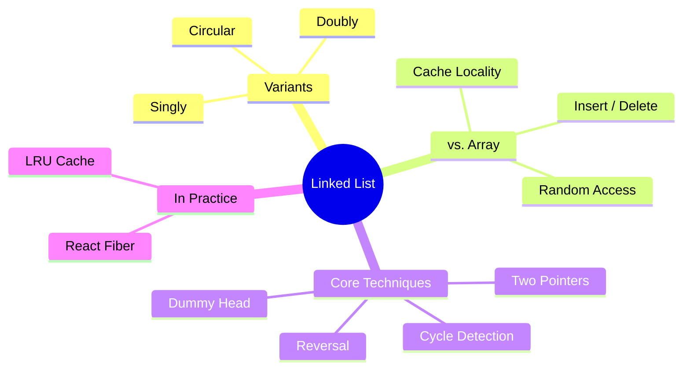
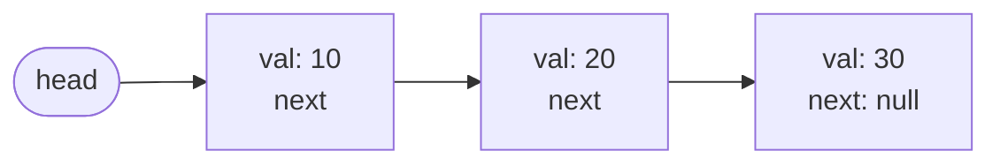
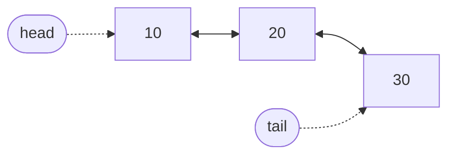
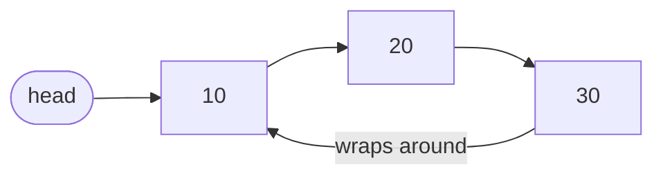
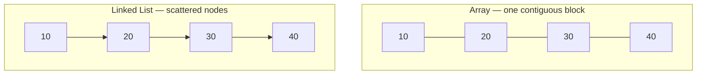
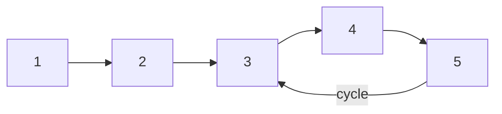
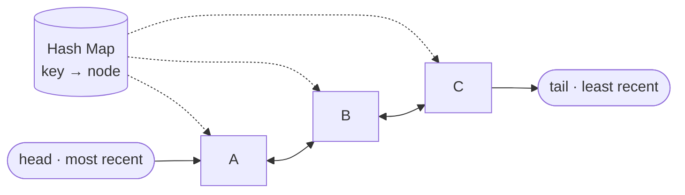

export const metadata = {
  title: 'Linked Lists: Sequences Built from Nodes and Pointers',
  date: '2026-08-01',
  excerpt: 'An in-depth guide to linked lists: how nodes and pointers form a sequence, the singly, doubly, and circular variants, how they really compare to arrays once cache locality enters the picture, and the pointer techniques behind everything from interview problems to React Fiber.',
  tags: ['Programming', 'Data Structures', 'Algorithm'],
};

# Linked Lists: Sequences Built from Nodes and Pointers

An array stores its elements side by side in one block of memory. That layout is what makes `arr[5]` instant: the position is just arithmetic on the starting address. It's also what makes inserting at the front expensive: every element after it has to shift.

A linked list makes the opposite trade. Instead of one contiguous block, it scatters each element into its own object (a node) and threads the nodes together with pointers. There's no index arithmetic and no shifting. Rewiring a single pointer can splice a node in or out in constant time.

Neither structure is better in the abstract. Knowing which one fits comes down to understanding exactly what each pointer buys you and what it costs.



- [What Is a Linked List](#what-is-a-linked-list)
- [Singly Linked List](#singly-linked-list)
- [Doubly Linked List](#doubly-linked-list)
- [Circular Linked List](#circular-linked-list)
- [Linked List vs. Array](#linked-list-vs-array)
- [Core Techniques](#core-techniques)
- [Where Linked Lists Show Up](#where-linked-lists-show-up)
- [Conclusion](#conclusion)

---

## What Is a Linked List

A linked list is a chain of nodes. Each node holds two things: a value, and a reference to the next node. The list itself only keeps a pointer to the first node, the head. From there, you follow `next` references until you hit `null`, which marks the end.



In JavaScript, a node is just a small object:

```javascript
class ListNode {
  constructor(value) {
    this.value = value;
    this.next = null; // points to the next node, or null at the end
  }
}
```

The contrast with an array is entirely about memory. An array asks the runtime for one contiguous block and lays the elements out in order, so the element at index `i` lives at a position you can compute directly. A linked list never asks for a block. Each node is allocated separately, wherever there's room on the heap, and the only thing connecting node 2 to node 3 is the pointer stored inside node 2.

That single design choice drives everything else:

- No random access. There's no formula to jump to the `n`-th node. The only way to reach it is to start at the head and walk `n` pointers down the chain, an O(n) operation.
- Cheap restructuring. Once you're holding the right node, inserting or removing is a matter of reassigning one or two pointers. Nothing else moves.

The rest of this article is about the variants that make those pointers more powerful, and the situations where the trade pays off.

---

## Singly Linked List

The structure above (one `next` pointer per node) is a singly linked list. Traversal only goes forward: from any node you can reach the ones after it, never the ones before. We'll wrap the nodes in a class that tracks the head.

```javascript
class LinkedList {
  constructor() {
    this.head = null;
  }
}
```

### Insertion

Inserting at the head is the operation linked lists are built for. You create a node, point its `next` at the current head, and move the head pointer to the new node. The size of the list is irrelevant: it's always O(1).

```javascript
// O(1) — splice a new node in at the front
prepend(value) {
  const node = new ListNode(value);
  node.next = this.head;
  this.head = node;
}
```

Inserting at the tail is the opposite story. With only a head pointer, there's no shortcut to the last node: you have to walk the entire list to find it first, which is O(n).

```javascript
// O(n) — walk to the end, then attach
append(value) {
  const node = new ListNode(value);

  if (this.head === null) {
    this.head = node;
    return;
  }

  let current = this.head;
  while (current.next !== null) {
    current = current.next;
  }
  current.next = node;
}
```

The fix is to also store a `tail` pointer alongside `head`. Then appending becomes O(1) too, at the cost of keeping that second pointer correct on every insert and delete. This is the first hint of a recurring theme: extra pointers buy speed but add bookkeeping.

### Deletion

To delete a node, you reroute the `next` pointer of the node before it so the chain skips over the target. The catch in a singly linked list is that a node has no reference back to its predecessor, so even though the rewiring itself is constant time, *finding* the predecessor takes O(n).

```javascript
// O(n) — find the predecessor, then bypass the target
delete(value) {
  if (this.head === null) return;

  // Deleting the head is a special case: there's no predecessor.
  if (this.head.value === value) {
    this.head = this.head.next;
    return;
  }

  let current = this.head;
  while (current.next !== null && current.next.value !== value) {
    current = current.next;
  }

  if (current.next !== null) {
    current.next = current.next.next; // unlink the target
  }
}
```

Notice the special case for the head. Because the head has no predecessor, it needs its own branch. That asymmetry is annoying, and later we'll see a clean way to make it disappear.

### Traversal and Search

Without random access, finding a value means visiting nodes one at a time from the head, O(n) in the worst case.

```javascript
// O(n) — linear scan from the head
find(value) {
  let current = this.head;
  while (current !== null) {
    if (current.value === value) return current;
    current = current.next;
  }
  return null;
}
```

This loop (`let current = this.head` then advance with `current = current.next` until `null`) is the backbone of nearly every linked list operation. Internalize it and the rest is variation.

---

## Doubly Linked List

The painful part of the singly linked list was deletion: to unlink a node, you first had to hunt down its predecessor. A doubly linked list removes that limitation by giving every node a second pointer, `prev`, that points backward.

```javascript
class DoublyNode {
  constructor(value) {
    this.value = value;
    this.prev = null;
    this.next = null;
  }
}
```



Now traversal works in both directions, and, crucially, if you're already holding a node, you can delete it in O(1) without scanning for anything. Its neighbors are one hop away through `prev` and `next`. Lists like this almost always track both `head` and `tail`.

```javascript
class DoublyLinkedList {
  constructor() {
    this.head = null;
    this.tail = null;
  }

  // O(1) — attach at the tail
  append(value) {
    const node = new DoublyNode(value);

    if (this.tail === null) {
      this.head = node;
      this.tail = node;
      return;
    }

    node.prev = this.tail;
    this.tail.next = node;
    this.tail = node;
  }

  // O(1) — given the node itself, unlink it directly
  remove(node) {
    if (node.prev !== null) {
      node.prev.next = node.next;
    } else {
      this.head = node.next; // node was the head
    }

    if (node.next !== null) {
      node.next.prev = node.prev;
    } else {
      this.tail = node.prev; // node was the tail
    }
  }
}
```

That O(1) `remove` (taking the node directly, no search) is the property that makes doubly linked lists the backbone of structures like the LRU cache later on.

The cost is real, though. Every node now carries an extra pointer (more memory), and every insertion and deletion has to keep both `prev` and `next` consistent on both sides (more ways to introduce a bug). You're paying with space and complexity to buy backward traversal and O(1) removal.

---

## Circular Linked List

In the lists so far, the last node's `next` is `null`, so the chain has a definite end. In a circular linked list, the tail's `next` points back to the head instead, closing the loop.



There's no `null` terminator, so traversal never naturally stops; you walk until you arrive back where you started. That's exactly the point: a circular list models things that genuinely cycle. A round-robin scheduler handing time slices to each process in turn, the players seated around a game table, a carousel of slides that loops back to the first: all of them map cleanly onto "advance to next, and after the last comes the first again."

```javascript
// Visit every node exactly once, then stop when we loop back
let current = head;
do {
  console.log(current.value);
  current = current.next;
} while (current !== head);
```

The trade-off is that the missing `null` removes your usual stopping signal. Loops that assume a terminator will spin forever, so termination has to be expressed some other way: "stop when we return to the start," or by counting nodes.

---

## Linked List vs. Array

This is the comparison that actually decides which structure to reach for. On paper, Big-O makes linked lists look like the clear winner for insertion and deletion. In practice, the answer is more interesting.



Start with the asymptotic costs:

| Operation | Array | Singly Linked | Doubly Linked |
| - | - | - | - |
| Access by index | O(1) | O(n) | O(n) |
| Search by value | O(n) | O(n) | O(n) |
| Insert at head | O(n) | O(1) | O(1) |
| Insert at tail | O(1)* | O(n) / O(1)† | O(1) |
| Delete at head | O(n) | O(1) | O(1) |
| Delete a known node | O(n) | O(n) | O(1) |
| Extra memory per element | None | 1 pointer | 2 pointers |

\* Amortized. Appending is usually instant, but an occasional resize copies the whole array to a bigger block.
† O(1) only if the list keeps a `tail` pointer; otherwise O(n) to walk to the end.

The table tells a clear story: arrays own random access, linked lists own restructuring at a position you're already holding. But there's a column the table can't show, and it's the one that flips real-world results.

### The Cache Locality Catch

Big-O counts operations; it says nothing about how long a single memory access takes. On modern hardware, that omission matters enormously. A CPU doesn't read one value from RAM at a time: it pulls in a whole cache line (typically 64 bytes) and, seeing sequential access, prefetches the next lines before you ask for them.

An array is laid out exactly for this. Iterating it streams through contiguous memory, so most reads are already sitting in cache. A linked list defeats the mechanism completely: its nodes are scattered across the heap, so following each `next` pointer is a jump to an unpredictable address, frequently a cache miss, where the CPU stalls waiting on main memory. A cache miss can cost two orders of magnitude more than a cache hit.

The consequence surprises people: for many real workloads, an array beats a linked list even at tasks the linked list is supposedly built for. Inserting into the middle of an array is O(n) because of the shift, but that shift is a tight, cache-friendly `memmove` over contiguous memory. The linked list's O(1) insert first requires an O(n) *traversal* to reach the spot, and every step of that traversal risks a cache miss. For small to medium `n`, the array often wins outright.

### Choosing Between Them

Reach for an array (the default) when you need indexed access, when you iterate far more than you restructure, or when `n` is small enough that cache behavior dominates the asymptotics, which covers the large majority of everyday code.

Reach for a linked list when you're constantly inserting and removing at positions you already have a reference to (not searching for), when there's no natural index, or when you specifically need O(1) splicing and stable node identity; the next section's structures are exactly these cases.

It's worth noting that JavaScript's built-in `Array` is a dynamic array, not a linked list, and the language ships no native linked list at all. When you need one, you build it, which is precisely why understanding the structure matters.

---

## Core Techniques

Beyond the basics, a handful of pointer techniques come up again and again, in interview problems and real library internals alike. Each one is a small idea that makes a whole class of operations clean.

### The Dummy Head Node

Remember the irritating special case in `delete`: the head has no predecessor, so it needs its own branch. A dummy head (also called a sentinel node) erases that asymmetry. You prepend one throwaway node in front of the real head; now every real node has a predecessor, and the special case is gone.

```javascript
// Delete all nodes matching `value`, with no special case for the head.
function deleteValue(head, value) {
  const dummy = new ListNode(0); // a stand-in predecessor for the real head
  dummy.next = head;

  let current = dummy;
  while (current.next !== null) {
    if (current.next.value === value) {
      current.next = current.next.next; // unlink, head included
    } else {
      current = current.next;
    }
  }

  return dummy.next; // the real head may have changed
}
```

The dummy node is never part of the data; it exists purely to give the head something to stand behind. Returning `dummy.next` at the end recovers the real head, which may well be different from the one passed in. It's a small trick that removes a recurring source of off-by-one and null bugs.

### Two Pointers: Fast and Slow

Many problems ask about positions relative to a length you don't know yet: the middle node, the `k`-th from the end. The naive approach measures the length first, then walks again. The fast-and-slow technique gets it in one pass.

Move two pointers from the head, but advance `fast` two steps for every one step of `slow`. By the time `fast` reaches the end, `slow` is at the halfway point.

```javascript
// Find the middle node in a single pass
function findMiddle(head) {
  let slow = head;
  let fast = head;

  while (fast !== null && fast.next !== null) {
    slow = slow.next;       // +1 per iteration
    fast = fast.next.next;  // +2 per iteration
  }

  return slow; // on even length, this is the second of the two middles
}
```

### Cycle Detection: Floyd's Algorithm

What if a list's tail accidentally points back into the list, creating a loop? A naive traversal would run forever. Floyd's cycle detection (the "tortoise and hare") reuses the fast-and-slow idea to settle it in O(n) time and, notably, O(1) space.

The insight: if there's a cycle, the fast pointer keeps lapping the slow one inside the loop, so the two must eventually land on the same node. If there's no cycle, the fast pointer simply runs off the end into `null`.



```javascript
// Detect a cycle in O(n) time, O(1) space
function hasCycle(head) {
  let slow = head;
  let fast = head;

  while (fast !== null && fast.next !== null) {
    slow = slow.next;
    fast = fast.next.next;
    if (slow === fast) return true; // the hare lapped the tortoise
  }

  return false; // fast reached the end → no cycle
}
```

### Reversing a Linked List

Reversing a singly linked list is the canonical pointer-manipulation exercise. You can't walk backward, so you flip each `next` pointer to face the other way as you go, keeping three references in flight: the node before, the current node, and the one ahead (saved before you overwrite the link to it).

```javascript
// Reverse a singly linked list in place — O(n) time, O(1) space
function reverse(head) {
  let prev = null;
  let current = head;

  while (current !== null) {
    const next = current.next; // save the rest of the list first
    current.next = prev;       // flip this node's pointer backward
    prev = current;            // advance prev
    current = next;            // advance current
  }

  return prev; // prev is the new head
}
```

The discipline of saving `next` before overwriting it is the whole trick. Lose that reference and the remainder of the list is unreachable, a dangling-pointer bug in miniature.

---

## Where Linked Lists Show Up

These structures aren't just interview fodder. They quietly run inside tools frontend engineers use every day.

### The LRU Cache

A least-recently-used cache has to do two things fast: look up a value by key, and, when it's full, evict the item used longest ago. The standard solution pairs a hash map with a doubly linked list. The map gives O(1) lookup from key to node; the list keeps items in recency order, most-recent at the head. On every access, the node is unlinked and moved to the front: O(1), exactly because a doubly linked list can splice a known node out in constant time. Eviction just drops the tail.



### React Fiber

When React rewrote its reconciler, it replaced recursive tree traversal with a linked structure: each fiber node carries `child`, `sibling`, and `return` (parent) pointers. Walking the tree through pointers instead of the call stack is what lets React pause rendering partway through, hand control back to the browser, and resume later, the foundation of interruptible, concurrent rendering. A recursive walk is the opposite: its progress lives implicitly on the call stack, which can't be paused partway and handed off; for how recursion leans on the call stack, see [Recursion](/articles/recursion).

### Browser History and Undo/Redo

Moving back and forward through pages, or undoing and redoing edits, is a sequence with a current position and neighbors on either side, a natural fit for a doubly linked list, where `prev` is "back / undo" and `next` is "forward / redo." The common thread across all three: when your access pattern is splicing things in and out at a position you already hold, and stable references to individual elements matter more than jumping to an arbitrary index, the linked list is the right tool.

---

## Conclusion

A linked list trades the array's contiguous memory (and the instant indexing that comes with it) for a chain of independently allocated nodes joined by pointers. That trade gives up random access and cache-friendly iteration, and buys O(1) restructuring at a position you're already holding.

The variants tune the deal: a singly linked list is the minimal forward chain, a doubly linked list adds backward pointers for two-way traversal and O(1) removal of a known node, and a circular list closes the loop for things that genuinely cycle. The pointer techniques (dummy heads, fast-and-slow, Floyd's cycle detection, in-place reversal) are the vocabulary for working with all of them.

The honest takeaway is that arrays should be your default; cache locality means they win more often than Big-O alone suggests. But when the workload is constant splicing at known positions, with stable node identity that matters (an LRU cache, a reconciler, a history stack): the linked list isn't just viable, it's the structure those tools are built on.
