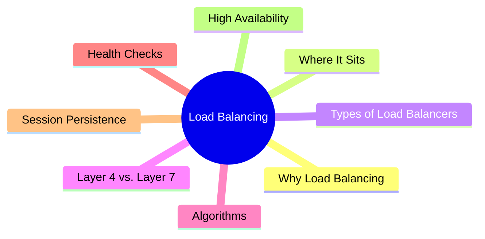
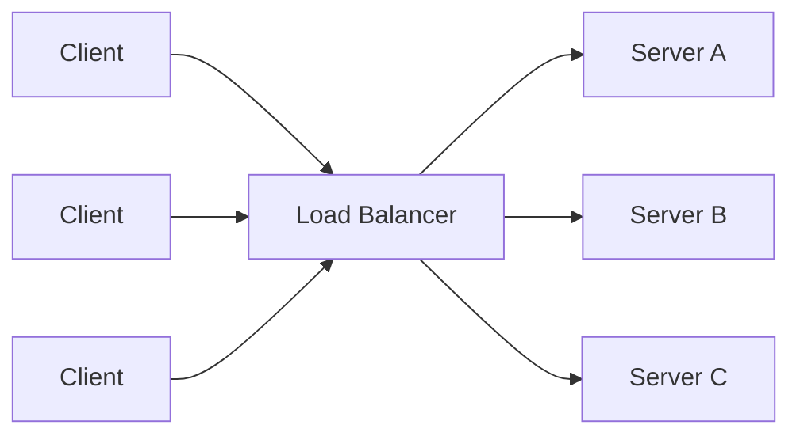
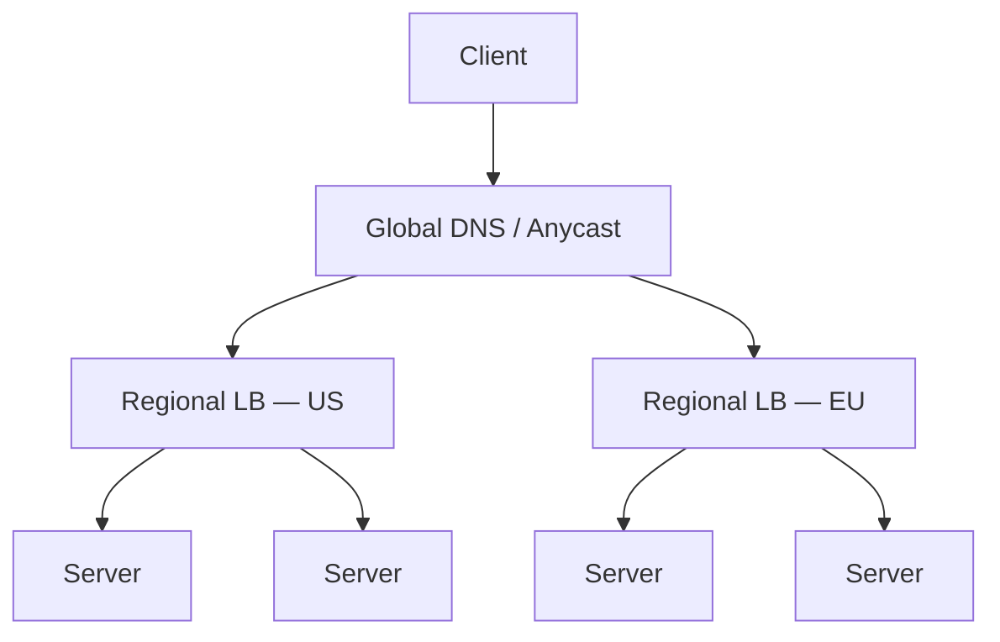
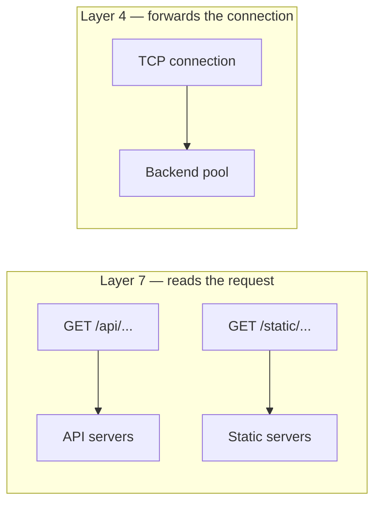
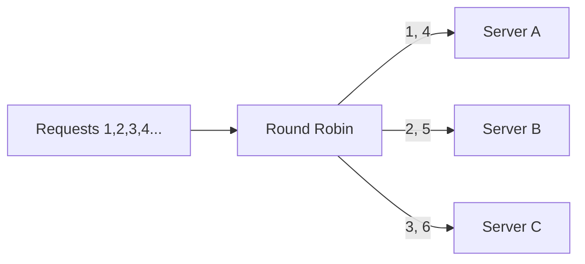
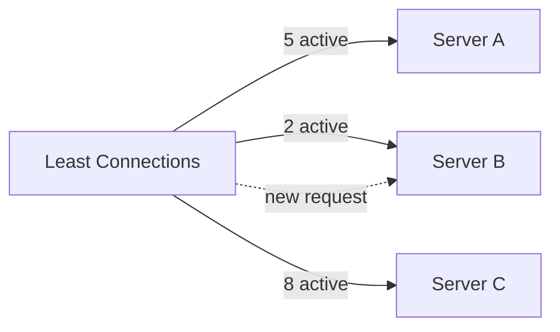
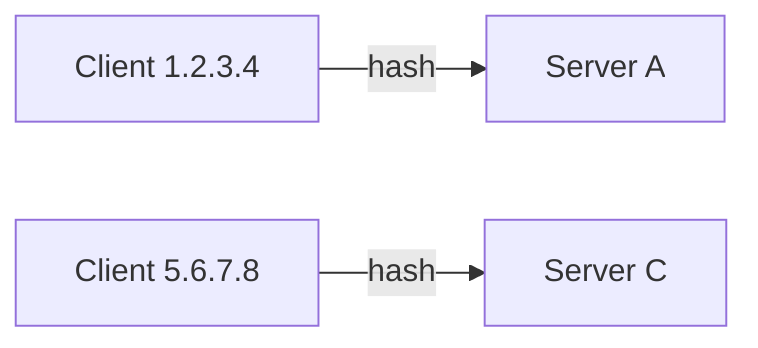
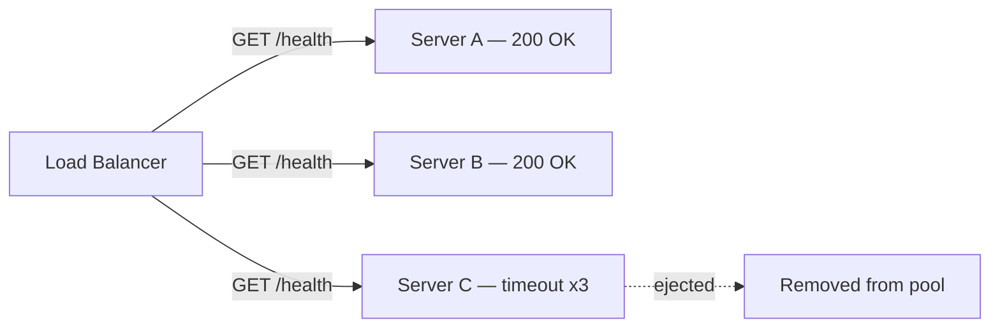
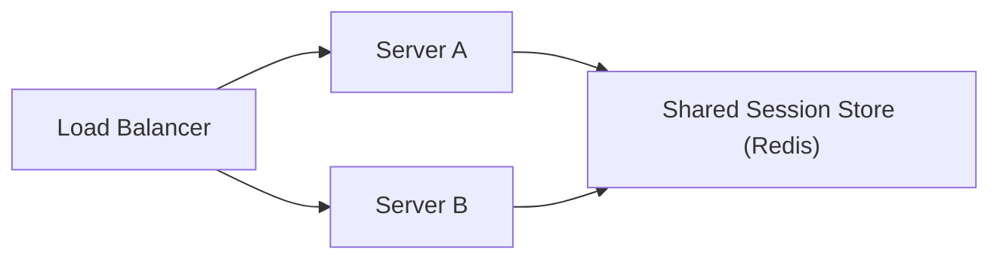
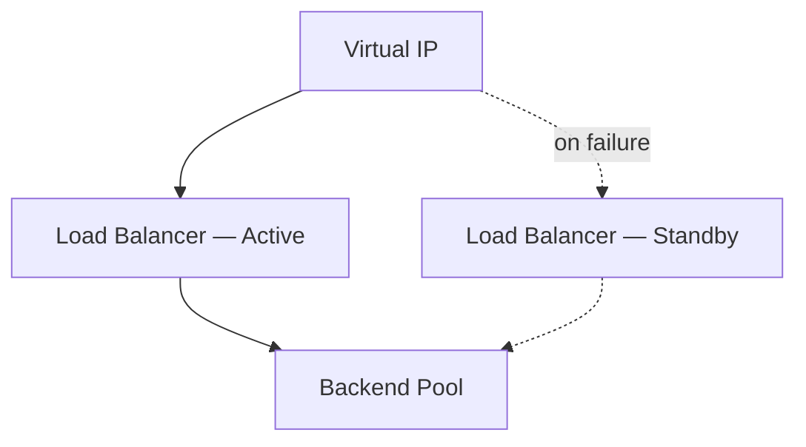

export const metadata = {
  title: 'Load Balancing',
  date: '2026-06-22',
  excerpt: 'A practical guide to load balancing: covering where the load balancer sits, the types you can run, Layer 4 vs. Layer 7, the core distribution algorithms, health checks, session persistence, and how to keep the load balancer itself highly available.',
  tags: ['Network', 'Web'],
};

# Load Balancing

A single server has a ceiling. It can only hold so many connections, burn so much CPU, and run so long before something fails. Load balancing is how you get past that ceiling: put several servers behind one entry point and spread incoming traffic across them.

The component that does the spreading is the load balancer. Done well, it buys you two things at once: more capacity (scale out by adding servers) and higher availability (one server dying doesn't take the site down).

If you've read about the [reverse proxy](/articles/web-proxy), a load balancer is essentially a reverse proxy whose defining job is deciding which backend each request should go to.



- [Why Load Balancing](#why-load-balancing)
- [Where the Load Balancer Sits](#where-the-load-balancer-sits)
- [Types of Load Balancers](#types-of-load-balancers)
- [Layer 4 vs. Layer 7](#layer-4-vs-layer-7)
- [Load Balancing Algorithms](#load-balancing-algorithms)
    - [Round Robin](#round-robin)
    - [Weighted Round Robin](#weighted-round-robin)
    - [Least Connections](#least-connections)
    - [Least Response Time](#least-response-time)
    - [IP Hash](#ip-hash)
    - [Consistent Hashing](#consistent-hashing)
    - [Power of Two Choices](#power-of-two-choices)
- [Health Checks](#health-checks)
- [Session Persistence](#session-persistence)
- [High Availability](#high-availability)
- [Configuration Examples](#configuration-examples)

---

## Why Load Balancing

Start with one server handling every request. As traffic grows, you have two ways to grow with it:

- **Scale up (vertical scaling)**: give that one server a bigger CPU, more RAM, faster disks. Simple, but there's a hard limit to how big a single machine gets, and you pay more per unit of capacity at the top end.
- **Scale out (horizontal scaling)**: add more servers and divide the work between them. There's no real ceiling, and commodity machines are cheap. But now something has to decide which server each request goes to.

That "something" is the load balancer, and it's what makes scaling out practical. The payoff comes in two forms:

- **Capacity**: traffic that would overwhelm one machine is spread across many, so each one stays within its limits.
- **Availability**: if a server crashes or is taken down for a deploy, the load balancer routes around it. The single point of failure on the application tier is gone.



The key shift is that clients no longer talk to a specific server. They talk to the load balancer, and the load balancer decides where their request lands.

---

## Where the Load Balancer Sits

A load balancer is a reverse proxy: it faces the public, accepts connections, and forwards them to a pool of backends the client never sees directly. The client only ever knows the load balancer's address.

That single entry point is why a load balancer can do more than just distribute traffic. Because every request flows through it, it's the natural place to also handle:

- **TLS termination**: decrypt HTTPS once at the edge so backends can speak plain HTTP internally (see [SSL/TLS](/articles/network-ssl-tls))
- **Health checking**: stop sending traffic to a backend that's failing
- **Caching and compression**: serve repeat responses without touching a backend

Larger systems rarely have just one load balancer. Traffic often passes through several tiers: a global layer that routes you to the nearest region, then a regional layer that spreads requests across the servers in that region.



---

## Types of Load Balancers

"Load balancer" describes a role, not a single product. The same role shows up at different points in the stack:

- **DNS load balancing**: the DNS server returns multiple IP addresses for one hostname, and clients connect to one of them. It's the cheapest way to spread traffic across regions, but it's coarse: DNS responses are cached for the duration of their TTL, so you can't react quickly when a server fails, and the resolver (not you) picks which address gets used.
- **Hardware load balancers**: dedicated appliances (F5, Citrix) that handle enormous throughput with purpose-built hardware. Fast and reliable, but expensive and inflexible.
- **Software load balancers**: programs like Nginx, HAProxy, and Envoy running on ordinary servers. Flexible, cheap, and the default choice for most teams today.
- **Cloud load balancers**: managed services like AWS ALB/NLB, GCP Cloud Load Balancing, and Azure Load Balancer. You get scaling, health checks, and high availability without operating the infrastructure yourself.

These layers compose. A typical setup uses DNS or anycast to reach the right region, then a software or cloud load balancer inside each region to spread requests across servers.

---

## Layer 4 vs. Layer 7

Load balancers operate at one of two layers of the network stack, and the choice shapes what they can and can't do. (For the layers themselves, see [the OSI model](/articles/network-osi) and [TCP/IP](/articles/network-tcp-ip).)

A Layer 4 load balancer works at the transport layer. It sees TCP/UDP segments (IP addresses and ports) and forwards them without looking inside. It decides where a connection goes when the connection is established, then every packet on that connection follows the same path. It has no idea whether the traffic is HTTP, a video stream, or a database protocol.

A Layer 7 load balancer works at the application layer. It terminates the connection, reads the actual HTTP request, and routes based on what's inside: the URL path, the `Host` header, cookies, anything in the request. That makes it far more capable, at the cost of more work per request.



| | Layer 4 | Layer 7 |
| - | - | - |
| Operates on | TCP/UDP, IP + port | HTTP/HTTPS request content |
| Routing decisions | Per connection | Per request |
| Can route by URL, host, cookie | No | Yes |
| TLS termination | No (passes through) | Yes |
| Overhead | Low, just forwards packets | Higher, parses each request |
| Typical use | Raw throughput, non-HTTP protocols | Web apps, microservice routing, APIs |

A practical example of the difference: a Layer 7 load balancer can send `/api/*` to your API servers and `/static/*` to a separate pool of static-file servers from a single public address. A Layer 4 load balancer can't; it never sees the path. In return, Layer 4 is leaner and handles enormous connection volumes with very little CPU.

---

## Load Balancing Algorithms

Once a request arrives, the load balancer has to pick a backend. The algorithm it uses is the heart of the whole thing. The right choice depends on whether your servers are equally powerful and whether your requests are equally expensive.

### Round Robin

Hand out requests in a fixed rotation: server A, then B, then C, then back to A.



It's dead simple and works well when all servers have similar capacity and all requests cost about the same. Its weakness is that it ignores reality: it'll keep sending requests to a server that's already struggling, because it only counts turns, not load.

### Weighted Round Robin

The same rotation, but each server gets a weight proportional to its capacity. A server with weight 3 receives three requests for every one that a weight-1 server gets.

This is the fix when your fleet isn't uniform: say a few large machines alongside some smaller ones. You bias the rotation toward the bigger servers so the share of traffic matches the share of capacity.

### Least Connections

Send each new request to the server with the fewest active connections right now.



This adapts to actual load instead of blindly rotating, which makes it the better default when requests vary in duration. With round robin, one server can quietly accumulate a backlog of slow, long-lived requests; least connections naturally steers new work toward whichever server is least busy. A weighted variant exists too, factoring server capacity into the count.

### Least Response Time

A step beyond least connections: pick the server with the best combination of fewest active connections and lowest average response time. A server might have few connections but still be slow (a saturated disk, a noisy neighbor), and response time exposes that. It's more accurate, but it requires the load balancer to continuously measure latency per backend.

### IP Hash

Hash the client's IP address and use the result to pick a server. The same client consistently lands on the same backend.



This gives you session stickiness without cookies, useful when a server holds per-client state in memory. The catch is rebalancing: when you add or remove a server, the hash mapping shifts and a large fraction of clients get reassigned to different backends, dropping their in-memory state. Consistent hashing solves exactly this.

### Consistent Hashing

Plain modulo hashing (`hash(key) % N`) has a brutal failure mode: change `N` and almost every key maps somewhere new. Consistent hashing fixes this by placing both servers and keys on a conceptual ring; each key belongs to the next server clockwise from its position.

The win is what happens when the pool changes. Add or remove one server out of $n$, and only about

$$\frac{K}{n}$$

of the $K$ keys move; the rest stay exactly where they were. Compare that to modulo hashing, where nearly all $K$ keys can move. To keep the distribution even, each server is placed at many points on the ring (virtual nodes). This is the standard approach for distributed caches and sharded data stores, where remapping a key means a cache miss or a data move.

### Power of Two Choices

Tracking global state to always pick the absolute least-loaded server is expensive and hard to coordinate. The power of two choices is a remarkably cheap approximation: pick two servers at random, then send the request to the less loaded of the two.

That one extra sample changes the math dramatically. For $n$ requests spread across $n$ servers, purely random assignment leaves the busiest server with a load of roughly

$$\frac{\ln n}{\ln \ln n}$$

while sampling two and taking the lighter one drops it to roughly

$$\frac{\ln \ln n}{\ln 2}$$

This is an exponential improvement, with almost none of the coordination cost of true least-connections. It's a favorite in large distributed systems for exactly this reason.

---

## Health Checks

Distributing traffic is only useful if you distribute it to servers that actually work. A health check is how the load balancer decides which backends are eligible to receive traffic, and it comes in two flavors.

Active health checks probe each backend on a schedule: an HTTP `GET /health`, or just a TCP connection attempt. A backend is marked down after a number of consecutive failures and brought back only after it passes again a number of times. The thresholds matter: too sensitive and a brief blip ejects a healthy server; too lax and a dead server keeps receiving traffic.

Passive health checks watch real traffic instead of sending synthetic probes. If responses to actual requests start timing out or returning errors, the load balancer marks the backend unhealthy and stops routing to it. This catches failures the moment users hit them, and is the basis of outlier detection and circuit breaking.



The two complement each other: active checks catch a sick server before it serves a single real request, while passive checks catch problems that only show up under real load.

---

## Session Persistence

Many applications keep per-user state in server memory: a login session, a shopping cart, a partially completed form. The problem: if request 1 creates a session on server A and request 2 gets routed to server B, server B has no idea who the user is.

The traditional fix is session persistence, also called sticky sessions: tie a user to one backend for the duration of their session. There are two common ways to do it:

- **Cookie-based**: the load balancer injects a cookie identifying the chosen backend, and routes subsequent requests with that cookie back to the same server. This is a Layer 7 feature.
- **IP-based**: use IP hash so a client's address always maps to the same server. Works at Layer 4, but breaks for clients behind shared NAT or roaming between networks.

Stickiness works, but it fights against the load balancer's whole purpose:

- **Load skews**: popular sessions can pile onto one server while others sit idle.
- **It breaks on removal**: when a sticky server goes down, every session pinned to it is lost.
- **It limits scaling**: new servers only pick up new sessions, not existing traffic.

The better answer is to make your servers stateless: move session state out of server memory and into a shared store both servers can read.



With state in a shared store like Redis (or carried entirely in the request as a signed token like a [JWT](/articles/network-jwt)), any server can handle any request. That's what lets you scale out freely, deploy without dropping sessions, and lean on the simplest, most even algorithms. Sticky sessions are a workaround; stateless servers are the design.

---

## High Availability

There's an awkward question lurking in every diagram so far: if all traffic flows through the load balancer, isn't the load balancer itself a single point of failure? It is, unless you design around it. A load balancer that can take down your whole site is worse than no load balancer at all.

The standard pattern is to run more than one. The two arrangements:

- **Active-passive**: one load balancer serves traffic while a standby waits. They share a virtual IP (VIP), a floating address that normally points at the active node. The two exchange heartbeats (via a protocol like VRRP, as `keepalived` implements); if the active one stops responding, the VIP moves to the standby, which takes over. Clients never see the address change.
- **Active-active**: multiple load balancers all serve traffic at once, fronted by DNS round robin or anycast. You get failover and extra capacity, at the cost of more coordination.



At the largest scale, the entry point itself is distributed geographically with anycast: the same IP address is announced from data centers around the world, and the internet's own routing (BGP) delivers each client to the nearest one. A whole site can fail and traffic simply reroutes to the next-closest location, with no DNS change and no waiting for caches to expire.

The principle is the same at every layer: never let a single box, however reliable, be the only thing standing between users and your service.

---

## Configuration Examples

The concepts above map directly onto real config. Here's the same backend pool expressed in the two most common software load balancers.

Nginx, using `upstream` to define the pool:

```nginx
upstream backend {
    least_conn;                                   # algorithm
    server backend1.example.com:8080 weight=3;    # gets 3x the traffic
    server backend2.example.com:8080;
    server backend3.example.com:8080 backup;      # only used if others are down
}

server {
    listen 80;
    server_name example.com;

    location / {
        proxy_pass http://backend;
        proxy_set_header Host $host;
        proxy_set_header X-Real-IP $remote_addr;
    }
}
```

HAProxy, with an explicit health check:

```haproxy
frontend http_in
    bind *:80
    default_backend servers

backend servers
    balance roundrobin
    option httpchk GET /health          # active health check
    server web1 10.0.0.1:8080 check weight 3
    server web2 10.0.0.2:8080 check
    server web3 10.0.0.3:8080 check backup
```

Both express the same ideas: a pool of backends, an algorithm (`least_conn` / `roundrobin`), per-server weights, a backup server, and, in HAProxy's case, an active health check on `/health`.

---

## Conclusion

Load balancing is what turns a pile of servers into a single, scalable, resilient service. The pieces fit together like this:

- A load balancer is a reverse proxy whose job is choosing a backend for each request, giving you capacity and availability at once.
- Layer 4 forwards connections fast and blind; Layer 7 reads requests and routes intelligently, at higher cost.
- The algorithm decides where requests land: round robin for uniform fleets, least connections for variable workloads, consistent hashing when remapping is expensive, power of two choices for cheap near-optimal balance.
- Health checks keep traffic away from broken backends; session persistence is a workaround that stateless servers make unnecessary.
- And the load balancer must never be a single point of failure: run it in pairs or distribute it with anycast.

Load balancing is the headline job of a [reverse proxy](/articles/web-proxy), covered here with the algorithms, health checks, and failover that make it production-ready. For how the edge decrypts HTTPS before handing requests to a backend, see [SSL/TLS](/articles/network-ssl-tls).
