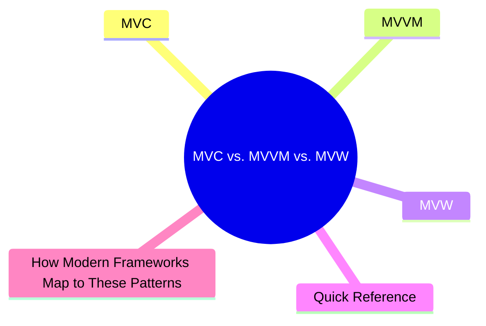
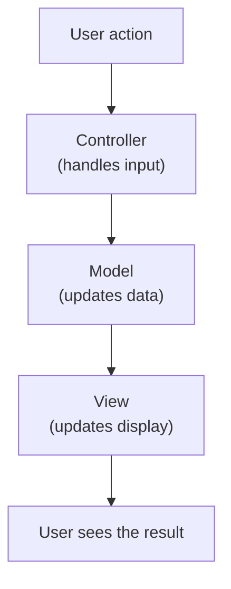

export const metadata = {
  title: 'MVC vs. MVVM vs. MVW: Architectural Patterns Explained',
  date: '2026-04-11',
  excerpt: 'A practical guide to MVC, MVVM, and MVW — covering how each pattern separates concerns, the difference in data flow, and how Angular, Vue, and React map to these patterns.',
  tags: ['Architecture', 'Design Pattern'],
};

# MVC vs. MVVM vs. MVW: Architectural Patterns Explained

MVC, MVVM, and MVW are architectural patterns for organizing application code. They all address the same core problem: how to separate UI, data, and logic clearly.



- [MVC](#mvc)
- [MVVM](#mvvm)
- [MVW](#mvw)
- [Quick Reference](#quick-reference)
- [How Modern Frameworks Map to These Patterns](#how-modern-frameworks-map-to-these-patterns)

---

## MVC

MVC (Model-View-Controller) is the classic architectural pattern. It divides an application into three roles:

- Model — data and business logic; manages application state and handles data storage and retrieval
- View — the UI; responsible only for displaying data, no business logic
- Controller — the intermediary; receives user input, updates the Model, and decides which View to show



### MVC Characteristics

- The Controller bridges View and Model
- The View never directly manipulates the Model
- One Controller can correspond to multiple Views
- Traditional backend frameworks (Rails, Laravel, Spring MVC) widely use this pattern

### MVC's Problem

In frontend applications, Controllers tend to grow bloated — taking on too much logic over time, a problem sometimes called "Massive View Controller." As applications scale, this becomes increasingly painful to manage.

---

## MVVM

MVVM (Model-View-ViewModel) is an evolution of MVC, particularly well-suited to frontend frameworks with data binding.

- Model — data and business logic, same as in MVC
- View — the UI; declaratively describes the layout and structure
- ViewModel — the View's data and state; provides what the View needs and handles View behavior, but never directly manipulates the DOM


### The Core of MVVM: Two-Way Data Binding

The defining feature of MVVM is two-way data binding between View and ViewModel:

- Model data changes → ViewModel updates → View updates automatically
- User interacts with the View → ViewModel is notified → Model is updated

Developers don't need to touch the DOM — the framework handles View updates automatically.

### Angular and MVVM

Angular is a classic MVVM framework:

- Model — Services and data objects
- ViewModel — The Component's TypeScript class (properties and methods)
- View — The Component's HTML template

```typescript
@Component({
  selector: 'app-counter',
  template: `
    <p>{{ count }}</p>
    <button (click)="increment()">+1</button>
  `,
})
export class CounterComponent {
  count = 0;

  increment() {
    this.count++; // update state; View updates automatically
  }
}
```

`{{ count }}` is one-way binding (ViewModel → View). `(click)` is event binding (View → ViewModel).

### Vue and MVVM

Vue is also a MVVM framework:

- Model — reactive data in `data()` or `ref()` / `reactive()`
- ViewModel — logic in `setup()` or the Options API
- View — the template

```vue
<template>
  <p>{{ count }}</p>
  <button @click="count++">+1</button>
</template>

<script setup>
import { ref } from 'vue';
const count = ref(0);
</script>
```

---

## MVW

MVW (Model-View-Whatever) was a term coined by the Angular team. The point: don't worry too much about what the middle layer is called — what matters is that you separate concerns properly.

It reflects a real-world truth: modern frameworks don't map cleanly onto traditional MVC or MVVM definitions, and forcing them into those boxes creates more confusion than clarity.

### Where React Fits

React has never claimed to be MVC or MVVM. Officially, it's a View library — it handles rendering and nothing else.

How you organize state, data flow, and business logic is up to you (or delegated to tools like Redux or Zustand).

```jsx
function Counter() {
  const [count, setCount] = useState(0); // state (closest to ViewModel)

  return (
    <div>
      <p>{count}</p>
      <button onClick={() => setCount(count + 1)}>+1</button>
    </div>
  );
}
```

React's data flow is one-directional: state changes trigger re-renders. This is different from MVVM's two-way binding.

---

## Quick Reference

| | MVC | MVVM | MVW |
| - | - | - | - |
| Middle layer | Controller | ViewModel | Whatever works |
| Data flow | One-way | Two-way binding | Depends on implementation |
| DOM manipulation | Controller may touch it | ViewModel doesn't | Depends on framework |
| Typical context | Backend frameworks, traditional MPAs | Frontend frameworks (Angular, Vue) | Modern frameworks like React |

---

## How Modern Frameworks Map to These Patterns

| Framework | Closest pattern | Notes |
| - | - | - |
| Angular | MVVM | Component = ViewModel, two-way data binding |
| Vue | MVVM | Reactivity system enables two-way binding |
| React | Closer to MVW | One-way data flow, no official architectural pattern |

---

## Summary

- MVC is the classic separation pattern — the Controller bridges View and Model
- MVVM uses two-way data binding to keep View and ViewModel in sync automatically — well-suited to modern frontend frameworks
- MVW is the pragmatic acknowledgment that modern frameworks don't always fit neatly into traditional categories

The goal behind all three is the same: keep UI, data, and logic separate, reduce coupling, and make the codebase easier to maintain.
