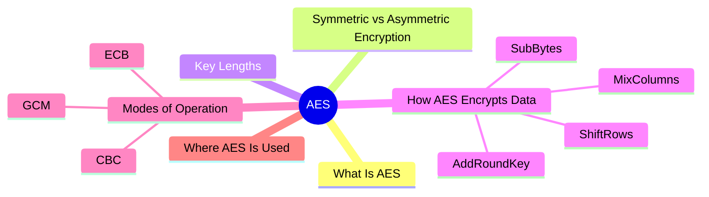
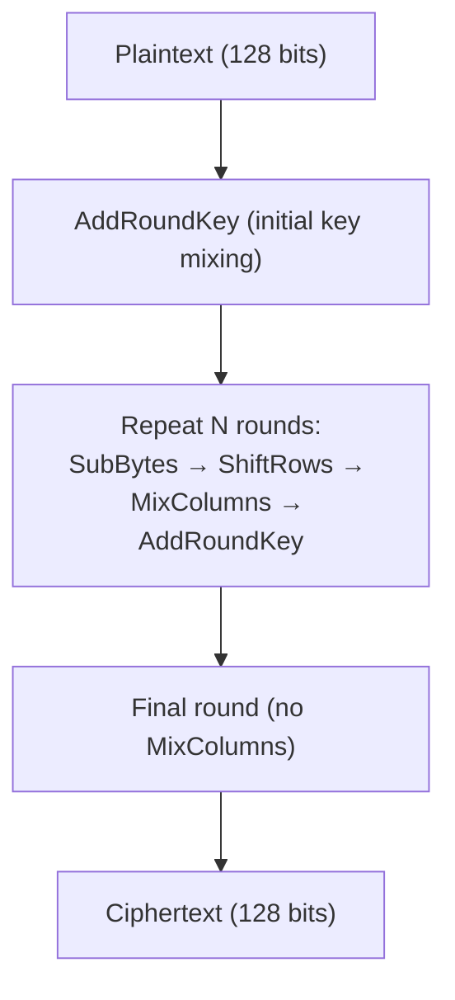
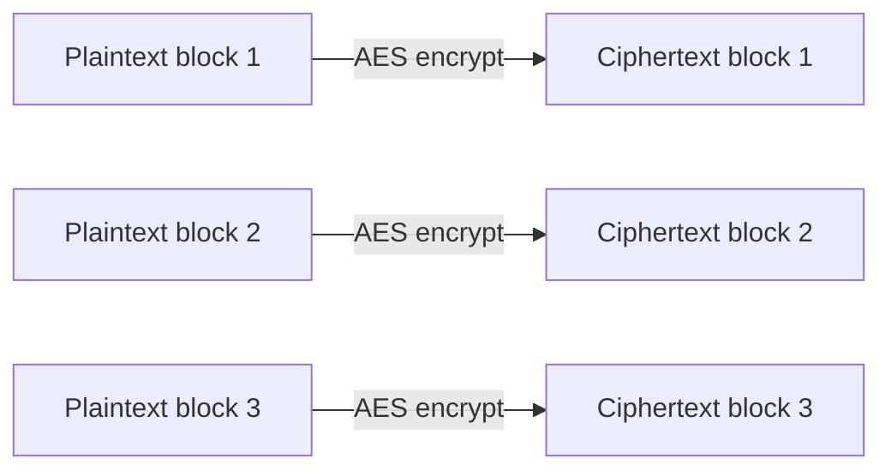
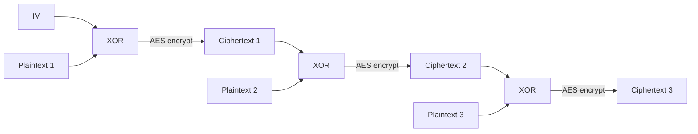

export const metadata = {
  title: 'Advanced Encryption Standard (AES)',
  date: '2026-04-29',
  excerpt: 'A practical guide to AES — covering symmetric vs asymmetric encryption, the three key lengths, and the differences between ECB, CBC, and GCM modes of operation.',
  tags: ['Security', 'Network'],
};

# Advanced Encryption Standard (AES)

AES (Advanced Encryption Standard) is the most widely used symmetric encryption algorithm in the world. It protects everything from HTTPS connections to full-disk encryption.



- [What Is AES](#what-is-aes)
- [Symmetric vs Asymmetric Encryption](#symmetric-vs-asymmetric-encryption)
- [Key Lengths](#key-lengths)
- [How AES Encrypts Data](#how-aes-encrypts-data)
- [Modes of Operation](#modes-of-operation)
- [Where AES Is Used](#where-aes-is-used)

---

## What Is AES

AES is a symmetric encryption algorithm — the same key encrypts and decrypts.

Designed by Belgian cryptographers Joan Daemen and Vincent Rijmen under the name Rijndael, it was selected by NIST as the US federal encryption standard in 2001.

AES is a block cipher — it processes data in fixed 128-bit chunks.

---

## Symmetric vs Asymmetric Encryption

| | Symmetric | Asymmetric |
| - | - | - |
| Keys | Same key for both operations | Public key encrypts, private key decrypts |
| Speed | Fast | Slow |
| Best for | Encrypting large amounts of data | Key exchange, digital signatures |
| Examples | AES, ChaCha20 | RSA, ECC |

In practice, HTTPS uses asymmetric encryption to securely exchange a symmetric key, then switches to AES for the actual data transfer.

---

## Key Lengths

| Key length | Rounds | Security |
| - | - | - |
| AES-128 | 10 | Sufficient for most use cases |
| AES-192 | 12 | Higher security |
| AES-256 | 14 | Maximum security, used for highly sensitive data |

With current computing power, brute-forcing AES-128 is computationally infeasible.

---

## How AES Encrypts Data

AES arranges 128 bits of data into a 4×4 matrix of bytes called the State, then applies four steps repeatedly to produce ciphertext.



### SubBytes

Each byte in the State is replaced with a corresponding value from a fixed 256-entry lookup table called the S-Box:

```
b[i][j] = S(a[i][j])
```

```text
Input State                    Output State
┌────┬────┬────┬────┐         ┌────┬────┬────┬────┐
│ a  │ b  │ c  │ d  │         │S(a)│S(b)│S(c)│S(d)│
├────┼────┼────┼────┤   →     ├────┼────┼────┼────┤
│ e  │ f  │ g  │ h  │         │S(e)│S(f)│S(g)│S(h)│
├────┼────┼────┼────┤         ├────┼────┼────┼────┤
│ i  │ j  │ k  │ l  │         │S(i)│S(j)│S(k)│S(l)│
├────┼────┼────┼────┤         ├────┼────┼────┼────┤
│ m  │ n  │ o  │ p  │         │S(m)│S(n)│S(o)│S(p)│
└────┴────┴────┴────┘         └────┴────┴────┴────┘
```

This introduces non-linearity, making it mathematically infeasible to reverse-engineer the key from the output.

### ShiftRows

Each row of the State matrix is cyclically shifted left:

```text
Row 0: no shift      [a0, a1, a2, a3] → [a0, a1, a2, a3]
Row 1: shift by 1    [b0, b1, b2, b3] → [b1, b2, b3, b0]
Row 2: shift by 2    [c0, c1, c2, c3] → [c2, c3, c0, c1]
Row 3: shift by 3    [d0, d1, d2, d3] → [d3, d0, d1, d2]
```

This spreads bytes across columns so that the subsequent MixColumns step can affect the entire matrix.

### MixColumns

Each column of the State is multiplied by a fixed matrix using GF(2⁸) (Galois field) arithmetic:

```text
[2 3 1 1]   [a]   [a']
[1 2 3 1] × [b] = [b']
[1 1 2 3]   [c]   [c']
[3 1 1 2]   [d]   [d']
```

This mixes each column's four bytes into four new bytes, creating a strong avalanche effect — changing a single input bit causes roughly half the output bits to flip.

### AddRoundKey

The State is XOR'd byte-by-byte with a round key derived from the original key:

```
State ⊕ RoundKey = new State
```

Round keys are generated by the Rijndael Key Schedule, producing a unique key for each round. This is the step where the secret key actually shapes the encryption output.

---

## Modes of Operation

When data is larger than one block, a mode of operation determines how multiple blocks are handled.

### ECB (Electronic Codebook)

Each block is encrypted independently:



The problem: identical plaintext blocks produce identical ciphertext blocks — patterns in the data remain visible. ECB is fundamentally insecure. Don't use it.

### CBC (Cipher Block Chaining)

Each block is XOR'd with the previous ciphertext block before encryption:



A random IV ensures the same plaintext always produces different ciphertext. More secure than ECB, but encryption must be sequential and doesn't include integrity verification.

### GCM (Galois/Counter Mode)

The recommended choice. GCM provides AEAD — encryption and authentication together. Encryption is parallelizable (fast), and it produces an Authentication Tag that the receiver uses to verify the data hasn't been tampered with. TLS 1.3 uses AES-GCM as a primary cipher suite.

---

## Where AES Is Used

Network transmission — HTTPS (TLS) uses AES-GCM to encrypt all data in transit.

Full-disk encryption — macOS FileVault, Windows BitLocker, and Linux LUKS all use AES.

File encryption — ZIP, 7z archives, and tools like VeraCrypt use AES.

Messaging apps — Signal, WhatsApp, and other E2EE apps use AES to encrypt message content.

Password managers — 1Password and Bitwarden use AES-256 to encrypt stored credentials.

---

## Conclusion

- AES is symmetric — the same key encrypts and decrypts
- Four steps per round: SubBytes (non-linear substitution), ShiftRows (row rotation), MixColumns (column mixing via GF(2⁸)), AddRoundKey (XOR with round key)
- Three key lengths: 128, 192, 256 bits — more bits means more rounds
- Modes: ECB is insecure and should never be used; CBC is secure but sequential; GCM is the recommended choice
- Used everywhere: HTTPS, disk encryption, messaging apps, password managers
