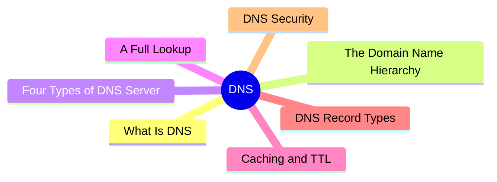
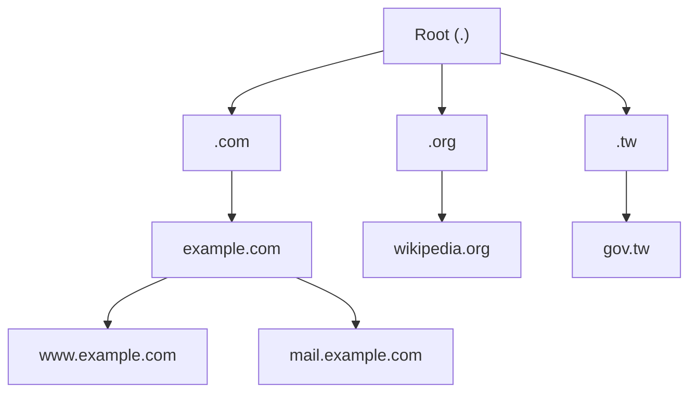
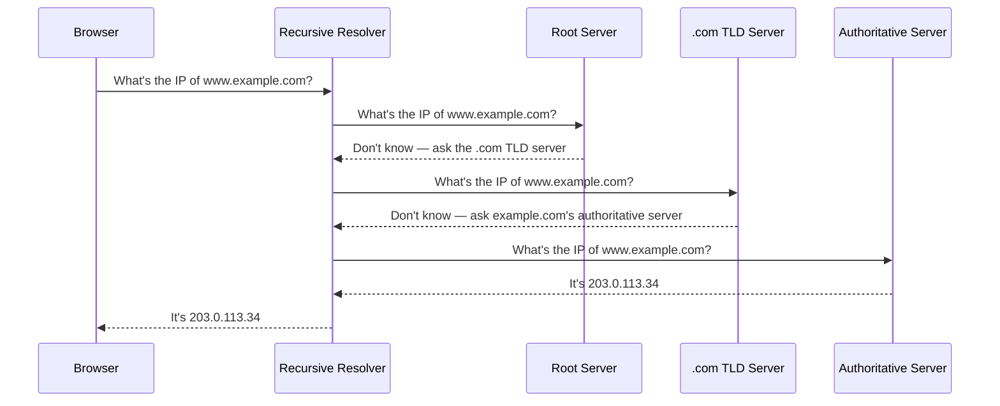

export const metadata = {
  title: 'DNS: The Internet\'s Naming System',
  date: '2026-06-22',
  excerpt: 'A practical guide to how DNS works: covering the domain name hierarchy, the four types of DNS server, a full recursive lookup, caching and TTL, common record types, and DNS security.',
  tags: ['Network', 'Web'],
};

# DNS: The Internet's Naming System

When you type `google.com` into your browser, your computer has no idea what that string means. Machines on a network talk to each other using IP addresses, and an IP address is an awkward string of numbers (like `142.250.80.46`).

DNS (Domain Name System) does the translation: it turns human-friendly domain names into the IP addresses machines actually use. It's often described as the phone book of the internet: you know someone's name (the domain), and DNS looks up their number (the IP address).



- [What Is DNS](#what-is-dns)
- [The Domain Name Hierarchy](#the-domain-name-hierarchy)
- [The Four Types of DNS Server](#the-four-types-of-dns-server)
- [A Full DNS Lookup](#a-full-dns-lookup)
- [Caching and TTL](#caching-and-ttl)
- [Common DNS Record Types](#common-dns-record-types)
- [DNS Security](#dns-security)

---

## What Is DNS

The obvious approach would be to put every domain name and its IP address into one giant table and look things up as needed. But there are billions of domains on the internet, with new ones added and changed every day. That table would be too large for any single server to hold, and no single organization could keep it up to date in real time. Worse, if that single server ever failed, the entire internet would go down with it.

DNS solves this by splitting the table apart and distributing it across millions of servers worldwide, organized as a hierarchy. No single server knows every answer, but every server knows *who to ask next*. This design is called delegation: each level is responsible only for pointing the way, handing the actual answers off to the level below.

So DNS is fundamentally a distributed, hierarchical database. Understanding DNS comes down to understanding how that hierarchy is divided, and how a single query walks down it to find an answer.

---

## The Domain Name Hierarchy

A domain name is read from right to left, and each part represents one level of the hierarchy:

```
www.example.com.
 │     │     │ └ Root
 │     │     └ Top-Level Domain (TLD)
 │     └ Second-Level Domain
 └ Subdomain
```

- **Root**: the very top of the hierarchy, represented by a single dot. We normally leave it out, but `www.example.com` is really `www.example.com.` in full.
- **Top-Level Domain (TLD)**: the rightmost part, such as `.com` or `.org`, or a country code like `.tw` or `.jp`.
- **Second-Level Domain**: usually the part you register and are free to name, like `example`.
- **Subdomain**: a further division below the second-level domain, like `www`, `mail`, or `blog`.

The complete name, including the trailing dot, which uniquely identifies a single host, is called a Fully Qualified Domain Name (FQDN).

This hierarchy is really a tree, with the root at the top, branching downward level by level:



The key idea is that each level is only responsible for the level directly beneath it. The root doesn't know where `example.com` lives, but it knows who manages `.com`. The `.com` servers don't know the IP of `www.example.com`, but they know who manages `example.com`. A query simply walks down this tree, asking one level at a time.

---

## The Four Types of DNS Server

A single lookup involves four servers, each playing a different role:

- **Recursive Resolver**: the one that asks around on your behalf and brings the answer back. It's usually provided by your ISP, though you can point to a public resolver like Google's `8.8.8.8` or Cloudflare's `1.1.1.1`.
- **Root Name Server**: the starting point of the hierarchy. It knows no domain's IP, but it can tell you which TLD server to ask. There are 13 root server identities (labeled A through M), deployed across many physical nodes around the world using anycast.
- **TLD Name Server**: manages every domain under a given TLD. The `.com` TLD server, for example, knows which authoritative server is responsible for `example.com`.
- **Authoritative Name Server**: holds the actual records for a domain. It's the final source of truth. Instead of saying "go ask someone else," it returns the real IP address.

Think of the recursive resolver as an assistant running errands for you: you hand it a single question, and it does all the level-by-level asking itself. You never need to know how many servers it talked to along the way.

---

## A Full DNS Lookup

Let's put all four roles together and walk through a complete lookup. Suppose you're connecting to `www.example.com` for the first time, with every cache still empty:



This process actually mixes two kinds of query:

- The browser sends the resolver a recursive query: "Give me the final answer; I don't care how."
- The resolver sends the root, TLD, and authoritative servers iterative queries: each step returns not an answer, but a pointer to the next server to ask.

This division of labor matters. The client only has to implement the simplest possible logic (ask once, get one answer), while all the complexity of chasing the answer down the hierarchy lives in the resolver.

It's worth noting that most queries travel over UDP rather than TCP. DNS requests and responses are usually tiny, and UDP has no handshake overhead and lower latency, which suits this kind of quick question-and-answer exchange. DNS only falls back to TCP when a response is too large (for example, when DNSSEC is enabled) or for a zone transfer.

---

## Caching and TTL

If every connection had to walk all the way down from the root, DNS would be painfully slow and the root servers would be crushed by traffic. In practice, that full lookup rarely happens, because every level caches.

Query results are cached at several layers, checked in order from nearest to farthest:


As soon as any layer has a cached answer, the query stops right there and everything downstream is skipped. So the vast majority of queries are answered right on your machine or at your resolver, never reaching the root at all.

How long should a record stay cached? That's decided by its TTL (Time To Live). Every DNS record carries a TTL value in seconds, telling each cache how long it may reuse the answer. Once the TTL expires, the cache discards the record and the next query asks up the hierarchy again.

Setting the TTL is a trade-off:

- A long TTL (say 86400 seconds, one day) means a higher cache hit rate, faster lookups, and less load on the authoritative server, but a changed record lingers at its old value for a long time.
- A short TTL (say 300 seconds, five minutes) means changes take effect quickly, at the cost of more frequent queries and higher load.

This is also why a new host or DNS change doesn't take effect everywhere instantly; that waiting period, where old and new records coexist, is commonly called DNS propagation. A common practice is to lower the TTL a few days before a planned change, then raise it back once the change is live and stable.

---

## Common DNS Record Types

DNS answers more than just IP addresses. A domain can hold several types of record, each answering a different question:

| Record | Purpose | Example |
| - | - | - |
| A | Points a domain to an IPv4 address | `example.com → 203.0.113.34` |
| AAAA | Points a domain to an IPv6 address | `example.com → 2001:db8::1` |
| CNAME | An alias, pointing one domain to another | `www.example.com → example.com` |
| MX | Specifies the mail servers for the domain | `example.com → mail.example.com (priority 10)` |
| NS | Specifies the authoritative name servers for the domain | `example.com → ns1.example.com` |
| TXT | Stores arbitrary text, often for domain verification and email anti-spoofing (SPF, DKIM) | `v=spf1 include:_spf.example.com ~all` |
| SOA | Administrative info for the DNS zone (primary server, serial number, default TTLs) | N/A |
| PTR | Reverse lookup, mapping an IP address back to a domain name | `203.0.113.34 → example.com` |

In practice, you can inspect a domain's records with a tool like `dig`:

```text
$ dig example.com

;; ANSWER SECTION:
example.com.    3600    IN    A    203.0.113.34
```

This line says: the A record for `example.com` is `203.0.113.34`, with a TTL of 3600 seconds, and `IN` denotes the Internet class. Read that one line and you've read the heart of a DNS response.

One CNAME limitation is worth remembering: if a name has a CNAME, it can't have any other records, so a root domain (like `example.com` itself) usually can't use a CNAME and must use an A or AAAA record instead. This trips up a lot of DNS configurations.

---

## DNS Security

DNS was designed in the early days of the internet, when the priorities were making it work and making it fast; security wasn't part of the picture. Traditional DNS queries travel in plain text over UDP, with no encryption and no way to verify that a response really came from the right server. That leaves two fundamental problems: queries can be eavesdropped on, and responses can be forged. The two defenses below each address one of them.

### DNS Cache Poisoning

DNS cache poisoning, also called DNS spoofing, is the forgery attack. An attacker races to send a forged record to the resolver before the real authoritative server replies. The resolver caches that fake answer, and from then on, every user who queries it is sent to a server the attacker controls, even though the address you typed was perfectly correct.

### DNSSEC: Guaranteeing Authenticity

DNSSEC (DNS Security Extensions) adds digital signatures to DNS records. The authoritative server signs its records with a private key, and the resolver verifies the signatures using the corresponding public keys, validated down the hierarchy. If a record has been tampered with, the signature won't match and the forged answer is rejected.

One thing to be clear about: DNSSEC guarantees authenticity and integrity (the record genuinely came from the right source and wasn't altered); it does not encrypt anything. In other words, DNSSEC protects against forgery, not eavesdropping.

### Encrypted DNS: Guaranteeing Privacy

To prevent eavesdropping, you need encryption. Even when a record isn't tampered with, traditional DNS is still plain text, so anyone along the path (your ISP, the operator of a public Wi-Fi hotspot) can see which domains you looked up. Two mainstream encrypted DNS protocols solve this:

- **DoH (DNS over HTTPS)**: wraps DNS queries inside HTTPS over port 443. Because it blends in with ordinary web traffic, it's hard to single out or block.
- **DoT (DNS over TLS)**: encrypts DNS with TLS over a dedicated port 853. Its traffic is easy to identify, which is convenient for network management but also makes it easier to block selectively.

DNSSEC and encrypted DNS don't compete; they complement each other: one ensures the answer wasn't forged, the other ensures the question wasn't seen.

---

## Conclusion

- DNS translates human-friendly domain names into the IP addresses machines use: fundamentally a distributed, hierarchical database
- Domain names are read right to left, layered by root, TLD, second-level domain, and subdomain, with each level only delegating to the one below it
- A lookup is handled by a recursive resolver, which iteratively asks the root, TLD, and authoritative servers in turn before bringing the answer back to the client
- Multi-layer caching and TTL keep most queries from ever running the full process; the TTL length is a trade-off between lookup speed and how fast changes take effect
- Beyond A/AAAA, DNS has CNAME, MX, NS, TXT, and other records, each answering a different question
- Traditional DNS can be both eavesdropped on and forged: DNSSEC uses signatures to guarantee authenticity, while DoH/DoT use encryption to guarantee privacy
