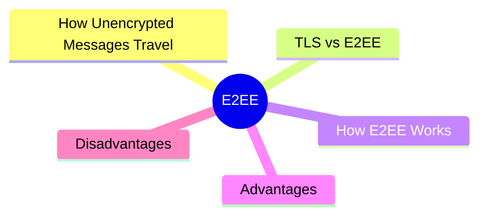
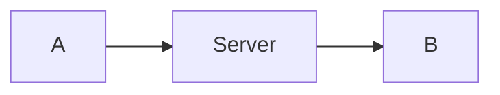
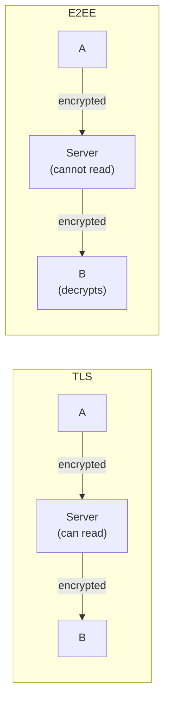
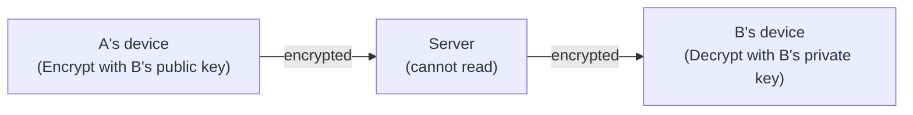

export const metadata = {
  title: 'End-to-End Encryption (E2EE)',
  date: '2026-04-26',
  excerpt: 'A practical guide to end-to-end encryption (E2EE) — covering how it differs from TLS, how asymmetric encryption works, and the trade-offs of using E2EE.',
  tags: ['Security', 'Network'],
};

# End-to-End Encryption (E2EE)

End-to-end encryption (E2EE) ensures that only the sender and recipient can read a message. Anyone in between — including the servers that carry the message — cannot decrypt the content.

Think of it like a letter that only the sender and recipient can open. The courier delivers it, but can't read what's inside.

- [How Unencrypted Messages Travel](#how-unencrypted-messages-travel)
- [TLS vs E2EE](#tls-vs-e2ee)
- [How E2EE Works](#how-e2ee-works)
- [Advantages](#advantages)
- [Disadvantages](#disadvantages)

---

## How Unencrypted Messages Travel

Take a messaging app: account A wants to send a message to account B. The message has to pass through a server.

This is the standard client-server model. The server is the intermediary. TLS can protect the connection between A and the server, and between the server and B — but once the message reaches the server, the server can read it.

---

## TLS vs E2EE

Both TLS and E2EE use public-key cryptography, but they protect different things:

- TLS — secures the connection between a client and a server. The message is encrypted in transit, but the server decrypts it on arrival and can read the contents.
- E2EE — secures the entire path from sender to recipient. The server only ever handles encrypted data and can't read the contents at all.

TLS solves the problem of interception in transit. E2EE goes further — even the service provider can't read your messages.

---

## How E2EE Works

E2EE uses asymmetric encryption (public-key cryptography). Each user has a key pair:

- Public key — shared openly, used to encrypt messages
- Private key — never leaves the user's device, used to decrypt messages

The process:

1. Generate key pairs

A and B each generate a public/private key pair. The public key can be shared with anyone; the private key stays on the device.

2. Exchange public keys

A and B share their public keys with each other (typically via the server). The server can see the public keys, but without the private key, it can't decrypt anything.

3. Encrypt the message

A wants to send a message to B, so A encrypts it using B's public key. The resulting ciphertext can only be decrypted by whoever holds B's private key.

4. Decrypt the message

B receives the encrypted message and decrypts it using their own private key.

Throughout this entire process, the server only ever sees ciphertext. It has no way to read the content.

---

## Advantages

### Strong privacy

Only the two parties in the conversation can read the messages. The service provider, the network operator, and even governments cannot access the content — not without obtaining someone's private key.

### Protection against interception

Even if a message is intercepted in transit, it's useless without the corresponding private key. It can't be read or tampered with.

### Trust that doesn't rely on the provider

Users don't have to trust the service provider's intentions. The security comes from the cryptography itself, not from a promise.

---

## Disadvantages

### Key management

If a private key is lost, any encrypted messages are gone forever. At organizational scale, managing keys requires significant infrastructure.

### Multi-device sync is complex

Using the same private key across multiple devices requires a secure sync mechanism, which is non-trivial to implement well.

### Legal and regulatory challenges

E2EE makes lawful interception difficult. Even if a court orders a service provider to hand over communications, the provider genuinely cannot — the content is inaccessible to them too.

### Performance overhead

Encryption and decryption require computation. On resource-constrained devices, this overhead can be noticeable.

### Feature limitations

Because the provider can't read content, features that depend on content access — keyword search, content moderation, targeted advertising — either don't work or need workarounds.

---

## Summary

E2EE keeps encryption and decryption at the endpoints only. No server, no intermediary, no service provider can read the contents — only the sender and recipient.

The mechanism is asymmetric encryption: a public key encrypts, a private key decrypts, and the private key never leaves the user's device.

Services that use E2EE by default include Signal, WhatsApp, iMessage (between Apple devices), and ProtonMail.
