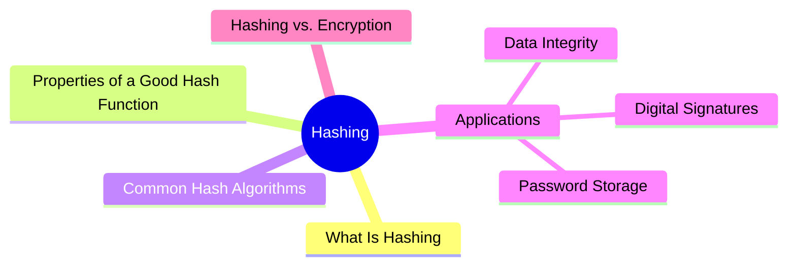
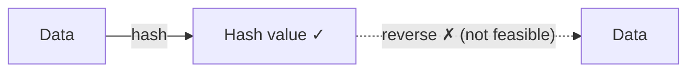

export const metadata = {
  title: 'Hashing',
  date: '2026-03-31',
  excerpt: 'A practical guide to hashing — covering the key properties, common algorithms (MD5, SHA-256, bcrypt, Argon2), and real-world applications in password storage, data integrity, and digital signatures.',
  tags: ['Security', 'Network'],
};

# Hashing

Hashing is the process of taking input of any length and running it through a hash function to produce a fixed-length output called a hash value or digest.



- [What Is Hashing](#what-is-hashing)
- [Properties of a Good Hash Function](#properties-of-a-good-hash-function)
- [Common Hash Algorithms](#common-hash-algorithms)
- [Applications](#applications)
- [Hashing vs. Encryption](#hashing-vs-encryption)

---

## What Is Hashing

A hash function takes any input and produces a fixed-length output:

```mermaid
flowchart LR
    A['"Hello"'] -->|SHA-256| H1["185f8db32921bd46d35c... (64 hex characters)"]
    B['"Hello World"'] -->|SHA-256| H2["a591a6d40bf420404a01... (64 hex characters)"]
    C["A 1GB file"] -->|SHA-256| H3["... (64 hex characters)"]
```

No matter how large the input, the output is always the same length.

---

## Properties of a Good Hash Function

### One-Way (Pre-image Resistance)

Hashing is irreversible. You cannot work backward from a hash value to recover the original data. This is fundamentally different from encryption, which has a corresponding decryption operation.



### Deterministic

The same input always produces the same output:

```
SHA-256("Hello") = 185f8db32921bd46d35c...  (same every time)
```

### Avalanche Effect

A tiny change in the input produces a completely different output:

```
SHA-256("Hello") = 185f8db32921bd46d35c...
SHA-256("hello") = 2cf24dba5fb0a30e26e8...  (completely different)
```

Changing one character — just the case of the first letter — produces an entirely different hash.

### Collision Resistance

A collision is when two different inputs produce the same hash. A strong hash function makes finding a collision computationally infeasible.

---

## Common Hash Algorithms

### MD5

Produces a 128-bit output (32 hex characters).

```
MD5("Hello") = 8b1a9953c4611296a827abf8c47804d7
```

MD5 has been broken — collisions can be found quickly. Do not use for security purposes. It's still fine for non-security use cases like file deduplication.

### SHA-1

Produces a 160-bit output (40 hex characters).

SHA-1 has also been broken. Google demonstrated a practical collision attack in 2017. Do not use for security purposes.

### SHA-256 / SHA-512 (SHA-2 Family)

SHA-256 produces a 256-bit output (64 hex characters); SHA-512 produces 512 bits.

```
SHA-256("Hello") = 185f8db32921bd46d35c54d8e3d7e7b262f41f529a1caeb3...
```

The most widely used secure hash algorithm today. Used in TLS, digital certificates, Git, and blockchain.

### SHA-3

SHA-3 is an alternative to SHA-2 (not an improvement — a separate design), based on the Keccak algorithm. Highly secure, but less widely adopted than SHA-2.

### bcrypt / Argon2 / scrypt (Password Hashing)

These are slow hash algorithms designed specifically for password storage. The computational cost is intentional — it makes brute-force attacks far more expensive:

- bcrypt — the most widely used password hash; adjustable work factor
- Argon2 — winner of the 2015 Password Hashing Competition; the current best-practice recommendation
- scrypt — memory-intensive; designed to resist GPU and ASIC-based attacks

General-purpose hash functions like SHA-256 should never be used directly for password storage. Always use a dedicated password hashing algorithm.

---

## Applications

### Password Storage

Never store passwords in plain text — store the hash instead. During login, hash the submitted password and compare it to the stored hash:

```javascript
const bcrypt = require('bcrypt');

// Hash the password on registration
const hash = await bcrypt.hash('userPassword', 12); // 12 is the work factor
// Store hash in the database — never the original password

// Verify on login
const isValid = await bcrypt.compare('userPassword', hash);
```

Salting: bcrypt and similar algorithms automatically add a random salt before hashing, ensuring the same password produces a different hash each time. This defeats rainbow table attacks.

### Data Integrity

When downloading a file, you can verify it hasn't been tampered with by comparing its hash against the publisher's:

```bash
# Compute the SHA-256 of a file
sha256sum ubuntu.iso

# Compare against the official hash value
# If they match, the file is intact
```

Git uses SHA-1 (legacy) and SHA-256 (modern) to identify every commit and file, ensuring the integrity of the entire version history.

### Digital Signatures

In asymmetric cryptography, you don't sign the raw data directly — you hash it first, then sign the hash:

1. Hash the data: H = SHA-256(data)
2. Sign the hash with the private key: Signature = RSA(H, privateKey)
3. Verify: recompute the hash, decrypt the signature with the public key, compare

Why hash first? Signing large amounts of data with asymmetric encryption is slow. Operating on a fixed-length hash is far more efficient.

### HMAC (Hash-based Message Authentication Code)

HMAC combines hashing with a secret key to verify both the integrity and the origin of a message:

```
HMAC = Hash(key + message)
```

JWT's HS256 signature is HMAC-SHA256.

---

## Hashing vs. Encryption

| | Hashing | Encryption |
| - | - | - |
| Reversible | No (one-way) | Yes (decrypt to recover) |
| Purpose | Verify integrity and identity | Protect confidentiality |
| Key required | No (HMAC is the exception) | Yes |
| Output length | Fixed | Related to input size |
| Common uses | Password storage, integrity checks | Data transmission, storage |

---

## Summary

- Hashing is one-way — you cannot recover the original data from a hash
- A good hash function is deterministic, has a strong avalanche effect, and resists collisions
- MD5 and SHA-1 are no longer secure — use SHA-256 or stronger
- For password storage, always use a slow algorithm like bcrypt or Argon2
- Hashing is used everywhere: password storage, data integrity, digital signatures, and HMAC
