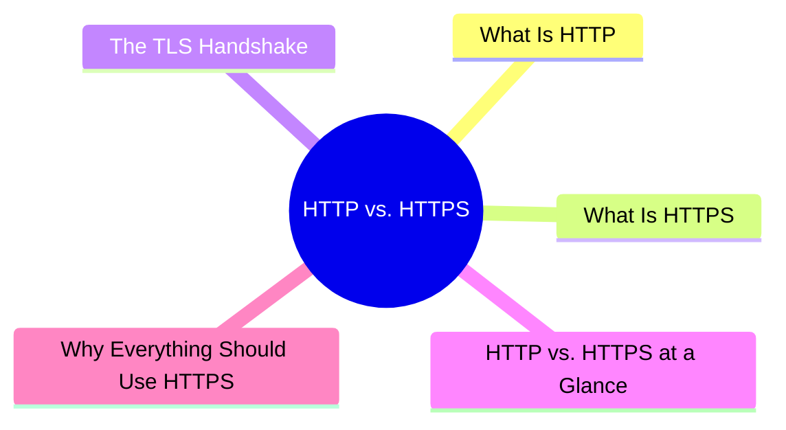
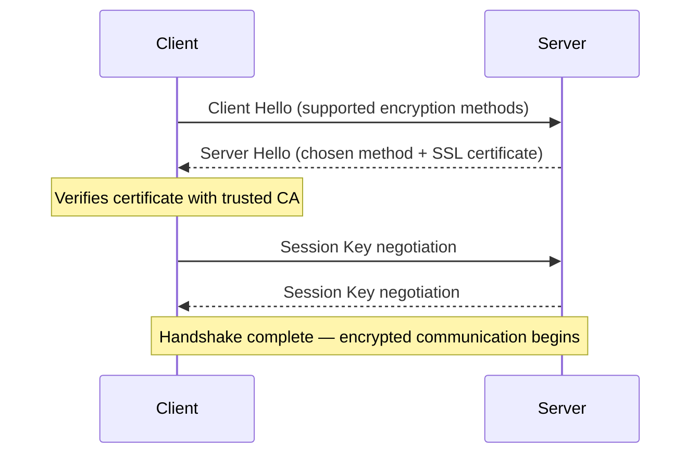

export const metadata = {
  title: 'HTTP vs. HTTPS',
  date: '2026-04-03',
  excerpt: 'A practical guide to HTTP vs. HTTPS — covering how TLS encryption works, the TLS Handshake, a side-by-side comparison, and why every site should use HTTPS today.',
  tags: ['NetWork'],
};

# HTTP vs. HTTPS

HTTP and HTTPS are both protocols for transferring data between a client and a server. The difference is that HTTPS adds a layer of encryption.

- [What Is HTTP](#what-is-http)
- [What Is HTTPS](#what-is-https)
- [The TLS Handshake](#the-tls-handshake)
- [HTTP vs. HTTPS at a Glance](#http-vs-https-at-a-glance)
- [Why Everything Should Use HTTPS](#why-everything-should-use-https)

---

## What Is HTTP

HTTP (HyperText Transfer Protocol) is the foundational protocol for data transfer on the web. It defines how clients (typically browsers) request resources from servers and how servers respond.

HTTP transmits everything in plain text — no encryption of any kind. Anyone who can intercept the network traffic can read it directly, including usernames, passwords, and personal data.

---

## What Is HTTPS

HTTPS (HTTP Secure) is HTTP with a TLS (Transport Layer Security) encryption layer added underneath.

TLS provides three guarantees:

- Encryption — transmitted data is encrypted and unreadable to third parties
- Integrity — data can't be tampered with in transit
- Authentication — you're actually connected to the server you think you are, not an impersonator

HTTPS uses an SSL/TLS certificate to verify the server's identity. Certificates are issued by trusted third-party organizations called Certificate Authorities (CAs).

---

## The TLS Handshake

Before any HTTPS data flows, the client and server perform a TLS Handshake to negotiate encryption and verify identity.

The simplified flow:

After the handshake, all subsequent HTTP traffic is encrypted using that Session Key.

---

## HTTP vs. HTTPS at a Glance

| | HTTP | HTTPS |
| - | - | - |
| Full name | HyperText Transfer Protocol | HTTP Secure |
| Default port | 80 | 443 |
| Encryption | None | TLS |
| Data integrity | Unprotected | Protected |
| Authentication | None | SSL certificate |
| Performance | Slightly faster (no crypto) | Negligible difference on modern hardware |
| SEO | Disadvantaged | Google prefers HTTPS |

---

## Why Everything Should Use HTTPS

### Security

HTTP is plain text. On an unsecured network like a public Wi-Fi hotspot, anyone with a packet capture tool (like Wireshark) can read everything you send and receive.

Common attacks on HTTP:

- Man-in-the-Middle (MITM) — an attacker intercepts traffic between client and server, reading or modifying the data
- Eavesdropping — passively monitoring network traffic to capture credentials and sensitive information

HTTPS encryption makes both attacks ineffective. Even if packets are intercepted, the attacker can't read the contents.

### Browser Warnings

Modern browsers display a "Not Secure" warning on HTTP sites, which damages user trust and can drive people away.

### SEO

Google explicitly uses HTTPS as a ranking signal. HTTP sites are at a disadvantage in search results.

### Browser API Restrictions

Some browser APIs are only available over HTTPS:

- Service Workers
- Geolocation API
- Push Notifications
- Camera and Microphone access

### Free Certificates

SSL certificates used to cost money. Let's Encrypt now provides free certificates, and most hosting platforms offer one-click certificate setup. There's no longer any reason not to use HTTPS.

---

## Conclusion

- HTTP — plain text, no encryption, vulnerable to interception and tampering
- HTTPS — HTTP + TLS encryption, protecting confidentiality, integrity, and identity
- The TLS Handshake negotiates encryption before any data flows — on modern hardware, the overhead is negligible
- Every site should use HTTPS today; free certificates are available through Let's Encrypt
