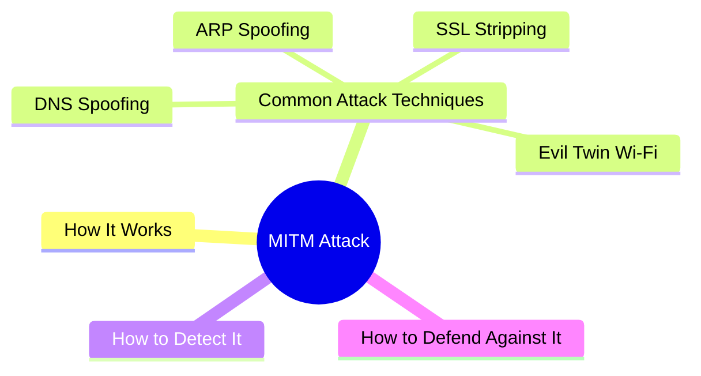
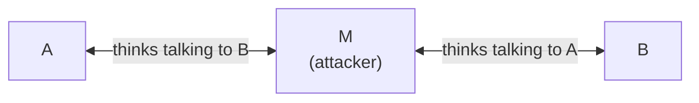
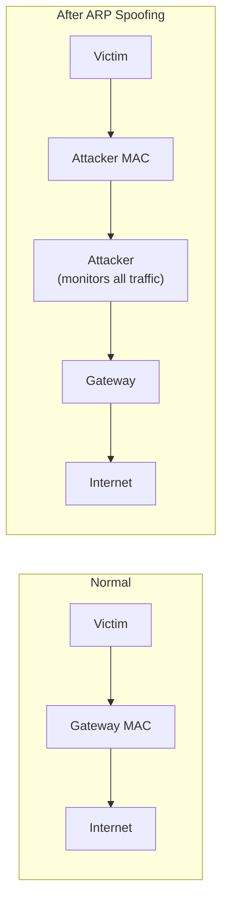
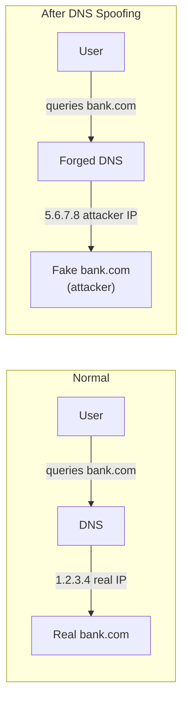
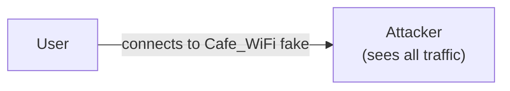

export const metadata = {
  title: 'Man-in-the-Middle Attack (MITM)',
  date: '2026-03-31',
  excerpt: 'A practical guide to man-in-the-middle (MITM) attacks — covering how they work, common techniques like ARP spoofing, DNS spoofing, SSL stripping, and evil twin Wi-Fi, plus how to detect and defend against them.',
  tags: ['Security', 'Network'],
};

# Man-in-the-Middle Attack (MITM)

A man-in-the-middle (MITM) attack is when an attacker secretly positions themselves between two communicating parties — intercepting, reading, and potentially altering the data in transit, while neither party knows anything is wrong.



- [How It Works](#how-it-works)
- [Common Attack Techniques](#common-attack-techniques)
- [How to Detect It](#how-to-detect-it)
- [How to Defend Against It](#how-to-defend-against-it)

---

## How It Works

In normal communication, A and B talk directly:


In a MITM attack, the attacker (M) inserts themselves in the middle. Both A and B believe they're communicating directly with each other:



The attacker can:
- Eavesdrop — read the transmitted data
- Tamper — modify the content in transit
- Inject — insert malicious content

---

## Common Attack Techniques

### ARP Spoofing

ARP (Address Resolution Protocol) maps IP addresses to MAC addresses, but it has no authentication mechanism.

An attacker broadcasts forged ARP replies on the local network, tricking devices into associating the attacker's MAC address with a legitimate IP (such as the gateway). Traffic is then routed through the attacker:



ARP spoofing is the most common LAN-based MITM technique.

### DNS Spoofing

The attacker forges DNS responses, redirecting a legitimate domain (like `bank.com`) to an IP they control. The user ends up on a fake site:



### SSL Stripping

The user intends to visit `https://bank.com`. The attacker intercepts the request and maintains an unencrypted HTTP connection with the user, while using HTTPS to connect to the real server:


The user thinks they're browsing normally, but everything they send — including passwords — flows through the attacker in plain text.

### Evil Twin Wi-Fi

The attacker sets up a rogue Wi-Fi hotspot with the same name (or a similar name) as a legitimate network. Users who connect have all their traffic routed through the attacker:



---

## How to Detect It

MITM attacks are designed to be invisible, but there are signs worth watching for.

### Certificate warnings

If your browser shows "Your connection is not private" or "Certificate invalid," someone may be inserting a forged certificate. Don't dismiss these warnings or click through.

### HTTP instead of HTTPS

If a site you expect to be HTTPS is loading over HTTP, SSL stripping may be happening.

### Unusual certificate details

Click the padlock icon in your browser and inspect the certificate. Verify the issuing CA and expiry date look correct for the site you're visiting.

### Suspicious ARP table entries

On a local network, run `arp -a`. If two different IPs resolve to the same MAC address, that's a sign of ARP spoofing.

---

## How to Defend Against It

### Use HTTPS

HTTPS (TLS) is the most fundamental defense against MITM. It provides:

- Encryption — even if traffic is intercepted, the attacker can't read it
- Authentication — the server's certificate confirms you're talking to the real server, not an impersonator

When a browser warns you about an HTTP site, pay attention to it.

### HSTS (HTTP Strict Transport Security)

HSTS tells browsers to only ever connect to a domain over HTTPS, refusing HTTP connections entirely. This directly defeats SSL stripping:

```
Strict-Transport-Security: max-age=31536000; includeSubDomains
```

### Certificate Pinning

Mobile apps can hardcode the expected certificate in the app itself, refusing any connection that doesn't match — even if the attacker inserts a forged certificate that a CA has signed.

### Avoid Sensitive Operations on Public Wi-Fi

Public Wi-Fi is a high-risk environment for MITM attacks. If you must use it, route your traffic through a VPN to encrypt it before it leaves your device.

### DNS over HTTPS (DoH)

Traditional DNS queries travel in plain text and can be intercepted and forged. DoH encrypts DNS queries, blocking DNS spoofing attacks.

---

## Conclusion

A MITM attack works by inserting the attacker between two communicating parties — monitoring or altering data without either side knowing.

Common techniques: ARP spoofing (LAN), DNS spoofing (domain hijacking), SSL stripping (HTTPS downgrade), evil twin Wi-Fi.

Defending against MITM comes down to using HTTPS:

- Deploy HTTPS so traffic is encrypted and the server's identity is verified
- Enable HSTS to prevent SSL stripping
- Take certificate warnings seriously — don't click through them
