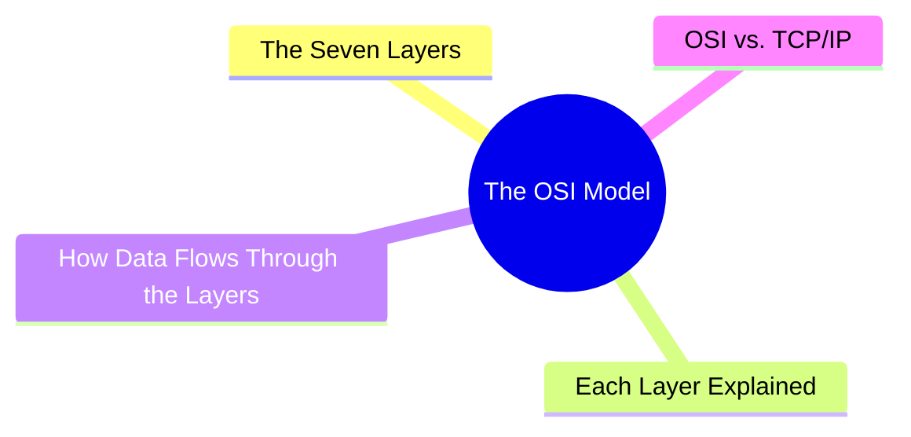
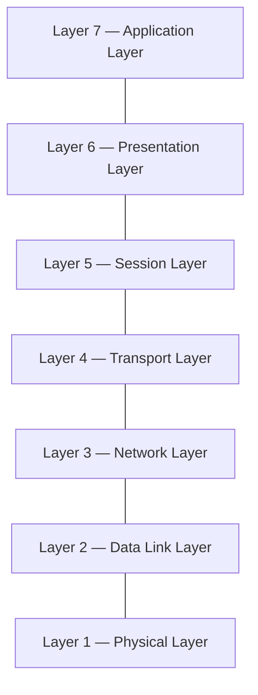
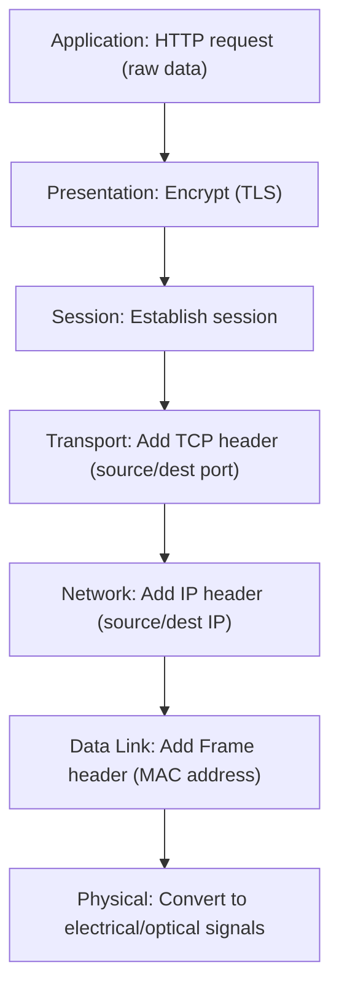
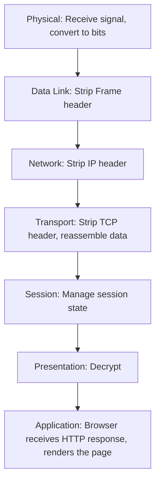
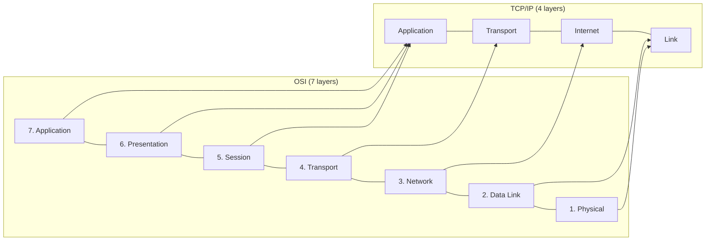

export const metadata = {
  title: 'The OSI Model: A Framework for Network Communication',
  date: '2026-04-10',
  excerpt: 'A practical guide to the OSI model — covering all seven layers, their responsibilities and common protocols, how data flows through encapsulation and decapsulation, and how OSI maps to the TCP/IP model.',
  tags: ['NetWork'],
};

# The OSI Model: A Framework for Network Communication

The OSI (Open Systems Interconnection) model is a conceptual framework that breaks network communication into seven distinct layers, each with a clearly defined responsibility.

OSI isn't a set of protocols you actually install — it's a reference model used to understand, discuss, and design network systems.

- [The Seven Layers](#the-seven-layers)
- [Each Layer Explained](#each-layer-explained)
- [How Data Flows Through the Layers](#how-data-flows-through-the-layers)
- [OSI vs. TCP/IP](#osi-vs-tcpip)

---

## The Seven Layers

From closest to the hardware at the bottom, to closest to the user at the top:

A common mnemonic (top to bottom): All People Seem To Need Data Processing

---

## Each Layer Explained

### Layer 7: Application Layer

The layer closest to the user. It provides the interface between applications and the network.

- Responsibility: Defines how applications communicate over the network
- Common protocols: HTTP, HTTPS, FTP, SMTP, DNS
- Example: A browser sending an HTTP request; an email client using SMTP to send a message

### Layer 6: Presentation Layer

Handles data formatting, encryption, and compression so both sides can understand each other's data.

- Responsibility: Format translation, encryption/decryption, compression/decompression
- Common protocols: TLS/SSL, JPEG, PNG, ASCII, UTF-8
- Example: TLS encryption in HTTPS happens at this layer

### Layer 5: Session Layer

Manages the session — establishing, maintaining, and terminating communication between two devices.

- Responsibility: Opening and closing sessions, handling recovery after interruptions
- Common protocols: NetBIOS, RPC (Remote Procedure Call)
- Example: Managing the connection state of a video call

### Layer 4: Transport Layer

Responsible for end-to-end data delivery — how data reliably gets from source to destination.

- Responsibility: Segmentation and reassembly, error control, flow control
- Common protocols: TCP, UDP
- Example: TCP's three-way handshake for reliable connections; UDP's connectionless delivery for streaming

### Layer 3: Network Layer

Handles logical addressing and routing — how packets travel across different networks.

- Responsibility: IP addressing, route selection, packet forwarding
- Common protocols: IP (IPv4, IPv6), ICMP
- Example: A router uses IP addresses at this layer to decide where to forward a packet

### Layer 2: Data Link Layer

Responsible for data transfer between two nodes on the same network, with error detection.

- Responsibility: MAC addressing, frame creation and parsing, error detection
- Common protocols: Ethernet, Wi-Fi (802.11), ARP
- Example: A network switch forwards frames based on MAC addresses at this layer

### Layer 1: Physical Layer

The bottom layer — responsible for the actual transmission of raw bits over a physical medium.

- Responsibility: Defines voltage levels, signal timing, transmission rates, connector specifications
- Examples: Ethernet cables (Cat5e, Cat6), fiber optic cables, Wi-Fi radio waves
- Example: An Ethernet cable transmitting electrical signals; a fiber cable transmitting light

---

## How Data Flows Through the Layers

When you type a URL in a browser, the request travels through all seven OSI layers.

Sending (top to bottom)

Each layer adds its own header before passing data to the layer below:

Receiving (bottom to top)

Each layer strips its header and passes the data up:

---

## OSI vs. TCP/IP

OSI is a conceptual model. The actual internet runs on the TCP/IP four-layer model. Here's how they map to each other:

TCP/IP merges OSI's Application, Presentation, and Session layers into one Application layer, and combines Data Link and Physical into the Link layer.

| | OSI Model | TCP/IP Model |
| - | - | - |
| Layers | 7 | 4 |
| Purpose | Conceptual reference for understanding | Practical standard for the internet |
| Flexibility | Higher (each layer independently defined) | Optimized for real-world deployment |

---

## Summary

The OSI model is a useful mental framework for understanding network communication:

- Each layer has a single, well-defined responsibility
- Data is encapsulated layer by layer going down, transmitted at the Physical layer, then decapsulated layer by layer going back up
- The actual internet uses the TCP/IP four-layer model; OSI is the reference model used for understanding and discussion

The real value of learning OSI is building a clear mental model of how networks work. When something goes wrong, knowing which layer to look at makes troubleshooting much faster.
