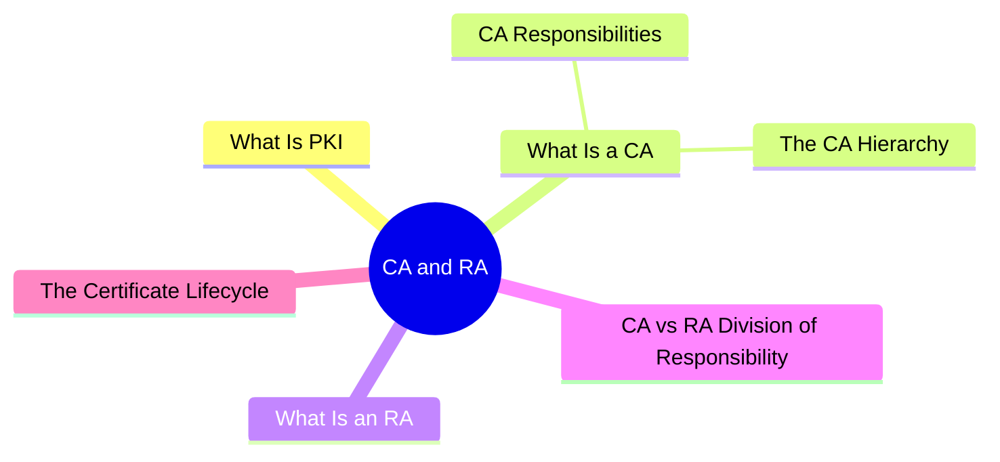
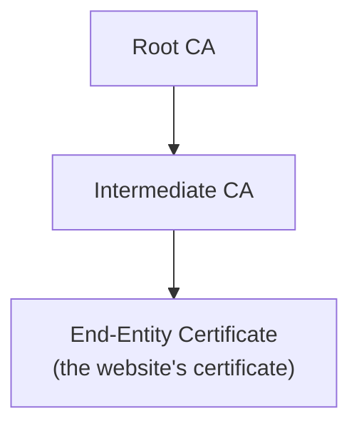
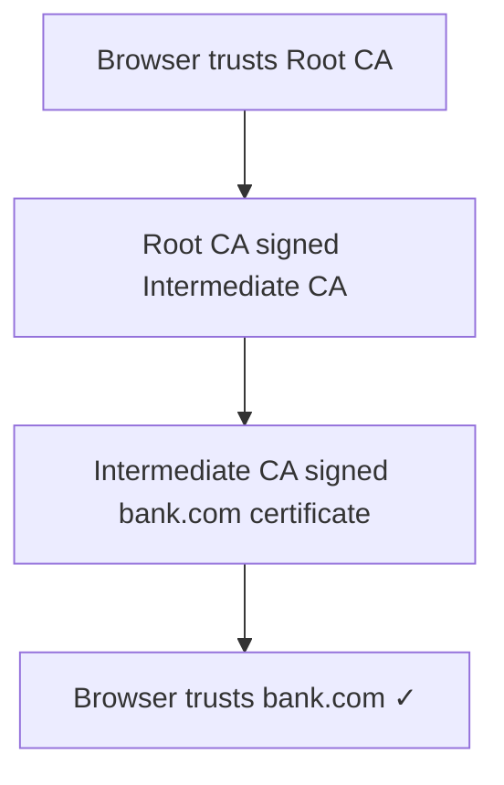
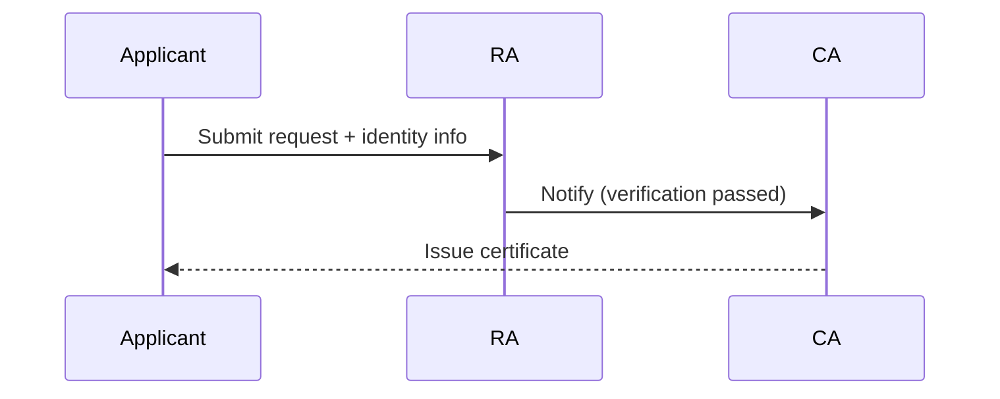

export const metadata = {
  title: 'Certificate Authority (CA) and Registration Authority (RA)',
  date: '2026-04-23',
  excerpt: 'A practical guide to Certificate Authorities and Registration Authorities — covering the CA hierarchy, how RA handles identity verification, the division of responsibility between the two, and the full certificate lifecycle.',
  tags: ['Security', 'Network'],
};

# Certificate Authority (CA) and Registration Authority (RA)

When your browser shows the padlock icon, it trusts the website's certificate. But where does that trust come from?

The answer is a system called PKI (Public Key Infrastructure), and CA and RA are its two core roles.

- [What Is PKI](#what-is-pki)
- [What Is a CA](#what-is-a-ca)
- [What Is an RA](#what-is-an-ra)
- [CA vs RA: Division of Responsibility](#ca-vs-ra-division-of-responsibility)
- [The Certificate Lifecycle](#the-certificate-lifecycle)

---

## What Is PKI

PKI is a framework for managing digital certificates and public-key encryption. It solves a fundamental problem: how do you verify that a public key actually belongs to who it claims to belong to?

When you connect to `https://bank.com`, your browser needs to confirm that the public key it receives really is bank.com's — not a forgery from a man-in-the-middle. PKI solves this by introducing a trusted third party: the CA.

The main components of PKI:

- CA (Certificate Authority) — issues and manages digital certificates
- RA (Registration Authority) — verifies the identity of certificate applicants
- Digital certificates — electronic documents that bind a public key to an identity
- CRL / OCSP — mechanisms for revoking certificates

---

## What Is a CA

A CA (Certificate Authority) is the trust anchor of the PKI system. Its job is to issue digital certificates.

### CA Responsibilities

- Issue certificates — after verifying an applicant's identity, the CA signs a certificate with its own private key
- Maintain the chain of trust — the CA's digital signature on a certificate tells browsers that the certificate is legitimate
- Revoke certificates — if a private key is compromised or information becomes invalid, the CA can revoke the certificate

Well-known CAs include DigiCert, Comodo, and GlobalSign. Let's Encrypt provides free certificates and has become the most widely used CA on the web.

### The CA Hierarchy

CAs aren't a single flat structure — they form a hierarchy:

Root CAs are at the top of the chain. Their certificates come pre-installed in operating systems and browsers. Root CAs typically don't issue website certificates directly — they delegate to Intermediate CAs.

The reason: a Root CA's private key is extremely sensitive and is kept offline in a hardware security module. Day-to-day certificate issuance is handled by Intermediate CAs, keeping the Root CA's key out of regular use.

When a browser verifies a certificate, it traces the chain upward until it reaches a Root CA it already trusts:

---

## What Is an RA

An RA (Registration Authority) is the PKI role responsible for verifying applicant identity before a certificate is issued.

The RA acts as the front end for the CA, handling the identity verification work:

- Collects identity information from the applicant
- Verifies that the information is accurate
- Confirms the applicant has the right to request the certificate (e.g. confirming domain ownership)
- Notifies the CA to proceed with issuance once verification passes

The RA doesn't issue certificates — it only handles verification. The actual signing is always done by the CA.

Not every CA has a separate RA. Many CAs handle verification internally and don't distinguish between the two roles.

---

## CA vs RA: Division of Responsibility

| | CA | RA |
| - | - | - |
| Main role | Issues certificates | Verifies identity |
| Issues certificates | Yes | No |
| Source of trust | Yes (browsers trust CAs) | No (trust flows from CA) |
| Typical examples | DigiCert, Let's Encrypt | Internal enterprise units, resellers |

---

## The Certificate Lifecycle

A digital certificate goes through several stages from request to expiry:

1. Application

The applicant generates a key pair and packages the public key along with identifying information (domain name, organization name, etc.) into a CSR (Certificate Signing Request), which is submitted to the RA or CA.

2. Validation

The RA or CA verifies the applicant's identity. The rigor of this step varies by certificate type:

- DV (Domain Validation) — verifies domain ownership only; fully automated, completed in minutes (Let's Encrypt uses this)
- OV (Organization Validation) — verifies both domain and organization identity; requires manual review
- EV (Extended Validation) — the strictest level; verifies the organization's legal identity; historically displayed a green address bar in browsers

3. Issuance

Once validation passes, the CA signs the certificate with its private key. The certificate contains the public key, validity period, domain name, CA's digital signature, and other metadata.

4. Deployment

The website installs the certificate on its server. When a browser connects, it validates the certificate before establishing a secure connection.

5. Revocation or Expiry

Certificates have a validity period — typically 90 days to one year — and must be renewed. If a private key is compromised or the information becomes inaccurate, the CA can revoke the certificate early and publish the revocation through a CRL (Certificate Revocation List) or OCSP.

---

## Summary

- PKI is the framework for managing public-key trust; CA and RA are its two core institutions
- CA issues digital certificates and is the source of the trust chain
- RA verifies applicant identity and acts as the CA's front-end review body
- CAs follow a hierarchy: Root CA → Intermediate CA → end-entity certificate
- A certificate's trustworthiness depends entirely on the trustworthiness of the CA that signed it — browsers come pre-loaded with a set of trusted Root CAs
