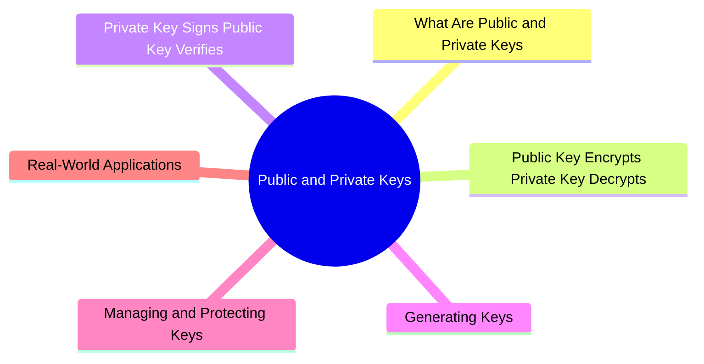

export const metadata = {
  title: 'Public Keys and Private Keys',
  date: '2026-04-24',
  excerpt: 'A practical guide to public and private keys — covering encryption and decryption, digital signatures, key generation, how to protect private keys, and real-world applications in HTTPS, SSH, and JWT.',
  tags: ['Security', 'Network'],
};

# Public Keys and Private Keys

A public key and a private key are a mathematically linked pair at the heart of asymmetric encryption.

They're generated together by the same algorithm, each serving a distinct purpose. Together, they underpin nearly every aspect of modern internet security — HTTPS, digital signatures, SSH, and encrypted messaging all rely on this mechanism.



- [What Are Public and Private Keys](#what-are-public-and-private-keys)
- [Public Key Encrypts, Private Key Decrypts](#public-key-encrypts-private-key-decrypts)
- [Private Key Signs, Public Key Verifies](#private-key-signs-public-key-verifies)
- [Generating Keys](#generating-keys)
- [Managing and Protecting Keys](#managing-and-protecting-keys)
- [Real-World Applications](#real-world-applications)

---

## What Are Public and Private Keys

A public/private key pair is generated simultaneously by an algorithm like RSA or ECC:

- Public key — safe to share openly with anyone
- Private key — must be kept strictly secret; only the owner holds it

Their relationship:

- Data encrypted with the public key can only be decrypted by the corresponding private key
- Data signed with the private key can be verified by anyone with the public key

The security of this system rests on mathematical one-way difficulty: deriving a private key from a public key is computationally infeasible. RSA relies on the hardness of factoring large numbers; ECC relies on the elliptic curve discrete logarithm problem.

---

## Public Key Encrypts, Private Key Decrypts

This is the most direct use of asymmetric encryption: a sender encrypts data with the recipient's public key, and only the recipient — who holds the private key — can decrypt it.

```text
Charmy wants to send a message to Tina:

1. Tina publishes his public key
2. Charmy encrypts the message with Tina's public key
3. The encrypted message is sent to Tina
4. Only Tina's private key can decrypt it

Even if the message is intercepted, without Tina's private key it's unreadable
```

This solves the fundamental problem with symmetric encryption: the key doesn't need to be transmitted over a secure channel, because the public key is already public.

---

## Private Key Signs, Public Key Verifies

The other major use of asymmetric encryption is digital signatures — and the direction is reversed: the private key signs, the public key verifies.

```text
Charmy wants to prove a document came from her:

1. Charmy generates a hash of the document
2. Charmy encrypts the hash with her private key — this is the signature
3. Charmy sends the document and signature together
4. Anyone with Charmy's public key can decrypt the signature to get the hash
5. They independently hash the received document and compare:
   If the hashes match: the document came from Charmy (only her private key
   could produce that signature) and hasn't been modified
```

A digital signature provides both authentication (who sent it) and integrity (it hasn't been changed).

---

## Generating Keys

Key pairs must be generated by a specific algorithm — you can't just pick two random numbers and call them a key pair.

### RSA Keys

RSA's security comes from the difficulty of factoring large numbers. Common key sizes:

- 2048-bit — the widely accepted minimum today
- 3072-bit — higher security
- 4096-bit — maximum security, but slower

### ECC Keys

ECC (Elliptic Curve Cryptography) achieves the same security as RSA with much shorter keys:

- 256-bit (P-256) — equivalent strength to RSA-3072
- 384-bit (P-384) — higher security
- Ed25519 — a modern ECC variant; fast, secure, widely used in SSH and TLS 1.3

### Generating Keys with OpenSSL

```bash
# Generate an RSA-2048 private key
openssl genrsa -out private_key.pem 2048

# Extract the public key from the private key
openssl rsa -in private_key.pem -pubout -out public_key.pem

# Generate an Ed25519 key pair
openssl genpkey -algorithm Ed25519 -out private_key.pem
openssl pkey -in private_key.pem -pubout -out public_key.pem
```

---

## Managing and Protecting Keys

If a private key is compromised, all data encrypted with the corresponding public key is potentially exposed, and all signatures made with that key can no longer be trusted.

### Protecting the Private Key

- Encrypted storage — private keys should be encrypted with a passphrase at rest; a stolen file is useless without it
- Hardware Security Modules (HSMs) — highly sensitive keys (like a CA's root signing key) are stored in dedicated hardware; the key never leaves the device
- Keychain / Secure Enclave — on Apple devices, private keys can be stored in the Keychain or Secure Enclave, protected by hardware
- Least privilege — access to private keys should be restricted to the absolute minimum

### Key Rotation

Private keys should be rotated periodically to limit the damage if one is ever compromised. TLS certificates typically expire after 90 days to one year and must be renewed.

### If a Key Is Compromised

Act immediately:

1. Revoke the associated certificate
2. Generate a new key pair
3. Request a new certificate

---

## Real-World Applications

HTTPS / TLS

During the TLS handshake, the server proves its identity using its private key (a digital signature). The client verifies with the server's public key. A shared symmetric key is then negotiated for the rest of the session.

SSH

SSH key-based authentication: the user places their public key in `~/.ssh/authorized_keys` on the server. At login, the client signs a challenge with the private key; the server verifies with the public key. No password needed.

```bash
# Generate an SSH key pair
ssh-keygen -t ed25519 -C "your@email.com"

# Copy the public key to the server
ssh-copy-id -i ~/.ssh/id_ed25519.pub user@server
```

Email Encryption (PGP / GPG)

PGP uses public/private key pairs to encrypt and sign emails. The sender encrypts with the recipient's public key; only the recipient can decrypt.

Encrypted Messaging (Signal, WhatsApp)

These apps use the Signal Protocol — a key exchange mechanism built on public/private keys — to implement end-to-end encryption.

JWT Signing

JWTs using RS256 or ES256 are signed by the server with its private key. Clients or third parties can verify the token's authenticity using the corresponding public key.

---

## Conclusion

- Public key — shared openly; used to encrypt data or verify signatures
- Private key — kept secret; used to decrypt data or sign content
- The two keys are mathematically linked; deriving the private key from the public key is computationally infeasible
- The security of the entire system rests on the private key — protect it accordingly
