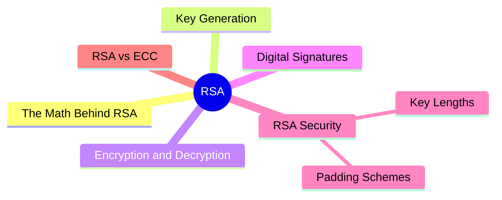

export const metadata = {
  title: 'RSA Encryption',
  date: '2026-03-31',
  excerpt: 'A practical guide to RSA encryption — covering the mathematical foundation, key generation, encryption and decryption, digital signatures, why padding schemes matter, and how RSA compares to ECC.',
  tags: ['Security', 'Network'],
};

# RSA Encryption

RSA is the most widely used asymmetric encryption algorithm. It was invented in 1977 by Ron Rivest, Adi Shamir, and Leonard Adleman — the name is their initials.

RSA's security rests on a mathematical hard problem: integer factorization. Multiplying two large prime numbers together is easy. Factoring the product back into its original primes is computationally infeasible at the key sizes used in practice.



- [The Math Behind RSA](#the-math-behind-rsa)
- [Key Generation](#key-generation)
- [Encryption and Decryption](#encryption-and-decryption)
- [Digital Signatures](#digital-signatures)
- [RSA Security](#rsa-security)
- [RSA vs ECC](#rsa-vs-ecc)

---

## The Math Behind RSA

RSA is built on modular exponentiation:

```
Encrypt: C = M^e mod n
Decrypt: M = C^d mod n
```

Where:
- `M` is the plaintext (represented as a number)
- `C` is the ciphertext
- `e` is the public exponent
- `d` is the private exponent
- `n` is the modulus

`n = p × q`, where `p` and `q` are two large primes. `n` is public; `p` and `q` are kept secret.

`e` and `d` are chosen so that `e × d ≡ 1 (mod λ(n))`, where `λ(n)` is the Carmichael function.

The intuition: raising to the power of `e` "locks" the message; raising to the power of `d` "unlocks" it. These two operations are mathematical inverses of each other.

---

## Key Generation

1. Choose two large primes

```
p = 61
q = 53
```

In real use, `p` and `q` are each over 1024 bits long.

2. Compute the modulus n

```
n = p × q = 61 × 53 = 3233
```

`n` is shared by both keys and determines the key length — RSA-2048 means `n` is 2048 bits.

3. Compute λ(n)

```
λ(n) = lcm(p-1, q-1) = lcm(60, 52) = 780
```

4. Choose the public exponent e

`e` must satisfy: `1 < e < λ(n)` and `gcd(e, λ(n)) = 1`.

The most common value is 65537 (`2^16 + 1`) — it's prime, has only two 1-bits in binary, and is computationally efficient.

5. Compute the private exponent d

`d` is the modular inverse of `e` with respect to `λ(n)`:

```
e × d ≡ 1 (mod λ(n))
17 × d ≡ 1 (mod 780)
d = 413
```

Public key: `(e, n)` = `(17, 3233)` — shared openly

Private key: `(d, n)` = `(413, 3233)` — kept secret

---

## Encryption and Decryption

Using the keys generated above:

Encryption (with the public key):

```
Plaintext M = 65
Ciphertext C = M^e mod n = 65^17 mod 3233 = 2790
```

Decryption (with the private key):

```
Ciphertext C = 2790
Plaintext M = C^d mod n = 2790^413 mod 3233 = 65
```

The ciphertext `2790` is sent to the recipient. Using private key `d = 413`, they recover the original `65`.

---

## Digital Signatures

RSA also works for digital signatures — the direction is the reverse of encryption: private key signs, public key verifies.

Signing (with the private key):

```
Hash of message M: H = hash(M)
Signature: S = H^d mod n
```

Verification (with the public key):

```
Recover the hash: H' = S^e mod n
Recompute from the message: H = hash(M)
If H' == H, the signature is valid
```

Anyone with the public key can verify a signature, but only the holder of the private key can produce a valid one.

---

## RSA Security

### Key Lengths

RSA's security depends on how difficult it is to factor `n`. That difficulty scales with key size:

| Key length | Security strength | Recommendation |
| - | - | - |
| 1024-bit | Broken | Never use |
| 2048-bit | 112-bit security | Current minimum |
| 3072-bit | 128-bit security | Recommended for long-term protection |
| 4096-bit | 140-bit security | Highest security, but slower |

NIST recommends at least 3072-bit RSA keys beyond 2030, or switching to ECC.

### Padding Schemes

Raw RSA (Textbook RSA) applies modular exponentiation directly and is vulnerable to several well-known attacks. Modern RSA must use a padding scheme:

- PKCS#1 v1.5 — the older standard; has known vulnerabilities (Bleichenbacher attack); avoid in new systems
- OAEP (Optimal Asymmetric Encryption Padding) — the modern standard for encryption; currently recommended
- PSS (Probabilistic Signature Scheme) — the modern standard for signatures; currently recommended

Using RSA without padding is a serious security mistake.

---

## RSA vs ECC

RSA is a deeply established standard, but ECC is often the better choice for new systems:

| | RSA | ECC |
| - | - | - |
| Security basis | Integer factorization | Elliptic curve discrete logarithm |
| Key size (equivalent security) | 3072-bit | 256-bit |
| Speed | Slower | Faster |
| Memory usage | Higher | Lower |
| Adoption | Very widespread | Rapidly growing |
| TLS 1.3 | Still supported | Preferred (ECDH) |

For new systems, ECC (especially Ed25519 or P-256) is generally the better choice. RSA remains important when backward compatibility with legacy systems is required.

---

## Summary

- RSA's security is based on the difficulty of factoring large numbers
- Public key `(e, n)` encrypts; private key `(d, n)` decrypts
- The private key also signs; the public key verifies
- Always use padding — OAEP for encryption, PSS for signatures; Textbook RSA is not secure
- Minimum 2048-bit keys; 3072-bit or higher is recommended for new systems, or use ECC instead
