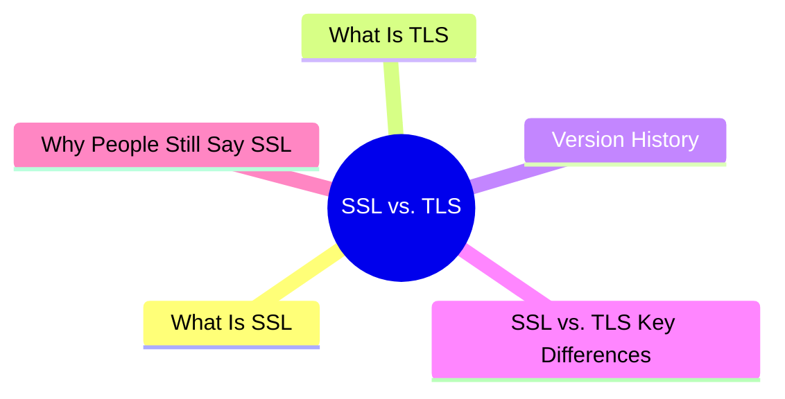

export const metadata = {
  title: 'SSL vs. TLS: The Evolution of Encryption Protocols',
  date: '2026-04-04',
  excerpt: 'A practical guide to SSL vs. TLS — covering the version history, what TLS 1.3 improved, the key differences between the two, and why the industry still says "SSL certificate" even though SSL is long deprecated.',
  tags: ['NetWork'],
};

# SSL vs. TLS: The Evolution of Encryption Protocols

When you see the padlock icon in your browser's address bar, the connection is encrypted. The protocol behind that encryption is SSL or TLS.

The two terms get used interchangeably — "SSL certificate," "SSL/TLS," "install SSL" — but they're actually different protocols, and SSL has been deprecated for years.

- [What Is SSL](#what-is-ssl)
- [What Is TLS](#what-is-tls)
- [Version History](#version-history)
- [SSL vs. TLS: Key Differences](#ssl-vs-tls-key-differences)
- [Why People Still Say "SSL"](#why-people-still-say-ssl)

---

## What Is SSL

SSL (Secure Sockets Layer) was developed by Netscape in the 1990s to add encryption to HTTP connections.

Three versions were released:

- SSL 1.0 — never publicly released; serious security flaws
- SSL 2.0 — released in 1995; found to have multiple vulnerabilities
- SSL 3.0 — released in 1996; deprecated in 2015 due to the POODLE vulnerability

All versions of SSL are now deprecated and should not be used.

---

## What Is TLS

TLS (Transport Layer Security) is SSL's successor, developed by the IETF in 1999 based on SSL 3.0.

TLS fixed SSL's security issues and has continued to evolve. The current version is TLS 1.3, released in 2018.

TLS provides the same three core guarantees:

- Encryption — data in transit can't be read by third parties
- Integrity — data can't be tampered with in transit
- Authentication — the server's identity is verified, preventing man-in-the-middle attacks

---

## Version History

| Version | Released | Status |
| - | - | - |
| SSL 1.0 | Never | Deprecated |
| SSL 2.0 | 1995 | Deprecated (RFC 6176) |
| SSL 3.0 | 1996 | Deprecated (RFC 7568) |
| TLS 1.0 | 1999 | Deprecated (2021) |
| TLS 1.1 | 2006 | Deprecated (2021) |
| TLS 1.2 | 2008 | Still in use |
| TLS 1.3 | 2018 | Recommended |

TLS 1.0 and 1.1 were dropped by all major browsers (Chrome, Firefox, Safari) in 2021. Modern sites should support at least TLS 1.2, with TLS 1.3 being the recommended choice.

### What TLS 1.3 Improved

- Faster handshake — reduced from 2-RTT to 1-RTT (and sometimes 0-RTT for resuming sessions)
- Removed obsolete algorithms — RC4, DES, 3DES, and other known-weak ciphers are gone
- Forward Secrecy is now mandatory — even if the server's private key is compromised later, past sessions can't be decrypted

---

## SSL vs. TLS: Key Differences

| | SSL | TLS |
| - | - | - |
| Developed by | Netscape | IETF |
| First released | 1995 (SSL 2.0) | 1999 (TLS 1.0) |
| Current status | All versions deprecated | TLS 1.2 / 1.3 in use |
| Security | Known vulnerabilities | Continuously updated |
| Handshake speed | Slower | Significantly improved in TLS 1.3 |

---

## Why People Still Say "SSL"

Even though SSL is long deprecated, the industry still uses the term everywhere:

- "SSL certificate" (actually a TLS certificate)
- "SSL/TLS" (listed together)
- "Install SSL" (actually configuring TLS)

This is purely historical. SSL was the term everyone learned when HTTPS first became widespread, and the name stuck even as the underlying protocol moved to TLS. Certificate vendors, hosting providers, and developer tools still say "SSL certificate" — but they all mean TLS.

Once you understand the distinction, seeing "SSL certificate" shouldn't cause any confusion. It's just the TLS certificate that enables HTTPS.

---

## Summary

- SSL is TLS's predecessor — all versions are deprecated and shouldn't be used
- TLS is the current standard — TLS 1.2 and TLS 1.3 are both in active use
- TLS 1.3 offers better performance and stronger security — it's the recommended version
- The industry still says "SSL certificate" out of habit — it means the same thing as a TLS certificate in practice
