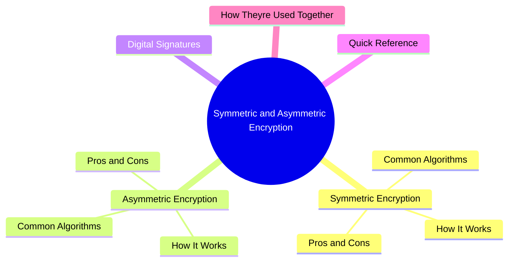
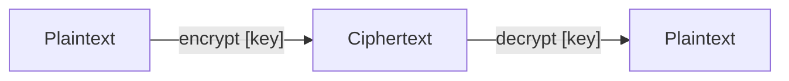
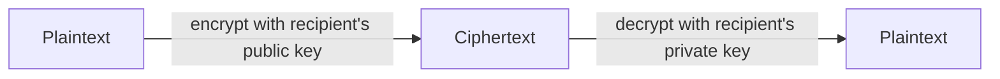
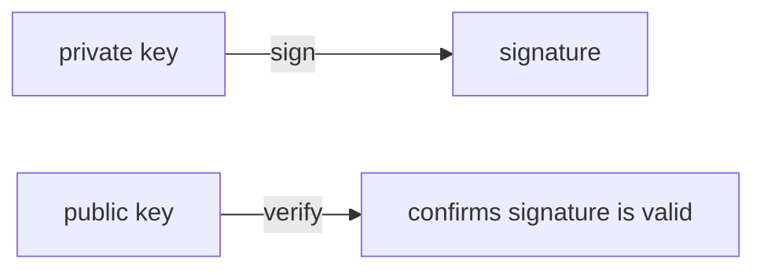
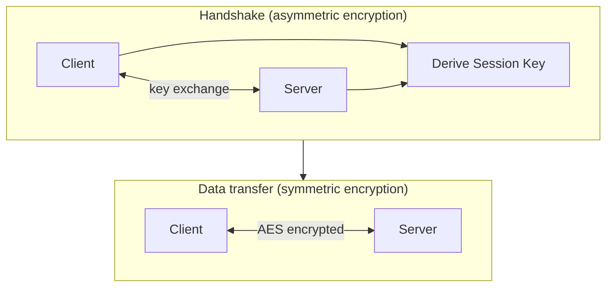

export const metadata = {
  title: 'Symmetric and Asymmetric Encryption',
  date: '2026-04-30',
  excerpt: 'A practical guide to symmetric and asymmetric encryption — covering how each works, their trade-offs, common algorithms, digital signatures, and how they are combined in systems like HTTPS.',
  tags: ['Security', 'Network'],
};

# Symmetric and Asymmetric Encryption

Encryption is the foundation of data security, and all encryption algorithms fall into one of two categories:

- Symmetric encryption — the same key encrypts and decrypts
- Asymmetric encryption — a key pair is used: the public key encrypts, the private key decrypts

Each has distinct strengths and weaknesses. Real-world security systems almost always use both.

- [Symmetric Encryption](#symmetric-encryption)
- [Asymmetric Encryption](#asymmetric-encryption)
- [Digital Signatures](#digital-signatures)
- [Quick Reference](#quick-reference)
- [How They're Used Together](#how-theyre-used-together)

---

## Symmetric Encryption

### How It Works

Symmetric encryption uses a single key for both encryption and decryption.

Both parties must share this key in advance. As long as the key stays secret, the data is secure.

### Pros and Cons

Pros:
- Fast — low computational overhead, suitable for encrypting large amounts of data
- Simpler to implement

Cons:
- Key distribution problem — the key has to be shared over a secure channel before communication can begin. If the channel isn't secure, the key is at risk.
- Key management at scale — N users communicating with each other requires N×(N-1)/2 unique keys. The number grows quickly.

### Common Algorithms

- AES (Advanced Encryption Standard) — the most widely used symmetric algorithm; supports 128, 192, and 256-bit keys
- ChaCha20 — designed by Google, used in TLS 1.3; faster than AES on low-end hardware without hardware acceleration
- 3DES — an improvement over DES; largely replaced by AES

---

## Asymmetric Encryption

### How It Works

Asymmetric encryption uses a mathematically linked key pair:

- Public key — shared openly with anyone; used to encrypt
- Private key — kept secret by the owner; used to decrypt

The two keys are related by mathematical properties — what one encrypts, only the other can decrypt. Even with the public key in hand, deriving the private key is computationally infeasible.

### Pros and Cons

Pros:
- Solves the key distribution problem — the public key can be transmitted openly over any channel
- Enables digital signatures — the private key signs, the public key verifies

Cons:
- Slow — asymmetric operations can be 100–1000x slower than symmetric encryption; not suitable for bulk data
- Longer keys needed — requires much larger keys to achieve the same security level as symmetric encryption

### Common Algorithms

- RSA — the most widely used asymmetric algorithm; security relies on the difficulty of factoring large numbers
- ECC (Elliptic Curve Cryptography) — based on elliptic curve math; achieves the same security as RSA with much shorter keys and better performance; increasingly replacing RSA
- Diffie-Hellman (DH) — not used for encrypting data directly; used to securely negotiate a shared symmetric key over an insecure channel

---

## Digital Signatures

Asymmetric encryption also enables digital signatures — a way to verify the origin and integrity of data.

The direction is the reverse of encryption:

The process:

1. The sender generates a hash of the data
2. The sender encrypts the hash with their private key — this is the signature
3. The recipient decrypts the signature with the sender's public key to get the hash
4. The recipient independently hashes the received data
5. If the two hashes match, the data is authentic and unmodified

Digital signatures are used in TLS certificate verification, software update validation, and blockchain transactions.

---

## Quick Reference

| | Symmetric | Asymmetric |
| - | - | - |
| Keys | One (shared) | A pair (public + private) |
| Speed | Fast | Slow (~100–1000x slower) |
| Key distribution | Requires a secure channel | Public key can be shared openly |
| Best for | Bulk data encryption | Key exchange, digital signatures |
| Key size comparison | AES-128 ≈ RSA-3072 in strength | Requires much longer keys |
| Common algorithms | AES, ChaCha20 | RSA, ECC |

---

## How They're Used Together

In practice, symmetric and asymmetric encryption are almost always used together, each doing what it does best.

How HTTPS (TLS) works:

1. Client and server use asymmetric encryption (e.g. ECDH) to negotiate a shared symmetric key
2. All subsequent data is encrypted with that symmetric key (AES-GCM)

This design gets the best of both: asymmetric encryption solves the key distribution problem, and symmetric encryption handles the actual data efficiently.

---

## Summary

- Symmetric encryption — fast and efficient, but the key must be shared securely in advance
- Asymmetric encryption — solves key distribution, but much slower; used for key exchange and digital signatures
- Modern security systems combine both: asymmetric to exchange keys, symmetric to encrypt data
