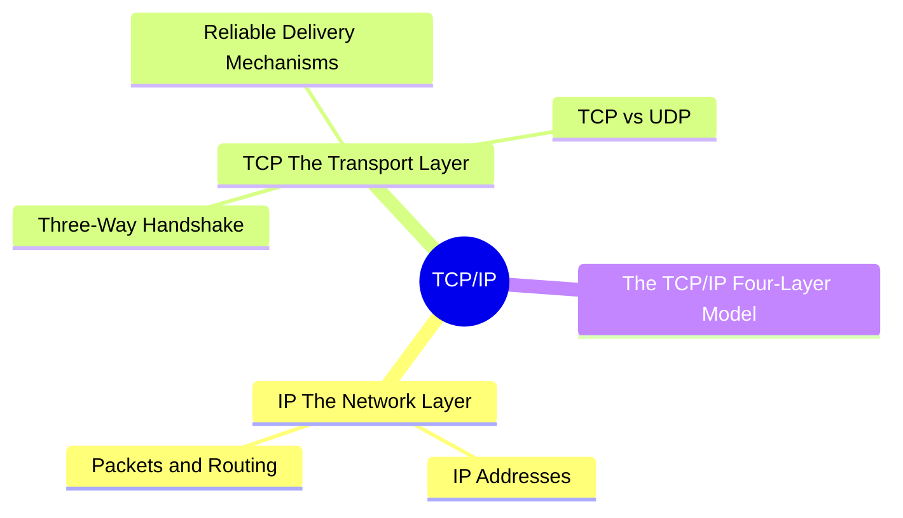
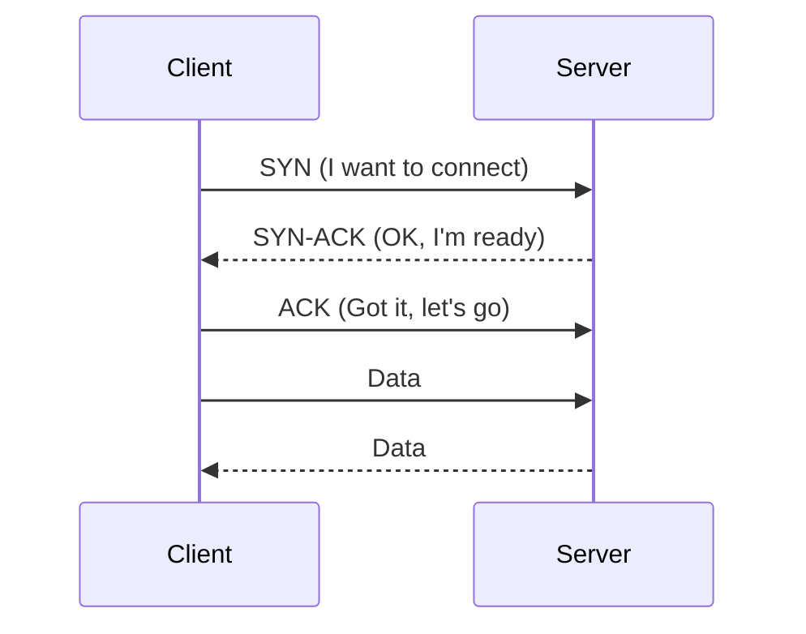
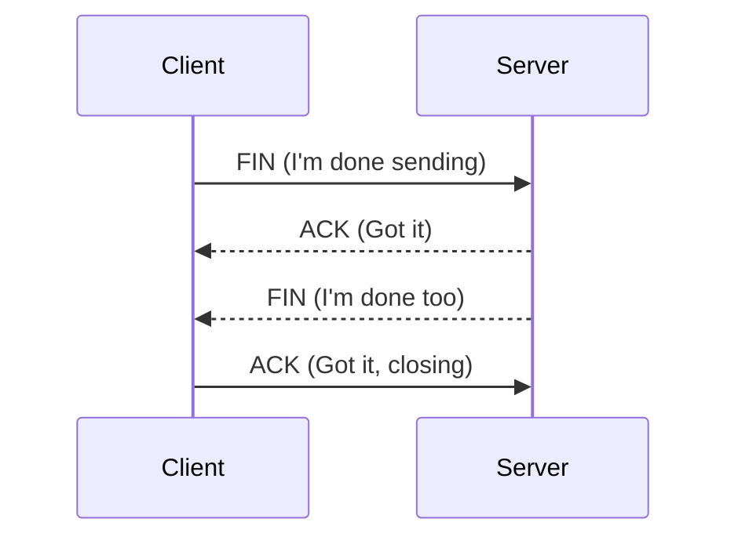
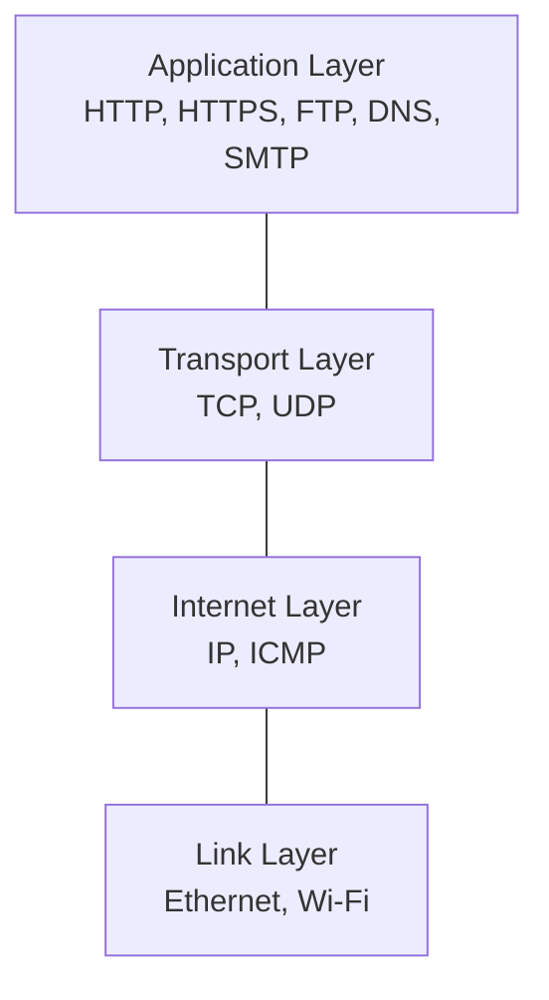
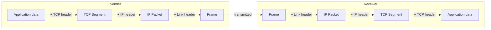

export const metadata = {
  title: 'TCP/IP: The Foundation of Internet Communication',
  date: '2026-04-09',
  excerpt: 'A practical guide to TCP/IP — covering IP addressing and packet routing, three-way handshake of TCP handshake and reliable delivery mechanisms, TCP vs UDP, and the four-layer model.',
  tags: ['NetWork'],
};

# TCP/IP: The Foundation of Internet Communication

Nearly all data transmission on the internet runs on TCP/IP — a combination of two protocols:

- IP (Internet Protocol) — handles addressing and routing; determines where packets go
- TCP (Transmission Control Protocol) — handles reliable delivery; ensures data arrives complete and in order



- [IP: The Network Layer](#ip-the-network-layer)
- [TCP: The Transport Layer](#tcp-the-transport-layer)
- [TCP vs UDP](#tcp-vs-udp)
- [The TCP/IP Four-Layer Model](#the-tcpip-four-layer-model)

---

## IP: The Network Layer

IP defines how devices on the internet are addressed and how data packets travel from source to destination.

### IP Addresses

Every device on a network has an IP address — its unique identifier.

IPv4 — four groups of numbers from 0 to 255, separated by dots:

```
192.168.1.1
203.0.113.42
```

IPv4 supports around 4.3 billion addresses. With the explosion of connected devices, that's no longer enough.

IPv6 — a 128-bit hexadecimal format with a vastly larger address space:

```
2001:0db8:85a3:0000:0000:8a2e:0370:7334
```

### Packets and Routing

IP doesn't send data as one continuous stream. It splits data into small packets, each transmitted independently. Every packet contains:

- Source IP address
- Destination IP address
- Payload (the actual data)

Packets travel different routes across the network and may arrive out of order. IP itself makes no guarantees about delivery or ordering — that's TCP's job.

---

## TCP: The Transport Layer

TCP sits on top of IP and adds reliable, ordered, error-checked data delivery.

### Three-Way Handshake

Before any data is sent, TCP establishes a connection through a Three-Way Handshake:



- SYN (Synchronize) — client initiates the connection
- SYN-ACK — server acknowledges and responds
- ACK (Acknowledge) — client confirms; connection is established

### Reliable Delivery Mechanisms

TCP uses several mechanisms to guarantee reliable delivery:

Sequence Numbers

Every packet gets a sequence number. The receiver uses these to reassemble packets in the correct order, even if they arrive out of sequence.

Acknowledgements (ACK)

The receiver sends an ACK for each packet it receives. If the sender doesn't get an ACK within a timeout window, it retransmits the packet.

Checksums

Each TCP packet includes a checksum. The receiver uses it to verify the data wasn't corrupted in transit.

### Closing the Connection: Four-Way Handshake

Closing a TCP connection takes four steps:



---

## TCP vs UDP

TCP's reliability comes at a cost. The handshake, ACKs, and retransmissions all add latency.

UDP (User Datagram Protocol) is the alternative. It drops all of TCP's reliability mechanisms in exchange for speed and lower latency.

| | TCP | UDP |
| - | - | - |
| Connection | Handshake required | Connectionless, sends immediately |
| Reliability | Guaranteed delivery, ordered | No delivery guarantee, no ordering |
| Speed | Slower | Faster |
| Best for | HTTP, email, file transfer | Video streaming, gaming, DNS |

UDP's lack of reliability isn't always a problem. In a video call, a dropped packet means a brief visual glitch — which is far preferable to freezing while waiting for a retransmission.

---

## The TCP/IP Four-Layer Model

The TCP/IP protocol suite is organized into four layers, each with a distinct responsibility:



When data is sent, each layer wraps the data with its own header — a process called encapsulation. On the receiving end, each layer strips its header back off — decapsulation:



---

## Conclusion

- IP handles addressing and routing — getting packets to the right destination
- TCP provides reliable delivery — using the handshake, sequence numbers, and ACKs to ensure data arrives complete and in order
- The Three-Way Handshake (SYN → SYN-ACK → ACK) establishes a TCP connection before any data flows
- UDP trades reliability for speed — the right choice when latency matters more than guaranteed delivery
- The TCP/IP four-layer model describes how each layer contributes to getting data from one place to another
