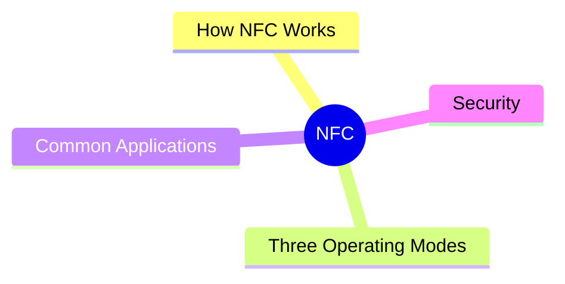
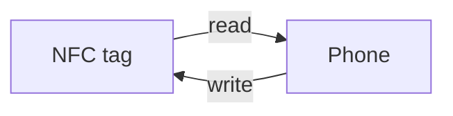
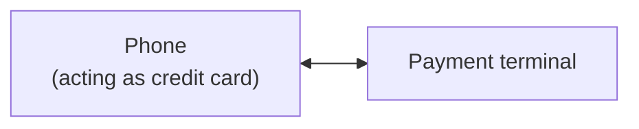
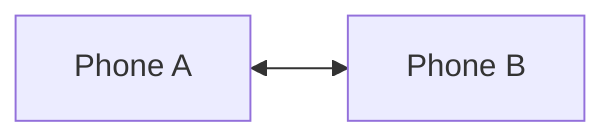

export const metadata = {
  title: 'NFC: Near Field Communication',
  date: '2026-03-31',
  excerpt: 'A practical guide to NFC — covering how it works, the three operating modes, common applications like mobile payments and transit cards, and the security mechanisms that make it safe to use.',
  tags: ['Wireless', 'Mobile'],
};

# NFC: Near Field Communication

NFC (Near Field Communication) is a short-range wireless technology that lets two devices exchange data when they're within about 4 centimeters of each other.

Tapping your phone to pay at a register, using a transit card, unlocking a door with a badge — NFC is behind all of it.

- [How NFC Works](#how-nfc-works)
- [Three Operating Modes](#three-operating-modes)
- [Common Applications](#common-applications)
- [Security](#security)

---

## How NFC Works

NFC is based on RFID (Radio Frequency Identification) technology and operates at 13.56 MHz.

### Active vs Passive Devices

NFC devices fall into two categories:

- Active devices — have their own power source and generate an electromagnetic field; examples: smartphones, NFC readers
- Passive devices — have no battery; they draw power from an active device's field to operate; examples: NFC tags, contactless cards

This is why an NFC sticker can work without a battery — it harvests energy from the phone's electromagnetic field.

### Speed and Range

- Data rates: 106 kbps, 212 kbps, 424 kbps
- Effective range: typically within 4 cm
- The very short range is an intentional security design

---

## Three Operating Modes

### Reader/Writer Mode

An active device (like a phone) reads from or writes to a passive device (like an NFC tag).

Uses: scanning an NFC tag to open a URL, writing contact info to an NFC business card.

### Card Emulation Mode

The device mimics an NFC card, so a reader treats it exactly like a physical card.

This is how Apple Pay, Google Pay, and contactless transit cards work on a phone.

### Peer-to-Peer Mode

Two active devices exchange data directly with each other.

Uses: sharing contacts between phones, pairing Bluetooth devices by tapping.

---

## Common Applications

### Mobile Payments

Apple Pay, Google Pay, and Samsung Pay all use NFC card emulation. When you tap to pay, the phone transmits an encrypted payment token, not your actual card number.

### Public Transit

Transit cards like EasyCard, Octopus, and Suica use NFC for fast gate entry and exit. Many phones can now emulate these cards, letting you tap through with just your phone.

### Access Control

Office keycards, hotel room keys, and building access badges are almost all NFC or RFID.

### NFC Tag Automation

Place NFC tags on physical objects and trigger actions when your phone taps them:

- On the nightstand: activate Do Not Disturb, set an alarm
- On your desk: connect to the office Wi-Fi, open work apps
- In the car: launch navigation, start a playlist

### Data Exchange

Tap two devices together to quickly exchange contacts, Wi-Fi credentials, or files.

---

## Security

### Short Range Is the Primary Defense

NFC's 4 cm range means an attacker has to be extremely close to intercept a transmission. While specialized equipment can extend that range somewhat, doing so in a public space without being noticed is difficult.

### How Mobile Payments Stay Secure

Apple Pay and Google Pay never transmit your real card number — they transmit a one-time payment token that's useless if intercepted.

Every transaction also requires biometric verification (Face ID or fingerprint). A stolen phone can't be used to pay.

### The Risk of Unknown NFC Tags

A malicious NFC tag could direct your phone to open a harmful URL or trigger an unsafe action. Modern phones display a confirmation prompt before acting on NFC tags, rather than executing everything automatically.

Treat unknown NFC tags the same way you'd treat unknown links — don't tap them.

### Contactless Card Skimming

Contactless credit cards can technically be read without physical contact, which raises questions about skimming. In practice, modern contactless cards also transmit tokens rather than real card numbers, and any transaction requires further authorization. The risk is lower than it sounds, but RFID-blocking wallets exist if you're concerned.

---

## Conclusion

- NFC is a short-range (~4 cm) wireless technology operating at 13.56 MHz
- Three modes: Reader/Writer (reading NFC tags), Card Emulation (mobile payments), Peer-to-Peer (device-to-device exchange)
- Key uses: mobile payments, transit cards, access control, tag-based automation
- Short range is the core security mechanism; mobile payments add token-based transactions and biometric verification on top
