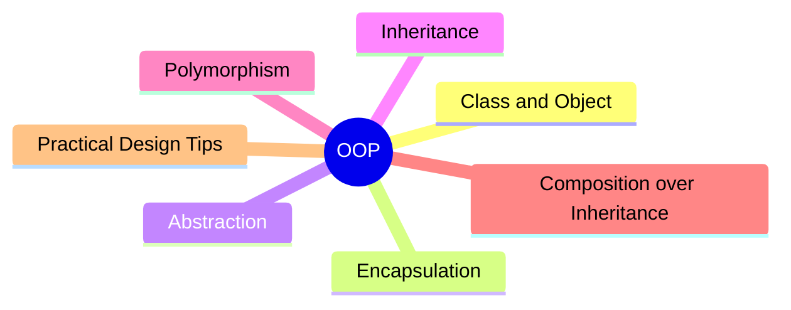

export const metadata = {
  title: 'Object-Oriented Programming (OOP): Core Concepts and Practical Design',
  date: '2026-05-28',
  excerpt: 'A practical guide to object-oriented programming — covering classes and objects, encapsulation, abstraction, inheritance, polymorphism, and when to prefer composition over inheritance.',
  tags: ['Software Design', 'Best Practice', 'OOP'],
};

# Object-Oriented Programming (OOP): Core Concepts and Practical Design

Object-oriented programming (OOP) is a way to model software around objects that hold both data (state) and behavior (methods).

The goal is not to use classes everywhere. The real goal is to design code that is easier to understand, test, extend, and maintain.



- [Class and Object](#class-and-object)
- [Encapsulation](#encapsulation)
- [Abstraction](#abstraction)
- [Inheritance](#inheritance)
- [Polymorphism](#polymorphism)
- [Composition over Inheritance](#composition-over-inheritance)
- [Practical Design Tips](#practical-design-tips)
- [Quick Reference](#quick-reference)

---

## Class and Object

A class is a blueprint. An object is an instance created from that blueprint.

```typescript
class User {
  constructor(
    public id: string,
    public name: string,
  ) {}

  rename(newName: string) {
    this.name = newName;
  }
}

const user = new User('u-1', 'Charmy');
user.rename('Alicia');
```

In this example:

- `User` defines structure and behavior
- `user` is a concrete object with its own state

---

## Encapsulation

Encapsulation means keeping internal state private and exposing only the operations that make sense from the outside.

```typescript
class BankAccount {
  #balance = 0;

  deposit(amount: number) {
    if (amount <= 0) {
      throw new Error('Amount must be greater than 0');
    }
    this.#balance += amount;
  }

  withdraw(amount: number) {
    if (amount <= 0) {
      throw new Error('Amount must be greater than 0');
    }
    if (amount > this.#balance) {
      throw new Error('Insufficient balance');
    }
    this.#balance -= amount;
  }

  getBalance() {
    return this.#balance;
  }
}
```

Why it matters:

- Prevents invalid state changes from outside
- Keeps business rules close to the data they protect
- Reduces accidental coupling

---

## Abstraction

Abstraction means exposing what a module does, while hiding implementation details.

```typescript
interface PaymentGateway {
  charge(amount: number): Promise<void>;
}

class StripeGateway implements PaymentGateway {
  async charge(amount: number): Promise<void> {
    // call Stripe API
    console.log(`Charging ${amount} with Stripe`);
  }
}

class CheckoutService {
  constructor(private gateway: PaymentGateway) {}

  async checkout(amount: number) {
    await this.gateway.charge(amount);
  }
}
```

`CheckoutService` depends on the abstraction (`PaymentGateway`), not a specific provider. That keeps the service flexible and testable.

---

## Inheritance

Inheritance lets one class reuse behavior from another.

```typescript
class Animal {
  move() {
    return 'moving';
  }
}

class Bird extends Animal {
  fly() {
    return 'flying';
  }
}
```

Inheritance is useful when there is a true "is-a" relationship and shared behavior is stable.

But deep inheritance chains often create tight coupling. Changes in a base class can unintentionally break many subclasses.

---

## Polymorphism

Polymorphism means different objects can be used through the same interface while behaving differently.

```typescript
interface NotificationSender {
  send(message: string): void;
}

class EmailSender implements NotificationSender {
  send(message: string) {
    console.log(`Email: ${message}`);
  }
}

class SmsSender implements NotificationSender {
  send(message: string) {
    console.log(`SMS: ${message}`);
  }
}

function notify(sender: NotificationSender, message: string) {
  sender.send(message);
}

notify(new EmailSender(), 'Order confirmed');
notify(new SmsSender(), 'Order confirmed');
```

The `notify` function does not need `if/else` for each channel. New channels can be added without changing existing logic.

---

## Composition over Inheritance

A practical OOP guideline: prefer composition over inheritance.

Composition builds behavior by combining small parts, instead of creating rigid class hierarchies.

```typescript
interface Logger {
  log(message: string): void;
}

class ConsoleLogger implements Logger {
  log(message: string) {
    console.log(message);
  }
}

class OrderService {
  constructor(private logger: Logger) {}

  placeOrder(orderId: string) {
    this.logger.log(`Placing order: ${orderId}`);
  }
}
```

Benefits:

- Lower coupling
- Easier unit testing (inject mocks)
- More flexibility to swap behaviors

---

## Practical Design Tips

- Model behavior, not just data containers. A class with only getters/setters is often a sign of poor design.
- Keep classes small and focused. If a class has multiple unrelated responsibilities, split it.
- Depend on abstractions (interfaces), not concrete implementations.
- Use inheritance sparingly; choose composition by default.
- OOP is one tool, not a religion. In many places, plain functions and immutable data can be simpler.

---

## Quick Reference

| Concept | Core Idea | Main Benefit | Common Pitfall |
| - | - | - | - |
| Class/Object | Bundle data and behavior | Clear modeling | Creating classes with no real behavior |
| Encapsulation | Hide internals and protect state | Predictable, protected state | Exposing mutable internals |
| Abstraction | Depend on contracts, not details | Easy replacement and testing | Leaky abstractions |
| Inheritance | Reuse via "is-a" hierarchy | Shared behavior reuse | Fragile deep hierarchies |
| Polymorphism | One interface, many implementations | Extensible behavior | Overengineering tiny cases |
| Composition | Build by assembling parts | Flexible and testable design | Too many tiny objects without boundaries |

---

## Conclusion

OOP is about design quality, not class quantity.

If you apply encapsulation, abstraction, and polymorphism thoughtfully, your codebase becomes easier to evolve. If you also favor composition over inheritance, you usually get better flexibility and fewer side effects over time.

The practical target remains the same: code that is easy to change without fear.