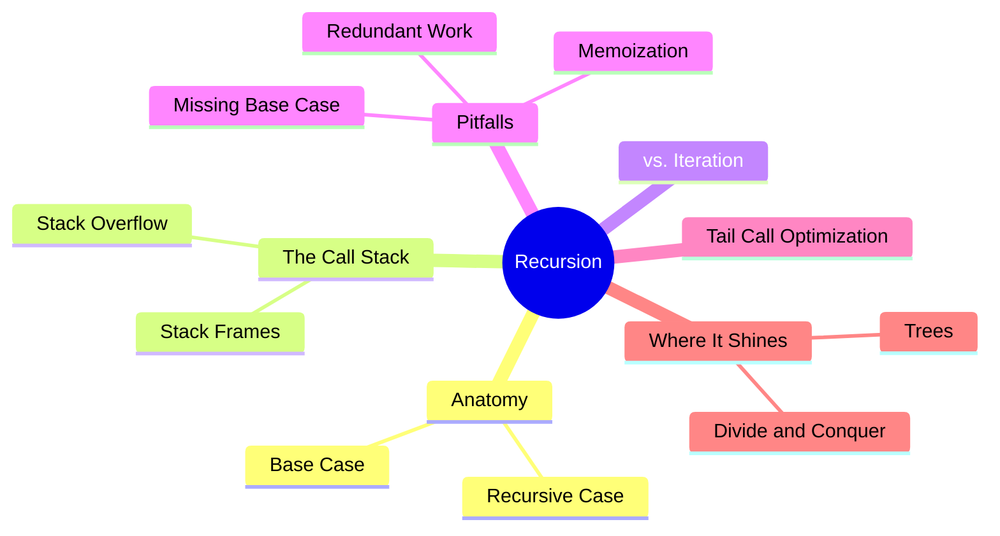
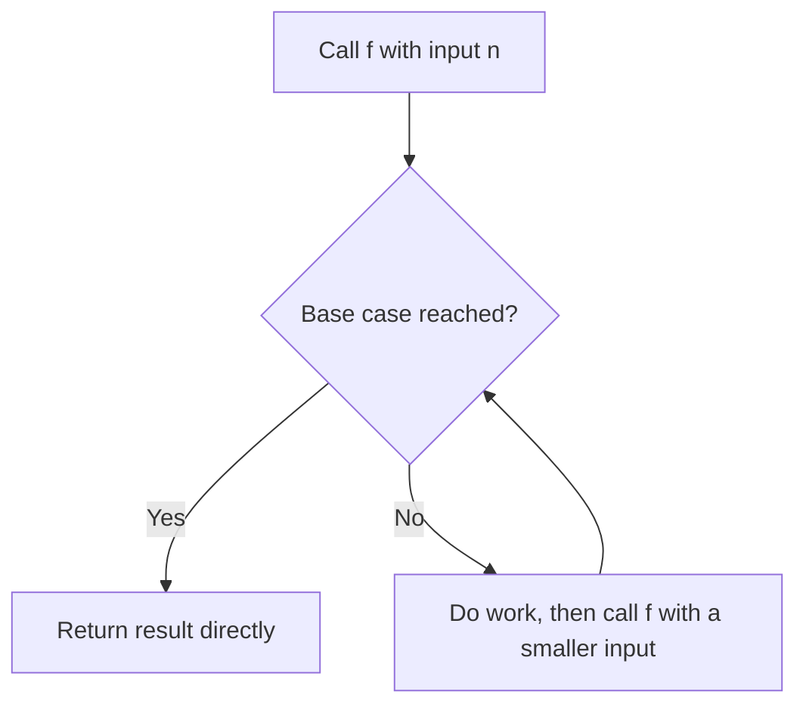
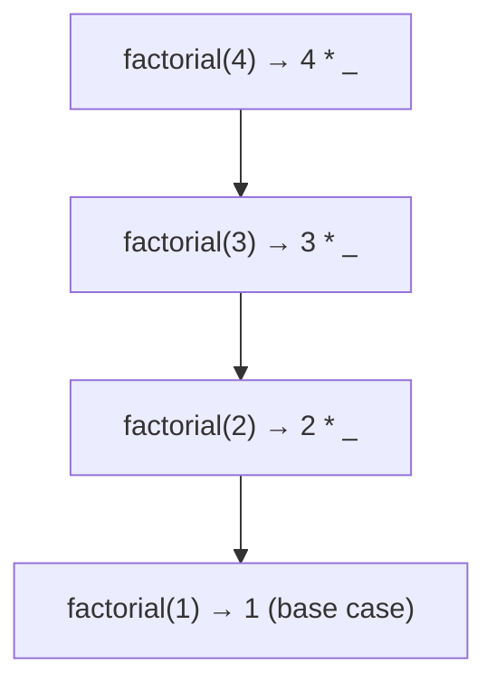
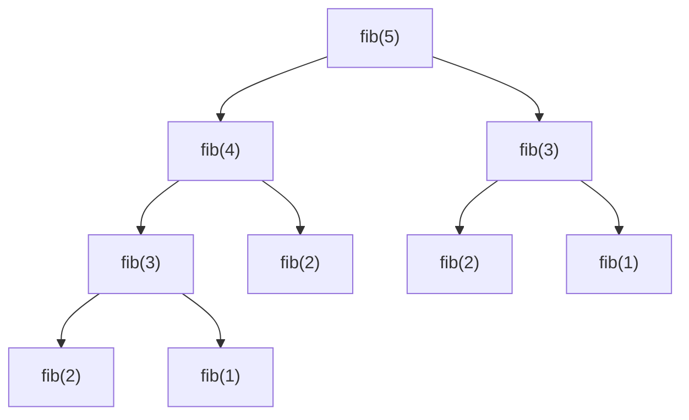

export const metadata = {
  title: 'Recursion',
  date: '2026-08-01',
  excerpt: 'A practical guide to recursion: how a function that calls itself actually works, what it costs on the call stack, when to reach for it over a loop, and the pitfalls (and fixes) that separate elegant recursion from a stack overflow.',
  tags: ['Programming'],
};

# Recursion

A recursive function is one that calls itself. That sounds almost circular: how can something be defined in terms of itself without spinning forever? The trick is that every working recursion has a way out, and every step moves closer to it.

Recursion isn't a clever party trick. Some problems are recursive by nature (trees, nested data, anything built from smaller copies of itself), and for those, recursion expresses the solution far more directly than a loop ever could. The cost is that it runs on the call stack, and the stack has limits worth understanding.



- [Anatomy of a Recursive Function](#anatomy-of-a-recursive-function)
- [The Call Stack](#the-call-stack)
- [Recursion vs. Iteration](#recursion-vs-iteration)
- [Common Pitfalls](#common-pitfalls)
- [Tail Call Optimization](#tail-call-optimization)
- [Where Recursion Shines](#where-recursion-shines)
- [Conclusion](#conclusion)

---

## Anatomy of a Recursive Function

Every correct recursion has two parts:

- **Base case**: the condition where the function stops and returns a value directly, without calling itself again. This is the way out.
- **Recursive case**: the function calls itself with a smaller or simpler input, moving one step closer to the base case.

Factorial is the textbook example. The factorial of `n` is `n` times the factorial of `n - 1`, and the factorial of 1 is 1.

```javascript
function factorial(n) {
  if (n <= 1) return 1;        // base case
  return n * factorial(n - 1); // recursive case
}
```

The part that trips people up is reasoning about it. Don't try to trace the whole thing in your head. Instead, take the recursive leap of faith: assume `factorial(n - 1)` already returns the correct answer, and define the current case in terms of it. If the base case is right and every call shrinks the input toward it, the whole thing works.

Two conditions make a recursion correct, and breaking either one breaks it:

- The base case must be reachable. Remove it, and the function calls itself forever.
- Each recursive call must move toward the base case. A call that doesn't shrink the input (`factorial(n)` calling `factorial(n)`, or decrementing the wrong variable) never terminates either.



A function can also recurse indirectly: `isEven` calling `isOdd`, which calls `isEven` again. That's mutual recursion, but the same rule holds: somewhere in the cycle there has to be a base case, and every loop through it has to make progress.

---

## The Call Stack

To see what recursion actually costs, you have to look at the call stack. Every function call gets its own stack frame, a small block of memory holding that call's parameters and local variables. When a function calls another, a new frame is pushed on top; when it returns, its frame is popped off. (This is the same machinery behind execution contexts; see [JavaScript Execution Context](/articles/javascript-execution-context) for the full picture.)

Recursion stacks frames up. Trace `factorial(4)`: each call can't finish until the call beneath it returns, so the frames pile on.



`factorial(4)` is waiting on `factorial(3)`, which is waiting on `factorial(2)`, which is waiting on `factorial(1)`. Only when `factorial(1)` hits the base case and returns 1 does the stack start to unwind: `factorial(2)` returns 2, `factorial(3)` returns 6, `factorial(4)` returns 24. Nothing gets multiplied until the recursion bottoms out and the frames resolve on the way back up.

This is exactly where the danger lives. Every pending call holds a frame, and the stack isn't infinite. Recurse too deep and you overflow it:

```javascript
function countDown(n) {
  if (n === 0) return;
  countDown(n - 1);
}

countDown(100000); // RangeError: Maximum call stack size exceeded
```

The exact limit depends on the engine and how much each frame holds: in V8 it's typically on the order of ten thousand calls deep, not millions. Any recursion whose depth scales with input size is one large input away from this error.

---

## Recursion vs. Iteration

Anything you can write recursively, you can write with a loop, and vice versa; the two are equivalent in power. The choice is about which one matches the problem, and what it costs.

Here's factorial again, iteratively:

```javascript
function factorial(n) {
  let result = 1;
  for (let i = 2; i <= n; i++) {
    result *= i;
  }
  return result;
}
```

Same answer, but the cost profile is completely different. The loop runs in constant memory: one `result` variable, reused. The recursive version holds a frame for every level of depth.

| | Recursion | Iteration |
| - | - | - |
| Memory | O(depth), one frame per call | O(1), constant |
| Reads naturally for | Nested or branching structures | Linear sequences |
| Failure mode | Stack overflow on deep input | None from depth |
| Performance | Function-call overhead per step | Generally faster |

The practical rule: reach for a loop when the work is a flat, linear sequence: counting, summing an array, walking a list. Reach for recursion when the structure branches or nests: a tree, a deeply nested object, a problem that splits into smaller versions of itself. For factorial specifically, the loop is the better choice; it's a linear sequence wearing a recursive disguise.

---

## Common Pitfalls

### Missing or unreachable base case

The most common bug is the one that produces infinite recursion: no base case, or a base case the recursion never reaches. The result is always the same: `Maximum call stack size exceeded`. When you see that error, the first question is whether every recursive call genuinely moves toward the base case.

### Redundant work

This one is subtler because the code looks correct and returns the right answer, but it's catastrophically slow. The naive Fibonacci is the classic offender:

```javascript
function fib(n) {
  if (n < 2) return n;
  return fib(n - 1) + fib(n - 2);
}
```

The problem is that the two branches recompute the same values over and over. Look at the call tree for `fib(5)`:



`fib(3)` is computed twice. `fib(2)` is computed three times. As `n` grows, this duplication explodes: the naive version runs in O(2ⁿ) time, so `fib(50)` would make tens of billions of calls. The recursion is correct, but it's redoing an enormous amount of identical work.

### Memoization

The fix is to remember answers you've already computed, so each distinct input is solved exactly once:

```javascript
function fib(n, memo = new Map()) {
  if (n < 2) return n;
  if (memo.has(n)) return memo.get(n);

  const result = fib(n - 1, memo) + fib(n - 2, memo);
  memo.set(n, result);
  return result;
}
```

Now `fib(5)` computes each of `fib(1)` through `fib(5)` a single time and reads the rest from the cache. That collapses the runtime from O(2ⁿ) to O(n): `fib(50)` returns instantly. This technique, caching the results of recursive subproblems, is the foundation that dynamic programming is built on.

---

## Tail Call Optimization

A tail call is a recursive call that is the very last thing a function does: its result is returned directly, with no work waiting to happen afterward.

The standard factorial is *not* tail-recursive. Look closely at `return n * factorial(n - 1)`: after `factorial(n - 1)` returns, there's still a multiplication left to do. That pending work is exactly why the frame has to stick around.

You can rewrite it to be tail-recursive by carrying the running result along in an accumulator, so nothing is left over after the call:

```javascript
function factorial(n, acc = 1) {
  if (n <= 1) return acc;
  return factorial(n - 1, n * acc); // tail call — nothing happens after this returns
}
```

When a call is in tail position, an engine *can* optimize it: instead of pushing a new frame, it reuses the current one, since there's nothing left to come back to. That turns the recursion into something with a constant stack footprint: no overflow, no matter how deep.

Here's the catch, and it matters: in JavaScript you mostly can't count on this. The ES2015 spec did mandate proper tail calls, but adoption stalled. Among the major engines, only JavaScriptCore (Safari) actually ships it. V8 (Chrome and Node.js) implemented it behind a flag and then removed it; SpiderMonkey (Firefox) never shipped it. So in Node or Chrome, the tail-recursive factorial above still overflows on a large enough `n`, exactly like the original.

The takeaway: understand tail calls conceptually, but don't rely on tail-call optimization in JavaScript. When you need a deep recursion to run in bounded stack space, convert it to a loop, or manage the work yourself with an explicit stack (an array you push to and pop from).

---

## Where Recursion Shines

Recursion is the right tool when the data itself is defined recursively: a structure that contains smaller versions of itself. When the shape of the code matches the shape of the data, the solution almost writes itself.

### Trees and nested structures

Trees are everywhere in frontend work: the DOM is a tree, a file system is a tree, JSON nests to arbitrary depth. Counting every node in a tree is three lines:

```javascript
function countNodes(node) {
  let count = 1; // count this node
  for (const child of node.children) {
    count += countNodes(child);
  }
  return count;
}
```

The loop handles the siblings at one level; the recursion handles the descent into depth. The elegance is that you never have to know how deep the tree goes; the recursion follows it as far as it reaches. Doing the same thing with a loop means maintaining your own explicit stack of nodes-to-visit, which is really just recursion done by hand.

### Divide and conquer

The other natural fit is the divide-and-conquer pattern: split a problem into smaller subproblems, solve each one recursively, then combine the results. Merge sort, quicksort, and binary search are all built this way. Binary search reads cleanly as a recursion: each step throws away half the remaining range:

```javascript
function binarySearch(arr, target, lo = 0, hi = arr.length - 1) {
  if (lo > hi) return -1; // base case: range is empty, not found

  const mid = (lo + hi) >> 1;
  if (arr[mid] === target) return mid;

  return arr[mid] < target
    ? binarySearch(arr, target, mid + 1, hi)  // search the right half
    : binarySearch(arr, target, lo, mid - 1); // search the left half
}
```

Each call works on a strictly smaller range, and the answer travels straight back up with no combining step. Merge sort and quicksort share the same skeleton: split, recurse, then do the real work as the results come back together.

---

## Conclusion

Recursion isn't about being clever; it's about matching the shape of the problem. When a structure is built from smaller copies of itself, a function that calls itself on those smaller copies is the most honest description you can write. Get the base case and the progress right, keep an eye on the stack, and the rest follows.

In practice the decision comes down to a few questions. Is the work linear, or does it branch and nest? Linear sequences belong in a loop; branching, self-similar structures belong in recursion. Is the same subproblem being solved more than once? Then memoize, and an exponential algorithm collapses to a linear one. And how deep can it go? Since JavaScript engines don't reliably optimize tail calls, any recursion whose depth grows with its input needs either a bounded depth or a rewrite as iteration. Answer those, and recursion stops being a source of mysterious stack overflows and becomes what it should be: the clearest way to express a self-similar problem.
