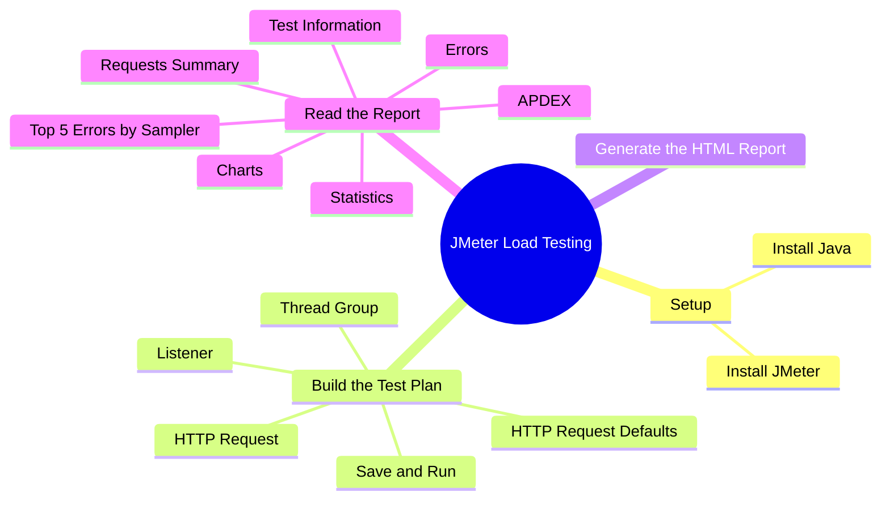
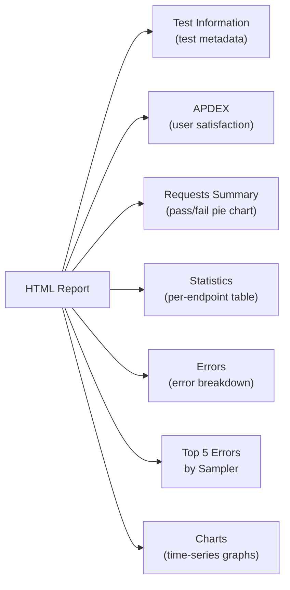
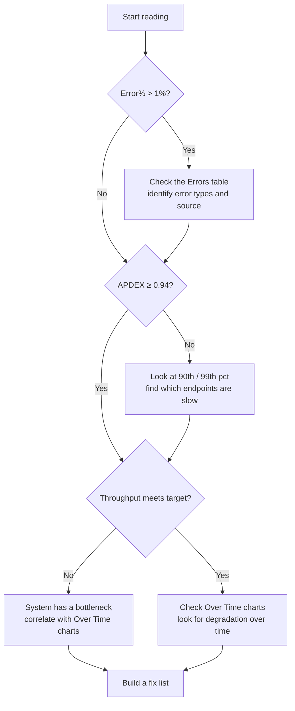

export const metadata = {
  title: 'JMeter Load Testing: From Setup to Reading the Report',
  date: '2026-06-21',
  excerpt: 'A complete walkthrough of JMeter load testing from scratch: covering Thread Group, HTTP Request, and Listener setup, through running tests in CLI mode, and breaking down every metric in the HTML report.',
  tags: ['Testing', 'Performance', 'Java'],
};

# JMeter Load Testing: From Setup to Reading the Report

Apache JMeter is a 100% pure-Java open-source load testing tool maintained by the Apache Software Foundation. It's designed for testing the performance, load capacity, and stress limits of web applications and APIs.

This post walks through the entire process: installing JMeter, setting up a test plan, running it from the command line, and making sense of every section in the HTML report.



- [Installation](#installation)
- [Thread Group](#thread-group)
- [HTTP Request Defaults](#http-request-defaults)
- [HTTP Request](#http-request)
- [Listener](#listener)
- [Save and Run](#save-and-run)
- [Generate the HTML Report (CLI)](#generate-the-html-report-cli)
- [Reading the Report](#reading-the-report)
- [How to Approach the Report](#how-to-approach-the-report)

---

## Installation

JMeter is a Java application, so Java needs to be installed before anything else.

### Steps

1. Install Java (Java 21 is recommended). Use [mise](https://mise.jdx.dev/), SDKMAN, or download directly from the Oracle or AdoptOpenJDK website.
2. Install JMeter: on macOS, `brew install jmeter` is the easiest option. On other platforms, download the binary archive from the [JMeter website](https://jmeter.apache.org/download_jmeter.cgi), extract it, and run `bin/jmeter`.
3. Launch JMeter: type `jmeter` in the terminal (or run `bin/jmeter.bat` on Windows). The GUI should open.


---

## Thread Group

The Thread Group is the core of a JMeter test plan. It defines how many virtual users to simulate, how quickly they ramp up, and how many times they run through the test.

### Setup

1. Right-click `Test Plan` in the left panel.
2. Select `Add → Threads (Users) → Thread Group`.
3. Configure the three main parameters in the right panel.


- Number of Threads (users)
    How many virtual users send requests simultaneously. Start with 10 when you're just verifying the script works; there's no need to go heavy at this stage.
- Ramp-up period (seconds)
    How long JMeter takes to start all threads. With Threads = 10 and Ramp-up = 10, JMeter adds one new user per second. Setting the ramp-up equal to the thread count keeps traffic from spiking all at once, which could be flagged as a DDoS attempt by the server.
- Loop Count
    How many times each user runs through the test. Keep it at 1 initially. The Infinite option is for long-running stability tests; use it only once you're confident the script is correct, since it'll keep hammering the server until you manually stop it.

---

## HTTP Request Defaults

If you're testing multiple endpoints on the same host, HTTP Request Defaults lets you configure the host once instead of repeating it on every request.

### Setup

1. Right-click `Thread Group`.
2. Select `Add → Config Element → HTTP Request Defaults`.
3. Fill in the right panel:
    - Protocol: `https` (or `http`)
    - Server Name or IP: your target domain, e.g., `example.com`


---

## HTTP Request

Each HTTP Request sampler represents one API call in the test flow. Add as many as you need to model a realistic user journey.

### Setup

1. Right-click `Thread Group`.
2. Select `Add → Sampler → HTTP Request`.
3. Fill in the right panel:
    - Name: a descriptive label, e.g., `Blog Home Page`
    - Method: `GET` (or POST, PUT, etc., depending on the API)
    - Path: `/` for the homepage, or a specific path like `/api/users`
    - Server Name: leave blank (JMeter will pull the domain from HTTP Request Defaults)


To test multiple endpoints, add more HTTP Request samplers under the same Thread Group. They run in sequence, simulating a user's complete interaction with the application.

---

## Listener

Listeners collect and display test results. Add at least these two:

- View Results Tree: shows per-request detail (request headers, response body). Use this for debugging.
- Summary Report: shows aggregate statistics, including average response time, error rate, and throughput.

### Setup

1. Right-click `Thread Group`, select `Add → Listener → View Results Tree`.
2. Right-click `Thread Group` again, select `Add → Listener → Summary Report`.


> Listeners render live charts while the GUI test runs, which burns significant CPU and memory. They're only for script verification; actual load tests should use CLI mode, covered below.

---

## Save and Run

Before running a full load test, do a quick sanity check with a small number of threads to confirm every request gets a correct response.

### Steps

1. Click the save button in the upper left and save the test plan, for example as `Summary Report.jmx`.
2. Click the green play button (Start) in the toolbar.
3. Click `View Results Tree` in the left panel to inspect the results.

### What to look for

- **Green (shield icon or label)**: HTTP 2xx / 3xx, success
- **Red**: HTTP 4xx / 5xx or an exception, something needs fixing


If everything shows green, the script is correct. Move on to running the real load test from the CLI.

---

## Generate the HTML Report (CLI)

Don't run real load tests in GUI mode. The GUI itself consumes significant CPU and memory while running, which skews the results. JMeter's own documentation explicitly recommends Non-GUI (CLI) mode for actual tests.

The workflow is: use the GUI to build and verify your test plan, then close it and run from the terminal.

### Steps

1. Make sure the test plan is saved (e.g., `Summary Report.jmx`).
2. Open a terminal and navigate to the directory containing the `.jmx` file.
3. Run:

```bash
jmeter -n -t "Summary Report.jmx" -l test_result.csv -e -o "Summary Report"
```

Flags explained

| Flag | Description |
| :--- | :--- |
| `-n` | Run in Non-GUI mode |
| `-t <file>` | The `.jmx` script to execute |
| `-l <file>` | Save raw per-request data to a CSV file |
| `-e` | Generate an HTML report after the test completes |
| `-o <dir>` | Output directory for the HTML report (must not already exist) |

> The `-o` directory must not exist before running the command; JMeter creates it automatically. If it already exists, JMeter will throw an error and stop. Either delete the old directory or use a different name between runs.


When the test completes, open `index.html` from the output directory in a browser to view the full report.

---

## Reading the Report


The JMeter HTML report is organized into several sections:



### Test and Report Information

The metadata block at the top of the report:

| Field | Description |
| :--- | :--- |
| Source file | The CSV file containing raw test results |
| Start Time | When the test started |
| End Time | When the test ended |
| Filter for display | The sampler filter, if any; blank means all samplers are shown |

### APDEX

APDEX (Application Performance Index) is a standardized score for quantifying user satisfaction with application performance. It ranges from 0 to 1.

The formula:

```
APDEX = (Satisfied + Tolerating × 0.5) / Total Requests
```

JMeter's default thresholds:

- Satisfied: response time ≤ 500ms (the T value, configurable)
- Tolerating: response time between 500ms and 2000ms (4T)
- Frustrated: response time > 2000ms, or an error occurred

Score reference:

| Score | Rating | What it means |
| :--- | :--- | :--- |
| 1.00 | Excellent | Perfect |
| 0.94 – 0.99 | Good | Meets expectations |
| 0.85 – 0.93 | Fair | Needs monitoring |
| 0.70 – 0.84 | Poor | Needs improvement |
| < 0.70 | Unacceptable | Requires immediate action |

APDEX table columns:

| Column | Description |
| :--- | :--- |
| Apdex | The score, 0–1 |
| T (Acceptable) | Satisfied threshold, default 500ms |
| F (Tolerated) | Tolerating threshold, default 2000ms |
| Label | The Thread Group or Sampler name |

### Requests Summary

A pie chart showing the overall pass/fail ratio:

- **Green (OK)**: HTTP 2xx / 3xx, marked as successful
- **Red (KO)**: HTTP 4xx / 5xx, or a Response Assertion failure

One thing to be aware of: JMeter uses HTTP status codes to determine success by default. If an API returns HTTP 200 but the body contains an error like `{"error":"permission denied"}`, JMeter still counts it as a pass. To catch that kind of failure, add a Response Assertion or JSON Extractor to your test plan.

### Statistics

The Statistics table is the heart of the report. Every sampler (API endpoint) gets its own row.

Request counts

| Column | Description |
| :--- | :--- |
| #Samples | Total requests sent |
| Fail | Total failures (KO) |
| Error% | Failure rate = Fail ÷ #Samples × 100% |

Response times (in ms)

| Column | Description | Why it matters |
| :--- | :--- | :--- |
| Average | Arithmetic mean | Useful reference, but distorted by outliers |
| Min | Fastest response | Best-case performance |
| Max | Slowest response | Worst-case performance |
| Median (50th pct) | Half of requests complete in this time | Better than Average for representing a typical user |
| 90th pct | 90% of requests complete in this time | The standard SLA metric; what most users experience |
| 95th pct | 95% of requests complete in this time | For stricter service standards |
| 99th pct | 99% of requests complete in this time | Represents the worst outliers |

> Why percentiles matter more than the average
>
> Say 99 requests complete in 100ms and 1 request takes 10,000ms:
> - Average ≈ 199ms, looks reasonable
> - 99th pct = 10,000ms: 1 in every 100 users waited over 10 seconds
>
> The average hides the problem. The 99th percentile reveals it.

Throughput

| Column | Description |
| :--- | :--- |
| Throughput | Requests per second (req/s); higher means the system can handle more load |
| Received KB/sec | Data received from the server per second |
| Sent KB/sec | Data sent to the server per second |

### Errors

The Errors table breaks down every error type that occurred:

| Column | Description |
| :--- | :--- |
| Type of error | The error type, e.g., `Response code: 500` or `Connection timed out` |
| Number of errors | How many times this error occurred |
| % in errors | This error's share of all errors |
| % in all samples | This error's share of all requests |

Common error types

| Error | Cause |
| :--- | :--- |
| `Response code: 500` | Server-side error: an unhandled exception was thrown |
| `Response code: 502 / 503` | Gateway or server temporarily unavailable, usually from overload or resource exhaustion |
| `Response code: 401 / 403` | Auth failure: token expired or not included in the request |
| `Connection timed out` | Server too busy to respond within JMeter's timeout window |
| `Connection refused` | Server rejected the connection; may be down or the port is closed |
| `java.net.SocketException` | The network connection was forcibly closed mid-request |

### Top 5 Errors by Sampler

Groups the Errors breakdown by sampler (API endpoint), showing the five worst offenders. This is usually the first place to check when a test produces a lot of failures; it tells you exactly which endpoint is responsible and how often it fails.

| Column | Description |
| :--- | :--- |
| Sampler | The Thread Group or HTTP Request name |
| Type of error | The error type |
| Number of errors | How many times this error occurred |
| % in errors | This error's share of all errors |
| % in all samples | This error's share of all requests |

### Charts

The report's Charts section has three sub-pages, each with interactive time-series graphs for tracking how the system behaves under load:

Over Time

- **Response Time Over Time**: does response time climb as load increases? This is where you spot the moment the system starts struggling.
- **Active Threads Over Time**: how the virtual user count changes over time.
- **Transactions Per Second**: throughput over time; look for any sudden drop-offs.

Throughput

- **Hits Per Second**: the raw request rate hitting the server.
- **Throughput vs Threads**: as you add more users, does throughput scale linearly or level off? A plateau means the system has hit its ceiling.

Response Times

- **Response Time Percentiles Over Time**: tracks each percentile across the test duration.
- **Response Time Distribution**: a histogram of response times; a wide spread or long tail points to variance issues.

---

## How to Approach the Report



Quick reference thresholds (general web services)

| Metric | Target | Notes |
| :--- | :--- | :--- |
| Error% | < 1% | Above 5% indicates a serious problem |
| 90th pct | < 2000ms | Reflects the experience of the majority of users |
| APDEX | ≥ 0.94 | Below this, users are noticeably affected |
| Throughput | Depends on your target | Verify the server can sustain the required req/s |
| Max vs 99th pct | Monitor the gap | A large gap means there are intermittent extreme outliers |

---

## Wrap-up

Load testing with JMeter breaks into two phases: building the test plan and reading the results.

In the first phase, configure everything in the GUI (thread count, endpoints, request parameters), then do a small dry run to confirm the script works. Close the GUI and run the full test from the CLI.

In the second phase, start with Error%, APDEX, and 90th pct. Those three numbers tell you most of what you need to know. Cross-reference with the Over Time charts to see whether things got worse as the test ran.

The earlier load testing becomes part of your development process, the earlier you'll find where the system breaks.
