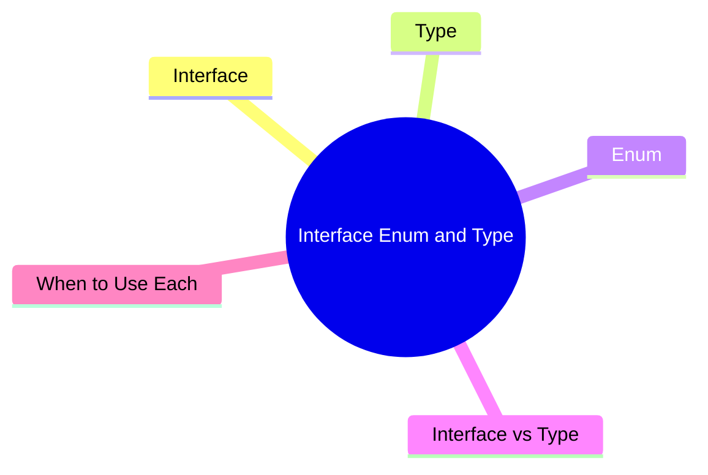

export const metadata = {
  title: 'TypeScript Interface, Enum, and Type: Roles and Differences',
  date: '2026-04-19',
  excerpt: 'A practical guide to TypeScript Interface, Type, and Enum — covering their syntax, key differences, declaration merging, union types, how Enum compiles, and when to use each.',
  tags: ['Front-end', 'TypeScript'],
};

# TypeScript Interface, Enum, and Type: Roles and Differences

TypeScript gives you three main tools for defining types: `interface`, `enum`, and `type`.

All three describe data shapes or type constraints, but they serve different purposes and behave differently in important ways.



- [Interface](#interface)
- [Type](#type)
- [Enum](#enum)
- [Interface vs Type](#interface-vs-type)
- [When to Use Each](#when-to-use-each)

---

## Interface

`interface` describes the shape of an object — what properties and methods it should have.

```typescript
interface User {
  id: number;
  name: string;
  email: string;
}

const user: User = {
  id: 1,
  name: 'Charmy',
  email: 'charmy@example.com',
};
```

### Optional and Readonly Properties

```typescript
interface User {
  id: number;
  name: string;
  email?: string;            // optional
  readonly createdAt: Date;  // can't be reassigned after initialization
}
```

### Extending

Interfaces can extend other interfaces to build up more complex shapes:

```typescript
interface Animal {
  name: string;
}

interface Dog extends Animal {
  breed: string;
}

const dog: Dog = {
  name: 'Max',
  breed: 'Labrador',
};
```

Multiple inheritance works too:

```typescript
interface C extends A, B { ... }
```

### Declaration Merging

Declaring the same interface name twice merges them — this is unique to `interface`:

```typescript
interface User {
  name: string;
}

interface User {
  age: number;
}

// User now has both name and age
const user: User = { name: 'Charmy', age: 25 };
```

This is particularly useful for augmenting types from third-party libraries.

---

## Type

`type` creates a type alias — a name you can give to any type, not just objects.

```typescript
type UserId = number;
type UserName = string;

type User = {
  id: UserId;
  name: UserName;
};
```

### Union Types

```typescript
type Status = 'active' | 'inactive' | 'pending';
type ID = number | string;

function getUser(id: ID): User { ... }
```

### Intersection Types

```typescript
type Admin = User & { role: 'admin' };
```

Combines all properties from multiple types into one.

### Utility Types

`type` works naturally with TypeScript's built-in utility types:

```typescript
type PartialUser = Partial<User>;    // all properties become optional
type ReadonlyUser = Readonly<User>;  // all properties become readonly
type UserKeys = keyof User;          // union of all property names
```

---

## Enum

`enum` defines a named set of constants, giving related values clear names and a shared type.

### Numeric Enum (default)

```typescript
enum Direction {
  Up,    // 0
  Down,  // 1
  Left,  // 2
  Right, // 3
}

const move = Direction.Up; // 0
```

Members auto-increment from 0 by default.

### String Enum

```typescript
enum Status {
  Active = 'ACTIVE',
  Inactive = 'INACTIVE',
  Pending = 'PENDING',
}

const status = Status.Active; // 'ACTIVE'
```

String enums are more readable at runtime and easier to debug than numbers.

### Const Enum

Adding `const` causes the enum to be inlined at compile time — no JavaScript object is generated:

```typescript
const enum Direction {
  Up = 'UP',
  Down = 'DOWN',
}

const move = Direction.Up; // compiles to: const move = 'UP';
```

### What Enum Compiles To

A regular enum compiles to a real JavaScript object:

```typescript
// TypeScript
enum Status {
  Active = 'ACTIVE',
  Inactive = 'INACTIVE',
}

// Compiled JavaScript
var Status;
(function (Status) {
  Status["Active"] = "ACTIVE";
  Status["Inactive"] = "INACTIVE";
})(Status || (Status = {}));
```

This means the enum exists at runtime — you can iterate over it and look up names by value.

---

## Interface vs Type

`interface` and `type` are interchangeable in many situations. The differences that matter:

| | `interface` | `type` |
| - | - | - |
| Object shapes | ✓ | ✓ |
| Union types | ✗ | ✓ |
| Intersection | via `extends` | via `&` |
| Declaration merging | ✓ (same name merges) | ✗ (duplicate name errors) |
| Extension syntax | `extends` | `&` |
| Utility types | works as generic parameter | works as generic parameter |

```typescript
// interface style
interface Animal {
  name: string;
}
interface Dog extends Animal {
  breed: string;
}

// equivalent with type
type Animal = { name: string };
type Dog = Animal & { breed: string };
```

---

## When to Use Each

### Use `interface` when:

- Defining the shape of an object, especially for public API types
- The type needs to be implemented by a class
- You want to allow third parties to extend the type via declaration merging

```typescript
interface Printable {
  print(): void;
}

class Document implements Printable {
  print() {
    console.log('Printing...');
  }
}
```

### Use `type` when:

- Defining union or intersection types
- Naming non-object types (functions, tuples, primitive aliases)
- Working with utility types

```typescript
type EventHandler = (event: MouseEvent) => void;
type Pair = [string, number];
type StringOrNumber = string | number;
```

### Use `enum` when:

- You have a fixed set of named constants (statuses, directions, error codes)
- You need to iterate over the values or look up names at runtime

```typescript
enum HttpStatus {
  Ok = 200,
  NotFound = 404,
  InternalServerError = 500,
}

function handleResponse(status: HttpStatus) {
  if (status === HttpStatus.Ok) {
    // ...
  }
}
```

When not to use `enum`: if you only need a set of string constants and don't need a runtime object, `as const` is a lighter alternative:

```typescript
const Status = {
  Active: 'ACTIVE',
  Inactive: 'INACTIVE',
} as const;

type Status = typeof Status[keyof typeof Status];
// 'ACTIVE' | 'INACTIVE'
```

---

## Summary

- `interface` — defines object shapes; supports extension and declaration merging; best for public API types
- `type` — type alias for anything; best for union types, intersection types, and utility types
- `enum` — named constant set; compiles to a real JavaScript object; best for fixed sets of values

A practical rule of thumb: use `interface` for object shapes, `type` for union and intersection types, and `enum` (or `as const`) for fixed constant sets.
