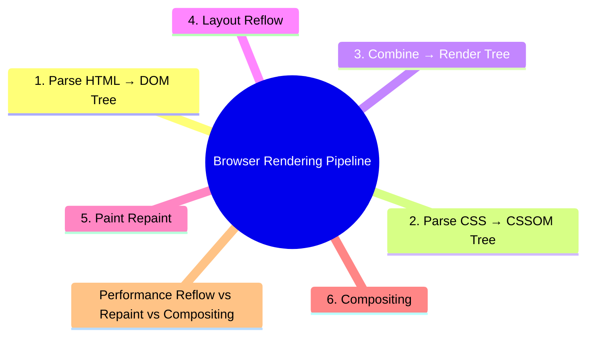
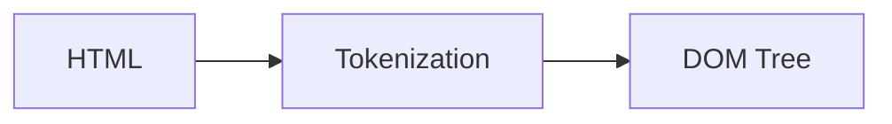
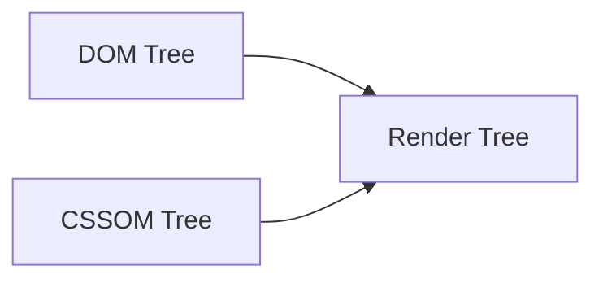
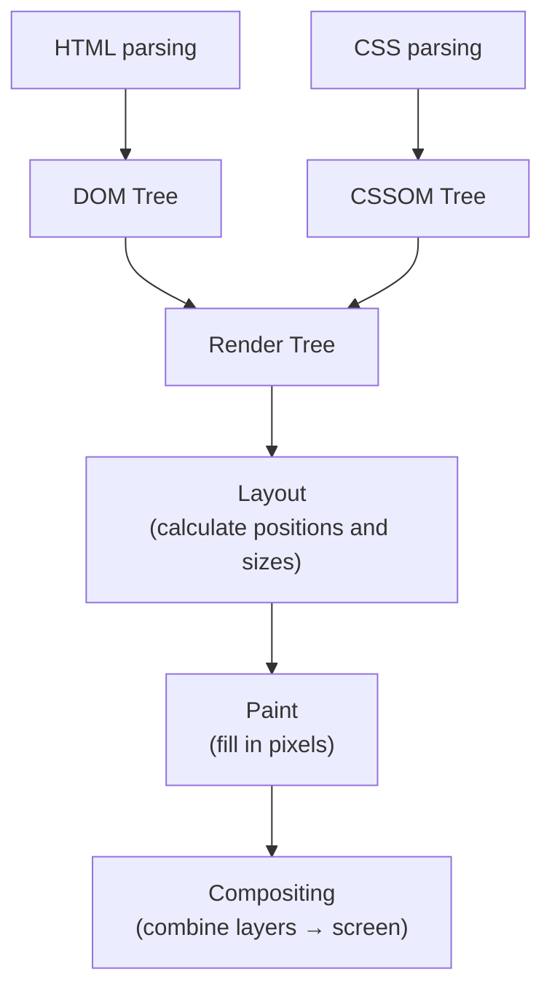

export const metadata = {
  title: 'Browser Rendering Pipeline',
  date: '2026-03-27',
  excerpt: 'A practical guide to the browser rendering pipeline — covering DOM Tree, CSSOM Tree, Render Tree, Layout, Paint, and Compositing, with a look at how Reflow and Repaint affect performance and how to minimize them.',
  tags: ['Front-end', 'Web'],
};

# Browser Rendering Pipeline

When a browser loads a webpage, a lot happens between receiving the HTML and putting pixels on screen. That sequence of steps is the rendering pipeline.

Understanding it helps you write more performant frontend code and avoid common bottlenecks.



- [Parse HTML → DOM Tree](#1-parse-html--dom-tree)
- [Parse CSS → CSSOM Tree](#2-parse-css--cssom-tree)
- [Combine → Render Tree](#3-combine--render-tree)
- [Layout](#4-layout)
- [Paint](#5-paint)
- [Compositing](#6-compositing)
- [Performance: Reflow vs. Repaint vs. Compositing](#performance-reflow-vs-repaint-vs-compositing)

---

## 1. Parse HTML → DOM Tree

The browser parses the HTML from top to bottom, converting tags into the DOM Tree.



When the parser hits a `<script>` tag, it pauses by default — the script has to download and execute before parsing continues. That's why scripts are typically placed at the bottom of `<body>`, or use `defer` / `async`.

```html
<!-- blocks parsing -->
<script src="app.js"></script>

<!-- downloads in background, executes after HTML is parsed -->
<script src="app.js" defer></script>

<!-- downloads in background, executes as soon as it's ready -->
<script src="app.js" async></script>
```

---

## 2. Parse CSS → CSSOM Tree

While parsing HTML, the browser also parses CSS and builds the CSSOM Tree.

The browser won't render anything until the CSSOM is complete — making CSS a render-blocking resource.

Placing `<link>` tags in `<head>` lets CSS start downloading as early as possible, minimizing how long rendering is blocked.

---

## 3. Combine → Render Tree

The DOM Tree and CSSOM Tree are combined into the Render Tree.

The Render Tree only includes visible nodes:

- Elements with `display: none` are excluded — they take up no space
- Elements with `visibility: hidden` are included — they're invisible but still occupy space
- Non-visual elements like `<head>` and `<script>` are excluded



---

## 4. Layout

In the Layout phase (also called Reflow), the browser calculates the position and size of every element in the Render Tree.

This determines:

- Each element's width and height
- Where each element sits on the page
- How elements relate to each other

Layout is expensive because changing one element's dimensions can cascade and affect the positioning of others.

---

## 5. Paint

In the Paint phase (also called Repaint), the browser fills in the pixels for each element:

- Background colors
- Text
- Borders
- Shadows

The browser divides the page into layers. Elements with complex styles — like those using `transform` or `opacity` — get their own layer.

---

## 6. Compositing

In the Compositing phase, the browser takes all the layers and combines them in the correct order to produce the final frame on screen.

Elements on their own compositor layer (achieved with `transform: translateZ(0)` or `will-change: transform`) can be processed entirely on the GPU, skipping Layout and Paint entirely — which makes them the most performant to animate.


---

## Performance: Reflow vs. Repaint vs. Compositing

### Reflow (most expensive)

These operations trigger a full Layout recalculation:

- Changing an element's dimensions (`width`, `height`, `padding`, `margin`)
- Adding or removing elements
- Changing font size
- Reading certain properties (`offsetWidth`, `offsetHeight`, `getBoundingClientRect()`)

Reading layout properties forces the browser to calculate Layout immediately, even if it hasn't rendered yet. This is called forced synchronous layout.

### Repaint (moderate cost)

Changing visual styles that don't affect size or position only triggers a Repaint:

- `color`
- `background-color`
- `visibility`
- `box-shadow`

### Compositing only (cheapest)

These only affect the GPU compositing step — no Layout or Paint:

- `transform`
- `opacity`

### Practical Tips

Batch style changes

```javascript
// bad: each change may trigger a Reflow
element.style.width = '100px';
element.style.height = '200px';
element.style.margin = '10px';

// good: one change, one Reflow
element.className = 'new-style';
// or
element.style.cssText = 'width: 100px; height: 200px; margin: 10px;';
```

Don't mix reads and writes in a loop

```javascript
// bad: reading offsetWidth inside the loop forces repeated Reflows
for (let i = 0; i < items.length; i++) {
  items[i].style.width = container.offsetWidth + 'px';
}

// good: read once, then write
const containerWidth = container.offsetWidth;
for (let i = 0; i < items.length; i++) {
  items[i].style.width = containerWidth + 'px';
}
```

Use transform instead of position properties for movement

```javascript
// triggers Reflow
element.style.left = '100px';

// triggers Compositing only — much cheaper
element.style.transform = 'translateX(100px)';
```

---

## Conclusion

The rendering pipeline in order:



Performance cost from highest to lowest: Reflow > Repaint > Compositing

The core principle for performant frontend code: avoid triggering Reflow wherever possible, and prefer properties that only trigger Compositing — `transform` and `opacity`.
