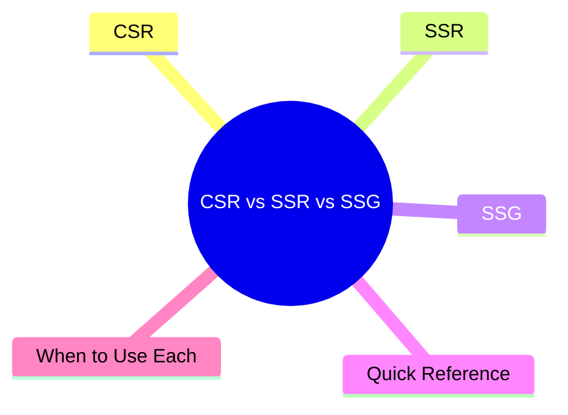
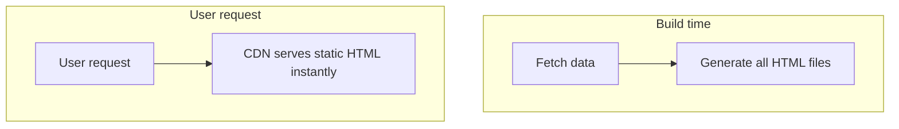

export const metadata = {
  title: 'CSR vs SSR vs SSG: Frontend Rendering Strategies',
  date: '2026-03-29',
  excerpt: 'A practical guide to frontend rendering strategies — covering how CSR, SSR, and SSG work, their trade-offs, and when to use each.',
  tags: ['Front-end', 'Web'],
};

# CSR vs SSR vs SSG: Frontend Rendering Strategies

There are three main ways to render a web application, and they differ in one fundamental question: where and when is the HTML generated?

- CSR (Client-Side Rendering) — in the browser, at runtime
- SSR (Server-Side Rendering) — on the server, on every request
- SSG (Static Site Generation) — at build time, before any user requests

The choice affects load speed, SEO, infrastructure costs, and deployment complexity.

- [CSR](#csr)
- [SSR](#ssr)
- [SSG](#ssg)
- [Quick Reference](#quick-reference)
- [When to Use Each](#when-to-use-each)

---

## CSR

CSR is the default for React, Vue, and Angular SPAs.

### How It Works

1. Browser requests the page
2. Server responds with a near-empty HTML file and a JavaScript bundle
3. Browser downloads and executes the JavaScript
4. JavaScript calls the API to fetch data
5. JavaScript generates and renders the HTML in the browser

### Pros

- Smooth page transitions — no full page reloads
- Low server load — the server only serves static files and an API
- Clean separation between frontend and backend

### Cons

- Slow initial load (slow FCP) — users see nothing until JavaScript downloads and runs
- Weaker SEO — crawlers may not see dynamically rendered content (though modern crawlers have improved)
- If JavaScript fails, the page is blank

### Good For

- Apps behind a login (dashboards, admin panels)
- Highly interactive apps (chat, collaboration tools)
- Internal tools where SEO doesn't matter

---

## SSR

With SSR, every request triggers the server to generate a full HTML page on the fly and send it to the browser.

### How It Works

1. Browser requests the page
2. Server fetches data (from a database or API)
3. Server generates complete HTML using that data
4. Browser receives fully rendered HTML and displays it immediately
5. JavaScript downloads and takes over interactivity (Hydration)

### Pros

- Fast FCP — the browser receives complete HTML, no waiting for JS
- Good SEO — crawlers see fully populated content
- Works well for pages that need fresh, real-time data

### Cons

- Slower TTFB — the server has to fetch data before it can respond
- Higher server load — HTML is regenerated on every request
- More complex deployment — requires a Node.js server

### Good For

- E-commerce product pages (live inventory, pricing)
- News and blog sites (SEO matters, content changes frequently)
- Pages that vary by user (login state affects what's shown)

---

## SSG

With SSG, all pages are pre-generated at build time. The server just serves static files — no computation happens at request time.

### How It Works

1. At build time, the framework fetches all needed data
2. It generates HTML files for every page using that data
3. Files are deployed to a CDN or static file server
4. When users request a page, they get the pre-built HTML instantly

### Pros

- Fastest load times — static files served from a CDN, globally distributed
- Best SEO — complete HTML is ready before any user visits
- Minimal server costs — no computation per request
- More secure — no dynamic server means fewer attack surfaces

### Cons

- Data isn't live — content is fixed at build time; updates require a rebuild
- Long build times when there are many pages
- Not suitable for highly personalized or frequently changing content

### Good For

- Blogs and documentation sites
- Marketing pages, company websites
- Any content that doesn't change often

---

## Quick Reference

| | CSR | SSR | SSG |
| - | - | - | - |
| HTML generated | In the browser (runtime) | On the server (per request) | At build time |
| Initial load speed | Slow | Medium | Fastest |
| SEO | Weaker | Good | Best |
| Data freshness | Real-time | Real-time | Stale until rebuild |
| Server requirements | Low (static only) | High (Node.js server) | Low (CDN) |
| Best for | SPAs, dashboards | E-commerce, news | Blogs, docs |

---

## When to Use Each

Choose CSR when:
- SEO isn't a concern (pages behind a login)
- High interactivity and frequently changing data
- You want the simplest deployment setup

Choose SSR when:
- SEO matters and the data needs to be fresh
- Page content varies based on who's viewing it
- You can justify the higher server costs

Choose SSG when:
- Content is relatively stable
- SEO and load speed are top priorities
- You want minimal infrastructure costs

---

## Conclusion

No single strategy is universally best — each involves trade-offs:

- CSR — simplest to build, great interactivity, weaker on SEO and initial load
- SSR — strong SEO, real-time data, higher server cost and complexity
- SSG — fastest, cheapest, but content isn't live

Modern frameworks like Next.js and Nuxt.js let you mix all three strategies within the same project, choosing the right approach on a page-by-page basis.
