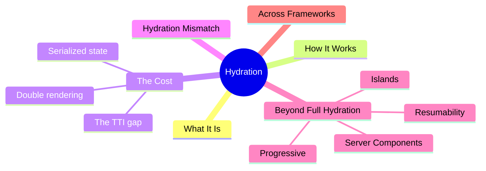
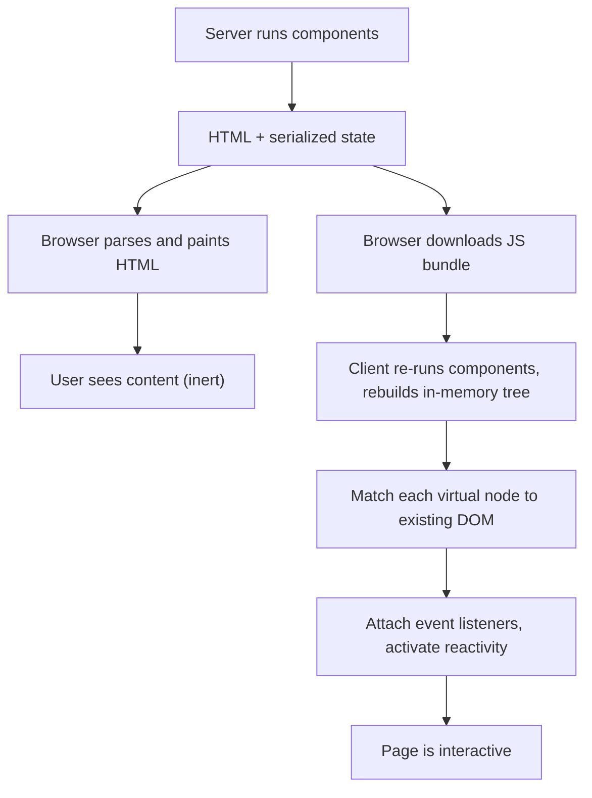
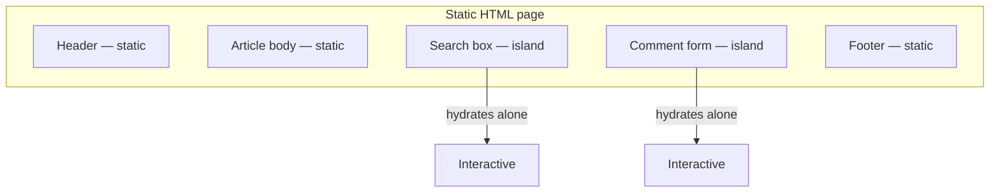
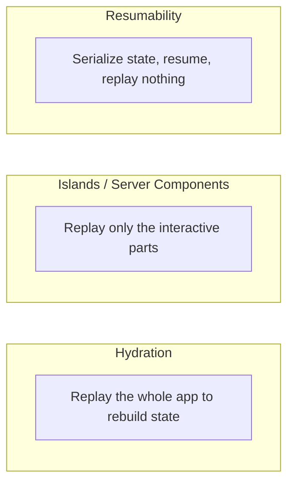

export const metadata = {
  title: 'Hydration: Bringing Server-Rendered HTML to Life',
  date: '2026-06-24',
  excerpt: 'A deep guide to hydration — what it is, how the client reuses server-rendered DOM, why hydration mismatches happen, the cost it carries, and how progressive hydration, islands, resumability, and Server Components move beyond it.',
  tags: ['Front-end', 'Web'],
};

# Hydration: Bringing Server-Rendered HTML to Life

Server-side rendering gives you HTML that arrives fast and reads well to a crawler. But that HTML is inert. The buttons don't click, the forms don't submit, the dropdowns don't open — it's markup, not an application. Something has to bridge the gap between visible and interactive. That something is hydration.

The name comes from a simple picture. The server ships "dry" HTML — the full structure of the page with none of the JavaScript that makes it work. The browser then pours in the "water", the JavaScript, and the page comes alive. More precisely: hydration is the process where client-side JavaScript attaches event listeners and rebuilds a framework's in-memory state on top of the existing server-rendered DOM, reusing that DOM instead of regenerating it from scratch.

It's worth understanding deeply because hydration is the hidden tax of [server-side rendering](/articles/web-csr-ssr-ssg). It's why a page can look finished yet ignore your clicks for a second. It's the source of those "hydration mismatch" warnings. And it's the exact problem that a whole generation of frameworks — islands, resumability, Server Components — was designed to shrink or remove.



- [What Hydration Is](#what-hydration-is)
- [How Hydration Works](#how-hydration-works)
- [The Cost of Hydration](#the-cost-of-hydration)
- [Hydration Mismatch](#hydration-mismatch)
- [Beyond Full Hydration](#beyond-full-hydration)
- [Hydration Across Frameworks](#hydration-across-frameworks)
- [Quick Reference](#quick-reference)

---

## What Hydration Is

Hydration (sometimes called rehydration) is the step that turns static, server-rendered HTML into a working application on the client. It attaches event handlers and reconstructs the framework's internal model of the page — and it does so by reusing the DOM that's already there rather than building a new one.

That last part is the whole point. To see why, compare it with pure [client-side rendering](/articles/web-csr-ssr-ssg). In CSR, the browser receives a near-empty shell and JavaScript builds the entire DOM from nothing. With server rendering plus hydration, the DOM already exists when the JavaScript runs — the server sent it fully formed. The client's job is not to create the DOM but to adopt it.

Hydration sits at the very end of the server-rendering pipeline. The server (at request time for SSR, or at build time for SSG) produced the HTML; hydration is what the client does with it once the JavaScript arrives.

The defining property is that hydration is non-destructive. It deliberately avoids throwing away the server's DOM and rebuilding it, because rebuilding would flash the screen, lose the server's work, and discard the fast paint you paid for. Angular's history makes this concrete: before Angular 16, its server-rendering bootstrap was destructive — it wiped the server DOM and re-rendered everything on the client, causing a visible flicker. Angular 16 introduced non-destructive hydration that reuses the existing DOM — the approach nearly every framework now takes.

---

## How Hydration Works

Hydration is best understood as a handoff between two renders of the same component tree: one on the server, one on the client. They have to agree.



Step by step:

1. Server render. The framework runs the components and produces HTML. Crucially, it also serializes the initial state and props into the page — usually as a JSON blob in a `<script>` tag — so the client can reproduce the exact same render later without re-fetching anything.
2. Paint. The browser parses the HTML and paints it. The user sees content quickly (a fast First Contentful Paint), but the page is inert. In parallel, the browser downloads the JavaScript bundles.
3. Client render. The JavaScript executes. The framework re-runs the same component tree to rebuild its in-memory representation — the virtual DOM, component instances, and reactivity graph — feeding it the serialized state so its output matches what the server produced.
4. Adoption. Instead of creating new elements, the framework walks the existing server DOM in lockstep with the tree it just built, claiming each node as the home for the corresponding component.
5. Wiring. It attaches event listeners and activates reactivity and data bindings.
6. Interactive. The page now responds to input.

The crucial assumption hides in step 4: the client's first render must produce a tree that is structurally identical to the server's HTML. Hydration trusts the markup — by default it does not diff the DOM and patch the differences. That trust is exactly what makes hydration fast, and exactly why a divergence is a problem (the next section).

In code, hydration is a different entry point from a fresh client render. React makes the distinction explicit:

```javascript
import { createRoot, hydrateRoot } from 'react-dom/client';

// Client-only: build the DOM from scratch.
createRoot(document.getElementById('root')).render(<App />);

// Server-rendered: adopt the existing DOM instead of rebuilding it.
hydrateRoot(document.getElementById('root'), <App />);
```

One detail worth knowing: "attach event listeners" is cheaper than it sounds. Frameworks like React don't bind a handler to every node — they attach a small set of listeners at the root container and rely on event delegation, so wiring up interactivity scales with the number of event types, not the number of nodes.

---

## The Cost of Hydration

Hydration buys you SSR's fast paint and good SEO without giving up interactivity. But it isn't free, and the costs are structural rather than incidental.

It does the work twice. Every component renders on the server and again on the client. The server burns CPU to produce the HTML; the client burns CPU to rebuild the tree that explains that HTML. For the user, the second render produces no new pixels — the content is already on screen — so it's pure overhead on the path to interactivity.

It ships the content twice. The page carries the rendered HTML (so the user can see it) and the serialized state (so the client can rebuild without re-fetching). A product page sends its data once as visible markup and again as a JSON blob baked into the document. That duplication inflates the payload for no visible gain.

It opens a gap between looking ready and being ready. This is the real UX problem. First Contentful Paint comes early — the HTML paints before any JavaScript runs. But Time to Interactive lags, because the page can't respond until the bundle downloads, parses, executes, and hydration finishes. In between, the page is a photograph: the user sees a button, clicks it, and nothing happens. The click may be dropped entirely or queued until hydration completes. This window is what bloats Total Blocking Time and hurts Interaction to Next Paint.


Classically, it's all-or-nothing. In traditional hydration the whole page must hydrate before anything is interactive, and that work runs as a single, often long task that blocks the main thread. The bigger the application, the longer the freeze. The cost scales with the size of the app — which is precisely backwards, because a bigger app is exactly where you'd most want interactivity to come quickly. Breaking that scaling relationship is the motivation behind everything in [Beyond Full Hydration](#beyond-full-hydration).

---

## Hydration Mismatch

A hydration mismatch happens when the DOM the server sent doesn't match what the client produces on its first render. Because hydration assumes the two are identical, any divergence breaks the adoption: the framework reaches a node it expected to find and finds something else.

How frameworks respond varies, but none of the responses are free:

- React logs an error and falls back to client-side rendering for the mismatched subtree — it discards the server HTML there and re-renders on the client. Correctness is preserved, but you lose the SSR benefit for that part and may see a flash of changed content. React 19 sharpened the error message to show a diff of what differed.
- Vue emits a hydration mismatch warning in development and lets the client render take over the offending node.
- Angular throws an `NG0500` hydration error in development when the structures don't line up.

The causes are remarkably consistent in practice. Almost all of them come down to the server and client renders being asked to produce different output:

- Non-deterministic values — `Date.now()`, `new Date()`, `Math.random()`, `crypto.randomUUID()`. The server computes one value, the client computes another, and the rendered text differs.
- Browser-only APIs during render — reading `window`, `document`, `localStorage`, or `navigator` while rendering. These don't exist on the server, so guarded code renders one branch there and a different branch in the browser.
- Locale and timezone formatting — the server typically runs in UTC, the visitor's browser in their local zone. The same timestamp or number formats differently on each side.
- Invalid HTML nesting — a `<div>` inside a `<p>`, a `<p>` inside a `<p>`, a block element inside an inline one, a `<table>` without a `<tbody>`. The browser's parser silently "fixes" malformed markup, so the live DOM no longer matches the string the server emitted.
- External DOM mutation — browser extensions (Grammarly, dark-mode injectors) and third-party scripts that modify the DOM before hydration runs.

The fixes follow from the cause. Keep the first client render identical to the server's, then change things after mount:

```javascript
function LastUpdated() {
  // Wrong: the server and client compute different times → mismatch.
  return <span>{new Date().toLocaleTimeString()}</span>;
}

function LastUpdated() {
  // Right: render nothing time-dependent on the first pass,
  // then fill it in after mount, where only the client runs.
  const [time, setTime] = useState(null);
  useEffect(() => setTime(new Date().toLocaleTimeString()), []);
  return <span>{time}</span>;
}
```

The general rules: make rendering deterministic; move browser-only and time-dependent values into a post-mount effect (`useEffect`, Vue's `onMounted`, Angular's `afterNextRender`) so the first render agrees with the server; keep both sides on the same data, locale, and timezone; and emit valid HTML. For the genuinely unavoidable case — a timestamp you must render immediately — React offers `suppressHydrationWarning`, but treat it as a scalpel: it silences the warning for one element only and doesn't actually reconcile the difference.

---

## Beyond Full Hydration

The defining flaw of full hydration is that its cost scales with the size of the app. Most of the last several years of framework work has been about breaking that relationship — shipping less code to hydrate, or not replaying the app at all.

### Progressive and Lazy Hydration

Rather than hydrating everything in one blocking task, spread the work out. Progressive hydration hydrates components over time; lazy hydration defers a component until it's actually needed — when the browser goes idle (`requestIdleCallback`), when the component scrolls into view (`IntersectionObserver`), or on first interaction. A footer or a far-down comments widget doesn't need to be interactive in the first second, so its hydration cost can wait and stop blocking the parts that do.

### Islands Architecture

Islands flip the default. Instead of a fully interactive page that you carve static regions out of, the page is static HTML by default, and interactivity is confined to isolated "islands" that hydrate independently. Everything between the islands ships zero JavaScript.



Astro is the clearest example: components are static unless you opt them in with a `client:*` directive — `client:load` (hydrate immediately), `client:idle` (when the browser is idle), `client:visible` (when scrolled into view), or `client:only` (skip SSR entirely). For content-heavy sites where most of the page is text and images, islands cut the hydration bill to almost nothing.

### Server Components and Streaming

React Server Components push the idea into the component model itself. A Server Component runs only on the server, renders to a serialized format, ships zero JavaScript, and never hydrates. Only Client Components — the ones you mark with `'use client'` — are sent to the browser and hydrated. Pair that with streaming SSR and `Suspense`, and the server can flush HTML in chunks while React hydrates the interactive leaves in prioritized order, even hydrating the part the user just clicked before the rest. The net effect is that the amount of code that has to hydrate shrinks to just the genuinely interactive parts of the tree.

### Resumability

Resumability, pioneered by Qwik, is the most radical answer: skip hydration entirely. The insight is that hydration is fundamentally a replay — the client re-runs the components to reconstruct state the server already computed. Resumability serializes that result instead. The server embeds both the application state and the framework's execution state — which listeners exist, what to run next — directly into the HTML. The client doesn't replay anything; it resumes exactly where the server left off, lazy-loading a handler's code only when that handler actually fires.



Because there's no replay, startup is effectively O(1) — independent of how large the app is. That's the property full hydration could never have. The trade is complexity: serializing execution state and wiring up lazy handlers is intricate, and the ecosystem around it is younger than React's or Vue's.

The throughline across all four: hydration replays the app to rebuild what the server already knew; islands and Server Components shrink how much gets replayed; resumability removes the replay altogether.

---

## Hydration Across Frameworks

The concept is shared, but the APIs and defaults differ.

React. `hydrateRoot(container, <App />)` (React 18, replacing the old `ReactDOM.hydrate`) adopts server HTML. Streaming comes from `renderToPipeableStream`, selective hydration from `<Suspense>` boundaries, and the zero-JS path from Server Components plus `'use client'`. `suppressHydrationWarning` is the per-element escape hatch.

Vue. Calling `createSSRApp(...).mount('#app')` triggers hydration instead of a fresh mount (`createApp` is the client-only counterpart). Vue 3.5 added lazy hydration for async components via `defineAsyncComponent` with strategies like `hydrateOnIdle`, `hydrateOnVisible`, `hydrateOnInteraction`, and `hydrateOnMediaQuery`.

Angular. `provideClientHydration()` (Angular 16+) enables full non-destructive hydration. `withEventReplay()` captures events that fire before hydration finishes and replays them afterward, so early clicks aren't lost. `withIncrementalHydration()` (Angular 19) pairs `@defer` blocks with `hydrate on ...` triggers — such as `viewport`, `interaction`, `idle`, or `never` — to hydrate regions lazily.

Svelte, SolidStart, Astro, Qwik. SvelteKit hydrates by default and compiles components down to small, targeted update code. SolidStart hydrates fine-grained reactive primitives rather than a virtual DOM. Astro is islands-first. Qwik is the resumability framework — it doesn't hydrate at all.

---

## Quick Reference

| Strategy | What ships JS | When it becomes interactive | Cost vs. app size | Examples |
| - | - | - | - | - |
| Full hydration | The whole app | After the entire page hydrates | Grows with the app | Classic React / Vue / Angular SSR |
| Progressive / lazy | The whole app, deferred | On idle, on visible, on interaction | Spread out, still grows | Vue 3.5, lazy-hydration libraries |
| Islands | Only the islands | Per island, independently | Grows with island count | Astro, Fresh |
| Server Components | Only Client Components | Streamed, prioritized | Grows with interactive leaves | React, Next.js App Router |
| Resumability | None upfront; code on demand | Effectively instant | Roughly constant | Qwik |

---

## Conclusion

Hydration is the bridge from static server-rendered HTML to a live application: reuse the existing DOM, attach the listeners, and rebuild the framework's state on top of it.

- It works by running the same component tree twice — once on the server to make the HTML, once on the client to adopt it — and the two renders must agree.
- Its cost is structural: double rendering, double payload, and a gap between First Contentful Paint and Time to Interactive that, in classic hydration, scales with the size of the app.
- Its hazard is the mismatch — non-deterministic values, browser-only APIs, locale differences, and invalid HTML are the usual culprits, and the fix is to make the first client render agree with the server, then change things after mount.
- The way forward is to hydrate less or not replay at all: progressive and lazy hydration spread the work, islands and Server Components shrink it, and resumability removes the replay so startup stops scaling with app size.

Hydration only makes sense once you know where the HTML came from — see [CSR vs. SSR vs. SSG](/articles/web-csr-ssr-ssg). For what the browser does with that HTML before any of this runs, see [the Browser Rendering Pipeline](/articles/web-browser-rendering), and for the full journey from request to interactive page, [From Source to Screen](/articles/web-source-to-screen).
