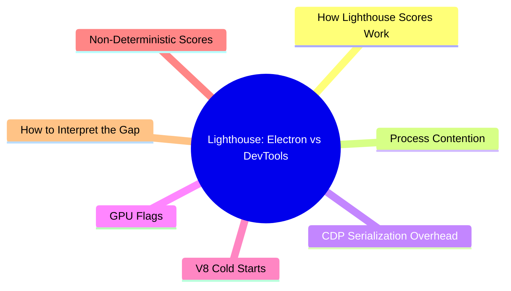

export const metadata = {
  title: 'Lighthouse in Electron vs. Chrome DevTools: Why Scores Differ',
  date: '2026-06-17',
  excerpt: 'Lighthouse scores from Electron-based runners consistently come in 5–20 points below Chrome DevTools for the same page. This article explains why, covering process contention, CDP overhead, GPU flags, V8 cold starts, and how to work with the gap.',
  tags: ['SEO', 'Front-end', 'Web', 'Performance'],
};

# Lighthouse in Electron vs. Chrome DevTools: Why Scores Differ

If you've built a Lighthouse automation tool with Electron and noticed the scores are consistently 5–20 points lower than Chrome DevTools reports for the same page, you're not looking at a bug in your code.

The gap is structural. It comes from how Electron runs Chromium compared to how DevTools runs Lighthouse, and understanding it changes how you read your audit results.

- [How Lighthouse Scores Work](#how-lighthouse-scores-work)
- [Process Contention](#process-contention)
- [CDP Serialization Overhead](#cdp-serialization-overhead)
- [GPU Flags and Hardware Acceleration](#gpu-flags-and-hardware-acceleration)
- [V8 Cold Starts](#v8-cold-starts)
- [Non-Deterministic Scores](#non-deterministic-scores)
- [How to Interpret the Gap](#how-to-interpret-the-gap)

---

## How Lighthouse Scores Work

Lighthouse doesn't linearly average your metrics. Each raw timing value passes through a log-normal cumulative distribution function (CDF):

$$Score = 100 \times \Phi\left( \frac{\ln(\text{median}) - \ln(p)}{\sigma} \right)$$

Where $p$ is the measured value, $\text{median}$ is the reference baseline, and $\sigma$ shapes the curve. Pages faster than the median score above 50; pages slower than the median score below.

The curve is steepest in the 40–60 range. A small change in raw execution time within that band produces a larger score swing than the same change at the extremes.

TBT (30%) and LCP (25%) together account for 55% of the total Performance score. Both are directly sensitive to CPU load and thread scheduling, exactly where Electron environments create pressure.

---

## Process Contention

Running Lighthouse through Chrome DevTools is relatively isolated: Chrome connects to itself over an internal CDP connection, and the Lighthouse runner has a dedicated sandbox that doesn't compete with the page's main thread.

An Electron-based runner is a different environment. A typical setup has all of the following active at the same time:

- Electron's main process (Node.js)
- A renderer process for the tool's own UI (React)
- A local dev server (Vite or equivalent)
- Frequent IPC between processes

All of these compete for the same CPU cores and memory bandwidth as the Chromium instance being audited. The OS doesn't automatically prioritize the audited page the way it would if Chrome were the foreground window.

When the CPU switches rapidly between competing processes, JavaScript Long Tasks in the audited page run longer than they otherwise would, directly inflating TBT and delaying the render pipeline, which slows down LCP.

---

## CDP Serialization Overhead

Puppeteer and Playwright drive Chromium over a WebSocket-based Chrome DevTools Protocol (CDP) connection. Inside native DevTools, CDP commands run as direct in-process calls (effectively zero latency).

Over Puppeteer, every event and trace stream that Lighthouse monitors has to be:

1. Serialized into JSON
2. Transmitted over a local socket
3. Deserialized on the other side

This happens hundreds of times per audit. The accumulated I/O overhead shows up as microsecond-level delays at exactly the critical rendering milestones Lighthouse is measuring.

---

## GPU Flags and Hardware Acceleration

A standard Chrome installation runs with full GPU hardware acceleration. Puppeteer frequently launches Chromium with `--disable-gpu` for stability in headless environments and CI pipelines.

Without GPU acceleration, layer compositing falls back to the CPU. That shows up as slower Speed Index and LCP scores, not because the page itself changed, but because the rendering environment has less hardware support than your regular browser.

---

## V8 Cold Starts

Chrome's V8 engine uses tiered JIT compilation, starting with the Ignition interpreter and advancing to the TurboFan optimizing compiler as code runs repeatedly and warms up. In a normal browser session, core runtime modules, DNS entries, and font caches are already warm in memory.

An Electron runner spins up a completely fresh Chromium instance for every audit. V8 has to compile hot paths from scratch, and image and font decode caches start empty. That cold start adds directly to FCP and LCP times.

---

## Non-Deterministic Scores

Even on identical hardware with identical configuration, running the same audit twice won't always produce the same score. The main sources of variance:

- **OS scheduling**: macOS GCD and Linux CFS dynamically reallocate CPU time slices for background tasks (cloud sync, search indexing). An OS interruption during a JavaScript task inflates TBT by an unpredictable amount.
- **V8 garbage collection**: As memory builds up during bulk testing, V8 periodically triggers a major GC cycle (mark-sweep-compact). If a GC cycle overlaps with an active audit, TBT can swing ±15 points based purely on timing coincidence.
- **Thermal throttling**: Sustained CPU load raises chip temperatures. When the hardware reaches its thermal ceiling, clock speed drops. A page audited at run 1 (CPU at 3.2 GHz) may score lower at run 20 (CPU throttled to 2.4 GHz). The page hasn't changed; the measurement environment has.

These factors affect any automated Lighthouse runner, not just Electron.

---

## How to Interpret the Gap

The solution isn't to abandon automation; use it correctly.

Track relative trends, not absolute scores. An automated runner's real value is in building a consistent baseline. If you measure under the same conditions every time, a drop from 70 to 65 across deployments is a genuine regression signal. The absolute score doesn't need to match DevTools for the trend to be meaningful and actionable.

Use a two-stage workflow. Run automation at scale to scan hundreds of URLs and identify which pages fall below your performance threshold. Then, for those flagged pages, open Chrome DevTools and run a detailed Performance Profile to find the actual cause at the code level.

Automation filters at scale. DevTools diagnoses in depth.
