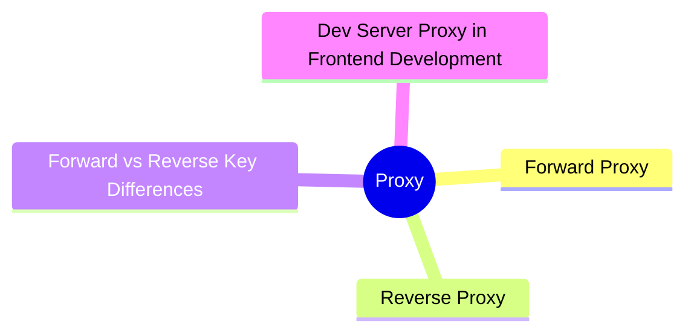
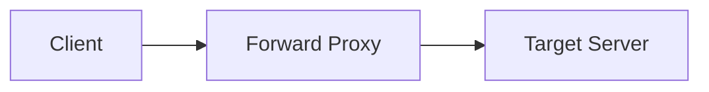
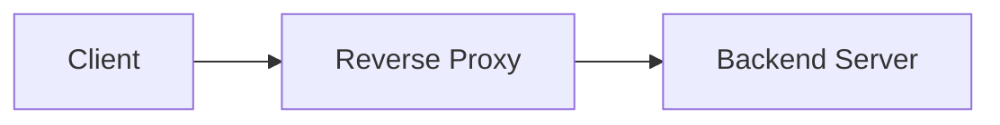
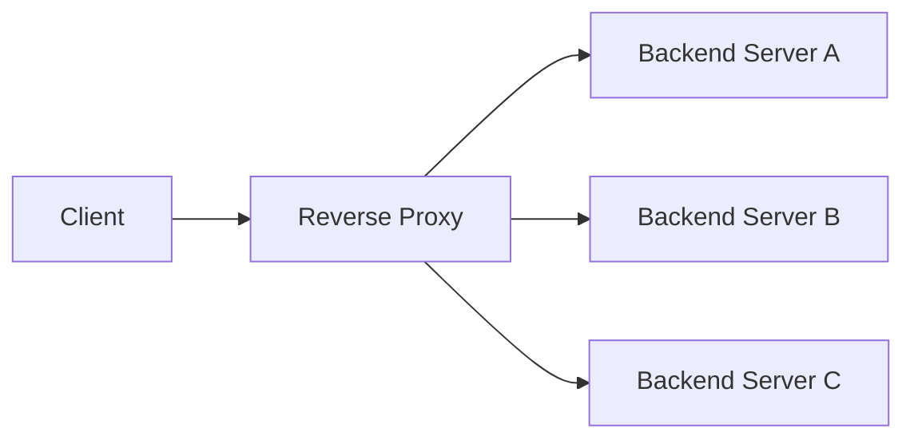
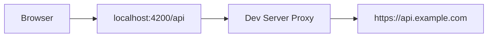

export const metadata = {
  title: 'Proxy: Forward Proxy and Reverse Proxy',
  date: '2026-03-30',
  excerpt: 'A practical guide to proxies — covering how Forward Proxy and Reverse Proxy work, their common uses, and how to configure a Dev Server Proxy in frontend development.',
  tags: ['Front-end', 'Web'],
};

# Proxy: Forward Proxy and Reverse Proxy

A proxy is an intermediary that sits between a client and a server, forwarding requests between them.

There are two types, and the distinction comes down to which side the proxy represents:

- Forward Proxy — acts on behalf of the client
- Reverse Proxy — acts on behalf of the server



- [Forward Proxy](#forward-proxy)
- [Reverse Proxy](#reverse-proxy)
- [Forward vs Reverse: Key Differences](#forward-vs-reverse-key-differences)
- [Dev Server Proxy in Frontend Development](#dev-server-proxy-in-frontend-development)

---

## Forward Proxy

A forward proxy sits on the client side and sends requests to external servers on the client's behalf.



The target server sees the proxy's IP address, not the client's.

### Common Uses

Bypassing geo-restrictions

Some services are blocked in certain regions. A forward proxy located elsewhere lets clients reach those resources. VPNs work on a similar principle.

Hiding the client's identity

The target server can't identify who the real client is, providing a degree of anonymity.

Corporate network access control

Companies can route all outbound traffic through a forward proxy to monitor usage, enforce policies, and block certain websites.

Caching

A forward proxy can cache frequently accessed external resources, reducing repeated outbound requests and improving access speed.

---

## Reverse Proxy

A reverse proxy sits on the server side and accepts incoming requests from clients, forwarding them to internal backend servers.



The client only knows the reverse proxy exists — it has no visibility into what's behind it.

### Common Uses

Load balancing

A reverse proxy distributes incoming requests across multiple backend servers, preventing any single server from being overwhelmed:



SSL termination

The reverse proxy handles HTTPS encryption and decryption. Backend servers communicate over plain HTTP internally, simplifying their configuration.

Hiding backend infrastructure

Clients can't directly access backend servers. This improves security and lets you restructure the backend without changing anything clients see.

Caching and compression

The reverse proxy can cache static assets and compress responses, reducing load on backend servers.

### Nginx as a Reverse Proxy

Nginx is one of the most widely used reverse proxies. A basic configuration:

```nginx
server {
    listen 80;
    server_name example.com;

    location /api/ {
        proxy_pass http://backend:3000/;
        proxy_set_header Host $host;
        proxy_set_header X-Real-IP $remote_addr;
    }

    location / {
        root /var/www/html;
        try_files $uri $uri/ /index.html;
    }
}
```

This routes `/api/` requests to a backend on port 3000, and serves the frontend's static files for everything else.

---

## Forward vs Reverse: Key Differences

| | Forward Proxy | Reverse Proxy |
| - | - | - |
| Represents | The client | The server |
| Who knows it exists | The client | The client doesn't know |
| Hides | The client's identity | The server infrastructure |
| Common uses | Bypassing restrictions, anonymity, access control | Load balancing, SSL termination, security |

---

## Dev Server Proxy in Frontend Development

In frontend development, the dev server proxy is a specialized forward proxy used to work around CORS during local development.

When your frontend on `localhost:4200` needs to call an API at `https://api.example.com`, the browser blocks the request due to cross-origin restrictions. The dev server proxy intercepts the request and forwards it on your behalf — the browser only sees `localhost:4200`, so no CORS error is triggered.



### Vite

```javascript
// vite.config.js
export default {
  server: {
    proxy: {
      '/api': {
        target: 'https://api.example.com',
        changeOrigin: true,
        rewrite: path => path.replace(/^\/api/, ''),
      },
    },
  },
};
```

### Angular CLI

```json
// proxy.conf.json
{
  "/api": {
    "target": "https://api.example.com",
    "changeOrigin": true,
    "pathRewrite": {
      "^/api": ""
    }
  }
}
```

```json
// angular.json
{
  "serve": {
    "options": {
      "proxyConfig": "proxy.conf.json"
    }
  }
}
```

Important: The dev server proxy only works in development. In production, CORS must be handled properly on the server side, or through a reverse proxy.

---

## Conclusion

- Forward Proxy — acts on behalf of the client; used for bypassing restrictions, anonymity, and access control
- Reverse Proxy — acts on behalf of the server; used for load balancing, SSL termination, and hiding backend infrastructure
- Dev Server Proxy — a forward proxy for local development that bypasses CORS; not suitable for production
