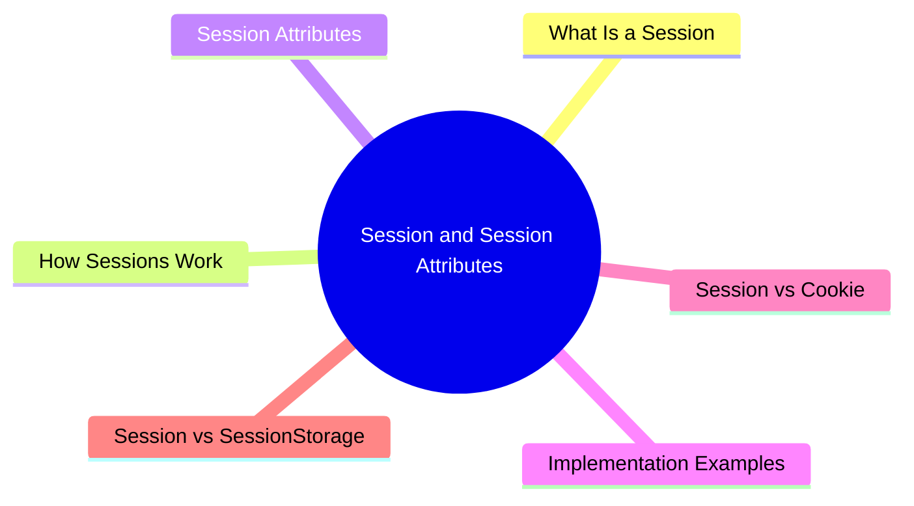

export const metadata = {
  title: 'Session and Session Attributes',
  date: '2026-03-31',
  excerpt: 'A practical guide to sessions and session attributes — covering how sessions work, how to set and read attributes, implementation examples in Java, Node.js, Python, and PHP, and the differences between sessions, cookies, and SessionStorage.',
  tags: ['Front-end', 'Back-end', 'Security'],
};

# Session and Session Attributes

HTTP is stateless — every request is independent, and the server has no memory of previous ones.

Sessions solve this problem by giving the server a way to maintain user state across multiple requests. Session attributes are the individual pieces of data stored within a session.



- [What Is a Session](#what-is-a-session)
- [How Sessions Work](#how-sessions-work)
- [Session Attributes](#session-attributes)
- [Implementation Examples](#implementation-examples)
- [Session vs Cookie](#session-vs-cookie)
- [Session vs SessionStorage](#session-vs-sessionstorage)

---

## What Is a Session

A session is a temporary server-side storage space created for each user, used to persist state across multiple HTTP requests.

Every session has a unique Session ID. The server sends this ID to the client (usually via a cookie), and the client includes it with every subsequent request so the server can identify the user.

Key characteristics of sessions:

- Stored server-side — sensitive data is never exposed to the client
- Has an expiry — sessions automatically invalidate after a period of inactivity
- Isolated per user — each user's session is independent

Common uses: login state, shopping carts, user preferences.

---

## How Sessions Work

```text
1. User visits for the first time — server creates a session
   Session ID: "abc123"
   Session Data: {}

2. Server sends the Session ID via cookie
   Set-Cookie: sessionId=abc123; HttpOnly; Secure

3. Every subsequent request includes the cookie automatically
   Cookie: sessionId=abc123

4. Server looks up the session data using the Session ID

5. On logout or expiry, server deletes the session data
```

---

## Session Attributes

Session attributes are the individual data items stored in a session. Each attribute has a name (key) and a value.

Through session attributes, the server can remember anything relevant about the user for the duration of the session:

| Attribute | Purpose |
| - | - |
| `userId` | The authenticated user's ID |
| `role` | User permissions (admin, user, etc.) |
| `cart` | Shopping cart contents |
| `language` | Language preference |
| `csrfToken` | CSRF protection token |

---

## Implementation Examples

### Java (Servlet)

```java
// Get or create a session
HttpSession session = request.getSession();

// Set a session attribute
session.setAttribute("user", "Charmy");

// Read a session attribute
String user = (String) session.getAttribute("user");

// Remove a session attribute
session.removeAttribute("user");

// Invalidate the session (logout)
session.invalidate();
```

### Node.js (Express)

```javascript
const session = require('express-session');

app.use(session({
  secret: 'mySecret',
  resave: false,
  saveUninitialized: false,
  cookie: { secure: true, httpOnly: true }
}));

// Set a session attribute
req.session.username = 'Charmy';

// Read a session attribute
const username = req.session.username;

// Logout
req.session.destroy();
```

### Python (Flask)

```python
from flask import Flask, session

app = Flask(__name__)
app.secret_key = 'mySecret'

# Set a session attribute
session['username'] = 'Charmy'

# Read a session attribute
username = session.get('username', 'Guest')

# Remove a session attribute
session.pop('username', None)
```

### PHP

```php
session_start();

// Set a session attribute
$_SESSION['username'] = 'Charmy';

// Read a session attribute
$username = $_SESSION['username'];

// Remove a session attribute
unset($_SESSION['username']);

// Logout
session_destroy();
```

---

## Session vs Cookie

| | Session | Cookie |
| - | - | - |
| Stored | Server-side | Client-side (browser) |
| Security | Higher — sensitive data stays on the server | Lower — readable by the client |
| Capacity | Larger (server-limited) | ~4KB |
| Lifetime | Expires or ends on logout | Configurable expiry |
| Best for | Sensitive data (login state, permissions) | Non-sensitive preferences |

The Session ID itself is typically stored in a cookie — but the session data lives on the server. This combination is how they're most commonly used together.

---

## Session vs SessionStorage

SessionStorage is a browser-side storage API. Despite the similar name, it's completely different from server-side sessions.

| | Session | SessionStorage |
| - | - | - |
| Stored | Server-side | Client-side (browser) |
| Scope | All pages within the same session | Single browser tab |
| Lifetime | Until session expires or logout | Until tab is closed |
| Cross-tab sharing | Yes | No |
| Security | Higher — suitable for sensitive data | Not suitable for sensitive data |
| Typical uses | Login state, shopping cart, permissions | Form state, UI state |

---

## Summary

- A session is a server-side mechanism for maintaining user state, identified by a Session ID
- Session attributes are the individual data items stored within a session
- Sessions are stored server-side, making them more secure than cookies or SessionStorage
- Use sessions for sensitive data (login state, permissions); use SessionStorage for temporary frontend UI state
