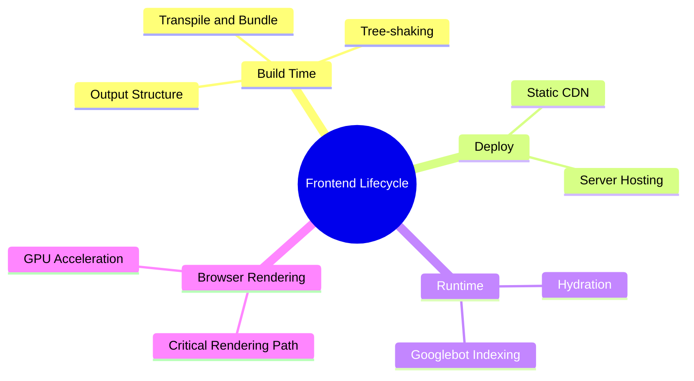
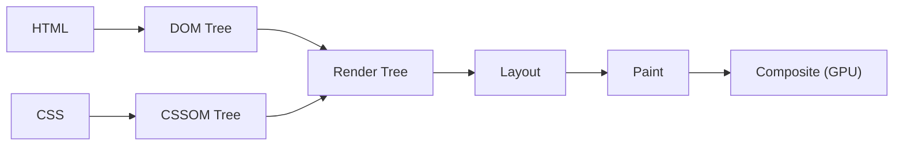

export const metadata = {
  title: 'From Source to Screen: The Frontend Execution Lifecycle',
  date: '2026-06-18',
  excerpt: 'A practical guide to the full frontend execution lifecycle, covering build-time compilation, CDN deployment, runtime rendering strategies, Hydration mechanics, Googlebot two-wave indexing, and the Critical Rendering Path.',
  tags: ['Front-end', 'Web', 'Performance'],
};

# From Source to Screen: The Frontend Execution Lifecycle

Running `npm run build` kicks off a chain of transformations that ends with pixels on a user's screen. The full journey spans four stages: Build Time → Deploy → Runtime → Browser Rendering.

Understanding this pipeline is the foundation for performance work, debugging production issues, and making sense of why different rendering strategies behave the way they do.



- [Build Time](#build-time)
- [Deploy](#deploy)
- [Runtime](#runtime)
- [Browser Rendering](#browser-rendering)
- [Summary](#summary)

---

## Build Time

Build Time runs in a developer's local environment or a CI/CD pipeline (like GitHub Actions). The goal is to take modular source files and transform them into optimized assets that browsers can load efficiently.

### Transpiling and Bundling

Tools like SWC or esbuild convert TypeScript, JSX, and TSX into JavaScript that target browsers can run. A bundler (Vite via Rollup, or Webpack) then analyzes the entire module dependency graph and merges hundreds of source files into a small set of bundles.

### Tree-shaking and Code Splitting

Because ES Modules have a static import/export structure, bundlers can analyze the AST and strip out anything that's imported but never actually used. That's tree-shaking, which can meaningfully cut bundle size without changing any code.

Code splitting uses dynamic `import()` to slice the application into async chunks, so the initial load only downloads what's immediately needed. The rest loads on demand.

### Output Structure

```bash
dist/
├── index.html              # CSR: empty shell; SSG: fully pre-rendered HTML
├── assets/
│   ├── main-9a7b2c.js      # Main bundle with content hash
│   ├── vendor-f4e2d1.js    # Third-party dependencies, split for better caching
│   └── style-b3e8a9.css    # Minified global stylesheet
└── assets/images/
    └── hero.webp           # Image converted and compressed at build time
```

The content hash in each filename (e.g., `main-9a7b2c.js`) ties the cache lifetime directly to the content. As long as the code doesn't change, the filename stays the same and the browser cache remains valid. The moment something changes, the hash changes, the old cache is invalidated, and users automatically get the new file.

---

## Deploy

Once the build is done, the contents of `dist/` get pushed to infrastructure.

Static hosting

For CSR and SSG, everything is a static file. These get deployed to platforms like Vercel, Netlify, Cloudflare Pages, or AWS S3 + CloudFront, which replicate files across global CDN edge nodes. User requests resolve at the nearest edge location, so latency is minimal.

Server hosting

SSR requires a Node.js process running continuously to receive requests and render HTML on the fly. This can run on a traditional host or on edge compute platforms (Vercel Edge Functions, Cloudflare Workers), which push the server logic closer to the user and reduce TTFB.

---

## Runtime

Runtime starts the moment a user makes an HTTP request. How the server responds depends on the rendering strategy:

- **CSR**: returns an empty HTML shell + JS bundle; the browser renders the page after executing the JavaScript
- **SSG**: serves pre-rendered static HTML straight from the CDN, with no server computation at request time
- **SSR**: the server receives the request, fetches data, runs `renderToString`, and sends back fully populated HTML

For a detailed breakdown of trade-offs and when to use each, see [CSR vs. SSR vs. SSG](/articles/web-csr-ssr-ssg).

### Hydration

With SSG and SSR, the browser receives fully structured HTML, so users see content immediately. But the page isn't interactive yet. JavaScript hasn't run, so there are no event listeners attached to anything.

Hydration is the process that brings a static HTML page to life. Instead of discarding the server-rendered DOM and rebuilding it, the framework walks through the existing nodes, reconciles them against its virtual DOM, and attaches event handlers in place:

```tsx
// React 18+
import { hydrateRoot } from 'react-dom/client';
import App from './App';

const container = document.getElementById('root');

// Takes over the server-rendered DOM and attaches event listeners
hydrateRoot(container, <App />);
```

The key difference between `hydrateRoot` and `createRoot`: `createRoot` assumes the DOM is empty and builds from scratch. `hydrateRoot` assumes the DOM already exists and just takes ownership.

If the server-rendered HTML doesn't match what the client expects, React throws a hydration mismatch warning and attempts to recover. In serious cases it falls back to a full client-side re-render of the affected subtree, which undermines the performance benefit of having SSR in the first place.

### Googlebot and JavaScript

A common misconception is that Googlebot can't run JavaScript. Google's Web Rendering Service (WRS) is Chromium-based and can execute JS, but indexing happens in two waves:

1. Wave 1 (immediate): the crawler fetches the HTML and parses text content right away. For SSR and SSG pages, the content is already there, so Googlebot can index and rank the page immediately.
2. Wave 2 (deferred): for pure CSR, Wave 1 only sees an empty shell. The URL gets queued for JavaScript rendering when cloud compute capacity is available, which can take days or weeks.

For any page where SEO matters, SSR or SSG ensures the crawler gets full content in Wave 1.

---

## Browser Rendering

Once the HTML, CSS, and JS arrive on the client, the browser's rendering engine (Blink in Chromium) runs the Critical Rendering Path (CRP) to turn bytes into pixels:



Six steps:

1. DOM construction: the parser converts HTML into the DOM tree. A `<script>` without `async` or `defer` pauses parsing until the script downloads and executes.
2. CSSOM construction: CSS is parsed into the CSSOM tree. The browser won't render anything until this is complete (CSS is render-blocking).
3. Render tree: DOM and CSSOM merge. Only visible nodes make the cut: `display: none` removes the element and its entire subtree; `visibility: hidden` keeps the node but makes it invisible.
4. Layout: the browser traverses the render tree and computes the exact position and size of every element. Relative units (`rem`, `%`) get resolved to absolute pixels.
5. Paint: layout coordinates get filled in with visual content: text, colors, borders, shadows.
6. Composite: the painted layers are handed to the GPU, which stacks them in the correct z-index order and outputs the final frame.

How fast this pipeline runs directly affects Core Web Vitals: FCP (First Contentful Paint) measures when the user first sees meaningful content; LCP (Largest Contentful Paint) measures when the largest visible element finishes rendering. Chrome DevTools' Performance panel lets you record the full timeline and identify where the bottleneck is.

### Performance: Avoid Layout and Paint

Changing properties like `top` or `left` forces the browser through the full Layout → Paint → Composite cycle on every frame. That's expensive.

`transform` and `opacity` are different; they only affect the Composite step, which runs entirely on the GPU, bypassing Layout and Paint:

```css
/* triggers Layout → Paint → Composite on every frame */
.box {
  position: absolute;
  top: 10px;
  transition: top 0.3s ease;
}
.box:hover {
  top: 100px;
}

/* only triggers Composite — GPU handles it directly */
.box {
  position: absolute;
  transform: translateY(10px);
  will-change: transform; /* promotes this element to its own compositor layer */
  transition: transform 0.3s ease;
}
.box:hover {
  transform: translateY(100px);
}
```

For a deeper look at Reflow, Repaint, and more optimization techniques, see [Browser Rendering Pipeline](/articles/web-browser-rendering).

---

## Summary

| Stage | What happens | Performance lever |
| - | - | - |
| Build Time | Transpile, bundle, tree-shake, generate assets | Bundle size, content hash caching |
| Deploy | Push assets to CDN or server | CDN edge distribution, cache headers |
| Runtime | Server responds, browser hydrates | Rendering strategy, avoid hydration mismatches |
| Browser Rendering | CRP: DOM/CSSOM → Layout → Paint → Composite | Avoid reflow, prefer GPU-composited properties |

Every stage has its own bottlenecks. Knowing the full pipeline makes it much easier to pinpoint where a performance problem is actually coming from.
