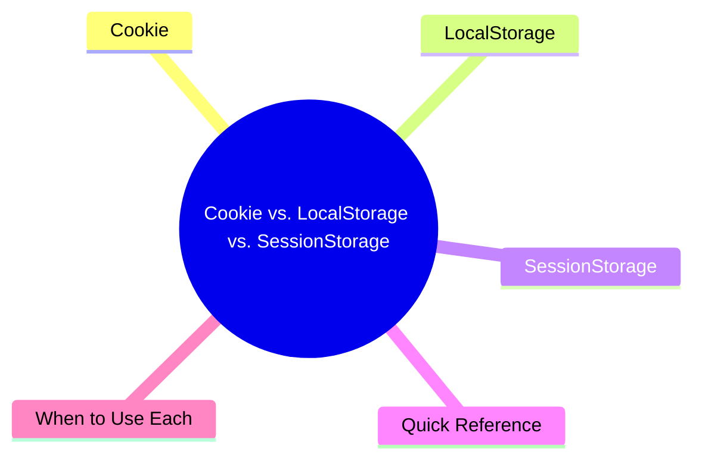

export const metadata = {
  title: 'Cookie vs. LocalStorage vs. SessionStorage',
  date: '2026-03-25',
  excerpt: 'A practical guide to browser storage — comparing Cookie, LocalStorage, and SessionStorage across capacity, lifetime, security options, and when to use each.',
  tags: ['Front-end', 'Web'],
};

# Cookie vs. LocalStorage vs. SessionStorage

Browsers offer three ways to store data on the client side: Cookie, LocalStorage, and SessionStorage.

They all live in the browser, but they differ significantly in lifetime, capacity, how they're accessed, and their security properties.



- [Cookie](#cookie)
- [LocalStorage](#localstorage)
- [SessionStorage](#sessionstorage)
- [Quick Reference](#quick-reference)
- [When to Use Each](#when-to-use-each)

---

## Cookie

Cookies are the oldest client-side storage mechanism. Their primary purpose is passing state between the browser and the server.

### Characteristics

- Small capacity — around 4KB
- Automatically sent with every HTTP request — the browser attaches matching cookies to every request for that domain
- Configurable expiry — without an expiry date, the cookie is deleted when the browser closes
- HttpOnly flag — prevents JavaScript from accessing the cookie, protecting against XSS
- Secure flag — only sent over HTTPS
- SameSite flag — controls whether cookies are sent with cross-site requests, protecting against CSRF

### Basic Usage

```javascript
// set a cookie
document.cookie = 'username=Charmy';

// set with expiry
document.cookie = 'username=Charmy; expires=Fri, 31 Dec 2025 23:59:59 GMT';

// set with path
document.cookie = 'username=Charmy; path=/';

// read all cookies (returns a single string — needs manual parsing)
console.log(document.cookie); // "username=Charmy; theme=dark"

// delete a cookie (set expiry in the past)
document.cookie = 'username=; expires=Thu, 01 Jan 1970 00:00:00 GMT';
```

The cookie API is awkward to work with directly. In practice, most teams use a library like `js-cookie`.

### Common Uses

- Authentication tokens (session IDs)
- User behavior tracking (analytics)
- Persisting user preferences (language, theme)

---

## LocalStorage

LocalStorage was introduced with HTML5. Data stored here persists indefinitely until explicitly cleared.

### Characteristics

- Larger capacity — around 5MB
- Persistent — survives browser restarts and tab closes
- Never sent to the server — client-side only
- Same-origin policy — only accessible from the same domain
- Strings only — objects need to be serialized with `JSON.stringify`

### Basic Usage

```javascript
// store data
localStorage.setItem('theme', 'dark');

// store an object
localStorage.setItem('user', JSON.stringify({ name: 'Charmy', age: 25 }));

// read data
const theme = localStorage.getItem('theme');
console.log(theme); // "dark"

// read an object
const user = JSON.parse(localStorage.getItem('user'));
console.log(user.name); // "Charmy"

// remove a specific item
localStorage.removeItem('theme');

// clear everything
localStorage.clear();
```

### Common Uses

- User preferences (theme, language)
- Shopping cart data (non-sensitive)
- Caching application state

---

## SessionStorage

SessionStorage has the same API as LocalStorage, but data only lasts for the current tab session. Close the tab and it's gone.

### Characteristics

- Larger capacity — around 5MB
- Tab-scoped — closed when the tab closes; not shared between tabs, even on the same domain
- Never sent to the server
- Same-origin and same-tab restriction

### Basic Usage

```javascript
// identical API to LocalStorage
sessionStorage.setItem('formData', JSON.stringify({ step: 2 }));

const formData = JSON.parse(sessionStorage.getItem('formData'));

sessionStorage.removeItem('formData');

sessionStorage.clear();
```

### Common Uses

- Multi-step form state
- Temporary state for a single browsing session
- Data that shouldn't persist after the tab closes

---

## Quick Reference

| | Cookie | LocalStorage | SessionStorage |
| - | - | - | - |
| Capacity | ~4KB | ~5MB | ~5MB |
| Lifetime | Configurable expiry | Permanent (until cleared) | Until tab closes |
| Sent to server | Yes (automatically) | No | No |
| JavaScript access | Yes (unless HttpOnly) | Yes | Yes |
| Shared across tabs | Yes | Yes | No |
| Security options | HttpOnly, Secure, SameSite | None | None |

---

## When to Use Each

### Use Cookie when:

- The server needs to read the data (authentication tokens)
- You need to set an expiry time
- You need `HttpOnly` to protect sensitive data from XSS

### Use LocalStorage when:

- You need non-sensitive data to persist long-term on the client
- Storing user preferences (theme, language)
- Caching app state that doesn't need to reach the server

### Use SessionStorage when:

- Data should only last for the current tab session
- Storing state for a multi-step flow
- You don't want data lingering after the tab closes

### What Not to Do

- Never store sensitive data (passwords, credit card numbers) in any client-side storage
- Don't store JWT tokens in LocalStorage — they're vulnerable to XSS attacks; use an `HttpOnly` cookie instead
- LocalStorage and SessionStorage have no encryption — any JavaScript running on the page can read them

---

## Conclusion

Each storage mechanism has its place:

- Cookie — when the server needs the data, or when you need security flags like `HttpOnly`
- LocalStorage — for long-term client-side persistence of non-sensitive data
- SessionStorage — for temporary data scoped to the current tab

The most important question when choosing: how sensitive is this data, and how long does it need to live?
