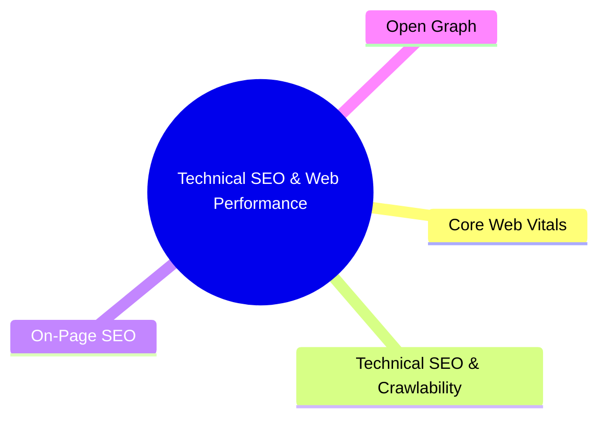

export const metadata = {
  title: 'Technical SEO and Web Performance Reference',
  date: '2026-06-17',
  excerpt: 'A practical reference covering Core Web Vitals, crawlability, on-page SEO, and Open Graph — definitions, targets, and implementation standards for building performant, search-optimized web applications.',
  tags: ['SEO', 'Front-end', 'Web', 'Performance'],
};

# Technical SEO and Web Performance Reference

Building a website that performs well and ranks well in search means working across two overlapping domains: web performance metrics and technical SEO configuration.

This reference covers the terms you'll encounter in Lighthouse audits and SEO tooling — definitions, targets, and implementation notes.

- [Core Web Vitals](#core-web-vitals)
- [Technical SEO and Crawlability](#technical-seo-and-crawlability)
- [On-Page SEO](#on-page-seo)
- [Open Graph](#open-graph)

---

## Core Web Vitals

These metrics measure loading performance, visual stability, and interactivity. Google uses them as direct ranking signals.

| Metric | Full Name | What It Measures | Target |
| :--- | :--- | :--- | :--- |
| LCP | Largest Contentful Paint | Time for the largest visible content element (text block or image) to fully render in the viewport | ≤ 2.5s |
| CLS | Cumulative Layout Shift | Total unexpected layout shift across the entire page load lifecycle | ≤ 0.1 |
| TBT | Total Blocking Time | Total time the main thread is blocked by Long Tasks (>50ms) between FCP and TTI; used as a lab proxy for INP | ≤ 200ms |
| FCP | First Contentful Paint | Time until the browser renders any DOM content — text, image, or canvas | ≤ 1.8s |
| SI | Speed Index | How quickly visual content fills the viewport during load, calculated from frame-by-frame visual progression | ≤ 3.4s |

All five metrics follow the same optimization direction: lower is better.

---

## Technical SEO and Crawlability

These settings determine whether search engines can find, access, and correctly understand your pages.

- HTTPS — All routes must be served over HTTPS. Google treats HTTPS as an explicit ranking factor.
- robots.txt — A file at the root path that tells crawlers which pages they can and can't access. Must be syntactically valid and must not accidentally block critical CSS or JS assets.
- Sitemap — An XML file listing your canonical URLs. Should be submitted to search consoles and must not include URLs returning 4xx/5xx errors or tagged with `noindex`.
- Canonical tag — `<link rel="canonical" href="..." />` points crawlers to the authoritative version of a page when duplicate or near-duplicate URLs exist. Prevents PageRank from being split across duplicates.
- Robots meta tag — `<meta name="robots">` controls crawl and index behavior per page. Public pages should use `index, follow`; admin or private pages should use `noindex, nofollow`.
- Viewport meta — Required for mobile-first indexing. Standard: `<meta name="viewport" content="width=device-width, initial-scale=1">`.
- Lang attribute — `<html lang="...">` declares the primary language of the page. Must match the actual content language for correct geo-targeting and translation engine behavior.
- hreflang — For multi-language or multi-region sites, maps each locale variant to the correct URL. Requires bidirectional linking — every paired page must reference the other.
- Schema markup — JSON-LD structured data helps search engines understand what a page is about (Article, Product, FAQ, etc.). Valid markup can trigger rich snippets in search results.

---

## On-Page SEO

Content and structural signals that influence how search engines rank and display your page.

- Title tag — The strongest on-page ranking signal. Should include the target keyword and be written to earn clicks.
    - English/Western characters: 50–60 characters
    - CJK characters: 25–30 characters
    - Exceeding these limits causes "..." truncation in search results.
- Meta description — The summary shown below the title in search results. Not a direct ranking factor, but has a strong impact on click-through rate.
    - English/Western characters: 150–160 characters
    - CJK characters: 75–80 characters
- H1 — The top-level heading. One per page, closely aligned with the title tag and the target keyword.
- H2s — Section-level headings. Use as many as the content needs to create clear structure and improve readability.
- Image alt text — Every meaningful image needs a descriptive `alt` attribute. It's how crawlers read images, and it's a hard accessibility requirement. Missing alt text on meaningful images should be treated as a bug — the target count is zero.
- Internal links — Links to other pages on the same domain. They pass PageRank, help users navigate, and help crawlers discover content. Keep density natural; over-packing links is treated as spam.
- Word count — Content pages should aim for at least 500 words of substantive text. Broader coverage generally helps with long-tail keyword ranking, but quality matters more than raw length.

---

## Open Graph

Open Graph tags control how a page looks when shared on social platforms — Slack, iMessage, LINE, Facebook, and others.

- og:title — The bold headline on the preview card. Can match the page title or be adjusted for the social sharing context.
- og:description — The summary text below the title. Keep it between 65–200 characters for full visibility across platforms.
- og:image — The preview image. Target size: 1200 × 630 pixels (1.91:1 aspect ratio). Keep essential content away from the edges to avoid cropping.
