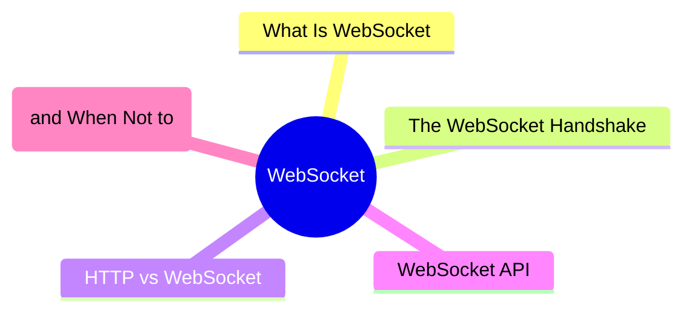
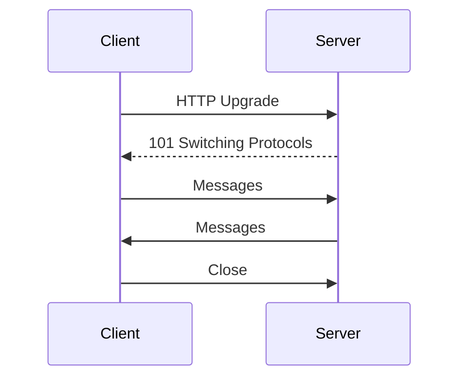

export const metadata = {
  title: 'WebSocket: Full-Duplex Real-Time Communication',
  date: '2026-03-31',
  excerpt: 'A practical guide to WebSocket — covering the handshake process, how it differs from HTTP, the browser WebSocket API, and when WebSocket is the right tool versus when HTTP or SSE is a better fit.',
  tags: ['Front-end', 'Web'],
};

# WebSocket: Full-Duplex Real-Time Communication

With traditional HTTP, every interaction follows the same pattern: the client sends a request, the server responds, and the connection closes.

WebSocket is different. It establishes a persistent connection between the client and server, letting either side send messages at any time — no new request needed.



- [What Is WebSocket](#what-is-websocket)
- [The WebSocket Handshake](#the-websocket-handshake)
- [HTTP vs WebSocket](#http-vs-websocket)
- [WebSocket API](#websocket-api)
- [When to Use (and When Not to)](#when-to-use-and-when-not-to)

---

## What Is WebSocket

WebSocket is an application-layer protocol built on top of TCP. It provides a full-duplex communication channel — both sides can send and receive messages simultaneously, like a phone call rather than a letter exchange.

WebSocket URLs use `ws://` or `wss://` (the encrypted version):

```
ws://example.com/chat
wss://example.com/chat
```

---

## The WebSocket Handshake

A WebSocket connection starts with an HTTP request — this is the WebSocket Handshake.

### 1. Client Sends an Upgrade Request

```
GET /chat HTTP/1.1
Host: example.com
Upgrade: websocket
Connection: Upgrade
Sec-WebSocket-Key: dGhlIHNhbXBsZSBub25jZQ==
Sec-WebSocket-Version: 13
```

### 2. Server Confirms the Upgrade

```
HTTP/1.1 101 Switching Protocols
Upgrade: websocket
Connection: Upgrade
Sec-WebSocket-Accept: s3pPLMBiTxaQ9kYGzzhZRbK+xOo=
```

### 3. Persistent Connection Established

Once the handshake completes, the HTTP connection upgrades to a WebSocket connection. Both sides can now freely exchange messages until either party closes the connection.



---

## HTTP vs WebSocket

| | HTTP | WebSocket |
| - | - | - |
| Connection | New connection per request | Persistent |
| Direction | One-way (client initiates) | Full-duplex (either side) |
| Latency | Overhead on every request | Low |
| Server push | Requires polling or SSE | Native |
| Best for | Standard API requests | Real-time communication |

---

## WebSocket API

The browser has a built-in WebSocket API — no library required.

### Opening a Connection

```javascript
const ws = new WebSocket('wss://example.com/chat');
```

### Listening to Events

```javascript
ws.addEventListener('open', () => {
  console.log('connected');
});

ws.addEventListener('message', event => {
  console.log('received:', event.data);
});

ws.addEventListener('close', event => {
  console.log('connection closed', event.code, event.reason);
});

ws.addEventListener('error', error => {
  console.error('WebSocket error', error);
});
```

### Sending Messages

```javascript
// send a string
ws.send('Hello');

// send JSON
ws.send(JSON.stringify({ type: 'message', content: 'Hello' }));
```

### Closing the Connection

```javascript
ws.close();

// with a status code and reason
ws.close(1000, 'Normal closure');
```

### Connection State

```javascript
ws.readyState
// 0 - CONNECTING
// 1 - OPEN
// 2 - CLOSING
// 3 - CLOSED
```

### Full Example: Chat Room

```javascript
const ws = new WebSocket('wss://example.com/chat');

ws.addEventListener('open', () => {
  console.log('joined the chat');
});

ws.addEventListener('message', event => {
  const message = JSON.parse(event.data);
  displayMessage(message);
});

function sendMessage(content) {
  if (ws.readyState === WebSocket.OPEN) {
    ws.send(JSON.stringify({
      type: 'chat',
      content,
      timestamp: Date.now(),
    }));
  }
}

ws.addEventListener('close', () => {
  console.log('left the chat');
});
```

---

## When to Use (and When Not to)

### Use WebSocket when you need low-latency, bidirectional real-time communication:

- Chat applications — messages need to reach all participants immediately
- Collaborative tools — simultaneous document editing, live cursor sync (Figma, Google Docs)
- Multiplayer games — player positions and game state need continuous synchronization
- Live feeds — stock prices, sports scores, system alerts
- IoT data streams — continuous sensor data pushed from devices

### Don't use WebSocket for:

Standard API requests

If you're just fetching data or submitting a form, HTTP is the right tool. A persistent WebSocket connection adds unnecessary overhead.

One-way server push

If the server only needs to push updates to the client (no messages going the other direction), Server-Sent Events (SSE) is a simpler choice. It runs over HTTP, requires no special server setup, and handles the use case cleanly.

---

## Conclusion

WebSocket establishes a persistent, full-duplex connection — both client and server can send messages at any time:

- Starts with an HTTP handshake that upgrades to a WebSocket connection
- Low latency, well-suited for real-time bidirectional communication
- Overkill for standard API requests — HTTP is simpler and sufficient
- For server-only push, consider SSE as a lighter alternative
