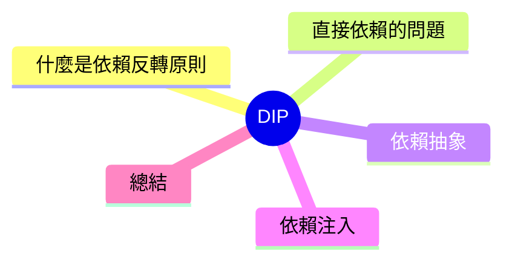

export const metadata = {
  title: 'SOLID 原則：依賴反轉原則 (DIP)',
  date: '2026-06-02',
  excerpt: '介紹 SOLID 五大原則中的依賴反轉原則，說明高層模組為何不應該直接依賴低層實作，以及如何透過抽象介面和依賴注入解耦。',
  tags: ['軟體設計', '最佳實踐', 'OOP'],
};

# SOLID 原則：依賴反轉原則 (DIP)

依賴反轉原則 (Dependency Inversion Principle，DIP) 是 SOLID 的第五條：

> 1. 高層模組不應該依賴低層模組，兩者都應該依賴抽象之物。
> 2. 抽象不應該依賴細節，細節應該依賴抽象。

「反轉」不是把依賴方向硬倒過來，而是「由抽象決定依賴方向」：高層模組定義它需要的能力，低層實作去符合這些能力。


```mermaid
mindmap
    root((DIP))
        什麼是依賴反轉原則
        直接依賴的問題
        依賴抽象
        依賴注入
        總結
```

- [什麼是依賴反轉原則](#什麼是依賴反轉原則)
- [直接依賴的問題](#直接依賴的問題)
- [依賴抽象](#依賴抽象)
- [依賴注入](#依賴注入)
- [總結](#總結)

---

## 什麼是依賴反轉原則

想像一個訂單服務需要資料庫存取、電子郵件通知與日誌記錄。如果直接在服務類別內建立這些依賴，就是典型的高層依賴低層。

高層模組：訂單服務 (負責業務邏輯)
低層模組：資料庫、電子郵件、日誌 (負責實作細節)

DIP 強調：兩層都應該依賴抽象，而不是彼此直接依賴。

---

## 直接依賴的問題

```typescript
class MySQLOrderRepository {
  save(order: Order): void {
    // 直接操作 MySQL
    mysql.query(`INSERT INTO orders ...`);
  }
}

class SMTPNotifier {
  send(to: string, message: string): void {
    // 直接使用 SMTP
    smtp.sendMail({ to, text: message });
  }
}

// 高層模組直接依賴低層的實作
class OrderService {
  private repo = new MySQLOrderRepository(); // 直接 new
  private notifier = new SMTPNotifier();      // 直接 new

  placeOrder(userId: string, items: Item[]): void {
    const order = buildOrder(userId, items);
    this.repo.save(order);
    this.notifier.send(userId, '訂單建立成功');
  }
}
```

問題：

- `OrderService` 和 `MySQLOrderRepository` 緊耦合，換 PostgreSQL 就要改 `OrderService`
- 測試 `OrderService` 需要真實的 MySQL 連線和 SMTP 伺服器
- 模組之間的依賴方向：`OrderService` → 具體實作，高層依賴低層

---

## 依賴抽象

將依賴的目標改為抽象：

```typescript
// 高層模組定義它需要的抽象介面
interface OrderRepository {
  save(order: Order): void;
}

interface Notifier {
  send(to: string, message: string): void;
}

// 低層模組實作抽象介面
class MySQLOrderRepository implements OrderRepository {
  save(order: Order): void {
    mysql.query(`INSERT INTO orders ...`);
  }
}

class SMTPNotifier implements Notifier {
  send(to: string, message: string): void {
    smtp.sendMail({ to, text: message });
  }
}

// 高層模組依賴抽象，不依賴實作
class OrderService {
  constructor(
    private repo: OrderRepository,  // 介面，不是具體類別
    private notifier: Notifier,      // 介面，不是具體類別
  ) {}

  placeOrder(userId: string, items: Item[]): void {
    const order = buildOrder(userId, items);
    this.repo.save(order);
    this.notifier.send(userId, '訂單建立成功');
  }
}
```

現在的依賴關係是：`OrderService` 和 `MySQLOrderRepository` 都依賴 `OrderRepository` 抽象，而不是彼此直接依賴。

---

## 依賴注入

依賴反轉原則常透過依賴注入 (Dependency Injection，DI) 實現。不在模組內部建立依賴，而是從外部傳入：

```typescript
// 建立實作類別
const repo = new MySQLOrderRepository();
const notifier = new SMTPNotifier();

// 將依賴注入 OrderService
const orderService = new OrderService(repo, notifier);
```

測試時，只需注入 mock 實作：

```typescript
// mock 實作
const mockRepo: OrderRepository = {
  save: jest.fn(),
};

const mockNotifier: Notifier = {
  send: jest.fn(),
};

// 不需要真實資料庫或 SMTP，完全可控
const orderService = new OrderService(mockRepo, mockNotifier);
```

測試獨立、決定性強。有需要時替換實作也很自然。

---

## 總結

DIP 的核心：

- 高層模組定義抽象，低層實作去符合抽象
- 抽象成為了高層模組和低層實作之間的「防火牆」
- 打破高層與低層之間的固定相依關係，讓兩者都能獨立演進與測試

DIP 是依賴注入容器 (IoC Container)、服務定位 (Service Locator) 等更進階模式的基礎。SOLID 五條原則至此完整，彼此獨立卻又相互強化。
