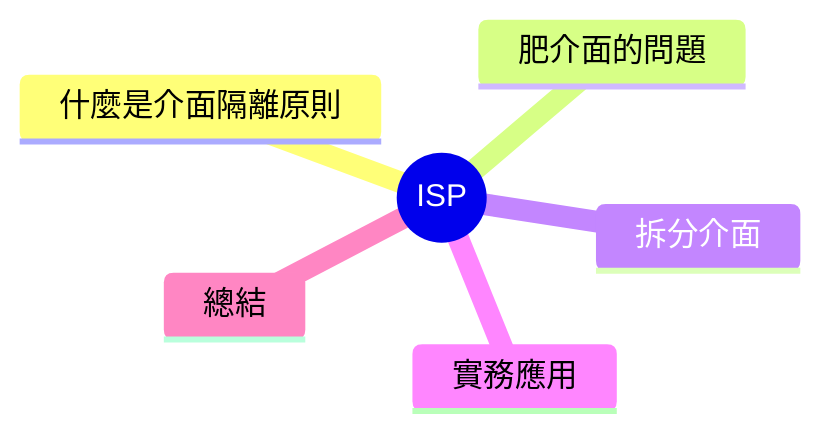

export const metadata = {
  title: 'SOLID 原則：介面隔離原則 (ISP)',
  date: '2026-04-14',
  excerpt: '介紹 SOLID 五大原則中的介面隔離原則，透過印表機的經典範例說明肥介面的問題，以及如何將介面拆分得更精粐。',
  tags: ['軟體設計', '最佳實踐', 'OOP'],
};

# SOLID 原則：介面隔離原則 (ISP)

介面隔離原則 (Interface Segregation Principle，ISP) 是 SOLID 的第四條：

> 客戶端不應該被迫依賴它們不使用的介面。

簡單說：**介面要超精粙，不要把不相關的方法和在同一個介面裡。**



- [什麼是介面隔離原則](#什麼是介面隔離原則)
- [肥介面的問題](#肥介面的問題)
- [拆分介面](#拆分介面)
- [實務應用](#實務應用)
- [總結](#總結)

---

## 什麼是介面隔離原則

一個肥介面 (fat interface) 是指一個宣告了大量方法的介面，導致實作者被迫實作它們其實不需要的方法。

常見的症狀：

```typescript
interface Printer {
  print(document: string): void;
  scan(): string;
  fax(document: string, to: string): void;
  copy(document: string): void;
}
```

這個介面表示一台全功能勞共機，但大多數設備其實只支援其中一部分。

---

## 肥介面的問題

```typescript
// 這台簡單印表機只會印印、複印
class SimplePrinter implements Printer {
  print(document: string): void {
    console.log(`Printing: ${document}`);
  }

  copy(document: string): void {
    console.log(`Copying: ${document}`);
  }

  // 這台機器根本沒有擃描功能，卻被迫實作
  scan(): string {
    throw new Error('此設備不支援擃描');
  }

  // 這台機器根本沒有傳真功能，卻被迫實作
  fax(document: string, to: string): void {
    throw new Error('此設備不支援傳真');
  }
}
```

`SimplePrinter` 被迫實作兩個它完全不支援的方法。這就是介面隔離原則的違反——`SimplePrinter` 被迫依賴它不需要的东西。

這還會導致 LSP 違反：第三方程式碼呼叫 `printer.scan()` 會突然得到一個例外。

---

## 拆分介面

將行為拆成獨立的小介面：

```typescript
interface Printable {
  print(document: string): void;
}

interface Scannable {
  scan(): string;
}

interface Faxable {
  fax(document: string, to: string): void;
}

interface Copyable {
  copy(document: string): void;
}

// 簡單印表機：只實作它支援的功能
class SimplePrinter implements Printable, Copyable {
  print(document: string): void {
    console.log(`Printing: ${document}`);
  }

  copy(document: string): void {
    console.log(`Copying: ${document}`);
  }
}

// 全功能勞共機：實作全部介面
class AllInOnePrinter implements Printable, Scannable, Faxable, Copyable {
  print(document: string): void { /* ... */ }
  scan(): string { return '...scanned content'; }
  fax(document: string, to: string): void { /* ... */ }
  copy(document: string): void { /* ... */ }
}
```

現在 `SimplePrinter` 只需實作它真正支援的东西。任何需要擃描功能的程式碼，只接受 `Scannable`，不需要知道機器還會不會印印或傳真。

---

## 實務應用

ISP 在前端開發中常見於 TypeScript 的型別設計：

```typescript
// 職責分離清楚的小介面
interface Readable {
  read(id: string): Promise<User>;
}

interface Writable {
  create(data: UserInput): Promise<User>;
  update(id: string, data: Partial<UserInput>): Promise<User>;
}

interface Deletable {
  delete(id: string): Promise<void>;
}

// 此服務只需讀取權限
class ReadOnlyUserService implements Readable {
  async read(id: string): Promise<User> {
    return db.findUser(id);
  }
}

// 此服務需要完整權限
class FullUserService implements Readable, Writable, Deletable {
  async read(id: string): Promise<User> { /* ... */ }
  async create(data: UserInput): Promise<User> { /* ... */ }
  async update(id: string, data: Partial<UserInput>): Promise<User> { /* ... */ }
  async delete(id: string): Promise<void> { /* ... */ }
}
```

---

## 總結

ISP 的實迴就是：**介面要小、要精、要專一。**

導守 ISP 有幾個好處：

- 實作者只需實作它真正需要的方法
- 不會有拋出異常的空實作（避免 LSP 違反）
- 不同角色的程式碼只依賴它需要的功能，跟其他功能完全隔離

ISP 跟 LSP 密切相關——介面設計得夠精粙，子類別就不會被迫實作不該有的方法。
