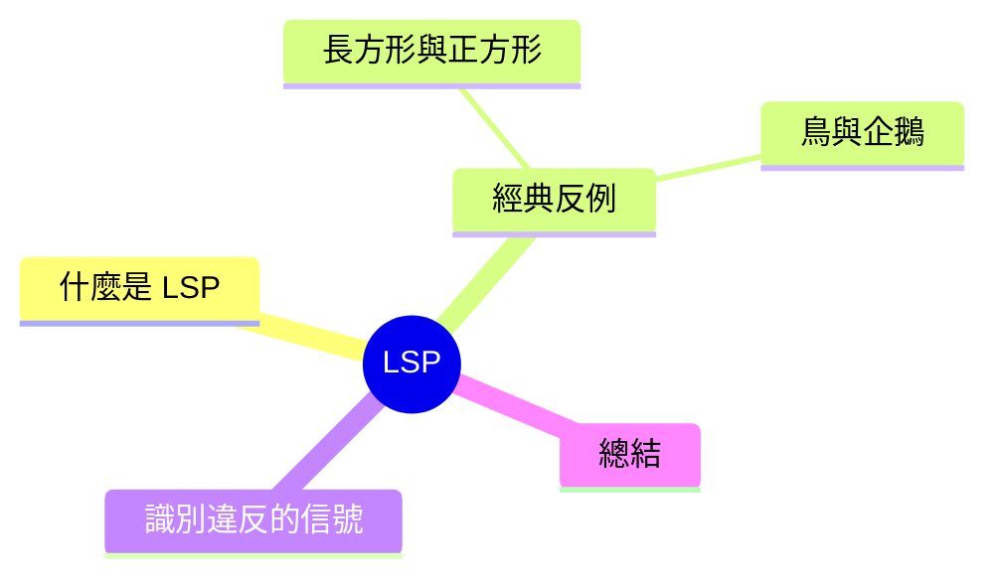

export const metadata = {
  title: 'SOLID 原則：Liskov 替換原則 (LSP)',
  date: '2026-04-25',
  excerpt: '介紹 SOLID 五大原則中的 Liskov 替換原則，透過長方形與正方形的經典範例說明繼承的本質，以及如何識別並修正 LSP 違反。',
  tags: ['軟體設計', '最佳實踐', 'OOP'],
};

# SOLID 原則：Liskov 替換原則 (LSP)

Liskov 替換原則 (Liskov Substitution Principle，LSP) 是 SOLID 的第三條，由電腦科學家 Barbara Liskov 在 1987 年提出。

核心概念很直覺：**程式碼可以接受父類別的地方，換成任何子類別，行為必須一致**。

不是「能執行」，而是「行為正確」。這個差別比看起來更重要。



- [什麼是 Liskov 替換原則](#什麼是-liskov-替換原則)
- [反例一：長方形與正方形](#反例一長方形與正方形)
- [反例二：鳥與企鵝](#反例二鳥與企鵝)
- [識別 LSP 違反的信號](#識別-lsp-違反的信號)
- [總結](#總結)

---

## 什麼是 Liskov 替換原則

正式的定義：

> 若 S 是 T 的子型別，則所有使用 T 的地方，都可以用 S 替換，且程式的行為不會改變。

更實務的理解：**父類別建立了一份行為契約，子類別必須完整遵守，不能縮減，也不能違背。**

LSP 不只是語法上「可以編譯」，而是語義上「行為符合預期」。覆寫父類別方法時，不能強化前置條件（要求呼叫者給更多），也不能弱化後置條件（承諾給呼叫者更少）。

---

## 反例一：長方形與正方形

這是最常被引用的 LSP 範例。

數學上，正方形是特殊的長方形（四邊等長），所以繼承看起來完全合理：

```typescript
class Rectangle {
  constructor(protected width: number, protected height: number) {}

  setWidth(w: number) { this.width = w; }
  setHeight(h: number) { this.height = h; }
  getArea(): number { return this.width * this.height; }
}

class Square extends Rectangle {
  // 正方形四邊必須等長，改一邊就要改兩邊
  setWidth(w: number) {
    this.width = w;
    this.height = w;
  }

  setHeight(h: number) {
    this.width = h;
    this.height = h;
  }
}
```

問題在這裡：

```typescript
function testArea(rect: Rectangle) {
  rect.setWidth(4);
  rect.setHeight(5);
  console.log(rect.getArea()); // 預期：20
}

testArea(new Rectangle(0, 0)); // 20 ✓
testArea(new Square(0));       // 25 ✗
```

`testArea` 把 width 設成 4、height 設成 5，預期面積 20。但傳入 `Square` 之後，`setHeight(5)` 同時把 `width` 也改成了 5，結果是 5 × 5 = 25。

`Square` 覆寫了 setter 的行為，讓呼叫者的假設失效。「設定 height 不會影響 width」這個隱含契約被打破了。

數學上「正方形是長方形」是對的，但繼承描述的是**行為相容性**，不是概念歸屬。這兩件事不一樣。

### 正確做法

用共同的介面，讓兩者各自獨立實作：

```typescript
interface Shape {
  getArea(): number;
}

class Rectangle implements Shape {
  constructor(private width: number, private height: number) {}

  setWidth(w: number) { this.width = w; }
  setHeight(h: number) { this.height = h; }
  getArea(): number { return this.width * this.height; }
}

class Square implements Shape {
  constructor(private side: number) {}

  setSide(s: number) { this.side = s; }
  getArea(): number { return this.side * this.side; }
}
```

兩者都實作 `Shape`，各自有獨立的 API，互不干擾，也不會有行為契約衝突。

---

## 反例二：鳥與企鵝

另一個常見例子：

```typescript
class Bird {
  fly() {
    console.log("Flying...");
  }
}

class Penguin extends Bird {
  fly() {
    throw new Error("企鵝不會飛");
  }
}
```

用 `Penguin` 替換 `Bird`，程式直接噴錯：

```typescript
function makeBirdFly(bird: Bird) {
  bird.fly();
}

makeBirdFly(new Bird());    // "Flying..."
makeBirdFly(new Penguin()); // Error: 企鵝不會飛 ✗
```

生物學上企鵝是鳥，但在這個設計裡，`Penguin` 違背了 `fly()` 的契約，無法正確替換 `Bird`。

### 正確做法

把「會飛」的能力抽成獨立的介面：

```typescript
class Bird {
  // 所有鳥共有的行為
}

interface Flyable {
  fly(): void;
}

class Sparrow extends Bird implements Flyable {
  fly() {
    console.log("Flying...");
  }
}

class Penguin extends Bird {
  swim() {
    console.log("Swimming...");
  }
}
```

`Penguin` 不繼承 `fly()`，也不需要假裝自己會飛。程式碼要使用 `fly()` 的地方，只接受 `Flyable`，不是所有 `Bird`，`Penguin` 就不會意外出現在那裡。

---

## 識別 LSP 違反的信號

**1. 子類別的方法拋出「不支援」例外**

```typescript
class ReadOnlyList extends MutableList {
  add(item: unknown) {
    throw new Error("This list is read-only"); // 違反 add() 的契約
  }
}
```

父類別承諾 `add()` 有效，子類別把這個承諾作廢了。

**2. 程式碼裡充斥 `instanceof` 判斷**

```typescript
function processShape(shape: Shape) {
  if (shape instanceof Square) {
    // 正方形的特殊處理
  } else if (shape instanceof Rectangle) {
    // 長方形的特殊處理
  }
}
```

需要知道「實際上是什麼型別」才能正確處理，代表子類別沒有真正替換父類別的能力，抽象設計出了問題。

**3. 子類別把父類別的方法清空**

```typescript
class SilentLogger extends Logger {
  log(message: string) {
    // 刻意什麼都不做
  }
}
```

父類別的 `log()` 保證有記錄行為，子類別悄悄把它移除了。

---

## 總結

LSP 的核心：**繼承不是「我是這種東西」，而是「我能完整扮演這個角色」**。

設計繼承關係時，問自己三個問題：

- 子類別所有方法的行為，都符合父類別原本的契約嗎？
- 把子類別換進去之後，現有的程式碼還會正確運作嗎？
- 子類別有沒有讓任何方法拋出原本不應該出現的例外？

如果有任何一個答案是否定的，繼承關係可能就設計錯了，應該考慮改用介面或組合。

LSP 和介面隔離原則 (ISP) 密切相關：介面設計得夠細，子類別就不會被迫實作不該有的方法。

