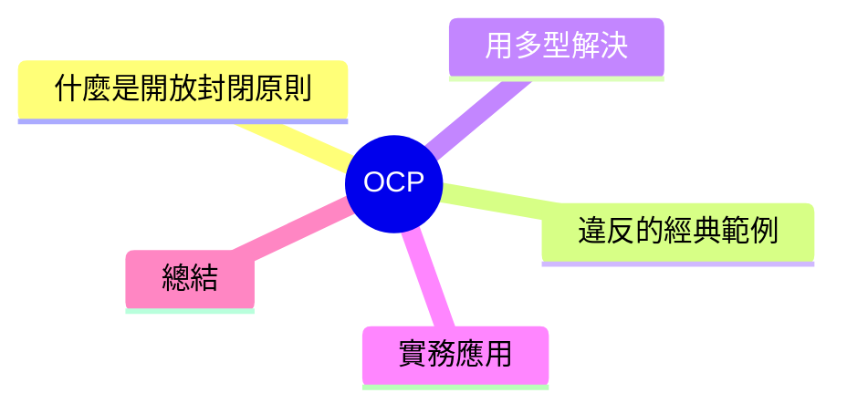

export const metadata = {
  title: 'SOLID 原則：開放封閉原則 (OCP)',
  date: '2026-04-10',
  excerpt: '介紹 SOLID 五大原則中的開放封閉原則，透過形狀面積計算的經典範例，說明如何用多型和抽象設計取代 if-else 演化。',
  tags: ['軟體設計', '最佳實踐', 'OOP'],
};

# SOLID 原則：開放封閉原則 (OCP)

開放封閉原則 (Open/Closed Principle，OCP) 是 SOLID 的第二條：

> 軟體實體應該對擴展開放，對修改封閉。

**對擴展開放**：可以新增行為。
**對修改封閉**：不需要修改現有程式碼。

實際情境下，這代表欲對系統加入新功能，應該是「新增程式碼」，而不是「修改現有程式碼」。



- [什麼是開放封閉原則](#什麼是開放封閉原則)
- [經典範例：形狀面積計算](#經典範例形狀面積計算)
- [用多型解決](#用多型解決)
- [實務應用：支付方式](#實務應用支付方式)
- [總結](#總結)

---

## 什麼是開放封閉原則

OCP 的核心目標是：當需求變化時，不需要動到現有已湋試、已驗證的程式碼。

這樣有兩個好處：

1. 减少引入跟隊的風險（沒有動到的地方，就沒有機會改壞它）
2. 新的功能可以獨立開發和測試

---

## 經典範例：形狀面積計算

一個違反 OCP 的常見寫法：

```typescript
type Shape = { type: 'circle'; radius: number }
           | { type: 'rectangle'; width: number; height: number }
           | { type: 'triangle'; base: number; height: number };

function calculateArea(shape: Shape): number {
  if (shape.type === 'circle') {
    return Math.PI * shape.radius ** 2;
  } else if (shape.type === 'rectangle') {
    return shape.width * shape.height;
  } else if (shape.type === 'triangle') {
    return (shape.base * shape.height) / 2;
  }
  throw new Error('Unknown shape');
}
```

每次新增一種形狀，就必須修改 `calculateArea`。這個函式對擴展是「封閉」的，要對修改「開放」——完全跨倒了 OCP。

問題越來越明顯：隨著形狀種類增加，`if-else` 就無限延伸，而且每次援動的範圍越大。

---

## 用多型解決

把面積計算的職責移進形狀本身：

```typescript
interface Shape {
  area(): number;
}

class Circle implements Shape {
  constructor(private radius: number) {}

  area(): number {
    return Math.PI * this.radius ** 2;
  }
}

class Rectangle implements Shape {
  constructor(private width: number, private height: number) {}

  area(): number {
    return this.width * this.height;
  }
}

class Triangle implements Shape {
  constructor(private base: number, private height: number) {}

  area(): number {
    return (this.base * this.height) / 2;
  }
}

// 這個函式不需要再改了
function calculateArea(shape: Shape): number {
  return shape.area();
}
```

現在要新增一種形狀，只需新增一個實作 `Shape` 介面的類別就好，`calculateArea` 完全不需要碰。

這就是對擴展開放、對修改封閉。

---

## 實務應用：支付方式

這個模式在前端地常見：

```typescript
interface PaymentMethod {
  pay(amount: number): void;
}

class CreditCard implements PaymentMethod {
  pay(amount: number): void {
    console.log(`信用卡付款 $${amount}`);
  }
}

class LinePay implements PaymentMethod {
  pay(amount: number): void {
    console.log(`Line Pay 付款 $${amount}`);
  }
}

class ApplePay implements PaymentMethod {
  pay(amount: number): void {
    console.log(`Apple Pay 付款 $${amount}`);
  }
}

class Checkout {
  constructor(private paymentMethod: PaymentMethod) {}

  complete(amount: number): void {
    this.paymentMethod.pay(amount);
  }
}

// 新增支付方式，只需新增類別
// Checkout 和其他程式碼完全不需要修改
const checkout = new Checkout(new ApplePay());
checkout.complete(1200);
```

日後新增第四、第五種支付方式，`Checkout` 完全不需要動。

---

## 總結

OCP 的實迴方式是：

- **介面 / 抽象類別**：定義封閉的行為合約，具體實作程式碼對它開放
- **策略模式**：將可替換的演算法或行為封裝成獨立的類別
- **多型**：透過繼承或實作介面，讓新的行為透過新增類別而不是修改現有程式碼

實務上的判斷標準：如果新增功能需要修改存在的、已測試過的程式碼，就应該思考是否可以設計成「新增程式碼」就能讓新功能運作。
