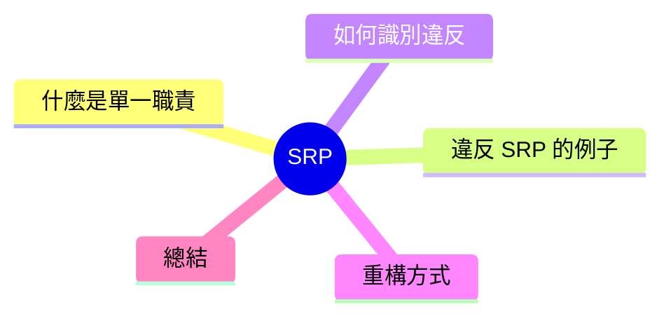

export const metadata = {
  title: 'SOLID 原則：單一職責原則 (SRP)',
  date: '2026-04-08',
  excerpt: '介紹 SOLID 五大原則中的單一職責原則，透過實際範例說明什麼是「一個改變的理由」，以及如何識別並重構職責混雜的程式碼。',
  tags: ['軟體設計', '最佳實踐', 'OOP'],
};

# SOLID 原則：單一職責原則 (SRP)

單一職責原則 (Single Responsibility Principle，SRP) 是 SOLID 的第一條，也是最常被誤解的一條。

常見的誤解是「一個類別只能有一個方法」。正確的理解是：**一個模組應該只有一個改變的理由**。

「改變的理由」指的是需求來源——是業務邏輯的需求，還是通知機制的需求，還是資料儲存的需求？如果一個類別需要因為不同來源的需求而修改，它就承擔了太多職責。



- [什麼是單一職責原則](#什麼是單一職責原則)
- [違反 SRP 的樣子](#違反-srp-的樣子)
- [如何識別違反](#如何識別違反)
- [重構方式](#重構方式)
- [總結](#總結)

---

## 什麼是單一職責原則

Robert C. Martin 的原話是：

> A class should have only one reason to change.

「改變的理由」是關鍵。不同的業務需求代表不同的改變來源：

- 財務部門要求改帳單格式 → 一個改變的理由
- 技術部門要求換資料庫 → 另一個改變的理由
- 行銷部門要求改通知內容 → 又是一個

如果同一個類別需要因為以上任何一個需求而修改，它就違反了 SRP。

---

## 違反 SRP 的樣子

一個典型的違反例子：

```typescript
class UserService {
  // 使用者業務邏輯
  createUser(name: string, email: string) {
    if (!email.includes('@')) throw new Error('Invalid email');
    const user = { id: Date.now(), name, email };

    // 直接操作資料庫
    db.query(`INSERT INTO users VALUES (${user.id}, '${name}', '${email}')`);

    // 直接發送 email
    const smtp = new SMTPClient('smtp.example.com', 587);
    smtp.send({
      to: email,
      subject: '歡迎加入',
      body: `Hi ${name}，歡迎！`,
    });

    // 直接寫 log
    fs.appendFileSync('app.log', `[${new Date()}] User created: ${email}\n`);

    return user;
  }
}
```

這個 `UserService` 同時承擔了四個職責：

1. 使用者業務邏輯（驗證、建立使用者物件）
2. 資料庫操作
3. Email 通知
4. 日誌記錄

每一個職責都可能因為不同的原因改變：換資料庫、換 email 服務商、改 log 格式……每次改動都需要動到這個類別，風險累積越來越大。

---

## 如何識別違反

**一、用「和」來描述類別的職責**

如果你需要用「和」才能說清楚一個類別在做什麼，它可能職責太多：

- `UserService` 負責「建立使用者**和**發送 email**和**寫 log」
- `ReportGenerator` 負責「產生報告**和**儲存報告**和**發送報告」

**二、改變的原因超過一個**

問：這個類別會因為哪些需求改變？

- 換資料庫 → 要改它？
- 換通知服務 → 要改它？
- 業務邏輯改了 → 也要改它？

三個問題有兩個以上的「是」，就值得考慮拆分。

**三、測試很難寫**

如果測試一個功能需要 mock 很多不相關的外部依賴，通常是職責混在一起的信號。

---

## 重構方式

將每個職責提取到獨立的類別：

```typescript
// 資料庫操作獨立
class UserRepository {
  save(user: User): void {
    db.query(`INSERT INTO users VALUES (${user.id}, '${user.name}', '${user.email}')`);
  }
}

// 通知邏輯獨立
class NotificationService {
  sendWelcome(name: string, email: string): void {
    const smtp = new SMTPClient('smtp.example.com', 587);
    smtp.send({ to: email, subject: '歡迎加入', body: `Hi ${name}，歡迎！` });
  }
}

// 日誌獨立
class Logger {
  info(message: string): void {
    fs.appendFileSync('app.log', `[${new Date()}] ${message}\n`);
  }
}

// UserService 只負責業務邏輯
class UserService {
  constructor(
    private userRepo: UserRepository,
    private notification: NotificationService,
    private logger: Logger,
  ) {}

  createUser(name: string, email: string): User {
    if (!email.includes('@')) throw new Error('Invalid email');
    const user = { id: Date.now(), name, email };
    this.userRepo.save(user);
    this.notification.sendWelcome(name, email);
    this.logger.info(`User created: ${email}`);
    return user;
  }
}
```

重構後：

- 換資料庫 → 只改 `UserRepository`
- 換 email 服務 → 只改 `NotificationService`
- 改 log 格式 → 只改 `Logger`
- 改業務邏輯 → 只改 `UserService`

每個類別只有一個改變的理由。

---

## 總結

SRP 不是「每個類別只能有一個方法」，而是「每個類別只服務於一個需求來源」。

實務上判斷的方式：

- 用一句話說清楚這個模組的職責，如果需要用「和」連接，考慮拆分
- 問自己：這個模組會因為哪些不同的需求而改變？
- 測試這個模組需要 mock 多少東西？

SRP 是其他 SOLID 原則的基礎。職責清晰的模組，才容易對外封閉修改（OCP）、容易替換（LSP）、容易組合介面（ISP）、容易注入依賴（DIP）。
