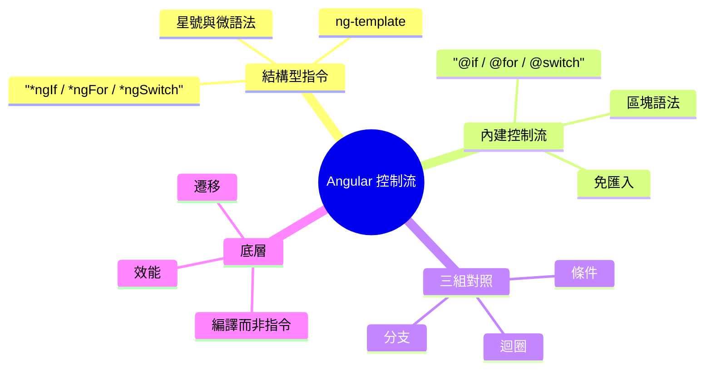
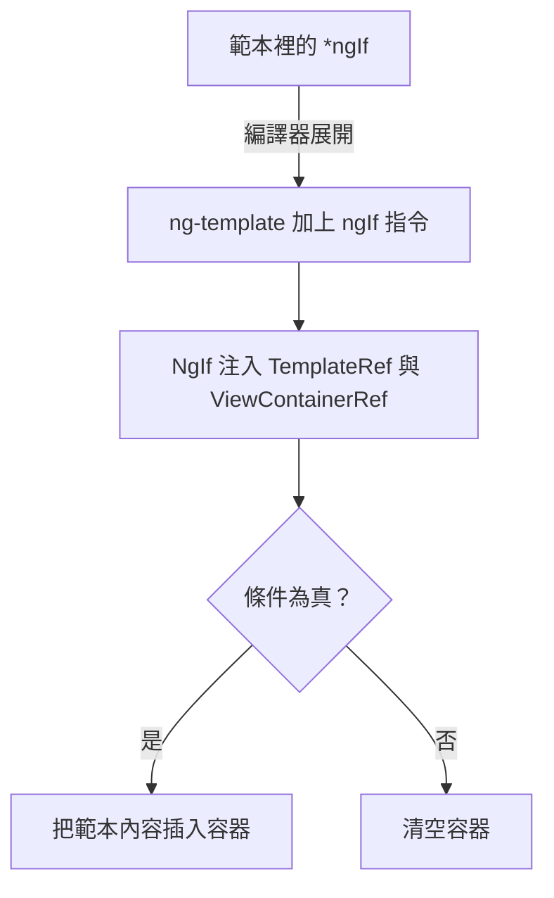
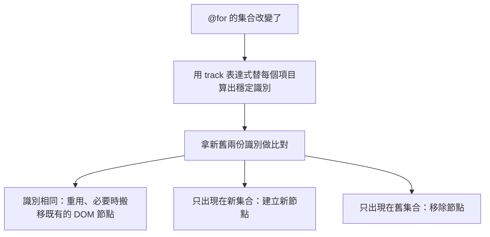
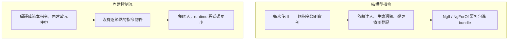

export const metadata = {
  title: 'Angular 控制流：從結構型指令到內建區塊語法',
  date: '2026-06-23',
  excerpt: '完整比較 Angular 的兩套控制流：*ngIf、*ngFor、*ngSwitch 這套結構型指令，與 Angular 17 引進的 @if、@for、@switch 內建區塊語法。從星號背後的微語法、底層機制的差異，一路談到 @for 強制 track 換來的效能、bundle 體積，以及實際該怎麼遷移。',
  tags: ['前端', 'Angular'],
};

# Angular 控制流：從結構型指令到內建區塊語法

打從 Angular 2 問世，在範本裡寫條件與迴圈就只有一條路：結構型指令。`*ngIf`、`*ngFor`、`*ngSwitch`，前面都掛著那顆有點神秘的星號 `*`。它能用，而且用了很久。

Angular 17 帶來了另一套寫法，也就是內建控制流 (built-in control flow)：`@if`、`@for`、`@switch`，以 `@` 開頭、用大括號包住內容，讀起來就像 JavaScript。表面上看，這只是把舊語法換個樣子；但只要往下挖一層就會發現，它底下是完全不同的機制。也正是這個機制上的差異，解釋了為什麼新語法的型別檢查更準、打包出來的程式碼更小，而且以 `@for` 來說跑得快非常多。



- [結構型指令與那顆星號](#結構型指令與那顆星號)
- [內建控制流：區塊語法](#內建控制流區塊語法)
- [@if 與 *ngIf](#if-與-ngif)
- [@for 與 *ngFor](#for-與-ngfor)
- [@switch 與 *ngSwitch](#switch-與-ngswitch)
- [底層與效能](#底層與效能)
- [如何遷移](#如何遷移)
- [總結](#總結)

---

## 結構型指令與那顆星號

要理解新語法好在哪，得先弄懂舊語法到底是什麼。結構型指令 (structural directive) 指的是會改變 DOM 結構 (也就是新增、移除、重組元素) 的那一類指令。`*ngIf`、`*ngFor`、`*ngSwitch` 都屬於這一類，而它們共同的標記，就是那顆星號。

關鍵的一點，多數人寫了很久也沒真正內化：那顆 `*` 純粹是語法糖。下面這行：

```html
<div *ngIf="isLoggedIn" class="card">歡迎回來</div>
```

編譯器看到星號，會把它展開 (desugar) 成一段以 `<ng-template>` 為核心的等價寫法：

```html
<ng-template [ngIf]="isLoggedIn">
  <div class="card">歡迎回來</div>
</ng-template>
```

`NgIf` 其實是一個再普通不過的指令類別。它在建構子裡注入 `TemplateRef` (被包起來的那段範本) 與 `ViewContainerRef` (可以插入內容的容器)，然後根據條件決定要不要把範本內容實例化並插入容器。`*ngFor` 也一樣，只是它的微語法更豐富：

```html
<div *ngFor="let item of items; let i = index; trackBy: trackById">
  {{ i }} - {{ item.name }}
</div>
```

展開後是這個樣子：

```html
<ng-template ngFor let-item [ngForOf]="items" let-i="index" [ngForTrackBy]="trackById">
  <div>{{ i }} - {{ item.name }}</div>
</ng-template>
```



這套設計撐起了 Angular 早期的整個範本系統，但它有幾筆藏在細節裡的代價：

- 微語法是一套自成一格的迷你語言。 `let item of items; let i = index; trackBy: fn` 看起來像 JavaScript，其實不是，而是一段字串 DSL，編譯器用一套專屬規則去解析。`of`、`let`、`trackBy` 這些關鍵字、各段之間的分號、`as` 的別名語法，全都得另外學。
- 一個元素只能掛一個結構型指令。 你沒辦法在同一個元素上同時寫 `*ngIf` 和 `*ngFor`，因為兩者都想接管同一個宿主範本。想兼得，標準解法是多包一層 `<ng-container>`。
- else 很彆扭。 想表達「否則顯示另一段」，得寫成 `*ngIf="cond; else other"`，再額外宣告一個 `<ng-template #other>` 放在別處。條件與它的兩個分支被拆散在範本的不同角落。
- 它們終究是指令。 每一次使用都是一個類別實例，背後跟著依賴注入、生命週期、變更偵測的登記；而且 `NgIf`、`NgForOf`、`NgSwitch` 得先從 `CommonModule` 匯入 (在 standalone 元件裡尤其明顯)，才能打包進你的 bundle。

這些代價單看都不致命，Angular 也靠這套寫法走了很遠。但把它們加總起來，就構成了重新設計的理由。

---

## 內建控制流：區塊語法

Angular 17 (2023 年 11 月) 引進了內建控制流，並在 Angular 18 正式穩定。同樣三件事 (條件、迴圈、分支) 改用 `@` 開頭的區塊語法來寫：

```html
@if (isLoggedIn) {
  <p>歡迎回來</p>
} @else {
  <p>請先登入</p>
}
```

最關鍵的差別，不在於它長得比較像 JavaScript，而在於：它們不是指令。Angular 編譯器原生就認得 `@if`、`@for`、`@switch`，會直接把它們編譯成範本指令 (template instructions)，內建在元件本身之中。這帶來幾個直接的後果：

- 不需要匯入任何東西。 你不必匯入 `CommonModule`，也不必匯入 `NgIf`，控制流是語言的一部分，打開範本就能用。 (要注意：`async`、`date` 這類 pipe，或 `ngClass`、`ngStyle` 這類屬性指令，仍然來自 `CommonModule`，該匯入還是得匯入。)
- 它是語言，不是函式庫。 因為語法歸編譯器管，編譯器就能對它做更深的最佳化、更準的型別檢查，並且少塞一些 runtime 程式碼進去。

三組對照大致是這樣：

| 工作 | 結構型指令 | 內建控制流 |
| - | - | - |
| 條件 | `*ngIf` + `else` 範本 | `@if` / `@else if` / `@else` |
| 迴圈 | `*ngFor` + 選用的 `trackBy` | `@for` + 必填的 `track` + `@empty` |
| 分支 | `[ngSwitch]` + `*ngSwitchCase` | `@switch` / `@case` / `@default` |
| 匯入 | 需要 `CommonModule` | 不需要 |
| 本質 | 指令類別實例 | 編譯後的範本指令 |

接下來三節，把這三組逐一拆開看。

---

## @if 與 *ngIf

最單純的條件，兩者幾乎一樣乾淨。真正拉開差距的是「否則」這件事。`@if` 內建了 `@else if` 與 `@else`，可以把一串條件平鋪直敘地寫下來：

```html
@if (user.role === 'admin') {
  <admin-panel />
} @else if (user.role === 'editor') {
  <editor-panel />
} @else {
  <viewer-panel />
}
```

同樣的邏輯用 `*ngIf` 表達，就得跳那支「`ngIfElse` + 具名範本」的舞：

```html
<div *ngIf="user.role === 'admin'; else editorTpl">
  <admin-panel />
</div>
<ng-template #editorTpl>
  <div *ngIf="user.role === 'editor'; else viewerTpl">
    <editor-panel />
  </div>
</ng-template>
<ng-template #viewerTpl>
  <viewer-panel />
</ng-template>
```

條件與分支被切成好幾塊、散落在不同的 `<ng-template>` 裡，巢狀一深就很難一眼讀懂。`@if` 把它們收攏回同一個區塊，閱讀順序就跟思考順序一致。

別名 (aliasing) 也保留了下來，而且更直覺。把一個算出來的值 (最常見的是搭配 `async` pipe 的非同步資料) 綁進一個區域變數：

```html
@if (user$ | async; as user) {
  <p>{{ user.name }}</p>
  <p>{{ user.email }}</p>
}
```

這裡的 `user` 只在這個區塊內有效，作用域很乾淨。還有一個容易被忽略、但很實在的好處：型別收窄 (type narrowing)。因為語法歸編譯器管，`@if` 區塊內部的型別推論更可靠，在區塊裡，編譯器確實知道 `user` 不是 `null`，範本的型別檢查也跟著更準。

---

## @for 與 *ngFor

迴圈是兩套寫法差距最大的地方，不只是寫法，連底層的執行效率都不同。先看新語法的樣子：

```html
@for (item of items; track item.id) {
  <li>{{ item.name }}</li>
} @empty {
  <li>目前沒有任何項目</li>
}
```

有三件事值得逐一拆開講。

第一，`track` 從選用變成必填。 在 `*ngFor` 裡，`trackBy` 是一個「可加可不加」的最佳化選項，多數人圖方便就跳過了。到了 `@for`，`track` 是編譯器強制要求，少了它根本編不過。而且它是一個運算式 (`item.id`)，不再是指向元件方法的參照，寫起來更輕。它為什麼非要不可？因為它正是新版高速差異比對的鑰匙，這點下面馬上會談。

第二，情境變數內建好了。 `*ngFor` 要拿索引得寫 `let i = index`；`@for` 直接提供一組以 `$` 開頭的情境變數，隨手就能用：

| 變數 | 意義 |
| - | - |
| `$index` | 目前項目的索引 |
| `$count` | 集合的總長度 |
| `$first` / `$last` | 是否為第一個 / 最後一個 |
| `$even` / `$odd` | 索引是偶數 / 奇數 |

需要改名時再用 `let` 取別名即可，巢狀迴圈裡特別有用：

```html
@for (row of rows; track row.id; let rowIndex = $index) {
  @for (cell of row.cells; track cell.id; let colIndex = $index) {
    <td>{{ rowIndex }},{{ colIndex }}: {{ cell.value }}</td>
  }
}
```

第三，`@empty` 是一等公民。 集合為空時要顯示的內容，直接寫在 `@for` 後面就好。換成 `*ngFor`，你得另外補一個 `*ngIf="items.length === 0"`，把「有資料」和「沒資料」兩種狀態拆到兩個地方維護。

### track 與那 90% 的效能

`@for` 最有份量的賣點是執行效能。根據社群框架基準 (js-framework-benchmark) 的量測，新版 `@for` 在 runtime 的表現最高可比 `*ngFor` 快上約 90%。這個數字背後的機制，正好說明了 `track` 為什麼非填不可。

`*ngFor` 透過 Angular 的 `IterableDiffer` 來追蹤集合變化。`@for` 則換上了一套全新、更精簡的差異比對演算法。而要讓任何差異比對跑得快，前提是它得能回答一個問題：「更新後的這一筆，和更新前的哪一筆是同一個？」`track` 就是你給編譯器的答案，替每一個項目算出一個穩定的識別。



有了穩定識別，當陣列被重新排序、或在中間插入幾筆時，Angular 能認出哪些項目其實沒變，於是搬移並重用既有的 DOM 節點，而不是把整段拆掉重建。少掉的那些建立與銷毀，就是效能數字的來源。

也因此，`track` 選什麼很重要：

- 集合裡的項目會移動、排序、被插入或刪除時，用一個唯一且穩定的識別，例如 `track item.id`。
- 純粹追加、或根本不會變動的清單，用 `track $index` 就夠了。
- 千萬別用一個每次都重算的值 (例如某個會變的物件) 去 track，那會逼 Angular 把每一筆都當成全新的，反而比不寫還慢。

換句話說，把 `track` 設成必填，不是 Angular 想找麻煩，而是它把過去那個「最容易被忽略、卻最影響效能」的決定，提到了你非面對不可的位置。

---

## @switch 與 *ngSwitch

分支的對照最能凸顯「結構型指令需要一個宿主元素」這件事。新語法是一組純粹的區塊：

```html
@switch (status) {
  @case ('loading') {
    <spinner />
  }
  @case ('error') {
    <error-message />
  }
  @default {
    <dashboard />
  }
}
```

舊寫法則需要一個掛著 `[ngSwitch]` 的容器元素，子元素再各自帶上 `*ngSwitchCase`：

```html
<div [ngSwitch]="status">
  <spinner *ngSwitchCase="'loading'" />
  <error-message *ngSwitchCase="'error'" />
  <dashboard *ngSwitchDefault />
</div>
```

差別有幾處：

- 不再需要包裝元素。 `[ngSwitch]` 一定得找一個宿主元素來掛 (常常因此多出一層 `<div>` 或 `<ng-container>`)；`@switch` 不需要，它本身就是區塊。
- `[ngSwitch]` 是屬性、`*ngSwitchCase` 是結構型指令。 舊寫法其實混用了兩種指令型態，容器上那個 `[ngSwitch]` 並不是結構型指令，真正控制顯示的是子元素上的星號指令。`@switch` 把這層心智負擔整個拿掉。
- 比對規則一致：嚴格相等。 `@case` 的值和 `@switch` 的值之間，是用 `===` 比對，跟 JavaScript 的 `switch` 一樣，這點與舊的 `ngSwitch` 行為相符。沒有 fall-through，比對到第一個符合的 `@case` 就停。

---

## 底層與效能

把前面三組看到的東西收束成一句話：結構型指令是 runtime 的指令物件，內建控制流是編譯期的範本指令。 整個差異幾乎都從這一句長出來。



由此導出三個實際的好處：

- 更小的 bundle。 不再需要 `NgIf`、`NgForOf`、`NgSwitch`，連帶常常可以整個省掉 `CommonModule` 的匯入，那些 runtime 程式碼離開 bundle，打包體積自然跟著變小。
- 更快的 runtime。 一方面是 `@for` 那套新的差異比對演算法 (最高約快 90%)，另一方面是少了「每個節點都掛一個指令實例」帶來的 DI 與變更偵測開銷。
- 更準的型別檢查。 語法歸編譯器所有，範本型別檢查與型別收窄都能做得更深、更可靠。

| 面向 | 結構型指令 | 內建控制流 |
| - | - | - |
| 本質 | 每次使用都是指令類別實例 | 編譯後的範本指令 |
| 匯入 | 需要 `CommonModule` | 不需要 |
| `@for` 差異比對 | `IterableDiffer` | 新演算法，最高約快 90% |
| `track` / `trackBy` | 選用 | 必填 |
| 型別收窄 | 有限 | 更完整 |
| bundle 影響 | 較大 | 較小 (省去指令與匯入) |

要強調的是，這些好處不是靠「換個好看的語法」變出來的，而是源自那個機制上的根本轉換：把控制流從「掛在元素上的指令」，變成「編譯器直接理解並生成的指令碼」。

---

## 如何遷移

好消息是，這趟遷移幾乎沒有風險。

兩套寫法可以共存。 你可以在同一個專案、甚至同一個範本裡，同時用 `*ngIf` 和 `@if`。不必一次全部換掉，可以漸進地搬。

有官方的自動遷移工具。 跑一行指令，schematic 就會把整個專案的範本改寫成新語法，`else`、`@empty`、`track` 都會自動補好：

```bash
ng generate @angular/core:control-flow
```

而且它連 `CommonModule` 都替你顧到了：遷移工具夠聰明，只有在 `CommonModule` 不再被其他東西 (`ngClass`、`ngStyle`，或 `async`、`date` 這類 pipe) 需要時，才會順手移除那行匯入，bundle 的好處因此能安全落袋。

結構型指令沒有被棄用。 截至 Angular 20，`*ngIf`、`*ngFor`、`*ngSwitch` 仍然正常運作，沒有被標記為 deprecated，也沒有移除的時程。換句話說，舊程式碼不會壞；對新寫的程式碼來說，內建控制流則是官方建議的預設選擇。

---

## 總結

從 `*ngIf` 到 `@if`，改變的不只是語法，而是底層的機制：

- `*ngIf`、`*ngFor`、`*ngSwitch` 與 `@if`、`@for`、`@switch` 做的是同樣三件事，但前者是 runtime 的指令實例，後者是編譯期的範本指令。
- 那顆 `*` 是語法糖，會展開成 `<ng-template>` 加指令；微語法、一個元素只能掛一個結構型指令、彆扭的 else，都是這套設計的代價。
- 內建控制流不需匯入、型別檢查更準，`@if` 的 `@else if` / `@else` 與 `@for` 的 `@empty` 都是語言原生的。
- `@for` 的 `track` 從選用變必填，配上新的差異比對演算法，在社群基準上最高約快 90%，`track` 是關鍵。
- 截至 Angular 20，結構型指令沒有被棄用、兩套也能共存；但對新寫的程式碼，`@` 區塊是建議的預設，`ng generate @angular/core:control-flow` 還能幫你自動遷移。
