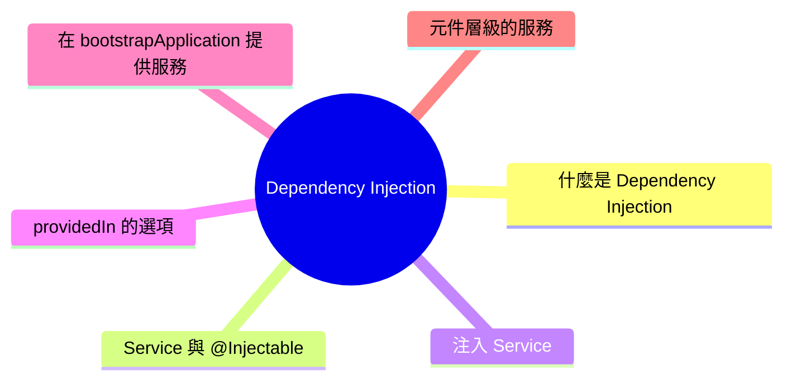

export const metadata = {
  title: 'Angular 開發必學：什麼是 Dependency Injection',
  date: '2026-03-22',
  excerpt: '介紹 Angular Dependency Injection 的核心概念，包含 @Injectable、建構子注入與 inject 函式、providedIn 的選項、bootstrapApplication 的全域服務，以及元件層級的服務隔離。',
  tags: ['前端', 'Angular', '設計模式'],
};

# Dependency Injection

Dependency Injection (依賴注入，DI) 是 Angular 的核心機制之一。

它讓元件不需要自己建立所需的服務，而是由 Angular 負責提供，讓程式碼更容易測試、更容易維護。



- [什麼是 Dependency Injection](#什麼是-dependency-injection)
- [Service 與 @Injectable](#service-與-injectable)
- [注入 Service](#注入-service)
- [providedIn 的選項](#providedin-的選項)
- [在 bootstrapApplication 提供服務](#在-bootstrapapplication-提供服務)
- [元件層級的服務](#元件層級的服務)

---

## 什麼是 Dependency Injection

假設一個元件需要使用 `UserService` 來取得使用者資料。

沒有依賴注入的做法：

```typescript
export class UserListComponent {
  private userService = new UserService(); // 自己建立
}
```

這樣做有幾個問題：

- 元件與 `UserService` 緊密耦合
- 難以在測試時替換成假的 `UserService`
- 每個元件都建立自己的實例，無法共享狀態

有了依賴注入，Angular 負責建立和管理 `UserService` 的實例，元件只需要宣告它需要什麼：

```typescript
export class UserListComponent {
  constructor(private userService: UserService) {} // Angular 注入
}
```

---

## Service 與 @Injectable

Service 是 Angular 中負責處理業務邏輯、資料存取等工作的類別。

建立一個 Service，需要加上 `@Injectable` 裝飾器：

```typescript
import { Injectable } from '@angular/core';

@Injectable({
  providedIn: 'root',
})
export class UserService {
  getUsers() {
    return [
      { id: 1, name: 'Charmy' },
      { id: 2, name: 'Alice' },
    ];
  }
}
```

`@Injectable` 告訴 Angular 這個類別可以被注入。`providedIn: 'root'` 表示這個服務在整個應用程式中只有一個實例 (Singleton)。

---

## 注入 Service

### 建構子注入 (傳統方式)

```typescript
import { Component } from '@angular/core';
import { UserService } from './user.service';

@Component({
  standalone: true,
  selector: 'app-user-list',
  template: `
    <ul>
      <li *ngFor="let user of users">{{ user.name }}</li>
    </ul>
  `,
})
export class UserListComponent {
  users = [];

  constructor(private userService: UserService) {
    this.users = this.userService.getUsers();
  }
}
```

### inject 函式 (現代方式，Angular 14+)

Angular 14 引入了 `inject` 函式，可以在不使用建構子的情況下注入依賴：

```typescript
import { Component, inject } from '@angular/core';
import { UserService } from './user.service';

@Component({
  standalone: true,
  selector: 'app-user-list',
  template: `...`,
})
export class UserListComponent {
  private userService = inject(UserService);
  users = this.userService.getUsers();
}
```

`inject` 函式可以在類別的屬性初始化階段使用，寫法更簡潔，也是 Standalone 風格下的推薦寫法。

---

## providedIn 的選項

`@Injectable` 的 `providedIn` 決定了服務在哪個層級被提供。

### `providedIn: 'root'`

最常用的選項，服務在整個應用程式中只有一個實例：

```typescript
@Injectable({
  providedIn: 'root',
})
export class UserService {}
```

適合全域共用的服務，例如 API 呼叫、認證狀態、使用者偏好設定。

### `providedIn: 'platform'`

跨多個 Angular 應用程式共用的服務 (較少使用)。

### `providedIn: 'any'`

每個 Lazy Loaded Module 都有自己獨立的實例 (較少使用)。

---

## 在 bootstrapApplication 提供服務

使用 Standalone 架構時，全域服務可以在 `bootstrapApplication` 的 `providers` 中提供：

```typescript
// main.ts
import { bootstrapApplication } from '@angular/platform-browser';
import { provideHttpClient } from '@angular/common/http';
import { AppComponent } from './app/app.component';

bootstrapApplication(AppComponent, {
  providers: [
    provideHttpClient(),
  ],
});
```

也可以提供自訂服務：

```typescript
bootstrapApplication(AppComponent, {
  providers: [
    { provide: UserService, useClass: UserService },
  ],
});
```

或是使用工廠函式提供值：

```typescript
bootstrapApplication(AppComponent, {
  providers: [
    { provide: 'API_URL', useValue: 'https://api.example.com' },
  ],
});
```

注入字串 token 時，需要用 `@Inject`：

```typescript
import { Component, Inject } from '@angular/core';

@Component({ ... })
export class AppComponent {
  constructor(@Inject('API_URL') private apiUrl: string) {
    console.log(apiUrl); // "https://api.example.com"
  }
}
```

---

## 元件層級的服務

服務也可以只提供給特定元件及其子元件，在 `@Component` 的 `providers` 中宣告：

```typescript
import { Component } from '@angular/core';
import { UserService } from './user.service';

@Component({
  standalone: true,
  selector: 'app-user-section',
  providers: [UserService], // 這個元件有自己的 UserService 實例
  template: `...`,
})
export class UserSectionComponent {}
```

這樣的設定讓 `UserService` 的實例只存在於 `UserSectionComponent` 及其子元件中，與根層級的實例完全隔離。

適合需要隔離狀態的場景，例如表單狀態、局部的資料管理。

---

## 總結

Angular 依賴注入讓服務的建立和管理從元件中分離出來：

- 用 `@Injectable` 宣告可注入的服務
- 用建構子或 `inject` 函式注入依賴
- `providedIn: 'root'` 建立全域單例服務
- `bootstrapApplication` 的 `providers` 提供全域設定
- 元件的 `providers` 建立元件層級的獨立實例

理解依賴注入之後，接下來通常會進一步學習：

- Angular Service 的設計模式
- HTTP 請求與 HttpClient
- 測試時替換依賴 (Mock Service)
