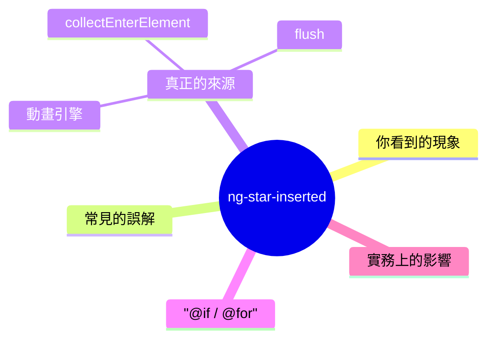
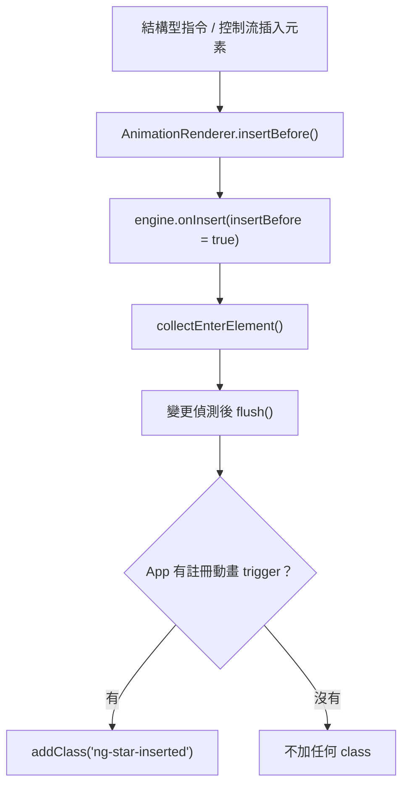

export const metadata = {
  title: 'Angular ng-star-inserted',
  date: '2026-06-25',
  excerpt:
    '拆解 Angular 留在 DOM 裡的 ng-star-inserted clas —— 其實不是結構型指令加的，而是動畫引擎的標記。從真正的來源、命名由來，一路談到 @if / @for 與實務上會踩到的坑。',
  tags: ['前端', 'Angular'],
};

# Angular ng-star-inserted

打開 DevTools 檢查 Angular 應用的 DOM，遲早會看到一個你從沒寫過的 class：`ng-star-inserted`。

它沒有樣式、沒有行為，官方文件也幾乎沒提到它。但它到底從哪裡來、為什麼只出現在某些元素上，答案比大多數人以為的更有意 —— 跟結構型指令 (structural directive) 其實沒有直接關係。



- [你看到的現象](#你看到的現象)
- [常見的誤解](#常見的誤解)
- [真正的來源是動畫引擎](#真正的來源是動畫引擎)
- [@if 與 @for 也一樣](#if-與-for-也一樣)
- [實務上的影響](#實務上的影響)

---

## 你看到的現象

`ng-star-inserted` 通常出現在被結構型指令渲染出來的元素 —— `*ngIf`、`*ngFor`、`*ngSwitchCase`，以及自訂的結構型指令。

```html
<div *ngIf="isLoggedIn" class="card">歡迎回來</div>
```

在某些應用裡，這段樣板渲染出來會變成：

```html
<div class="card ng-star-inserted">歡迎回來</div>
<!--bindings={ "ng-reflect-ng-if": "true" }-->
```

那個 `class="card"` 之外憑空多出來的 `ng-star-inserted`，加上後面那行註解，就是大家最常問的兩個東西。註解是結構型指令留下的錨點 (anchor —— `*ngIf` 會被展開成 `<ng-template>`，元素就插在這個錨點前面；而 `ng-star-inserted` 則被普遍認為是 Angular 用來「標記它插入的元素」的記號)。

聽起來很合理。問題是，這個解釋是錯的。

---

## 常見的誤解

網路上幾乎所有說法都是同一句：「結構型指令會自動加上 `ng-star-inserted` 來標記它動態插入的元素。」

驗證它只要一個實驗：開一個乾乾淨淨、沒有任何動畫的應用，只放一個 `*ngIf`。

```html
<div *ngIf="show" class="content">hello</div>
```

渲染出來的結果是：

```html
<div class="content">hello</div>
```

沒有 `ng-star-inserted`。元素確確實實是被 `*ngIf` 插進 DOM 的，結構型指令也照常運作，但那個 class 就是不在。

換句話說，結構型指令本身不會加上 `ng-star-inserted`。真正加上它的，是另一個你可能根本沒注意到的東西。

---

## 真正的來源是動畫引擎

把 `ng-star-inserted` 這個字串拿去整個 Angular 原始碼裡搜尋，會發現它只存在於一個套件：`@angular/animations`。`@angular/core`、`@angular/common`、`@angular/platform-browser` 全都沒有它。從 View Engine 時代的 v8 到 Ivy 的 v20，都是如此。

機制是這樣的。當你啟用動畫 (`provideAnimations()` 或 `BrowserAnimationsModule`)，Angular 會用一個 `AnimationRenderer` 包住底層的 DOM Renderer。從此每一次 DOM 插入都會先經過動畫引擎 (animation engine)。結構型指令插入元素時，是把元素插在錨點註解的「前面 —— 正是 `*` 語法的特徵。動畫引擎攔截到這類插入，就把元素收集起來；等到變更偵測 (change detection) 結束、引擎 `flush()` 時，再替它們補上 `ng-star-inserted`。

```typescript
// @angular/animations 內部 (簡化)
const STAR_CLASSNAME = 'ng-star-inserted';

collectEnterElement(element) {
  this.collectedEnterElements.push(element);
}

flush() {
  // 只有在「應用裡確實有註冊動畫」時才會進這個分支
  if (this.totalAnimations && this.collectedEnterElements.length) {
    for (const elm of this.collectedEnterElements) {
      addClass(elm, STAR_CLASSNAME); // ← class 就是在這裡加上去的
    }
  }
  // ...
}
```



名字的由來也藏在原始碼裡。引擎收集進場元素的那段邏輯，旁邊有一行註解：`// only *directives and host elements are inserted before`。`star` 指的就是結構型指令的星號 `*`，`inserted` 則是「被插入 DOM」。連起來，`ng-star-inserted` 的意思是「一個被星號語法插進來、目前正被動畫引擎追蹤的元素」。

那引擎為什麼要做這個標記？為了之後找得回來。當某個父元素要離場 (leave) 時，引擎需要 `query('.ng-star-inserted')` 把當初進場 (enter) 的子元素一併找出來，正確地跑離場動畫。這個 class 純粹是動畫引擎自己的記帳工具。

這裡有一個容易誤判的細節：條件是 `totalAnimations`，也就是應用裡至少要有一個用 `trigger()` 註冊的動畫。光是呼叫 `provideAnimations()`，但沒有任何元素真的套上動畫，`totalAnimations` 還是 0，`ng-star-inserted` 一樣不會出現。

---

## @if 與 @for 也一樣

Angular 17 的新控制流上線後，常有人問：換成 `@if`、`@for` 之後，`ng-star-inserted` 會不會消失？

不會。`@if` 和 `@for` 在編譯後，走的是跟 `*ngIf`、`*ngFor` 同一條「建立內嵌視圖 (embedded view) 再插入」的路徑。動畫引擎攔截、收集、標記的流程完全相同，所以只要應用有動畫，控制流插入的元素照樣會帶上 `ng-star-inserted`。

```html
<!-- 元素套了動畫，且應用啟用動畫 -->
@if (show) {
  <div @fade class="content">hello</div>
}
```

```html
<div class="content ng-trigger ng-trigger-fade ng-star-inserted">hello</div>
```

順帶一提，同一行的 `ng-trigger`、`ng-trigger-fade` 也是動畫引擎加的，跟 `ng-star-inserted` 同源，分別標記「這個元素掛了動畫」和「套用的是哪一個 trigger」。在 DOM 裡看到一整排 `ng-` 開頭的 class，幾乎都是動畫引擎的手筆。

關鍵在於，這個 class 從來就不是綁在 `*` 這個語法符號上，而是綁在「一個元素，透過動畫引擎追蹤的視圖，進入了 DOM」這件事上。`star` 只是來自星號時代的歷史命名，行為對新舊語法一視同仁。

| 情境 | 有 `ng-star-inserted`？ |
| - | - |
| `*ngIf` / `*ngFor`，應用沒有任何動畫 | 否 |
| `*ngIf` / `*ngFor`，元素套了 `@trigger` 動畫 | 是 |
| `@if` / `@for`，元素套了 `@trigger` 動畫 | 是 |
| 靜態元素 (不在結構型指令或控制流內) | 否 |

---

## 實務上的影響

不要針對它寫 CSS，也不要在測試裡斷言它。 它是動畫引擎的內部標記，不是公開 API；只在有動畫時才出現，Angular 哪天想改也不需要通知任何人。任何依賴它存在 (或不存在) 的程式碼，都是建立在流沙上。

精確的屬性選擇器會被它打斷。 像 `[class="content"]` 這種要求「整個 class 字串完全相等」的選擇器，會因為元素上多了一個 `ng-star-inserted` token 而比對失敗。改用 class 選擇器 `.content` (以個別 token 比對) 就不受影響。任何「假設 class 屬性只包含自己設定的值」的程式碼或第三方套件，都可能被這個多出來的 token 絆 —— ngular 早年就收過這類回報，最有名的是與 Font Awesome 的衝突。

它是無害的。 不是錯誤、不是記憶體洩漏，也不代表動畫沒跑完。在 DevTools 看到它，不需要緊張。

真的想擺脫它？ 唯一條件是「應用沒有動畫 —— 幾乎沒有人會為了一個無害的 class 拿掉整套動畫。最務實的作法，就是知道它是什麼，然後無視它。

---

## 總結

- `ng-star-inserted` 是 `@angular/animations` 加上的，不是結構型指令、也不是核心 Renderer。
- 沒有動畫 → 不會出現；有註冊動畫 trigger → 進入 DOM 的元素才會被標記。
- 名字裡的 `star` 是結構型指令的星號 `*`，`inserted` 是「被插入 DOM」，合起來是動畫引擎追蹤進場元素的記號。
- `@if` / `@for` 與 `*ngIf` / `*ngFor` 行為一致，新控制流不會讓它消失。
- 它是內部實作細節，別把樣式或測試綁在上面。
