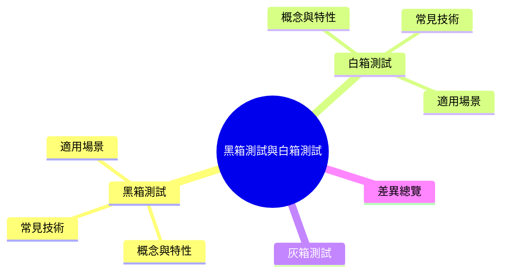
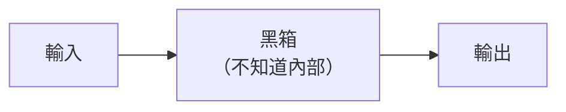
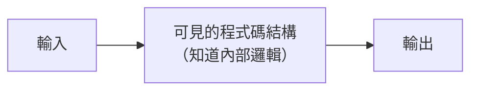

export const metadata = {
  title: '黑箱測試、白箱測試與灰箱測試',
  date: '2026-03-31',
  excerpt: '介紹黑箱測試、白箱測試與灰箱測試的差異，包含各自的測試依據、常見技術 (等價分割、邊界值分析、語句覆蓋、分支覆蓋)、適用場景，以及三者在實務中如何搭配使用。',
  tags: ['軟體測試', '軟體設計'],
};

# 黑箱測試、白箱測試與灰箱測試

軟體測試依照測試者對系統內部結構的了解程度，分為三種主要方式：

- 黑箱測試 (Black-Box Testing)：不了解內部實作，只測試輸入和輸出
- 白箱測試 (White-Box Testing)：了解內部實作，根據程式碼結構設計測試
- 灰箱測試 (Gray-Box Testing)：部分了解內部實作



- [黑箱測試](#黑箱測試)
- [白箱測試](#白箱測試)
- [灰箱測試](#灰箱測試)
- [差異總覽](#差異總覽)

---

## 黑箱測試

### 概念與特性

黑箱測試將系統視為一個「黑箱」——測試者只知道系統的輸入和預期輸出，不了解也不關心內部如何實作。



測試者通常是 QA 工程師或終端使用者，不需要查看原始碼。測試的依據是需求規格、使用者故事或 API 文件。

### 常見技術

等價分割 (Equivalence Partitioning)

將輸入資料分成多個等價類別，每個類別只取一個代表值測試。

例如年齡驗證 (有效範圍 0–120)：

```
無效類別 (負數)：-1
有效類別 (0–120)：60
無效類別 (超過120)：121
```

只測試代表值，而不是每個可能的輸入。

邊界值分析 (Boundary Value Analysis)

在等價分割的邊界附近進行測試，因為錯誤最常發生在邊界。

同樣是年齡驗證：

```
測試值：-1, 0, 1, 119, 120, 121
```

決策表測試 (Decision Table Testing)

適合有多個條件組合的邏輯：

```
條件 A | 條件 B | 預期結果
  T    |   T    |  結果 1
  T    |   F    |  結果 2
  F    |   T    |  結果 3
  F    |   F    |  結果 4
```

### 適用場景

- 驗收測試 (Acceptance Testing)：確認產品符合使用者需求
- 功能測試 (Functional Testing)：驗證功能是否按規格運作
- 回歸測試 (Regression Testing)：確認修改後既有功能仍然正常
- API 測試：根據 API 文件測試輸入輸出行為

---

## 白箱測試

### 概念與特性

白箱測試 (也稱為透明箱測試、玻璃箱測試) 讓測試者看到系統內部的程式碼結構，根據程式碼設計測試案例。



測試者通常是開發者本身，需要閱讀和理解原始碼。測試的目標是確保程式碼的每個分支、路徑都被測試到。

### 常見技術

語句覆蓋 (Statement Coverage)

確保每一行程式碼至少被執行一次：

```javascript
function divide(a, b) {
  if (b === 0) {        // 需要測試 b = 0
    return null;
  }
  return a / b;         // 需要測試 b ≠ 0
}
```

分支覆蓋 (Branch Coverage)

確保每個 if/else 分支都被測試到：

```javascript
function classify(score) {
  if (score >= 60) {    // 需要測試 true 和 false 兩種情況
    return '及格';
  } else {
    return '不及格';
  }
}
```

路徑覆蓋 (Path Coverage)

測試程式碼中所有可能的執行路徑 (包含多個條件的組合)。路徑覆蓋是最全面的，但也最難達到 100%。

單元測試 (Unit Testing)

白箱測試最常見的形式，測試單一函式或模組的行為：

```javascript
// 被測試的函式
function add(a, b) {
  return a + b;
}

// 單元測試
test('add 應該回傳兩數之和', () => {
  expect(add(1, 2)).toBe(3);
  expect(add(-1, 1)).toBe(0);
  expect(add(0, 0)).toBe(0);
});
```

### 適用場景

- 單元測試：測試單一函式或模組
- 整合測試：測試模組之間的互動
- 安全測試：找出程式碼中的安全漏洞
- 程式碼覆蓋率分析：確保測試涵蓋足夠的程式碼

---

## 灰箱測試

灰箱測試介於黑箱和白箱之間——測試者對系統內部有部分了解，但不是完全透明。

常見的情況：

- 知道 API 的資料庫結構，但不知道所有業務邏輯
- 知道前端如何呼叫後端，但不知道後端的內部實作
- 安全滲透測試中，知道部分系統架構

灰箱測試可以設計更有針對性的測試案例，比純黑箱更有效率，又不需要像白箱一樣完全理解所有程式碼。

---

## 差異總覽

| | 黑箱測試 | 白箱測試 | 灰箱測試 |
| - | - | - | - |
| 對內部的了解 | 無 | 完全了解 | 部分了解 |
| 測試依據 | 需求規格、使用者行為 | 程式碼結構 | 兩者結合 |
| 執行者 | QA、測試工程師 | 開發者 | 開發者或測試工程師 |
| 優點 | 接近使用者視角，不受實作影響 | 可以測試到程式碼的每個細節 | 兼具兩者優點 |
| 缺點 | 可能遺漏內部邏輯的邊界情況 | 可能忽略使用者實際使用場景 | 需要更多背景知識 |
| 典型應用 | 功能測試、驗收測試 | 單元測試、程式碼覆蓋 | 整合測試、滲透測試 |

---

## 總結

- 黑箱測試：從外部視角測試，不看程式碼，確保功能符合需求
- 白箱測試：從內部視角測試，根據程式碼結構確保所有路徑都被覆蓋
- 灰箱測試：部分了解內部，設計更有針對性的測試

實務上，完整的測試策略通常結合三種方式：開發者寫單元測試 (白箱)，QA 工程師做功能和驗收測試 (黑箱)，整合測試則可能介於兩者之間 (灰箱)。
