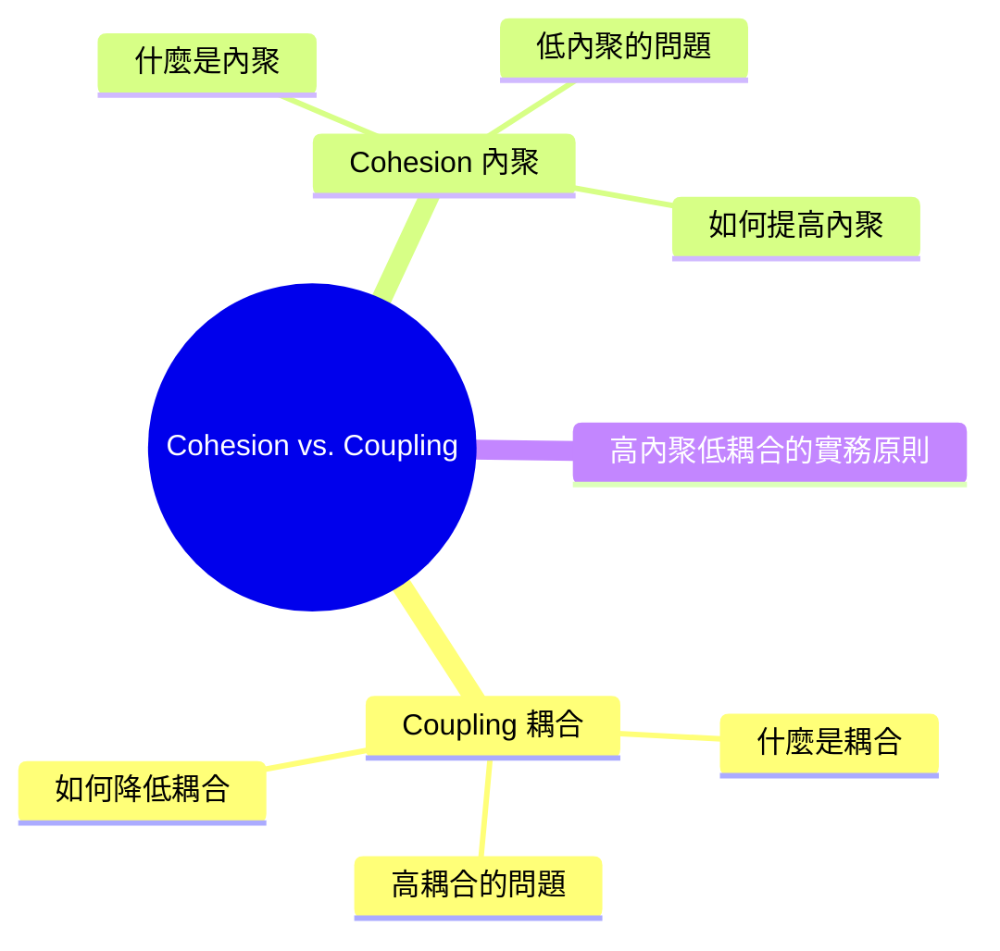

export const metadata = {
  title: 'Cohesion vs Coupling：內聚與耦合',
  date: '2026-04-18',
  excerpt: '介紹 Cohesion 與 Coupling 的核心概念，包含高耦合與低內聚的問題、如何透過依賴注入和單一職責原則改善，以及判斷程式碼品質的實務方法。',
  tags: ['軟體設計', '最佳實踐'],
};

# Cohesion vs Coupling：內聚與耦合

Cohesion (內聚) 和 Coupling (耦合) 是評估程式碼品質的兩個核心概念。

好的程式碼設計目標是：高內聚、低耦合。

- 高內聚 (High Cohesion)：一個模組內部的元素緊密相關，專注做一件事
- 低耦合 (Low Coupling)：模組之間的依賴關係少，互相獨立



- [Coupling：耦合](#coupling耦合)
- [Cohesion：內聚](#cohesion內聚)
- [高內聚低耦合的實務原則](#高內聚低耦合的實務原則)

---

## Coupling：耦合

### 什麼是耦合

耦合描述的是模組之間的依賴程度。耦合越高，一個模組的改動越容易影響其他模組。

高耦合的例子：

```javascript
// UserComponent 直接依賴 UserService 的實作細節
class UserComponent {
  getUser() {
    const db = new Database('mysql://localhost/users');
    const query = db.query('SELECT * FROM users WHERE id = 1');
    return query.result;
  }
}
```

這個元件直接操作資料庫，耦合非常高：

- 資料庫換成 PostgreSQL，這裡要改
- 查詢邏輯變了，這裡要改
- 想在測試中用假資料，很困難

低耦合的例子：

```javascript
// UserComponent 只依賴介面，不依賴實作
class UserComponent {
  constructor(private userService: UserService) {}

  getUser(id: number) {
    return this.userService.getUser(id);
  }
}
```

現在 `UserComponent` 不知道資料怎麼來的，只知道有 `userService` 可以用。要換實作、要測試，只需要替換注入的 `userService`。

### 高耦合的問題

- 修改困難：改動一個地方需要同時修改多個相關模組
- 難以測試：元件依賴外部資源，測試時需要準備完整的環境
- 難以重用：模組與特定實作綁在一起，無法單獨使用
- 難以理解：一個模組的行為取決於許多外部因素

### 如何降低耦合

依賴注入 (Dependency Injection)

不在模組內部建立依賴，而是從外部傳入：

```javascript
// 高耦合：自己建立依賴
class OrderService {
  constructor() {
    this.emailService = new EmailService(); // 直接建立
  }
}

// 低耦合：從外部注入依賴
class OrderService {
  constructor(emailService) {
    this.emailService = emailService; // 從外部傳入
  }
}
```

程式碼對介面，不對實作

依賴抽象而不是具體實作，讓實作可以自由替換。

事件驅動

模組透過事件通訊，不直接呼叫彼此的方法：

```javascript
// 高耦合：直接呼叫
orderService.complete(order);
emailService.sendConfirmation(order); // OrderService 需要知道 EmailService

// 低耦合：透過事件
orderService.complete(order);
eventBus.emit('order.completed', order); // EmailService 自己訂閱這個事件
```

---

## Cohesion：內聚

### 什麼是內聚

內聚描述的是一個模組內部元素的相關程度。內聚越高，模組內部的職責越單一、越集中。

低內聚的例子：

```javascript
// 這個 Utils 做了太多不相關的事
class Utils {
  formatDate(date) { ... }
  sendEmail(to, subject) { ... }
  calculateTax(price) { ... }
  validatePassword(password) { ... }
  resizeImage(image, width) { ... }
}
```

這個 `Utils` 沒有明確的職責，什麼都放進來，是典型的低內聚。

高內聚的例子：

```javascript
// 每個 class 只做一件事
class DateFormatter {
  format(date) { ... }
  parse(string) { ... }
}

class EmailService {
  send(to, subject, body) { ... }
  validate(email) { ... }
}

class TaxCalculator {
  calculate(price, rate) { ... }
}
```

每個類別只負責自己的領域，內聚高。

### 低內聚的問題

- 難以理解：一個模組做太多不相關的事，很難快速掌握它的用途
- 難以維護：修改一個功能可能意外影響同一模組中不相關的功能
- 難以測試：測試需要涵蓋太多不相關的情境
- 難以重用：模組的某個功能想單獨用，卻必須引入整個模組

### 如何提高內聚

單一職責原則 (Single Responsibility Principle)

每個模組只有一個改變的理由。如果你需要用「和」來描述一個模組的功能，它可能需要被拆分：

```javascript
// 需要拆分：「處理使用者資料 和 發送通知」
class UserManager {
  updateUser(user) { ... }
  sendWelcomeEmail(user) { ... } // 這個應該獨立
}

// 拆分後
class UserService {
  updateUser(user) { ... }
}

class NotificationService {
  sendWelcomeEmail(user) { ... }
}
```

---

## 高內聚低耦合的實務原則

### 前端元件設計

回到前一篇提到的 Smart/Dumb Components 模式：

- Dumb Component 只接收 props、發出事件，不依賴外部服務 → 低耦合
- Dumb Component 只負責 UI 的呈現 → 高內聚

### 函式設計

```javascript
// 低內聚、高耦合
function processOrder(orderId) {
  const order = db.getOrder(orderId);     // 直接操作資料庫
  const tax = order.price * 0.1;          // 稅率邏輯混在一起
  order.total = order.price + tax;
  db.saveOrder(order);                    // 又操作資料庫
  emailService.sendReceipt(order);        // 又依賴 email 服務
}

// 高內聚、低耦合
function calculateTotal(price, taxRate) {
  return price + price * taxRate;         // 只做一件事
}
```

### 如何判斷

幾個問題幫助判斷：

- 耦合：如果 A 模組改動，B 模組也需要改嗎？→ 可能耦合太高
- 內聚：這個模組的職責可以用一句話說清楚嗎？→ 不能 → 可能內聚太低
- 測試難度：測試這個模組需要準備很多環境嗎？→ 可能耦合太高

---

## 總結

| | 高 | 低 |
| - | - | - |
| 內聚 (Cohesion) | 好：職責單一，易理解易維護 | 差：職責混雜，難維護 |
| 耦合 (Coupling) | 差：依賴多，改動困難 | 好：獨立，易替換易測試 |

目標：高內聚、低耦合。

這兩個概念是許多設計原則 (SOLID、Clean Architecture) 的基礎，理解它們能幫助你在日常開發中做出更好的設計決策。
