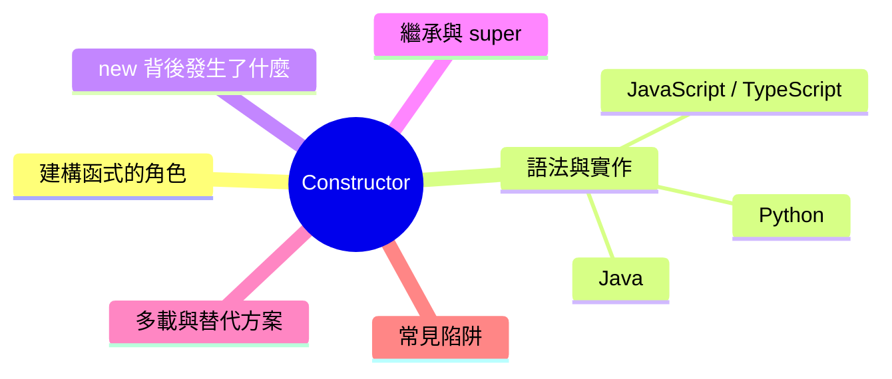
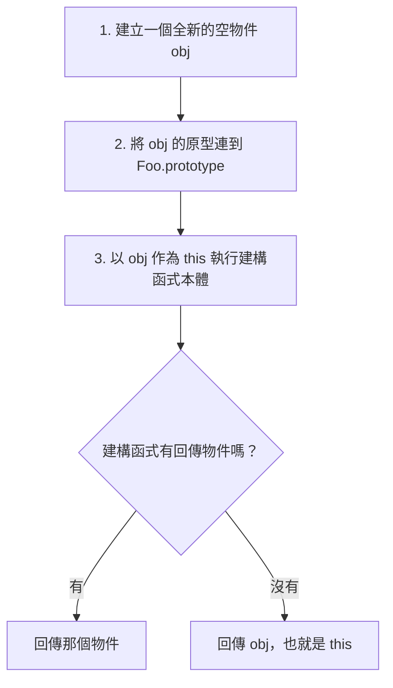
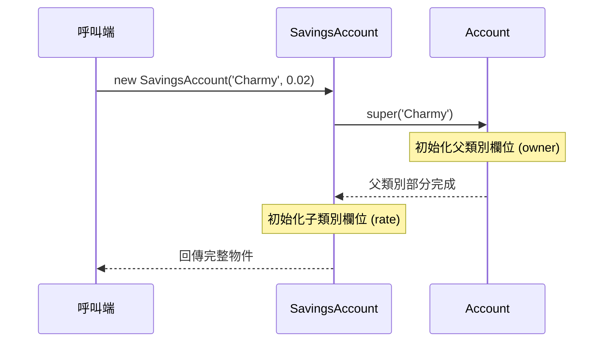

export const metadata = {
  title: '建構函式 constructor：物件初始化的核心機制',
  date: '2026-06-29',
  excerpt: '深入解析建構函式 (Constructor) 的職責與運作原理，從 new 背後的四個步驟、繼承時的 super() 建構鏈，到多載與靜態工廠方法的取捨，並整理忘記 new、在建構函式呼叫可覆寫方法等常見陷阱，對照 JavaScript、Python、Java 三種語言。',
  tags: ['OOP', '軟體設計'],
};

# 建構函式 constructor：物件初始化的核心機制

建構函式 (Constructor) 是類別中一個特殊的方法，它在「物件被建立的當下」自動執行，負責把物件的初始狀態準備好。

每次你用 `new` 建立一個物件，建構函式就是那段「先跑一次、而且只跑一次」的初始化邏輯：參數接進來、設定欄位、建立必要的關聯，讓物件一誕生就處於可用的合法狀態。

雖然多數前端工程師是從 ES6 的 `class` 開始接觸建構函式，但它其實是物件導向語言共通的設計概念。各語言語法不同，背後要解決的問題卻一致：如何保證一個物件「從第一秒起就是完整的」。



- [建構函式的角色](#建構函式的角色)
- [語法與實作](#語法與實作)
- [new 背後發生了什麼](#new-背後發生了什麼)
- [繼承與 super()](#繼承與-super)
- [建構函式多載與替代方案](#建構函式多載與替代方案)
- [常見陷阱](#常見陷阱)
- [總結](#總結)

---

## 建構函式的角色

要理解建構函式，先把兩件事分開：定義一個類別和建立一個物件。類別 (Class) 是藍圖，描述一個物件「長什麼樣、能做什麼」；但藍圖本身不是物件。真正產生物件的是 `new`，而建構函式就是 `new` 過程中那段「把這個物件準備好」的程式碼。

沒有建構函式時，物件會先以空殼的形式誕生，再被呼叫端逐一填值。在填完之前，它是個半成品：

```typescript
// 沒有建構函式：物件先誕生，再被逐步填充，期間是個半成品
class User {
  id!: string;
  name!: string;
}

const user = new User();
// 在這兩行之前，user 的欄位都是 undefined
user.id = 'u-1';
user.name = 'Charmy';
```

問題在於「半成品狀態」會外洩。任何人只要拿到還沒填完的 `user`，就可能讀到 `undefined`；而且每個建立物件的地方都得記得補齊所有欄位，漏掉一個就是潛在的 bug。

建構函式把「建立」和「準備好」綁成同一個不可分割的動作：

```typescript
// 有建構函式：建立與初始化是同一個動作，不存在「半成品」狀態
class User {
  constructor(
    public id: string,
    public name: string,
  ) {}
}

const user = new User('u-1', 'Charmy'); // 一誕生就是完整的
```

> 上面 `constructor` 的參數直接寫 `public id` 是 TypeScript 的參數屬性 (Parameter Properties) 語法糖，會自動把參數宣告成同名欄位並賦值，省去 `this.id = id` 的樣板程式碼。

這帶來一個更深層的好處：建構函式是物件唯一的建立入口，所以合法性的檢查可以集中在這裡。只要建構函式保證「不合法的物件根本建立不出來」，後續的程式碼就能放心假設手上的物件一定有效。

---

## 語法與實作

以下用同一個情境 (一個帶有擁有者與初始餘額、且餘額不能為負的銀行帳戶) 來示範三種語言的建構函式寫法。

### 1. JavaScript / TypeScript

使用 `constructor` 關鍵字定義建構函式。它沒有回傳型別，`new` 會自動回傳建立好的實例。搭配原生私有欄位 (`#`)，可以在建構的當下就擋掉不合法的輸入。

```typescript
class BankAccount {
  #balance: number;

  constructor(
    public readonly owner: string,
    initialBalance: number = 0,
  ) {
    if (initialBalance < 0) {
      throw new Error('Initial balance cannot be negative.');
    }
    this.#balance = initialBalance;
  }

  get balance(): number {
    return this.#balance;
  }
}

const account = new BankAccount('Charmy', 100);
console.log(account.owner);   // 'Charmy'
console.log(account.balance); // 100
// new BankAccount('Eve', -50); // Error: Initial balance cannot be negative.
```

這段同時用到三個重點：`readonly` 讓 `owner` 一旦設定就不能再改、`initialBalance = 0` 是預設參數、`throw` 讓不合法的帳戶根本建立不出來。

### 2. Python

Python 用 `__init__` 方法做初始化，第一個參數 `self` 代表正在被建立的那個實例。

```python
class BankAccount:
    def __init__(self, owner: str, initial_balance: float = 0):
        if initial_balance < 0:
            raise ValueError("Initial balance cannot be negative.")
        self.owner = owner
        self._balance = initial_balance  # 慣例以單底線前綴代表私有

    @property
    def balance(self) -> float:
        return self._balance

account = BankAccount("Charmy", 100)
print(account.owner)    # Charmy
print(account.balance)  # 100
```

嚴格來說，`__init__` 是初始化器 (Initializer)，不是真正建立物件的那一步。Python 在呼叫 `__init__` 之前，會先呼叫 `__new__` 把實例配置出來，再把這個實例當成 `self` 傳進 `__init__` 填值。日常開發幾乎只會用到 `__init__`；只有在實作不可變型別或單例等特殊情境，才需要覆寫 `__new__`。

### 3. Java

Java 的建構函式名稱必須與類別完全相同，而且沒有回傳型別，連 `void` 都不寫。

```java
public class BankAccount {
    private final String owner;
    private double balance;

    public BankAccount(String owner, double initialBalance) {
        if (initialBalance < 0) {
            throw new IllegalArgumentException("Initial balance cannot be negative.");
        }
        this.owner = owner;
        this.balance = initialBalance;
    }

    public double getBalance() {
        return this.balance;
    }
}
```

`final` 欄位 `owner` 必須在建構函式結束前被賦值且只能賦值一次，這讓編譯器替你保證它建立後不可變。另外 Java 沒有預設參數，想支援「只傳 owner」這種變化，就得靠下面會談到的建構函式多載。

---

## new 背後發生了什麼

在 JavaScript 裡，`new` 看似只是一個關鍵字，實際上它在背後做了四個步驟。理解這四步，幾乎所有和建構相關的「怪現象」都能迎刃而解。



如果用一般的函式把 `new` 的行為手動重現出來，大致長這樣：

```javascript
function myNew(Constructor, ...args) {
  // 步驟 1、2：建立空物件，並把原型連到 Constructor.prototype
  const obj = Object.create(Constructor.prototype);

  // 步驟 3：以 obj 作為 this 執行建構函式
  const result = Constructor.apply(obj, args);

  // 步驟 4：建構函式回傳物件就用那個，否則回傳 obj
  return typeof result === 'object' && result !== null ? result : obj;
}
```

要提醒的是，這段重現的是舊式 `function` 建構函式的 `new` 流程；它沒辦法真的套用在 ES6 `class` (`Constructor.apply` 會丟出下面陷阱一提到的「不能不用 `new` 呼叫」的錯誤)，這四個步驟仍精準描述了 `new` 一個 class 時實際發生的事。

兩個常被忽略的細節，都藏在這四步裡：

- 步驟 2 把實例接上了原型鏈，所以實例才能透過 `account.constructor` 找回自己的建構函式，`account instanceof BankAccount` 也才會是 `true`。
- 步驟 4 解釋了一個冷門但致命的行為：如果你在建構函式裡 `return` 一個物件，`new` 給你的會是那個物件，而不是剛建立好的實例 (後面的陷阱章節會詳談)。

---

## 繼承與 super()

當一個類別 `extends` 另一個類別時，子類別的建構函式必須先呼叫 `super(...)`，才能初始化父類別的那一層。這個「子類別呼叫父類別建構函式」的過程稱為建構鏈 (Constructor Chaining)。

```typescript
class Account {
  constructor(public readonly owner: string) {}
}

class SavingsAccount extends Account {
  constructor(
    owner: string,
    public rate: number,
  ) {
    super(owner);   // 必須先呼叫，父類別那層才會初始化
    // this.rate = rate; // 若把存取 this 寫在 super() 之前 → ReferenceError
  }
}

const acc = new SavingsAccount('Charmy', 0.02);
```

在 JavaScript 裡，`super()` 執行完畢之前，`this` 處於暫時性死區 (Temporal Dead Zone)，提前存取會直接拋出 `ReferenceError`。這背後的道理很直觀：父類別都還沒把它負責的欄位設好，子類別就去動 `this`，等於操作一個尚未成形的物件。

實際的建構順序是由內而外、先父後子：



不同語言對 `super()` 的要求略有差異，但精神一致：

- JavaScript / TypeScript：子類別只要自己寫了 `constructor`，就必須在存取 `this` 之前呼叫 `super()`。
- Java：如果你不寫，編譯器會自動在建構函式第一行插入無參數的 `super()`；傳統上它也規定 `super(...)` 必須是建構函式的第一個語句 (Java 25 起放寬了這項限制，但仍禁止在 `super()` 之前存取 `this`)。
- Python：需要手動呼叫 `super().__init__(...)`，否則父類別的 `__init__` 不會被執行。

這裡有個關鍵但容易踩雷的細節：在 JS/TS 中，子類別的欄位初始化 (例如 `public rate: number` 或 `value = 42`) 排在 `super()` 回傳之後才執行。這個順序正是下一節某個陷阱的根源。

---

## 建構函式多載與替代方案

在 Java、C++、C# 這類語言中，同一個類別可以有多個同名但參數不同的建構函式，由編譯器依呼叫時的參數型別與數量挑選，這就是建構函式多載 (Overloading)。

```java
public class BankAccount {
    private final String owner;
    private double balance;

    public BankAccount(String owner, double initialBalance) {
        this.owner = owner;
        this.balance = initialBalance;
    }

    // 多載：只給 owner，餘額預設為 0
    public BankAccount(String owner) {
        this(owner, 0); // 委派給上面那個建構函式，避免重複邏輯
    }
}
```

`this(owner, 0)` 是建構函式委派 (Constructor Delegation)，讓一個建構函式把工作轉交給另一個，把實際的初始化邏輯收斂在單一處。

JavaScript 和 Python 沒有依簽章分派的機制，因此不支援建構函式多載，一個類別只能有一個 `constructor` 或 `__init__`。要表達「多種建立方式」，常見有兩條路。

### 方案一：靜態工廠方法

與其塞滿多載的建構函式，不如用具名的靜態工廠方法 (Static Factory Method) 把每種建立方式各自命名清楚：

```typescript
class Temperature {
  private constructor(public readonly celsius: number) {}

  static fromCelsius(c: number): Temperature {
    return new Temperature(c);
  }

  static fromFahrenheit(f: number): Temperature {
    return new Temperature(((f - 32) * 5) / 9);
  }
}

const a = Temperature.fromCelsius(25);
const b = Temperature.fromFahrenheit(77); // 同樣是 25°C
```

相較於兩個同名的建構函式，`fromCelsius` 與 `fromFahrenheit` 一眼就能看懂意圖。把建構函式設為 `private`，更能強制所有人都走這些有意義的入口。靜態工廠還有兩個建構函式給不了的能力：它可以回傳快取好的既有實例 (不一定每次都 `new` 一個新的)，也可以回傳子類別。

### 方案二：物件參數

當可選參數一多，與其排列組合出一堆多載，不如收進單一個設定物件：

```typescript
interface ServerOptions {
  host?: string;
  port?: number;
  timeout?: number;
}

class Server {
  constructor(private options: ServerOptions = {}) {}
}

new Server({ port: 8080 }); // 只指定需要的，其餘交給預設值
```

呼叫端只需指定關心的欄位，也不必記參數順序，可讀性比一長串位置參數好得多。

---

## 常見陷阱

### 1. 忘記 new (JavaScript)

`class` 的建構函式一定要搭配 `new` 呼叫。少了 `new`，JavaScript 會直接拋錯：

```javascript
class BankAccount {
  constructor(owner) {
    this.owner = owner;
  }
}

const account = BankAccount('Charmy');
// TypeError: Class constructor BankAccount cannot be invoked without 'new'
```

`class` 的這個錯誤其實是好事，逼你當場修正。真正危險的是舊式的「函式建構函式」：在非嚴格模式下少了 `new`，`this` 會指向全域物件，賦值就這樣悄悄汙染了全域，連個錯誤都沒有 (嚴格模式下 `this` 是 `undefined`，賦值會直接拋錯，反而安全)。這也是現代程式碼偏好 `class` 的原因之一。

### 2. 在建構函式裡回傳物件

回想 `new` 的步驟 4：如果建構函式回傳一個物件，`new` 給你的就是那個物件，而不是剛建立的實例。

```javascript
class Widget {
  constructor() {
    return { hijacked: true }; // 回傳物件 → 覆蓋掉原本的實例
  }
}

console.log(new Widget() instanceof Widget); // false
```

回傳基本型別 (例如數字、字串) 會被忽略，但回傳物件會悄悄把整個實例換掉。除非你刻意要這個行為，否則建構函式不該有 `return` 一個值。

### 3. 在建構函式裡呼叫可覆寫的方法

這是跨語言 (Java、C#、TypeScript 都中招) 的經典陷阱。當父類別的建構函式呼叫一個子類別覆寫的方法時，跑的是子類別版本，但此時子類別自己的欄位還沒初始化：

```typescript
class Base {
  constructor() {
    this.init(); // 呼叫到子類別覆寫的版本
  }
  init() {}
}

class Derived extends Base {
  value = 42;
  init() {
    console.log(this.value); // undefined！
  }
}

new Derived();
```

原因正是前面提過的初始化順序：子類別欄位 `value = 42` 排在 `super()` 回傳之後才執行，而 `super()` (也就是 `Base` 的建構函式) 裡就呼叫了 `init()`，這時 `value` 還是 `undefined`。

原則很簡單：不要在建構函式裡呼叫子類別可能覆寫的方法。需要可覆寫的初始化邏輯時，把它移到建構完成後再呼叫的方法裡。

### 4. 建構函式做太多事

建構函式的職責是「把欄位設好」，不該在裡面發 API 請求、讀寫檔案，或啟動背景工作。一旦 `new` 變成有副作用的操作，它會難以測試、難以掌控，失敗時也無從處理。

```typescript
// 不建議：建構函式裡偷偷做非同步 I/O
class UserRepo {
  constructor() {
    fetch('/api/users').then(/* ... */); // new 的當下就發請求，呼叫端無從掌控
  }
}

// 建議：建構函式只接收已備妥的資料，非同步邏輯交給靜態工廠
class UserRepo2 {
  private constructor(private users: User[]) {}

  static async create(): Promise<UserRepo2> {
    const users = await fetch('/api/users').then((r) => r.json());
    return new UserRepo2(users);
  }
}
```

建構函式無法是 `async`，所以凡是需要等待或可能失敗的初始化，靜態工廠 (例如 `static async create()`) 幾乎都是更乾淨的選擇。

### 5. Python 的可變預設參數

這是 Python 獨有、但極常見的陷阱。預設參數的值在函式定義時就被建立一次，之後所有沒傳該參數的呼叫都共用同一個物件：

```python
# 陷阱：預設的 [] 只建立一次，所有實例共用同一個 list
class Cart:
    def __init__(self, items=[]):
        self.items = items

a = Cart()
a.items.append("apple")
b = Cart()
print(b.items)  # ['apple']，竟然也有 a 加進去的東西
```

正解是用 `None` 當哨兵值，在 `__init__` 內部才建立新的 list：

```python
class Cart:
    def __init__(self, items=None):
        self.items = items if items is not None else []
```

---

## 總結

建構函式是物件生命週期的第一個事件：它的職責，是把一個剛配置好的空物件，變成一個狀態合法、可以馬上使用的實例。

掌握幾個原則，就能讓建構函式保持乾淨：

- 只做初始化：把驗證集中在這個唯一入口，別塞進 I/O 或重運算
- 繼承時先呼叫 super()：並理解「先父後子」的欄位初始化順序
- 不要呼叫可覆寫的方法：避免讀到子類別還沒初始化的欄位
- 善用靜態工廠方法：當建立邏輯有多種變化或可能失敗時，它比塞滿多載的建構函式更清楚

理解 `new` 背後那四個步驟，你就能解釋大多數和建構相關的「怪現象」，從忘記 `new` 的 `this` 問題，到回傳物件造成的意外覆蓋。建構函式看似只是個起點，卻決定了物件接下來能不能被信任。
