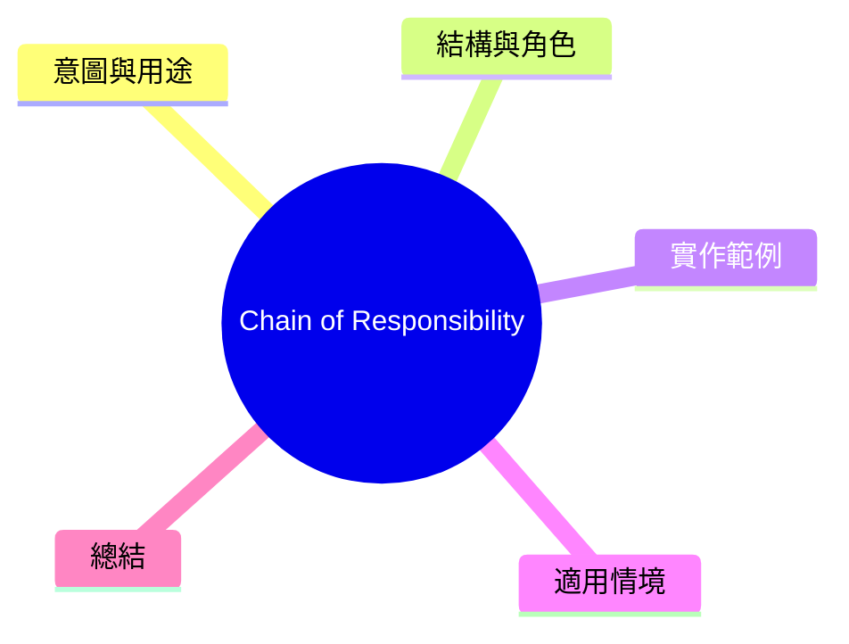

export const metadata = {
  title: '設計模式：責任鏈 (Chain of Responsibility)',
  date: '2026-04-11',
  excerpt: '介紹行為型設計模式中的責任鏈模式——將請求沿處理鏈傳遞，每個處理者决定自己處理或能繼續傳遞。',
  tags: ['軟體設計', '設計模式', 'OOP'],
};

# 設計模式：責任鏈 (Chain of Responsibility)

Chain of Responsibility 讓請求沿一條處理器鏈傳遞。每個處理器自行决定將請求吸收或這繼傳遞給下一個處理器。



- [意圖與用途](#意圖與用途)
- [結構與角色](#結構與角色)
- [實作範例： HTTP 中間件鏈](#實作範例-http-中間件鏈)
- [適用情境](#適用情境)
- [總結](#總結)

---

## 意圖與用途

一個請求需要經過多個錯誤檢查或處理步驟，但進行哪些步驟常基於時機和情境。

如果將所有邏輯塩進一個專中類別，就會這成高耆合。Chain of Responsibility 將每步驟抽离成獨立的處理器，並能自由組合。

---

## 結構與角色

- **Handler**：定義處理請求和設置下一個處理器的介面
- **ConcreteHandler**：實作處理邏輯，決定處理或繼續傳遞
- **Client**：組裝鏈，發送請求

---

## 實作範例： HTTP 中間件鏈

```typescript
interface Request {
  method: string;
  path: string;
  headers: Record<string, string>;
  body?: unknown;
}

interface Response {
  status: number;
  message: string;
}

abstract class Middleware {
  protected next: Middleware | null = null;

  setNext(handler: Middleware): Middleware {
    this.next = handler;
    return handler; // 方便鏈式呼叫
  }

  protected proceed(request: Request): Response | null {
    return this.next ? this.next.handle(request) : null;
  }

  abstract handle(request: Request): Response | null;
}

// 驗證 Token
class AuthMiddleware extends Middleware {
  handle(request: Request): Response | null {
    const token = request.headers['authorization'];
    if (!token || !token.startsWith('Bearer ')) {
      return { status: 401, message: 'Unauthorized' };
    }
    console.log('[Auth] 通過驗證');
    return this.proceed(request);
  }
}

// 檢查 Content-Type
class ContentTypeMiddleware extends Middleware {
  handle(request: Request): Response | null {
    if (request.body && request.headers['content-type'] !== 'application/json') {
      return { status: 415, message: 'Unsupported Media Type' };
    }
    console.log('[ContentType] 通過檢查');
    return this.proceed(request);
  }
}

// 記錄請求日誌
class LoggingMiddleware extends Middleware {
  handle(request: Request): Response | null {
    console.log(`[Log] ${request.method} ${request.path}`);
    const response = this.proceed(request);
    console.log(`[Log] 回應: ${response?.status ?? '無'}`);
    return response;
  }
}

// 實際處理器
class RouteHandler extends Middleware {
  handle(request: Request): Response | null {
    return { status: 200, message: `處理 ${request.path}` };
  }
}

// 組裝中間件鏈
const logging = new LoggingMiddleware();
const auth = new AuthMiddleware();
const contentType = new ContentTypeMiddleware();
const route = new RouteHandler();

logging.setNext(auth).setNext(contentType).setNext(route);

// 發送請求
const response = logging.handle({
  method: 'POST',
  path: '/api/orders',
  headers: {
    authorization: 'Bearer abc123',
    'content-type': 'application/json',
  },
  body: { product: 'iPhone' },
});
console.log(response); // { status: 200, message: '處理 /api/orders' }
```

---

## 適用情境

**適用時機**

- 多個物件可處理一個請求，具體處理者到執行時才知道
- 處理步驟需要彈性組合，或請求順序很重要
- HTTP 中間件、事件氣泡、審批流程

---

## 總結

Chain of Responsibility 隱藏了「請求由誰處理」的決定。發送者只需要將請求丟入鏈頭，結果自然流向正確的處理器。Express.js 的 middleware 、NestJS 的 Guard/Interceptor 都是這個模式的實際應用。
