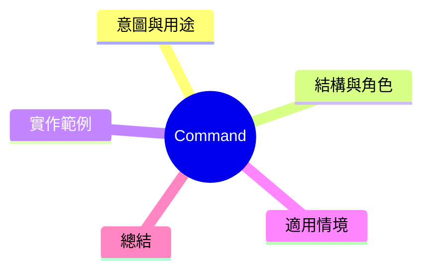

export const metadata = {
  title: '設計模式：命令模式 (Command)',
  date: '2026-04-03',
  excerpt: '介紹行為型設計模式中的命令模式——將請求封裝成物件，支援撤銷、重做、以及延遲執行等功能。',
  tags: ['軟體設計', '設計模式', 'OOP'],
};

# 設計模式：命令模式 (Command)

Command 將請求封裝成物件。這讓請求可以被儲存、传遞、延遲、支援撤銷，並不需要知道請求的具體內容。



- [意圖與用途](#意圖與用途)
- [結構與角色](#結構與角色)
- [實作範例：文字編輯器撤銷重做](#實作範例文字編輯器撤銷重做)
- [適用情境](#適用情境)
- [總結](#總結)

---

## 意圖與用途

假設一個文字編輯器，需要支援 Ctrl+Z 撤銷、Ctrl+Y 重做。如果直接在各處修改狀態，很難追蹤。

Command 將每個操作封裝成命令物件，記錄執行前的狀態，需要撤銷時再展開。

---

## 結構與角色

- **Command**：定義執行和撤銷的介面
- **ConcreteCommand**：實作操作和撤銷邏輯
- **Receiver**：實際执行操作的物件
- **Invoker**：呼叫命令的物件，可以儲存命令歷史

---

## 實作範例：文字編輯器撤銷重做

```typescript
interface Command {
  execute(): void;
  undo(): void;
}

// Receiver
class TextEditor {
  private content = '';

  getContent(): string { return this.content; }

  insertText(text: string, position: number): void {
    this.content = this.content.slice(0, position) + text + this.content.slice(position);
  }

  deleteText(position: number, length: number): void {
    this.content = this.content.slice(0, position) + this.content.slice(position + length);
  }
}

// ConcreteCommand: 插入文字
class InsertCommand implements Command {
  constructor(
    private editor: TextEditor,
    private text: string,
    private position: number,
  ) {}

  execute(): void {
    this.editor.insertText(this.text, this.position);
  }

  undo(): void {
    this.editor.deleteText(this.position, this.text.length);
  }
}

// ConcreteCommand: 刪除文字
class DeleteCommand implements Command {
  private deletedText = '';

  constructor(
    private editor: TextEditor,
    private position: number,
    private length: number,
  ) {}

  execute(): void {
    this.deletedText = this.editor.getContent().slice(this.position, this.position + this.length);
    this.editor.deleteText(this.position, this.length);
  }

  undo(): void {
    this.editor.insertText(this.deletedText, this.position);
  }
}

// Invoker: 管理命令歷史
class CommandHistory {
  private history: Command[] = [];
  private redoStack: Command[] = [];

  execute(command: Command): void {
    command.execute();
    this.history.push(command);
    this.redoStack = []; // 新操作清空重做堆疊
  }

  undo(): void {
    const command = this.history.pop();
    if (command) {
      command.undo();
      this.redoStack.push(command);
    }
  }

  redo(): void {
    const command = this.redoStack.pop();
    if (command) {
      command.execute();
      this.history.push(command);
    }
  }
}

// 使用
const editor = new TextEditor();
const history = new CommandHistory();

history.execute(new InsertCommand(editor, 'Hello', 0));
history.execute(new InsertCommand(editor, ' World', 5));
console.log(editor.getContent()); // 'Hello World'

history.undo(); // 撤銷插入 ' World'
console.log(editor.getContent()); // 'Hello'

history.redo(); // 重做插入 ' World'
console.log(editor.getContent()); // 'Hello World'
```

---

## 適用情境

**適用時機**

- 需要支援撤銷/重做
- 需要將操作延遲執行或排队
- 需要記錄命令日誌（實現 Audit Trail）

---

## 總結

Command 的核心是「將行為轉化為物件」。請求一旦成為物件，就可以被儲存、得到傳遞、排成一列、讓撤銷變得自然。
